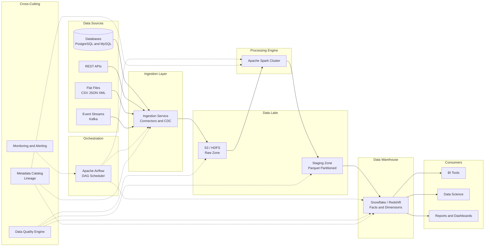
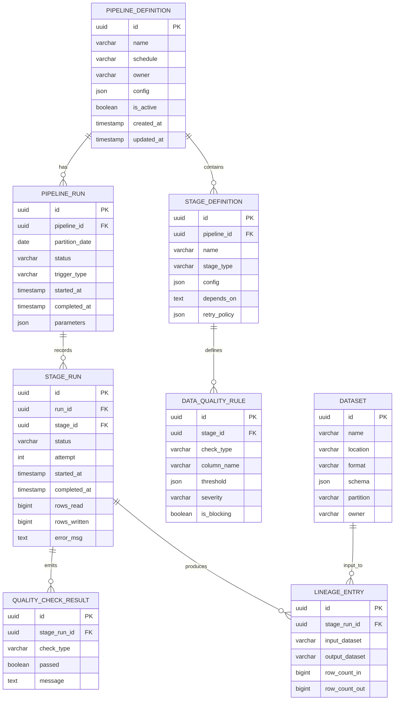
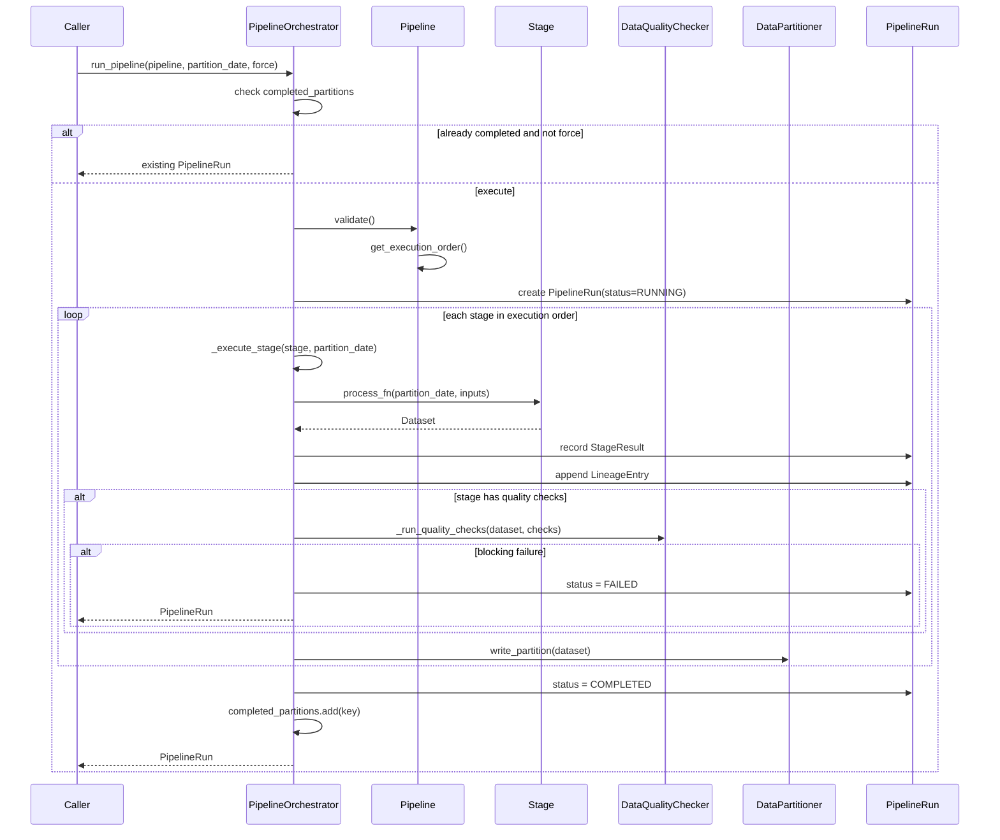
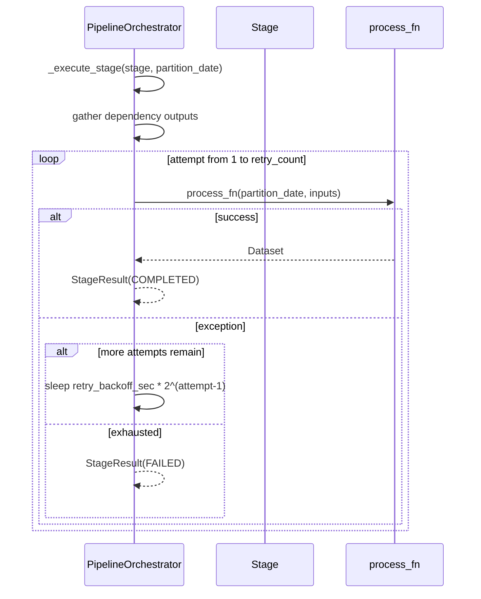
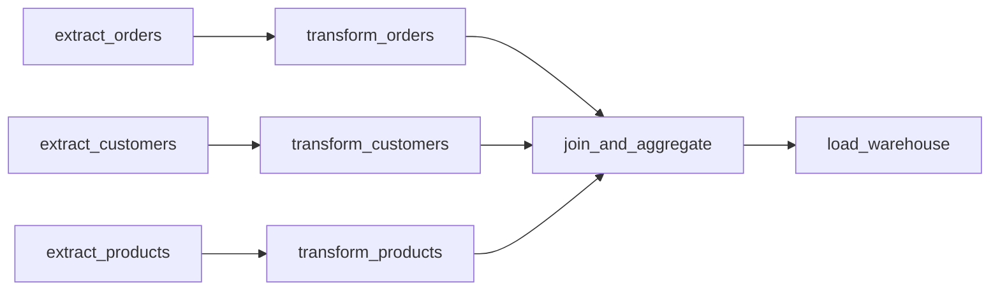
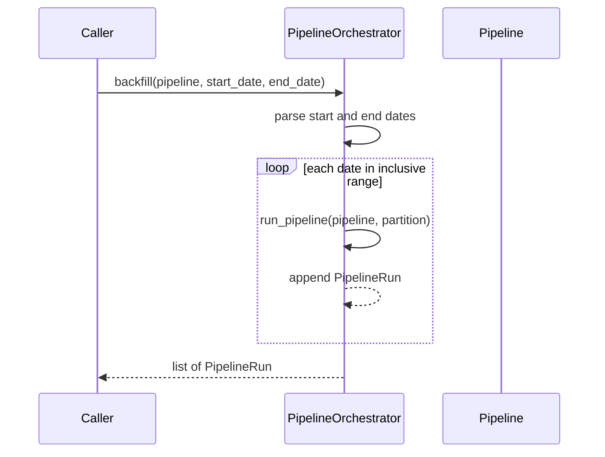

# Batch Data Pipeline — Architecture

> **Scope of this document.** This is the consolidated architecture reference for
> the Batch Data Pipeline. It preserves the production ETL/ELT system design from
> [`README.md`](./README.md) and maps it to the reference implementation in
> [`batch_pipeline.py`](./batch_pipeline.py), a single-process simulation of DAG
> orchestration, extraction, transformation, data quality checks, partitioning,
> retries, idempotency, backfill, and lineage. Sections tagged **[Design-only]**
> describe production capabilities not present in the simulation; sections tagged
> **[Implemented]** map directly to code.

---

## 1. Problem Statement

Modern organizations generate massive volumes of data across databases, APIs,
log files, and third-party services. Deriving business insights requires
collecting raw data, transforming it into analysis-ready formats, and loading it
into a warehouse where BI tools and analysts can query it efficiently.

We need a scalable batch data processing pipeline that:

- Ingests data from heterogeneous sources on a recurring schedule.
- Applies cleaning, deduplication, aggregation, and joins.
- Loads processed data into a data warehouse with strict SLA guarantees.
- Handles failures gracefully with retry, checkpoint, and backfill.
- Maintains data quality through automated validation.
- Tracks data lineage from source to destination.

The production target is **10 TB/day** with a **<4-hour SLA** for the daily
batch run. The simulation implements these concepts over generated in-memory
datasets.

---

## 2. Requirements

### 2.1 Functional Requirements

| # | Requirement | Details | Status |
|---|-------------|---------|--------|
| FR-1 | **Multi-source ingestion** | Ingest from databases, REST APIs, flat files, and cloud storage. | ⚠️ Simulated for database/API sources via `DataSource.extract`; flat/cloud file connectors are **[Design-only]** |
| FR-2 | **Data transformation** | Clean nulls, deduplicate, aggregate, join across datasets. | ✅ Implemented in demo stage functions (`transform_orders`, `transform_customers`, `transform_products`, `join_and_aggregate`) |
| FR-3 | **Warehouse loading** | Load transformed data with merge/upsert semantics. | ⚠️ Simulated (`load_warehouse` renames dataset); real warehouse merge is **[Design-only]** |
| FR-4 | **Scheduled recurring jobs** | Cron-based and event-driven triggers. | ❌ **[Design-only]** |
| FR-5 | **Data quality checks** | Null, row count, schema, uniqueness, referential integrity, freshness. | ✅ Null/row/schema/uniqueness implemented (`DataQualityChecker`); referential/freshness/statistical checks are **[Design-only]** |
| FR-6 | **Backfill support** | Re-run pipelines for historical date ranges. | ✅ Implemented (`PipelineOrchestrator.backfill`) |
| FR-7 | **Pipeline definition as code** | Define DAGs with stages, dependencies, configs. | ✅ Implemented (`Pipeline`, `Stage`, `build_demo_pipeline`) |
| FR-8 | **Idempotent reruns** | Same partition rerun produces identical destination state. | ✅ Implemented as skip unless `force=True` (`completed_partitions`) |
| FR-9 | **Data lineage tracking** | Track inputs and outputs for each stage. | ✅ Implemented (`LineageEntry`, `PipelineRun.lineage`, `print_lineage`) |
| FR-10 | **Alerting and notifications** | Notify on failures, SLA breaches, quality violations. | ❌ **[Design-only]**; console output only |
| FR-11 | **Retry with backoff** | Retry failed stages with exponential backoff. | ✅ Implemented (`_execute_stage`) |
| FR-12 | **DAG validation** | Reject missing dependencies and cycles. | ✅ Implemented (`Pipeline.validate`, `get_execution_order`) |

### 2.2 Non-Functional Requirements [Design-only targets]

| ID | Requirement | Target |
|----|-------------|--------|
| NFR-1 | Throughput | Process 10 TB raw data/day |
| NFR-2 | Latency / SLA | Daily pipeline completes within 4 hours |
| NFR-3 | Fault tolerance | Retry failed stages up to 3 times with exponential backoff |
| NFR-4 | Idempotency | Reruns produce identical results and no duplicates |
| NFR-5 | Data lineage | Full source-to-destination lineage queryable via metadata catalog |
| NFR-6 | Availability | Orchestrator 99.9% available |
| NFR-7 | Data freshness | Warehouse refreshed within 1 hour of pipeline completion |
| NFR-8 | Cost efficiency | Auto-scale compute and shut down idle clusters |
| NFR-9 | Security | Encryption, PII masking, RBAC |
| NFR-10 | Observability | Unified metrics, logs, and traces |

---

## 3. Capacity Estimation [Design-only]

### 3.1 Data Volume

| Metric | Daily | Monthly | Yearly |
|--------|-------|---------|--------|
| Raw ingestion | 10 TB | 300 TB | 3.6 PB |
| After deduplication | 7 TB | 210 TB | 2.5 PB |
| After aggregation | 500 GB | 15 TB | 180 TB |
| Warehouse growth | +500 GB/day | ~15 TB growth | ~180 TB total |

### 3.2 Compute Resources

| Component | Specification |
|-----------|---------------|
| Spark cluster | 50 worker nodes, 16 cores / 64 GB RAM each |
| Peak parallelism | 800 concurrent tasks |
| Orchestrator | 4-node Airflow cluster |
| Metadata DB | PostgreSQL RDS, 500 GB SSD |

### 3.3 Storage Tiers

| Tier | Format | Retention | Estimated Size |
|------|--------|-----------|----------------|
| Raw landing | JSON/CSV | 90 days | 900 TB/year |
| Processed | Parquet | 1 year | 750 TB compressed |
| Aggregated | Parquet | 3 years | 540 TB |
| Warehouse | Columnar | 5 years | 900 TB |

---

## 4. High-Level Architecture [Design-only]



The simulation replaces Airflow with `PipelineOrchestrator`, Spark with Python
stage functions over lists of `Record`, object storage with `DataPartitioner`,
and the metadata catalog with `PipelineRun.lineage`.

---

## 5. Reference Implementation Overview [Implemented]

`batch_pipeline.py` defines the pipeline framework and a sample
`daily_sales_analytics` pipeline. It models records, datasets, sources, quality
checks, partitions, stages, lineage, pipeline definitions, and pipeline runs.

```mermaid
classDiagram
    class StageType {
        <<enumeration>>
        EXTRACT
        TRANSFORM
        LOAD
        QUALITY_CHECK
    }
    class RunStatus {
        <<enumeration>>
        PENDING
        RUNNING
        COMPLETED
        FAILED
        SKIPPED
    }
    class QualityCheckType {
        <<enumeration>>
        NULL_CHECK
        ROW_COUNT
        SCHEMA_VALIDATION
        UNIQUENESS
    }
    class Severity {
        <<enumeration>>
        WARNING
        ERROR
        CRITICAL
    }
    class Record {
        +dict data
        +str source
        +datetime timestamp
    }
    class Dataset {
        +str name
        +list records
        +dict schema
        +str partition_key
        +str partition_value
        +row_count int
        +get_column_values(column) list
        +get_null_count(column) int
        +get_unique_count(column) int
        +deduplicate(key_column) Dataset
        +filter_nulls(required_columns) Dataset
    }
    class DataSource {
        +str name
        +str source_type
        +dict connection_config
        +dict schema
        +extract(partition_date, row_count) Dataset
        -_generate_value(col_name, col_type, index) Any
    }
    class DataQualityChecker {
        +list results
        +null_check(dataset, column, max_null_pct, severity) QualityCheckResult
        +row_count_check(dataset, min_rows, max_rows, severity) QualityCheckResult
        +schema_check(dataset, expected_columns, severity) QualityCheckResult
        +uniqueness_check(dataset, column, severity) QualityCheckResult
        +get_summary() dict
        +get_blocking_failures() list
    }
    class DataPartitioner {
        +dict partitions
        +write_partition(dataset) str
        +read_partition(dataset_name, partition_value) Dataset
        +list_partitions(dataset_name) list
        +get_idempotency_key(dataset_name, partition_value) str
    }
    class Stage {
        +str name
        +StageType stage_type
        +Callable process_fn
        +list depends_on
        +int retry_count
        +float retry_backoff_sec
        +list quality_checks
        +str description
    }
    class Pipeline {
        +str name
        +str description
        +dict stages
        +str id
        +add_stage(stage) None
        +get_execution_order() list
        +validate() list
    }
    class PipelineRun {
        +str run_id
        +str pipeline_name
        +str partition_date
        +RunStatus status
        +dict stage_results
        +datetime started_at
        +datetime completed_at
        +list lineage
    }
    class PipelineOrchestrator {
        +dict runs
        +DataPartitioner partitioner
        +DataQualityChecker quality_checker
        +set completed_partitions
        +dict stage_outputs
        +run_pipeline(pipeline, partition_date, force) PipelineRun
        -_execute_stage(stage, partition_date) StageResult
        -_run_quality_checks(dataset, checks) bool
        +backfill(pipeline, start_date, end_date) list
        +print_lineage(run) None
        +print_quality_summary() None
    }
    Pipeline "1" o-- "many" Stage
    PipelineOrchestrator o-- DataPartitioner
    PipelineOrchestrator o-- DataQualityChecker
    PipelineOrchestrator "1" o-- "many" PipelineRun
    Dataset "1" o-- "many" Record
    DataSource ..> Dataset : extract
```



### 5.1 Component Deep-Dive (doc → code)

| Design concept | Implemented by | Notes |
|----------------|----------------|-------|
| Raw row | `Record` | Holds arbitrary `data`, source name, and timestamp. |
| Dataset | `Dataset` | Provides row count, null counts, unique counts, dedup, and null filtering. |
| Source connector | `DataSource.extract` | Generates synthetic rows using schema and source type. |
| Quality rule | `DataQualityChecker` methods | Null, row count, schema, uniqueness checks. |
| Quality result | `QualityCheckResult` | Stores type, column, pass/fail, severity, message, values. |
| Partition storage | `DataPartitioner` | In-memory `partitions[dataset_name][partition_value]`. |
| Stage definition | `Stage` | Name, type, callable, dependencies, retry policy, quality checks. |
| Pipeline DAG | `Pipeline.get_execution_order` | Topological sort with cycle detection. |
| Pipeline validation | `Pipeline.validate` | Checks missing dependencies and cycles. |
| Run orchestration | `PipelineOrchestrator.run_pipeline` | Validates, executes stages, stores partitions, tracks lineage, stops on failure. |
| Retry/backoff | `_execute_stage` | Retries up to `stage.retry_count`, exponential wait capped to 2 seconds for demo. |
| Idempotency | `completed_partitions` | Skips completed `pipeline.name:partition_date` unless `force=True`. |
| Backfill | `backfill` | Iterates inclusive date range and calls `run_pipeline`. |
| Demo pipeline | `build_demo_pipeline` | Builds orders/customers/products ETL DAG. |

---

## 6. Data Model

### 6.1 Conceptual production metadata schema [Design-only]



### 6.2 As implemented [Implemented]

| Production entity | In-memory equivalent |
|-------------------|----------------------|
| `pipeline_definition` | `Pipeline` |
| `stage_definition` | `Stage` |
| `pipeline_run` | `PipelineRun` |
| `stage_run` | `StageResult` values in `PipelineRun.stage_results` |
| `dataset` | `Dataset` |
| `data_quality_rule` | dict entries in `Stage.quality_checks` |
| `quality_check_result` | `DataQualityChecker.results` |
| `lineage` | `LineageEntry` objects in `PipelineRun.lineage` |
| Partitioned data lake | `DataPartitioner.partitions` |

---

## 7. API Design

### 7.1 Production HTTP surface [Design-only]

| Method & Path | Purpose | Success |
|---------------|---------|---------|
| `POST /api/v1/pipelines` | Create pipeline definition with schedule, stages, quality checks | `201 Created` |
| `POST /api/v1/pipelines/{pipeline_id}/trigger` | Manually trigger a run for a partition | `202 Accepted` |
| `GET /api/v1/pipelines/{pipeline_id}/runs/{run_id}` | Fetch run/stage/quality status | `200 OK` |
| `POST /api/v1/pipelines/{pipeline_id}/backfill` | Backfill date range with parallelism/priority | `202 Accepted` |

The README request/response examples include stage configs such as
`extract_orders`, `transform_orders`, `load_orders`, row count checks, null
percentage checks, and run status with per-stage progress.

### 7.2 In-process API [Implemented]

| Method | Signature | Raises / behavior |
|--------|-----------|-------------------|
| `DataSource.extract` | `(partition_date: str, row_count: int = 100) -> Dataset` | Generates random values, nulls, and duplicate IDs |
| `Dataset.deduplicate` | `(key_column: str) -> Dataset` | Keeps first record for each key |
| `Dataset.filter_nulls` | `(required_columns: list[str]) -> Dataset` | Removes records missing required columns |
| `Pipeline.add_stage` | `(stage: Stage) -> None` | Replaces by name if reused |
| `Pipeline.get_execution_order` | `() -> list[str]` | Raises `ValueError` if cycle detected |
| `Pipeline.validate` | `() -> list[str]` | Returns missing dependency/cycle errors |
| `PipelineOrchestrator.run_pipeline` | `(pipeline: Pipeline, partition_date: str, force: bool = False) -> PipelineRun` | Raises `ValueError` on validation errors; skips completed partition unless forced |
| `PipelineOrchestrator.backfill` | `(pipeline: Pipeline, start_date: str, end_date: str) -> list[PipelineRun]` | Runs inclusive date range |
| `PipelineOrchestrator.print_lineage` | `(run: PipelineRun) -> None` | Console output |
| `PipelineOrchestrator.print_quality_summary` | `() -> None` | Console output |

---

## 8. Key Workflows [Implemented]

### 8.1 Pipeline run



### 8.2 Stage retry with exponential backoff



### 8.3 Demo ETL DAG



### 8.4 Backfill



---

## 9. Detailed Component Design

### 9.1 Dataset and transformations [Implemented]

`Dataset` is the central in-memory data container. It provides:

- `row_count`
- `get_column_values()`
- `get_null_count()`
- `get_unique_count()`
- `deduplicate(key_column)`
- `filter_nulls(required_columns)`

The demo ETL uses those helpers to clean and deduplicate orders, customers, and
products before joining.

### 9.2 Data source simulation [Implemented]

`DataSource.extract()` generates rows based on a schema. Supported generated
types are `int`, `float`, `string`, and `date`. It intentionally injects:

- ~5% nulls across nullable columns.
- ~3% duplicate IDs when the schema contains `id`.

This makes quality checks meaningful without external dependencies.

### 9.3 DAG orchestration [Implemented]

`Pipeline.get_execution_order()` performs a topological sort. It computes
in-degrees and adjacency lists from `Stage.depends_on`, sorts ready nodes for a
stable order, and raises `ValueError` if not all stages can be ordered.

`PipelineOrchestrator.run_pipeline()` then executes the order serially. Parallel
execution is **[Design-only]**.

### 9.4 Data quality framework [Implemented / Design-only]

Implemented checks:

| Check | Method | Blocking behavior |
|-------|--------|-------------------|
| Null percentage | `null_check` | Blocks if failed and severity is `ERROR` or `CRITICAL` |
| Row count | `row_count_check` | Blocks if failed and non-warning |
| Schema | `schema_check` | Blocks if failed and non-warning |
| Uniqueness | `uniqueness_check` | Blocks if failed and non-warning |

Referential integrity, freshness, statistical checks, custom SQL checks, and DLQ
record capture are **[Design-only]**.

### 9.5 Idempotency and partitioning [Implemented]

`DataPartitioner.write_partition()` writes by dataset name and partition value:

```text
data-lake/{dataset.name}/partition_date={dataset.partition_value}/
```

`PipelineOrchestrator.completed_partitions` stores keys like
`daily_sales_analytics:2024-01-15`. A second run of the same partition skips
unless `force=True`.

### 9.6 Lineage [Implemented]

For every completed stage with output, `run_pipeline()` appends a `LineageEntry`
with stage name, input dataset names, output dataset name, input/output row
counts, timestamp, and partition date. `print_lineage()` renders this metadata
for debugging.

---

## 10. Architectural Patterns [Design-only]

- **Lambda Architecture:** batch layer for authoritative data, serving layer for
  low-latency queries, optional speed layer for near-real-time data.
- **DAG orchestration:** stages execute only after dependencies complete.
- **ETL + ELT:** Spark handles heavy joins/dedup; warehouse/dbt handles
  SQL-friendly aggregations.
- **SCD Type 2:** version dimension rows to preserve historical attributes.
- **Idempotent processing:** write-then-swap partitions and rerun safely.
- **Partition-based incremental loads:** process only new/changed date
  partitions.
- **Data Vault modeling:** raw vault layer with hubs, links, satellites before
  dimensional serving.

---

## 11. Technology Choices & Trade-offs [Design-only]

### 11.1 Processing Engine

| Engine | Strengths | Weaknesses | Best For |
|--------|-----------|------------|----------|
| Spark | Distributed, mature, rich API | JVM overhead, tuning complexity | Large-scale batch ETL |
| Presto | Fast interactive SQL | Not ideal for heavy ETL writes | Ad-hoc analytics |
| Hive | SQL on Hadoop | Slow iterative processing | Legacy Hadoop |
| dbt | SQL-first, version controlled | Limited to SQL transforms | ELT in warehouse |

**Choice:** Spark for heavy transforms and dbt for warehouse ELT.

### 11.2 Storage

| Storage | Strengths | Weaknesses | Best For |
|---------|-----------|------------|----------|
| S3 | Cheap, durable, scalable | Higher latency than local | Data lake |
| HDFS | Low latency, data locality | Operational overhead | On-prem Hadoop |
| GCS | GCP-native consistency | GCP lock-in | GCP environments |

**Choice:** S3 or equivalent object storage for the data lake.

### 11.3 Orchestrator

| Tool | Strengths | Weaknesses | Best For |
|------|-----------|------------|----------|
| Airflow | Mature, large community | Complex operations | General-purpose pipelines |
| Prefect | Modern API | Smaller community | Python-centric teams |
| Dagster | Software-defined assets | Newer | Data mesh architectures |

**Choice:** Airflow for production orchestration.

### 11.4 Format and warehouse

| Decision | Choice | Why |
|----------|--------|-----|
| Ingestion format | Avro | Schema evolution |
| Processing format | Parquet | Columnar compression and fast analytics |
| Warehouse | Snowflake | Separation of storage/compute and multi-cloud flexibility |

---

## 12. Scaling, Reliability & Security [Design-only]

- **Spark scaling:** dynamic allocation, cluster autoscaling, stage-level
  resources, adaptive query execution.
- **Partition pruning:** date partitioning, predicate pushdown, and bucketing on
  high-cardinality joins.
- **Caching:** Spark persist per job, warehouse result cache for 24 h, BI cache
  for 15 minutes, metadata cache for 1 h.
- **Compaction:** small files compacted into 128 MB-1 GB Parquet files.
- **Checkpoint/restart:** each successful stage writes a marker; failed stage
  re-executes from preserved intermediate data.
- **Retry policy:** 3 retries, 30 s initial backoff, multiplier 2, max 300 s;
  retry timeouts/throttling, do not retry schema/auth errors.
- **DLQ:** corrupt records stored with original record, error, timestamp, stage.
- **SLA alerts:** warn if start delayed, critical if near SLA breach or failed.
- **Disaster recovery:** cross-region raw data replication, pipeline definitions
  in Git, metadata DB backup every 6 h, RTO 2 h, RPO 6 h.
- **Security:** AES-256 at rest, TLS 1.3 in transit, KMS/Vault, RBAC, row-level
  security, service accounts, hashing/tokenization/redaction/generalization for
  PII, audited pipeline runs and warehouse access.
- **Observability:** pipeline duration, stage duration, freshness, row-count
  delta, quality score, error rate, DLQ depth, Spark utilization, SLA dashboards,
  PagerDuty/Slack/email alerting.

---

## 13. Running the Simulation [Implemented]

```powershell
uv run --no-project python SystemDesign\BatchDataPipeline\batch_pipeline.py
```

The demo builds the `daily_sales_analytics` DAG, validates it, extracts generated
orders/customers/products, transforms and joins them, runs quality checks, writes
partitions, prints lineage, demonstrates idempotent skip, forces a rerun, lists
partitions, prints quality summaries, and backfills two historical dates.

### Suggested tests

- `Pipeline.get_execution_order()` returns dependencies before consumers.
- `Pipeline.validate()` reports unknown dependencies and cycles.
- `Dataset.deduplicate()` keeps one row per key.
- `Dataset.filter_nulls()` removes rows missing required columns.
- `DataQualityChecker` blocks failed `ERROR`/`CRITICAL` checks but not warnings.
- `run_pipeline()` skips a completed partition unless `force=True`.
- Failed stage functions retry the configured number of times.
- `backfill()` runs every date in an inclusive range.
- `LineageEntry` row counts match stage inputs/outputs.

---

## 14. Future Improvements

- Add real connector interfaces for files, databases, APIs, and object storage.
- Separate framework code from the demo pipeline stages.
- Add a scheduler abstraction for cron and event triggers.
- Implement real warehouse merge/upsert semantics.
- Add referential integrity, freshness, statistical, and custom quality checks.
- Persist run metadata, lineage, and quality results.
- Support parallel execution for independent DAG branches.
- Add DLQ datasets for bad records and replay workflows.
- Add alerting hooks for failures, SLA breaches, and blocking quality checks.
- Replace legacy typing aliases in code with built-in generics during a future
  cleanup pass.
