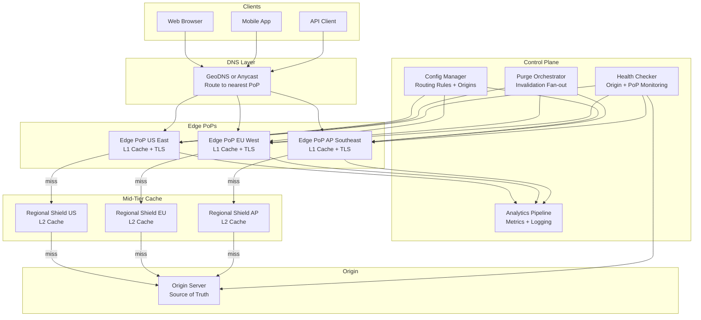
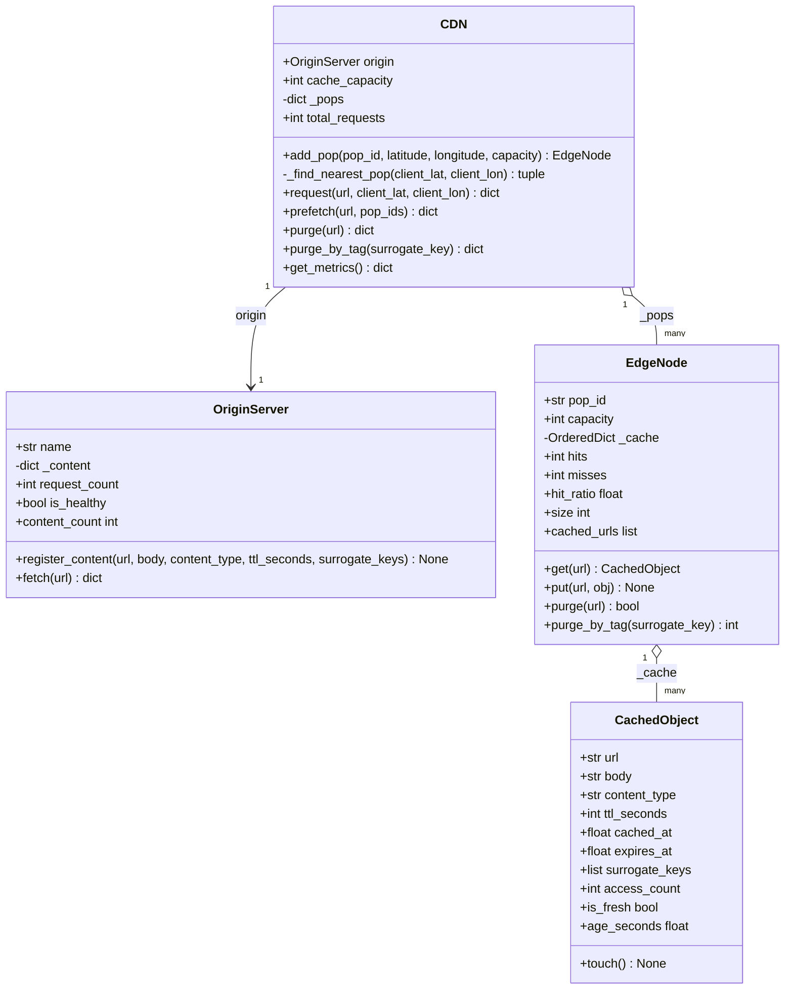
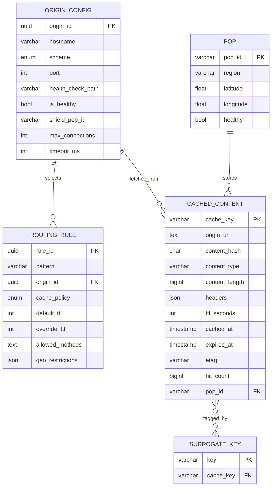
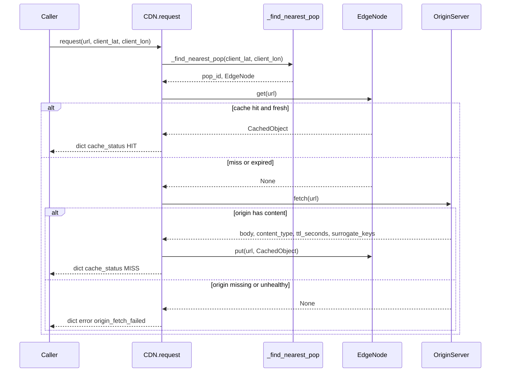
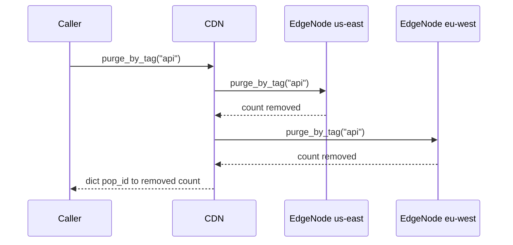

# Content Delivery Network (CDN) — Architecture

> **Scope of this document.** This is the consolidated architecture reference for
> the CDN. It preserves the production system design from `README.md` and maps it
> to the reference implementation in [`cdn.py`](./cdn.py), a single-process,
> in-memory simulation. Sections tagged **[Design-only]** describe production
> concerns not present in code; sections tagged **[Implemented]** map directly to
> classes, methods, and data structures in `cdn.py`.

---

## 1. Problem Statement

A Content Delivery Network accelerates delivery of HTML, CSS, JavaScript,
images, video, APIs, and other web content by caching copies at geographically
distributed **Points of Presence (PoPs)** close to end users.

**Why build one?**

- A single origin cannot serve global traffic with low latency; Tokyo to
  Virginia can exceed 200 ms RTT.
- Flash sales, breaking news, and live events overwhelm origins without a cache
  layer.
- HTTPS termination at the edge reduces TLS handshake latency.
- CDNs offload 80-95% of origin traffic and reduce bandwidth cost.

The core challenge is routing users to the nearest healthy PoP, keeping cache hit
ratios above 95%, and invalidating stale content globally within seconds while
handling millions of requests per second.

---

## 2. Requirements

### 2.1 Functional Requirements

| # | Requirement | Details | Status |
|---|-------------|---------|--------|
| FR-1 | **Cache content at edge** | Cache static and dynamic objects at edge PoPs. | ✅ Implemented (`EdgeNode.get`, `EdgeNode.put`, `CDN.request`) |
| FR-2 | **Origin pull** | Fetch from origin on miss and cache it. | ✅ Implemented (`OriginServer.fetch`, `CDN.request`) |
| FR-3 | **Origin push / prefetch** | Proactively push content to PoPs. | ✅ Implemented (`CDN.prefetch`) |
| FR-4 | **Cache invalidation** | Purge by URL, wildcard, surrogate key/tag, and soft purge. | ✅ URL/tag purge implemented (`CDN.purge`, `CDN.purge_by_tag`); wildcard and soft purge **[Design-only]** |
| FR-5 | **Route to nearest PoP** | Direct users to geographic/latency-closest edge. | ✅ Implemented with Haversine routing (`CDN._find_nearest_pop`, `_haversine`) |
| FR-6 | **HTTPS termination** | Terminate TLS at edge and optionally re-encrypt to origin. | **[Design-only]** |
| FR-7 | **Cache-Control compliance** | Respect `Cache-Control`, `Vary`, `ETag`, and `Last-Modified`. | Partially implemented as explicit `ttl_seconds`; header parsing/revalidation **[Design-only]** |
| FR-8 | **Analytics and logging** | Real-time traffic, hit/miss, bandwidth, and error metrics. | ✅ Basic metrics (`CDN.get_metrics`); logging/bandwidth pipeline **[Design-only]** |
| FR-9 | **LRU eviction** | Evict least-recently-used objects under capacity pressure. | ✅ Implemented (`OrderedDict` in `EdgeNode`) |
| FR-10 | **Origin failure handling** | Continue serving cached objects when origin is unhealthy. | ✅ Implemented (`OriginServer.is_healthy`, `CDN.request`) |

### 2.2 Non-Functional Requirements [Design-only targets]

| Attribute | Target |
|-----------|--------|
| **Latency** | < 50 ms p99 globally for cache hits |
| **Availability** | 99.99% uptime (< 53 min downtime/year) |
| **Cache hit ratio** | > 95% for static content, > 80% for dynamic |
| **Throughput** | 10M+ requests/sec across all PoPs |
| **Invalidation latency** | Purges propagate globally within 5 seconds |
| **Traffic spikes** | Absorb 10x normal traffic without origin overload |
| **Security** | DDoS mitigation, WAF integration, bot detection |
| **Consistency** | Eventual consistency; stale-while-revalidate where safe |

---

## 3. Capacity Estimation [Design-only]

```text
Traffic:
Total requests      : 10 M/sec across all PoPs
PoPs worldwide      : 200 locations
Avg per PoP         : 50,000 req/sec
Cache hit ratio     : 95 %
Origin pulls        : 10 M * 0.05 = 500 K/sec

Cache storage per PoP:
Unique objects      : 50 M objects
Avg object size     : 100 KB
Storage per PoP     : 50 M * 100 KB = 5 TB SSD
Hot working set     : 5 M * 100 KB = 500 GB RAM

Bandwidth:
Avg response size   : 100 KB
Egress per PoP      : 50,000 req/s * 100 KB = 5 GB/s = 40 Gbps
Global egress       : 200 PoPs * 40 Gbps = 8 Tbps
Origin ingress      : 500 K misses/s * 100 KB = 50 GB/s

TLS:
New handshakes/PoP  : ~10,000/sec with keep-alive reuse
Session resumption  : > 80 %
CPU overhead        : ~2 cores per PoP for TLS
```

---

## 4. High-Level Architecture [Design-only]



Production uses a multi-tier hierarchy: L1 edge caches serve hot objects close
to clients, regional shields aggregate misses, and origins see only residual
traffic. The simulation collapses this to one `OriginServer` and multiple
`EdgeNode` instances managed by `CDN`.

---

## 5. Reference Implementation Overview [Implemented]

`cdn.py` demonstrates edge nodes with LRU + TTL, an origin source of truth,
GeoDNS-style nearest-PoP routing, metrics, prefetch, URL purge, tag purge, and
origin-down behavior.



### 5.1 Component Deep-Dive (doc → code)

| Design concept | Implemented by | Notes |
|----------------|----------------|-------|
| Origin source of truth | `OriginServer._content`, `register_content`, `fetch` | Stores body, content type, TTL, and surrogate keys. |
| Edge L1 cache | `EdgeNode._cache: OrderedDict[str, CachedObject]` | One cache per PoP; no L2 shield in code. |
| TTL freshness | `CachedObject.is_fresh`, `EdgeNode.get` | Lazy expiration on access. |
| LRU eviction | `EdgeNode.put` | Evicts `popitem(last=False)` while capacity is exceeded. |
| GeoDNS routing | `CDN._find_nearest_pop`, `_haversine` | Chooses nearest PoP by latitude/longitude. |
| Origin pull | `CDN.request` | On miss, fetches origin data and stores a new `CachedObject`. |
| Origin push | `CDN.prefetch` | Stores origin content in selected/all PoPs. |
| URL invalidation | `CDN.purge`, `EdgeNode.purge` | Deletes one URL from every PoP. |
| Tag invalidation | `CDN.purge_by_tag`, `EdgeNode.purge_by_tag` | Uses `CachedObject.surrogate_keys`. |
| Metrics | `EdgeNode.hits`, `EdgeNode.misses`, `CDN.get_metrics` | Aggregates per-PoP and global hit ratio. |
| Origin failure | `OriginServer.is_healthy`, `CDN.request` | Misses return `error: origin_fetch_failed`; cached hits still work. |

---

## 6. Data Model

### 6.1 Conceptual production schema [Design-only]



Production indexes include `(pop_id, cache_key)`, surrogate-key/tag indexes,
expiry indexes, origin indexes, and hit-count tracking for eviction decisions.

### 6.2 As implemented [Implemented]

The simulation stores origin content in `OriginServer._content` and cached
objects in `EdgeNode._cache`. `CachedObject` carries `url`, `body`,
`content_type`, `ttl_seconds`, `cached_at`, `expires_at`, `surrogate_keys`, and
`access_count`. There is no content hash, ETag, `Cache-Control` parser, wildcard
purge index, durable store, or L2 shield object in code.

---

## 7. API Design

### 7.1 Production HTTP/control-plane surface [Design-only]

| Method & Path | Purpose | Success |
|---------------|---------|---------|
| `POST /api/v1/purge` | Purge URLs with optional soft purge. | `202 Accepted` + purge id |
| `POST /api/v1/purge/tags` | Purge content by surrogate keys. | `202 Accepted` |
| `POST /api/v1/prefetch` | Queue proactive push to regions/PoPs. | `202 Accepted` |
| `GET /api/v1/cache/status?url=...` | Report freshness, TTL, hash, and PoP coverage. | `200 OK` |

README payloads are preserved conceptually: purge requests include `type`,
`targets`, and `soft_purge`; tag purge includes `surrogate_keys`; prefetch
includes `urls`, `regions`, and `priority`; status returns cached PoP count,
freshness, TTL remaining, and content hash.

### 7.2 In-process API [Implemented]

| Method | Signature | Returns / raises |
|--------|-----------|------------------|
| `OriginServer.register_content` | `(url, body, content_type="text/html", ttl_seconds=3600, surrogate_keys=None) -> None` | Registers origin data. |
| `OriginServer.fetch` | `(url) -> dict | None` | Returns metadata, or `None` if missing/unhealthy. |
| `CDN.add_pop` | `(pop_id, latitude, longitude, capacity=None) -> EdgeNode` | Registers PoP. |
| `CDN.request` | `(url, client_lat=0.0, client_lon=0.0) -> dict` | Returns body/cache status; no exceptions for misses. |
| `CDN.prefetch` | `(url, pop_ids=None) -> dict[str, bool]` | Pop-level prefetch success. |
| `CDN.purge` | `(url) -> dict[str, bool]` | Whether each PoP had the URL. |
| `CDN.purge_by_tag` | `(surrogate_key) -> dict[str, int]` | Number of objects purged per PoP. |
| `CDN.get_metrics` | `() -> dict` | Aggregate and per-PoP metrics. |

---

## 8. Key Workflows [Implemented]

### 8.1 Cache miss → origin pull → edge fill



### 8.2 Tag purge



---

## 9. Detailed Component Design

### 9.1 DNS-based routing [Implemented in simulation, Design-only at scale]

`CDN._find_nearest_pop` computes Haversine distance from client coordinates to
registered PoP coordinates and chooses the closest. Production combines GeoDNS,
Anycast, health checks, latency telemetry, and BGP policy.

| Factor | GeoDNS | Anycast |
|--------|--------|---------|
| Routing granularity | Country/city level | Network topology |
| Failover speed | DNS TTL, 30-60s | BGP withdrawal, seconds |
| Implementation | DNS infrastructure | BGP peering at each PoP |
| Client stickiness | Per DNS TTL | Per TCP connection |
| Best for | HTTP/HTTPS content | UDP or ultra-low latency |

### 9.2 Cache hierarchy [Design-only]

Production hierarchy:

```text
L1 Edge Cache      < 5 ms     hot objects, RAM + SSD, per PoP
L2 Regional Shield < 20 ms    aggregates misses from 5-20 edge PoPs
Origin Server      50-200 ms  source of truth, protected by upper tiers
```

The current code has only L1 edge caches plus origin. `cdn.py` mentions L2 in the
module docstring, but there is no `ShieldCache` class or L2 lookup.

### 9.3 Eviction, freshness, and invalidation [Implemented]

`EdgeNode` uses `OrderedDict` for O(1) LRU promotion and eviction. `get()` moves
fresh hits to the MRU end and removes stale entries lazily. `put()` evicts from
the LRU end while `len(_cache) >= capacity`. `CDN.purge` removes one URL from all
PoPs; `CDN.purge_by_tag` scans local cached objects for `surrogate_keys`.

### 9.4 Request coalescing and stale-while-revalidate [Design-only gap]

The README and module docstring mention request coalescing and
stale-while-revalidate. The implementation does not use per-key locks, does not
serve stale expired entries, and refetches synchronously after TTL expiry.

---

## 10. Architectural Patterns [Design-only]

- **Cache hierarchy pattern** — L1 edge, L2 shield, and origin reduce latency and
  origin pressure.
- **Pull vs push model** — origin-pull is lazy and storage-efficient; prefetch
  removes cold-start latency for launches and live events.
- **Consistent hashing within a PoP** — production cache servers shard keys with
  virtual nodes.
- **Circuit breaker for origin** — open after high error rates, then serve stale
  or fail fast until a half-open probe succeeds.
- **Request coalescing** — one origin fetch per missing key while concurrent
  requests wait and share the result.

---

## 11. Technology Choices & Trade-offs [Design-only]

| Factor | Varnish | Nginx |
|--------|---------|-------|
| Caching performance | Purpose-built, extremely fast | Fast but general-purpose |
| Config language | VCL, powerful and complex | nginx.conf, simpler |
| TLS termination | Requires HAProxy/Hitch frontend | Native TLS support |
| Cache invalidation | Rich purge, ban, xkey | Basic purge only |
| Memory management | Malloc + LRU, file-backed | Shared memory zones |
| Verdict | Choose for pure caching | Choose for TLS + routing + caching |

Recommendation: Nginx for TLS/routing, Varnish behind it for advanced cache
logic.

| Factor | Anycast | GeoDNS |
|--------|---------|--------|
| Setup complexity | BGP peering at each PoP | DNS infrastructure |
| Failover speed | Instant withdrawal, convergence in seconds | DNS TTL, 30-60s |
| Granularity | Network topology | Geographic/IP based |
| Cost | Higher, ASN and peering required | Lower |
| UDP support | Excellent | N/A after DNS resolution |

---

## 12. Scaling, Reliability & Security [Design-only]

- **Scaling:** add PoPs, split PoPs into cache-server rings, and use regional
  shields to reduce origin fan-in.
- **Reliability:** health-check origins/PoPs, circuit-break origin fetches,
  jitter TTLs, and serve stale when safe.
- **Security:** TLS 1.3, DDoS scrubbing, WAF rules, signed URLs/cookies, bot
  detection, origin authentication, and private origin shield connectivity.
- **Observability:** track p99 hit latency, miss latency, hit ratio, origin
  fetches/sec, purge propagation lag, per-PoP egress, and error rates.

---

## 13. Running the Simulation [Implemented]

```powershell
uv run --no-project python SystemDesign\CDN\cdn.py
```

The demo registers origin content, creates six global PoPs, demonstrates nearest
PoP routing, cache misses and hits, multi-PoP metrics, URL purge, tag purge,
prefetch, TTL expiry, LRU eviction, origin-down behavior, and final metrics.

### Suggested tests

- `_haversine` chooses expected nearest PoP for known coordinates.
- `CDN.request` returns `MISS` then `HIT` for the same URL and PoP.
- `EdgeNode.put` evicts least-recently-used entries at capacity.
- `CDN.purge` and `CDN.purge_by_tag` remove cached objects across PoPs.
- Origin-down misses return `origin_fetch_failed` while cached hits still serve.

---

## 14. Future Improvements

- Add an explicit `ShieldCache`/L2 tier and route misses edge → shield → origin.
- Implement request coalescing with a per-key lock.
- Add stale-while-revalidate instead of deleting stale entries immediately.
- Parse/cache origin headers (`Cache-Control`, `Vary`, `ETag`, `Last-Modified`).
- Add wildcard/ban purge indexes and asynchronous purge fan-out.
- Add thread safety around `EdgeNode._cache` if shared across threads.
