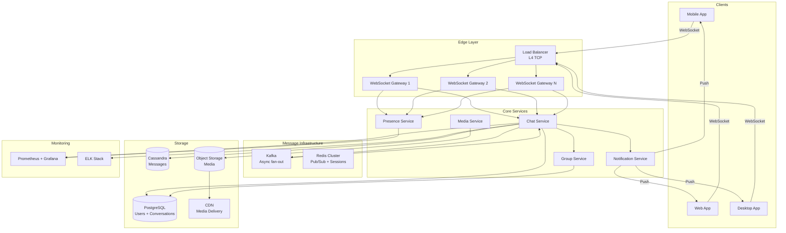
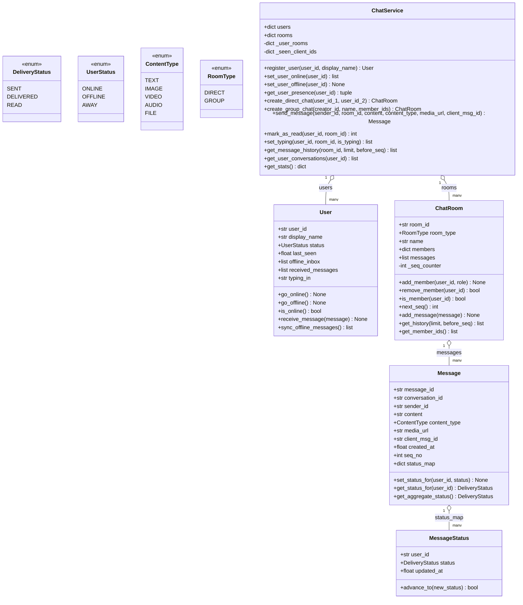
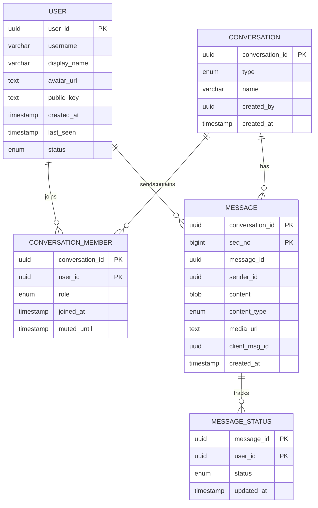
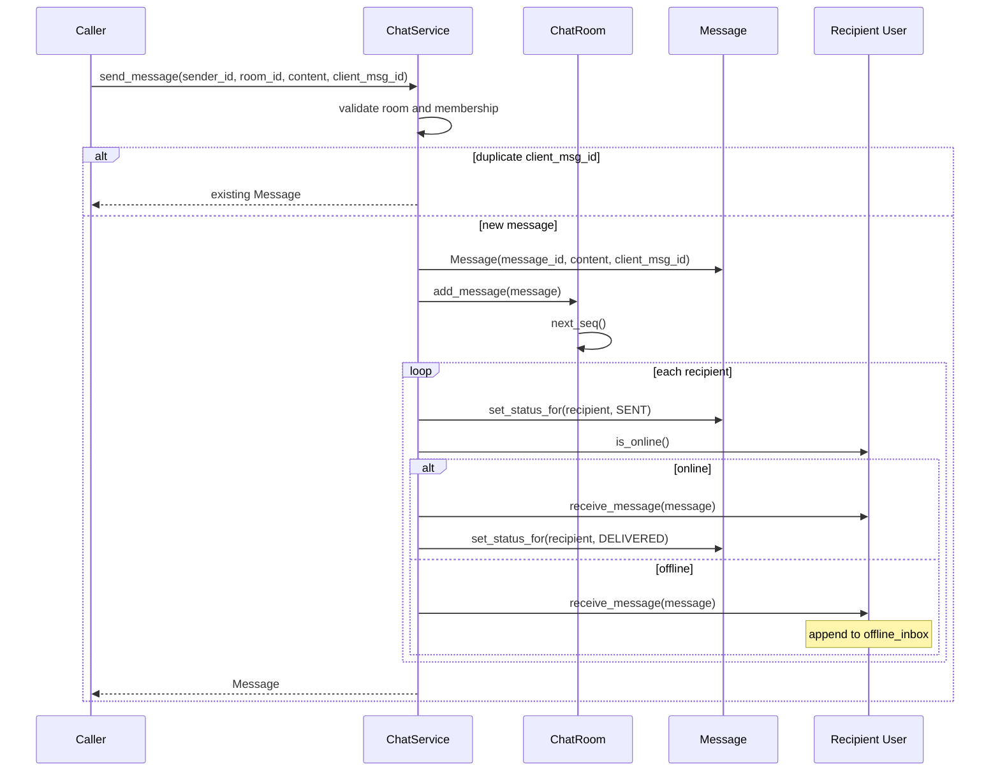
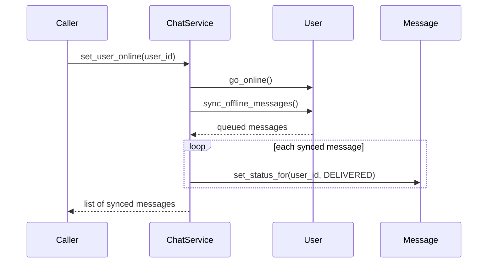

# Chat System (WhatsApp / Messenger) — Architecture

> **Scope of this document.** This is the consolidated architecture reference for
> the Chat System. It preserves the production design in `README.md` and maps it
> to [`chat_system.py`](./chat_system.py), a single-process, in-memory
> simulation. Sections tagged **[Design-only]** describe production concerns not
> present in code; sections tagged **[Implemented]** map directly to classes,
> methods, and data structures in `chat_system.py`.

---

## 1. Problem Statement

Design a real-time chat system similar to WhatsApp or Facebook Messenger that
supports one-to-one messaging, group conversations, online/offline presence,
read receipts, media sharing, historical sync, push notifications, and typing
indicators. The system must deliver messages quickly to online users, queue
messages for offline users, guarantee ordering within a conversation, and scale
to hundreds of millions of concurrent connections.

---

## 2. Requirements

### 2.1 Functional Requirements

| # | Requirement | Description | Status |
|---|-------------|-------------|--------|
| F1 | **1:1 chat** | Users send and receive private messages. | ✅ Implemented (`ChatService.create_direct_chat`, `send_message`) |
| F2 | **Group chat** | Create groups and broadcast to members. | ✅ Implemented (`create_group_chat`, `add_group_member`, `ChatRoom.members`) |
| F3 | **Online/offline status** | Presence and last-seen tracking. | ✅ Implemented (`UserStatus`, `set_user_online`, `set_user_offline`, `get_user_presence`) |
| F4 | **Read receipts** | Sent, delivered, read status per recipient. | ✅ Implemented (`DeliveryStatus`, `MessageStatus`, `Message.set_status_for`, `mark_as_read`) |
| F5 | **Media sharing** | Images, videos, audio, documents, voice notes. | ✅ Metadata implemented (`ContentType`, `media_url`); upload/storage pipeline **[Design-only]** |
| F6 | **Message history** | Persistent storage and paginated history. | ✅ In-memory history (`ChatRoom.messages`, `get_history`); durable storage **[Design-only]** |
| F7 | **Push notifications** | Notify offline users via APNs/FCM/web push. | **[Design-only]**; offline queue exists but no push sender |
| F8 | **Typing indicators** | Show when a participant is typing. | ✅ Implemented (`User.typing_in`, `ChatService.set_typing`) |
| F9 | **Offline sync** | Deliver queued messages on reconnect. | ✅ Implemented (`User.offline_inbox`, `sync_offline_messages`, `set_user_online`) |
| F10 | **Idempotent sends** | Deduplicate retries by client message id. | ✅ Implemented (`ChatService._seen_client_ids`) |

### 2.2 Non-Functional Requirements [Design-only targets]

| # | Requirement | Target |
|---|-------------|--------|
| NF1 | **Real-time delivery** | < 100 ms end-to-end latency for online recipients |
| NF2 | **Message ordering** | Strict per-conversation monotonic `seq_no` |
| NF3 | **Delivery guarantee** | At-least-once delivery with idempotent processing |
| NF4 | **E2E encryption** | Signal Protocol; messages unreadable by servers |
| NF5 | **Availability** | 99.99% uptime |
| NF6 | **Scalability** | 500M+ DAU and 2M concurrent connections per region |
| NF7 | **Durability** | Zero message loss with replicated storage and WAL |
| NF8 | **Low bandwidth** | Protobuf or similar binary protocol over WebSocket |

---

## 3. Capacity Estimation [Design-only]

| Metric | Estimate |
|--------|----------|
| Daily Active Users | 500 million |
| Messages per user per day | 40 |
| Total messages per day | 20 billion |
| Average messages/sec | ~230,000 |
| Peak messages/sec | ~700,000 |
| Concurrent WebSocket connections | ~100 million |

| Data Type | Size per Unit | Daily Volume | Daily Storage |
|-----------|---------------|--------------|---------------|
| Text message | 100 bytes | 20B messages | ~2 TB |
| Message metadata | 200 bytes | 20B messages | ~4 TB |
| Media | 300 KB avg | 2B media messages | ~600 TB |
| Total daily storage | — | — | ~606 TB |

| Direction | Calculation | Throughput |
|-----------|-------------|------------|
| Inbound text | 230K msg/s * 300 bytes | ~69 MB/s |
| Outbound text | 230K msg/s * 300 bytes * 1.2 fan-out | ~83 MB/s |
| Media inbound | 23K media/s * 300 KB | ~6.9 GB/s |

---

## 4. High-Level Architecture [Design-only]



Production separates long-lived WebSocket gateways from stateless core
services. The simulation collapses those tiers into `ChatService`, `User`,
`ChatRoom`, `Message`, and `MessageStatus`.

---

## 5. Reference Implementation Overview [Implemented]

`chat_system.py` models users, rooms, ordered messages, status maps, offline
queues, idempotent sends, media metadata, and typing indicators in memory.



### 5.1 Component Deep-Dive (doc → code)

| Design concept | Implemented by | Notes |
|----------------|----------------|-------|
| User registry and presence | `ChatService.users`, `User`, `set_user_online`, `set_user_offline` | `last_seen` updated on transitions. |
| Conversation membership | `ChatRoom.members`, `_user_rooms` | Roles are strings (`admin`, `member`). |
| Direct chat uniqueness | `create_direct_chat` | Deterministic `dm:min:max` room id returns existing room. |
| Group creation | `create_group_chat`, `add_group_member` | No 256-member cap enforced in code. |
| Message ordering | `ChatRoom._seq_counter`, `next_seq`, `add_message` | Monotonic per room in memory. |
| Delivery status | `Message.status_map`, `MessageStatus.advance_to` | State only advances sent → delivered → read. |
| Offline queue | `User.offline_inbox`, `sync_offline_messages` | Drained by `set_user_online`. |
| Idempotency | `ChatService._seen_client_ids` | Maps `client_msg_id` to existing `message_id`. |
| Typing indicators | `set_typing`, `User.typing_in` | Returns online members to notify; no network delivery. |
| Media messages | `ContentType`, `Message.media_url` | Stores metadata only; object storage/CDN are design-only. |

---

## 6. Data Model

### 6.1 Conceptual production schema [Design-only]



Messages are designed for Cassandra partitioning by `conversation_id` and
clustering by `seq_no`. Users/conversations fit PostgreSQL; media is stored in
object storage and delivered through a CDN.

### 6.2 As implemented [Implemented]

The simulation stores `User` objects in `ChatService.users`, `ChatRoom` objects
in `ChatService.rooms`, membership in `ChatRoom.members`, and message history in
`ChatRoom.messages`. `Message.status_map` embeds per-recipient status. There is
no durable database, encryption key store, object storage, Redis registry, or
Kafka pipeline in code.

---

## 7. API Design

### 7.1 Production WebSocket and REST surface [Design-only]

**WebSocket events:** `CONNECT`, `SEND_MSG`, `TYPING`, `ACK`, and `PRESENCE` from
client to server; `NEW_MSG`, `MSG_STATUS`, `TYPING_IND`, and `PRESENCE_UP` from
server to client.

| Method & Path | Purpose |
|---------------|---------|
| `POST /api/v1/auth/login` | Authenticate, return JWT + WebSocket ticket. |
| `POST /api/v1/conversations` | Create direct or group conversation. |
| `GET /api/v1/conversations/{id}/messages?before={seq}&limit=50` | Paginated message history. |
| `POST /api/v1/conversations/{id}/members` | Add members to a group. |
| `DELETE /api/v1/conversations/{id}/members/{uid}` | Remove group member. |
| `PUT /api/v1/users/{id}/profile` | Update display name/avatar. |
| `POST /api/v1/media/upload` | Upload media, return `media_url`. |
| `GET /api/v1/media/{media_id}` | Download media. |

### 7.2 In-process API [Implemented]

| Method | Signature | Returns / behavior |
|--------|-----------|--------------------|
| `register_user` | `(user_id, display_name) -> User` | Creates an offline user. |
| `set_user_online` | `(user_id) -> list[Message]` | Drains offline queue and marks delivered. |
| `set_user_offline` | `(user_id) -> None` | Updates presence. |
| `get_user_presence` | `(user_id) -> tuple[UserStatus, float]` | Missing users return offline, `0.0`. |
| `create_direct_chat` | `(user_id_1, user_id_2) -> ChatRoom` | Assumes users exist; returns existing room if present. |
| `create_group_chat` | `(creator_id, name, member_ids) -> ChatRoom` | Adds creator as admin and known members. |
| `add_group_member` | `(room_id, user_id) -> bool` | False if invalid room/user. |
| `send_message` | `(sender_id, room_id, content, content_type=TEXT, media_url=None, client_msg_id=None) -> Message | None` | None if invalid room or sender not member. |
| `mark_as_read` | `(user_id, room_id) -> int` | Count of statuses advanced. |
| `set_typing` | `(user_id, room_id, is_typing) -> list[str]` | Online members to notify. |
| `get_message_history` | `(room_id, limit=50, before_seq=None) -> list[Message]` | In-memory pagination. |
| `get_user_conversations` | `(user_id) -> list[ChatRoom]` | Uses `_user_rooms` index. |
| `get_stats` | `() -> dict` | Counts users, rooms, messages, online users. |

---

## 8. Key Workflows [Implemented]

### 8.1 Send message to online/offline recipients



### 8.2 Offline sync on reconnect



---

## 9. Detailed Component Design

### 9.1 WebSocket connection management [Design-only]

Production flow: REST auth returns JWT + one-time WebSocket ticket; gateway
validates the ticket, stores `ws:user:{user_id}` in Redis, subscribes to
`user:{user_id}:inbox`, and removes registry entries on disconnect. Heartbeats
detect stale connections and graceful shutdown drains sockets to other gateways.

### 9.2 Message delivery and ordering [Implemented core]

`ChatRoom.add_message` assigns a monotonic `seq_no` via `next_seq` before
appending to `messages`. `ChatService.send_message` fans out to all recipients
except the sender. Production persists to Cassandra before ACK; the simulation
persists in memory before fan-out.

### 9.3 Offline queue and group fan-out [Implemented]

When a recipient is offline, `User.receive_message` appends to `offline_inbox`.
`ChatService.set_user_online` moves messages into `received_messages` and marks
them delivered. Groups use synchronous write-time fan-out. The README's large
group Kafka fan-out and APNs/FCM notifications are **[Design-only]**.

### 9.4 Security and encryption [Design-only]

Signal Protocol E2E encryption, device key registration, key rotation, TLS 1.3,
JWT refresh tokens, one-time WebSocket tickets, rate limiting, and GDPR export or
deletion APIs are not implemented in the simulation.

---

## 10. Architectural Patterns [Design-only]

- **Pub/Sub pattern** — Redis channels route messages to whichever gateway owns a
  user's connection.
- **Event-driven architecture** — Kafka powers group fan-out, notifications, and
  analytics.
- **CQRS** — write path optimizes Cassandra append writes; read path optimizes
  pagination/search.
- **Connection gateway pattern** — gateways manage long-lived sockets separately
  from business logic.
- **Inbox pattern** — each user has a single delivery endpoint independent of
  conversation count.

---

## 11. Technology Choices & Trade-offs [Design-only]

| Transport | Latency | Server resources | Bidirectional | Choice |
|-----------|---------|------------------|---------------|--------|
| WebSocket | Low, ~10 ms | One TCP connection/client | Yes | Selected |
| Long polling | Medium, ~100 ms | High repeated HTTP | No | Fallback |
| SSE | Low | One connection/client | Server to client only | Not suitable |

| Message store | Write perf | Read perf | Scalability | Choice |
|---------------|------------|-----------|-------------|--------|
| Cassandra | Excellent | Good by partition key | Linear | Selected |
| HBase | Good | Good | Good | Alternative |
| MongoDB | Good | Good | Moderate | Not ideal at scale |

| Pub/Sub | Latency | Throughput | Persistence | Choice |
|---------|---------|------------|-------------|--------|
| Redis Pub/Sub | < 1 ms | Very high | No | Real-time routing |
| Kafka | ~5 ms | Very high | Yes | Async fan-out |
| RabbitMQ | ~2 ms | High | Yes | Overkill for routing |

---

## 12. Scaling, Reliability & Security [Design-only]

- **Connection sharding:** consistent hash by `user_id`; each gateway handles
  ~50K concurrent sockets; ~2000 gateways for 100M connections.
- **Message partitioning:** Cassandra partition key is `conversation_id`, cluster
  key is `seq_no`; time-based compaction supports sequential history reads.
- **Reliability:** persist before ACK, RF=3, quorum reads/writes, WAL, retry with
  `client_msg_id`, ordered `seq_no`, reconnect + history sync after gateway
  crash.
- **Monitoring:** delivery latency p99, per-gateway connections, throughput,
  failed deliveries, Cassandra latency, Redis lag, offline queue depth, gateway
  reconnection rate.
- **Security:** Signal Protocol, JWT + WebSocket tickets, TLS, rate limits,
  device verification, encrypted media at rest, PII encryption, GDPR workflows.

---

## 13. Running the Simulation [Implemented]

```powershell
uv run --no-project python SystemDesign\ChatSystem\chat_system.py
```

The demo registers users, changes presence, creates direct and group chats, sends
online/offline messages, records read receipts, syncs offline queues, stores
media metadata, emits typing notifications, deduplicates sends, fetches history,
lists conversations, and prints service stats.

### Suggested tests

- `send_message` assigns increasing `seq_no` and returns existing message for a
  duplicate `client_msg_id`.
- Offline recipients receive messages in `offline_inbox` and then in
  `received_messages` after `set_user_online`.
- `mark_as_read` only advances messages not sent by the reader.
- `create_direct_chat` is idempotent for the same user pair.
- `set_typing` returns only online members except the typer.

---

## 14. Future Improvements

- Enforce group size limits and authorization checks for membership changes.
- Add durable repositories for users, rooms, messages, and statuses.
- Implement WebSocket gateway and Redis pub/sub simulation.
- Add push notification stubs for offline users.
- Add E2E-encryption metadata and media upload/download abstractions.
- Add thread safety if `ChatService` is shared across concurrent workers.
