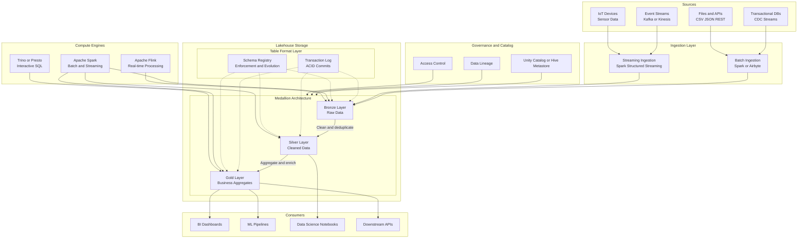
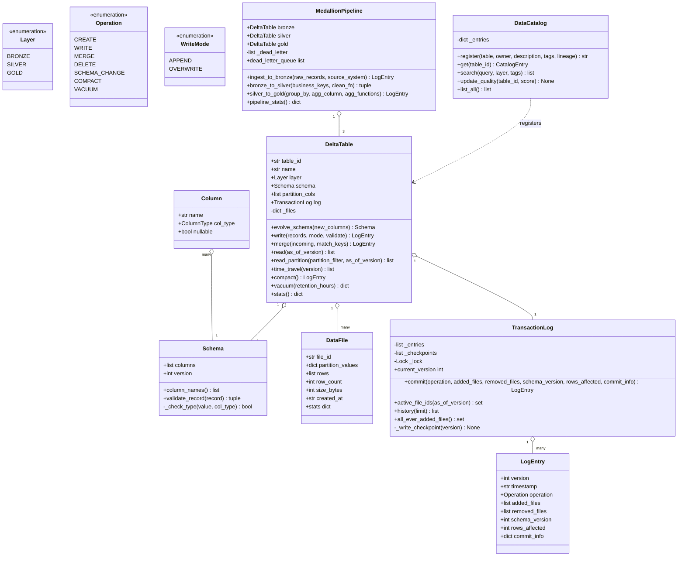
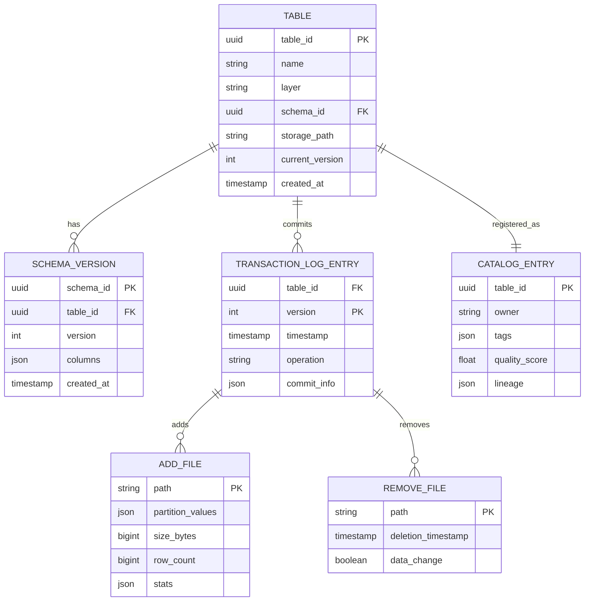
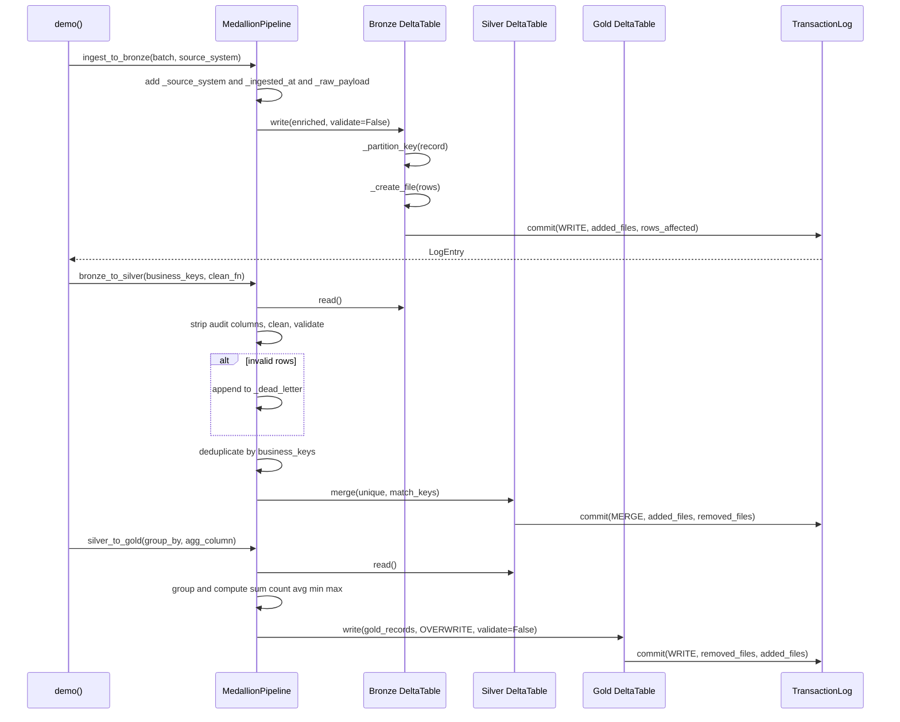
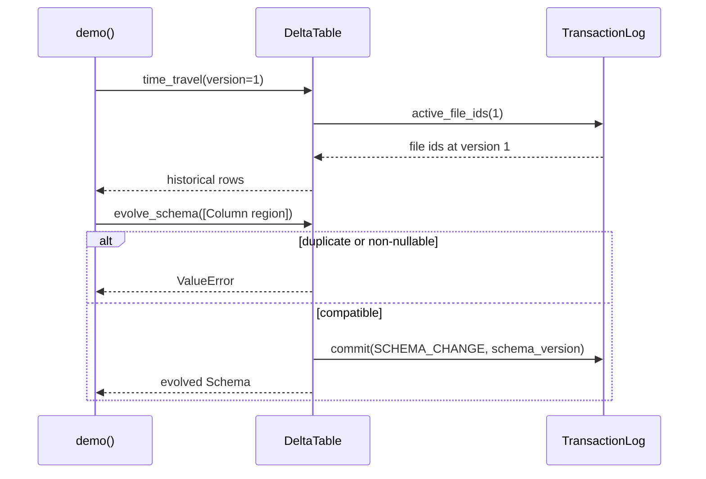

# Data Lakehouse — Architecture

> **Scope of this document.** This is the consolidated architecture reference for
> the Data Lakehouse design. It preserves the README system-design material and
> maps it to the reference implementation in `data_lakehouse.py`, a single-process
> in-memory simulation. Sections tagged **[Design-only]** describe production
> capabilities not present in the simulation; sections tagged **[Implemented]**
> map directly to code.

---

## 1. Problem Statement

Modern data architectures balance a low-cost, flexible **data lake** against a
high-performance, governed **data warehouse**:

| Challenge | Data Lake | Data Warehouse |
|-----------|-----------|----------------|
| Storage cost | Low object-store cost | High proprietary cost |
| Schema flexibility | Schema-on-read | Rigid schema-on-write |
| Data types | Structured + unstructured | Structured only |
| ACID transactions | Typically no | Yes |
| Query performance | Slow full scans without optimization | Fast optimized queries |
| ML/AI support | Native raw-file access | Often export-driven |
| Data freshness | Near-real-time possible | Batch ETL lag |
| Governance | Weak without a catalog | Stronger controls |

Running both systems causes duplicated data, fragile ETL, stale warehouse data,
governance gaps, and higher cost. A **Data Lakehouse** applies warehouse-grade
reliability (ACID, schema enforcement, governance, time travel) directly on
low-cost object storage.

The Python implementation demonstrates the core mechanics with in-memory
objects: transaction log, Delta-like table snapshots, additive schema evolution,
Medallion processing, dead-letter handling, compaction, vacuum, and catalog
search.

---

## 2. Requirements

### 2.1 Functional Requirements

| ID | Requirement | Details | Status |
|----|-------------|---------|--------|
| FR-1 | Unified ingestion | Batch and streaming ingestion into one platform. | ⚠️ Partially implemented: batch-style `list` ingestion via `MedallionPipeline.ingest_to_bronze`; streaming connectors are **[Design-only]**. |
| FR-2 | ACID transactions | Serializable isolation for reads/writes on data lake files. | ⚠️ Simulated by `TransactionLog.commit()` and `active_file_ids()`; distributed serializable conflict detection is **[Design-only]**. |
| FR-3 | Schema enforcement | Validate incoming records against a registered schema. | ✅ Implemented by `Schema.validate_record()` and `DeltaTable.write(validate=True)`. |
| FR-4 | Schema evolution | Add compatible columns without rewriting data. | ✅ Implemented by `DeltaTable.evolve_schema()` for nullable new columns only. |
| FR-5 | Time travel | Query historical versions by version number. | ✅ Implemented by `DeltaTable.time_travel(version)` and `DeltaTable.read(as_of_version=...)`. Timestamp time travel is **[Design-only]**. |
| FR-6 | Medallion layers | Bronze raw, Silver cleaned, Gold aggregated tiers. | ✅ Implemented by `Layer` and `MedallionPipeline.ingest_to_bronze()`, `bronze_to_silver()`, `silver_to_gold()`. |
| FR-7 | Unified serving | Serve BI, SQL, and ML from one copy. | ⚠️ Implemented only as in-memory `DeltaTable.read()`; Trino/Spark/BI serving are **[Design-only]**. |
| FR-8 | Table management | Create, alter, drop, list, partition, metadata. | ⚠️ Create/evolve/list/search are implemented by `DeltaTable` and `DataCatalog`; drop and REST APIs are **[Design-only]**. |
| FR-9 | Data catalog | Register, discover, search with metadata, lineage, quality. | ✅ Basic catalog implemented by `DataCatalog.register()`, `search()`, `update_quality()`, and `list_all()`. |
| FR-10 | Compaction and vacuum | Merge small files and remove obsolete versions. | ✅ Implemented by `DeltaTable.compact()` and `vacuum()`; retention-age safety is **[Design-only]**. |

### 2.2 Non-Functional Requirements [Design-only targets]

| ID | Requirement | Target |
|----|-------------|--------|
| NFR-1 | Scale | Petabyte-scale storage across billions of files |
| NFR-2 | Data freshness | < 5 minutes from source event to queryable Gold table |
| NFR-3 | ACID guarantees | Serializable isolation; no partial/corrupt reads under concurrent writes |
| NFR-4 | Query latency | Interactive BI queries < 10 s on Gold tables |
| NFR-5 | Availability | 99.95% uptime for query engine and metastore |
| NFR-6 | Durability | 99.999999999% via cloud object storage replication |
| NFR-7 | Cost efficiency | >= 5x cheaper per TB than traditional cloud warehouse |
| NFR-8 | Governance | Column-level access control, audit logging, data lineage |
| NFR-9 | Interoperability | Open table format readable by Spark, Trino, Flink, DuckDB, etc. |

---

## 3. Capacity Estimation [Design-only]

### 3.1 Storage

| Tier | Daily ingest | Retention | Total storage |
|------|--------------|-----------|---------------|
| Bronze raw | 10 TB/day | 90 days | ~900 TB |
| Silver cleaned | 6 TB/day after 40% reduction | 1 year | ~2.2 PB |
| Gold aggregated | 500 GB/day | 3 years | ~550 TB |
| Transaction logs | ~1 GB/day | Forever | ~10 TB |
| **Total** | | | **~3.7 PB** |

### 3.2 Compute

| Workload | Cluster size | Concurrency |
|----------|--------------|-------------|
| Batch ingestion | 50-node Spark daily | 1-2 jobs |
| Streaming ingestion | 20-node Spark Structured Streaming | Always-on |
| Bronze → Silver | 30-node Spark hourly | 3-5 jobs |
| Silver → Gold | 20-node Spark hourly | 5-10 jobs |
| BI / ad-hoc queries | 10-node Trino cluster | 50-100 concurrent |
| ML feature reads | Dedicated 5-node cluster | 10-20 concurrent |

### 3.3 Query Throughput

| Metric | Target |
|--------|--------|
| Point lookups on Gold | < 1 s |
| Analytical scans on 1 TB Gold data | < 10 s |
| Full scan on 100 TB Silver data | < 5 min |
| Concurrent BI queries | 100+ |
| Streaming write throughput | 200 K events/s |

---

## 4. High-Level Architecture [Design-only]



---

## 5. Reference Implementation Overview [Implemented]

`data_lakehouse.py` collapses the architecture into one process. Rows are
`dict` objects, data files are `DataFile` instances, commits are `LogEntry`
instances, and table history is reconstructed from `TransactionLog`.



### 5.1 Component Deep-Dive (doc → code)

| Design concept | Implemented by | Notes |
|----------------|----------------|-------|
| Layer classification | `Layer` enum | Encodes `bronze`, `silver`, `gold`. |
| Transaction log | `TransactionLog._entries`, `commit()`, `active_file_ids()` | Append-only version log; active files are reconstructed by replay. |
| Checkpoint optimization | `CHECKPOINT_INTERVAL`, `TransactionLog._write_checkpoint()` | In-memory checkpoint every 10 commits. |
| Delta table | `DeltaTable` | Schema, partition columns, files, schema history, and transaction log. |
| Schema enforcement | `Schema.validate_record()` | Checks required fields, nullability, and primitive types. |
| Schema evolution | `DeltaTable.evolve_schema()` | Adds nullable columns only and commits `SCHEMA_CHANGE`. |
| Append/overwrite | `DeltaTable.write()` | Creates synthetic `part-*.parquet` `DataFile` objects. |
| MERGE upsert | `DeltaTable.merge()` | Full-table read/modify/rewrite by match keys. |
| Time travel | `DeltaTable.time_travel()` | Reads active-file snapshot for a historical version. |
| Partition pruning | `DeltaTable.read_partition()` | Filters active files by `DataFile.partition_values`. |
| Compaction | `DeltaTable.compact()` | Rewrites active rows into chunks of `TARGET_FILE_SIZE_ROWS`. |
| Vacuum | `DeltaTable.vacuum()` | Deletes obsolete in-memory files; retention age is not enforced. |
| Bronze ingestion | `MedallionPipeline.ingest_to_bronze()` | Adds audit metadata and writes with `validate=False`. |
| Silver quality gate | `MedallionPipeline.bronze_to_silver()` | Cleans, validates, deduplicates, merges, and quarantines rejects. |
| Gold aggregation | `MedallionPipeline.silver_to_gold()` | Computes sum/count/avg/min/max for a numeric column. |
| Catalog | `DataCatalog.register()`, `search()`, `list_all()` | Tracks owner, description, tags, quality score, lineage IDs. |

---

## 6. Data Model

### 6.1 Conceptual production model [Design-only]



### 6.2 As implemented [Implemented]

- `DeltaTable._files: dict[str, DataFile]` stores active and obsolete files.
- `TransactionLog._entries: list[LogEntry]` stores every commit.
- `TransactionLog._checkpoints: list[Checkpoint]` stores active-file snapshots.
- `DataCatalog._entries: dict[str, CatalogEntry]` stores table metadata.
- Rows are plain `dict` records; `DataFile.stats` computes numeric min/max only.

There is no physical Parquet, object-store path, metastore database, row-level
delete file, column ACL, or SQL engine in code.

---

## 7. API Design

### 7.1 Production HTTP surface [Design-only]

| Method & Path | Purpose | Success |
|---------------|---------|---------|
| `POST /api/v1/tables` | Create table with schema, partition columns, layer, format. | `201 Created` |
| `GET /api/v1/tables?layer=silver&search=orders` | List/search tables. | `200 OK` |
| `GET /api/v1/tables/{table_id}` | Fetch metadata, schema, current version. | `200 OK` |
| `PUT /api/v1/tables/{table_id}/schema` | Add compatible columns. | `200 OK` |
| `DELETE /api/v1/tables/{table_id}` | Drop table. | `204 No Content` |
| `POST /api/v1/tables/{table_id}/ingest` | Append, overwrite, or merge records. | `202 Accepted` |
| `POST /api/v1/tables/{table_id}/merge` | Upsert rows by match keys. | `200 OK` |
| `POST /api/v1/query` | Run SQL against serving tables. | `200 OK` |
| `GET /api/v1/tables/{table_id}/history` | Return commit history. | `200 OK` |
| `POST /api/v1/query/time-travel` | Query by version/timestamp. | `200 OK` |
| `POST /api/v1/tables/{table_id}/compact` | Bin-pack small files. | `200 OK` |
| `POST /api/v1/tables/{table_id}/vacuum` | Delete obsolete files after retention. | `200 OK` |
| `POST /api/v1/tables/{table_id}/zorder` | Recluster for data skipping. | `200 OK` |

### 7.2 In-process API [Implemented]

| Method | Signature | Raises |
|--------|-----------|--------|
| `Schema.validate_record` | `(record: dict[str, Any]) -> tuple[bool, str]` | — |
| `TransactionLog.commit` | `(operation, added_files=None, removed_files=None, schema_version=None, rows_affected=0, commit_info=None) -> LogEntry` | No real conflict path despite docstring. |
| `DeltaTable.evolve_schema` | `(new_columns: list[Column]) -> Schema` | `ValueError` for duplicate or non-nullable added column. |
| `DeltaTable.write` | `(records: list[dict], mode=WriteMode.APPEND, validate=True) -> LogEntry` | `ValueError` for empty records or all rejected. |
| `DeltaTable.merge` | `(incoming: list[dict], match_keys: list[str]) -> LogEntry` | — |
| `DeltaTable.read` | `(as_of_version: int | None = None) -> list[dict]` | — |
| `DeltaTable.read_partition` | `(partition_filter: dict[str, str], as_of_version=None) -> list[dict]` | — |
| `DeltaTable.time_travel` | `(version: int) -> list[dict]` | `ValueError` if version is out of range. |
| `DeltaTable.compact` | `() -> LogEntry` | `ValueError` when table is empty. |
| `DeltaTable.vacuum` | `(retention_hours=168) -> dict[str, int]` | — |
| `MedallionPipeline.bronze_to_silver` | `(business_keys: list[str], clean_fn=None) -> tuple[LogEntry, int, int]` | `ValueError` if no valid records remain. |
| `MedallionPipeline.silver_to_gold` | `(group_by: list[str], agg_column: str, agg_functions=None) -> LogEntry` | `ValueError` if Silver is empty. |
| `DataCatalog.search` | `(query='', layer=None, tags=None) -> list[CatalogEntry]` | — |

---

## 8. Key Workflows [Implemented]

### 8.1 Bronze → Silver → Gold code path



### 8.2 Time travel and schema evolution



---

## 9. Detailed Component Design

### 9.1 Transaction log and snapshots [Implemented]

`TransactionLog.commit()` appends a `LogEntry` under a `threading.Lock`, assigns
the next integer version, records added and removed file IDs, and writes a
`Checkpoint` every `CHECKPOINT_INTERVAL` versions. `active_file_ids()` starts
from the latest checkpoint at or before the requested version, then replays log
entries forward.

**Gap:** the docstring mentions optimistic concurrency conflict detection, but
there is no caller-supplied expected version. The lock serializes commits in one
process; distributed conflict checks are **[Design-only]**.

### 9.2 Delta table and files [Implemented]

`DeltaTable.write()` validates records, partitions them with `_partition_key()`,
creates synthetic `DataFile` objects with `_create_file()`, and commits `WRITE`.
`merge()` performs a full-table read/modify/rewrite upsert by match key.
`read_partition()` simulates partition pruning by inspecting file partition
metadata.

### 9.3 Medallion layers [Implemented]

Bronze preserves raw records plus audit metadata. Silver strips audit fields,
applies a cleaning callback, validates against the Silver schema, deduplicates by
business key, and merges. Gold groups Silver rows and calculates business
aggregates.

### 9.4 Catalog and governance [Implemented + Design-only]

`DataCatalog` implements registration, text/layer/tag search, quality-score
updates, and listing. Unity Catalog/Hive Metastore, column-level ACLs, audit
trails, and lineage UI are **[Design-only]**.

### 9.5 Maintenance [Implemented + Design-only]

`compact()` rewrites active rows into fewer files. `vacuum()` deletes obsolete
in-memory file objects. Retention windows, active-reader protection, Z-ordering,
bloom filters, lifecycle policies, and physical object deletion are **[Design-only]**.

---

## 10. Architectural Patterns [Design-only]

- **Medallion Architecture:** Bronze → Silver → Gold with quality gates. The code
  implements this directly through `MedallionPipeline`.
- **Delta/Iceberg Table Format:** transaction log and file manifests provide ACID,
  time travel, schema evolution, and interoperability. The code simulates the log.
- **Change Data Capture:** source row changes become MERGE operations; `merge()`
  mirrors this behavior.
- **SCD Type 2:** keep historical dimension values; not implemented.
- **Materialized Views:** Gold tables are business-ready aggregates; the code
  recomputes from the current Silver snapshot rather than incremental change feed.

---

## 11. Technology Choices & Trade-offs [Design-only]

| Decision | Options | Recommendation |
|----------|---------|----------------|
| Table format | Delta Lake, Iceberg, Hudi | Delta for Spark-native shops; Iceberg for multi-engine environments. |
| Compute | Spark, Trino, Flink, DuckDB | Spark for ETL, Trino for BI, Flink for streaming, DuckDB for local dev. |
| Storage | S3, ADLS Gen2, GCS | Cloud object storage with lifecycle policies. |
| Catalog | Unity Catalog, Hive Metastore, Nessie, Glue | Unity Catalog for fine-grained governance; Hive for open ubiquity. |
| Transform layer | dbt, Spark jobs, Airflow/Dagster | dbt for SQL, Spark for complex transforms, Airflow/Dagster for orchestration. |

---

## 12. Scaling, Reliability & Security [Design-only]

| Dimension | Strategy |
|-----------|----------|
| Storage | Object storage scales independently; tier cold data. |
| Compute | Auto-scaling Spark clusters; separate ETL/query/ML clusters. |
| Metadata | Checkpoint transaction logs and maintain partition indexes. |
| Query | Z-ordering, data skipping, materialized aggregates, hot-data cache. |
| Ingestion | Kafka partitions mapped to parallel Spark/Flink tasks. |
| Multi-region | Object-store and metastore replication for DR. |

Reliability depends on atomic commit files, snapshot isolation, checksum
validation, raw Bronze replay, Spark checkpoints, metastore backups, and DLQs for
schema failures. Security uses private networking, IAM/OAuth, column/row-level
ACLs, encryption at rest/in transit, immutable audit logs, data masking, and GDPR
delete/vacuum workflows.

Key monitoring targets: ingestion lag < 2 min, Bronze→Silver freshness < 5 min,
Silver→Gold freshness < 10 min, Gold query P95 < 5 s, DLQ depth near zero, small
file count < 100 per partition, and data quality score > 0.95.

---

## 13. Running the Simulation [Implemented]

```powershell
uv run --no-project python SystemDesign\DataLakehouse\data_lakehouse.py
```

The demo exercises schema creation, Bronze ingestion, bad-data handling, Silver
cleaning/deduplication, Gold aggregation, time travel, schema evolution, catalog
search, compaction, vacuum, transaction history, and pipeline stats.

### Suggested tests

- `Schema.validate_record()` rejects missing required fields and bad types.
- `DeltaTable.write()` and `time_travel()` preserve historical snapshots.
- `DeltaTable.evolve_schema()` accepts nullable columns and rejects invalid ones.
- `MedallionPipeline.bronze_to_silver()` quarantines invalid rows and deduplicates.
- `DeltaTable.compact()` preserves row count and `vacuum()` deletes obsolete files.
- `DataCatalog.search()` filters by tag, layer, and text.

---

## 14. Future Improvements

- Add expected-version conflict checks to `TransactionLog.commit()`.
- Persist files/logs to disk or object storage.
- Add timestamp time travel and retention-aware vacuum.
- Add DELETE operations and row-level tombstones.
- Add Z-order or min/max-aware pruning beyond partition filtering.
- Add REST and SQL facades for the production API.
- Introduce storage/catalog interfaces for real Delta, Iceberg, Spark, or DuckDB backends.
