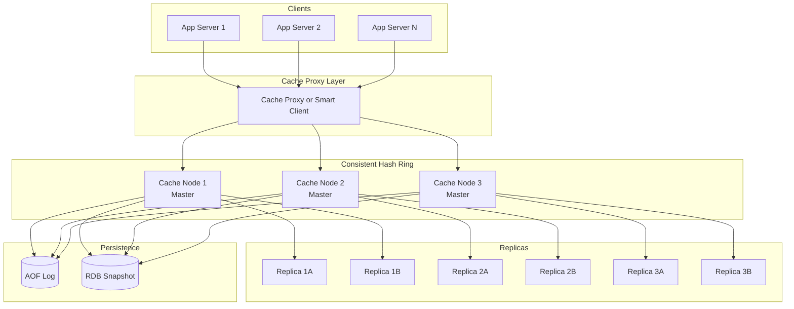
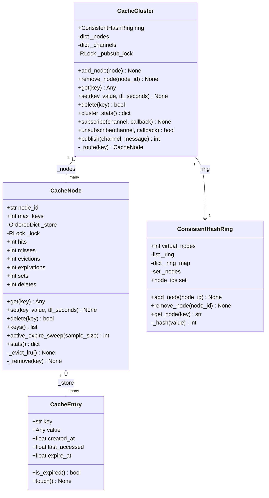
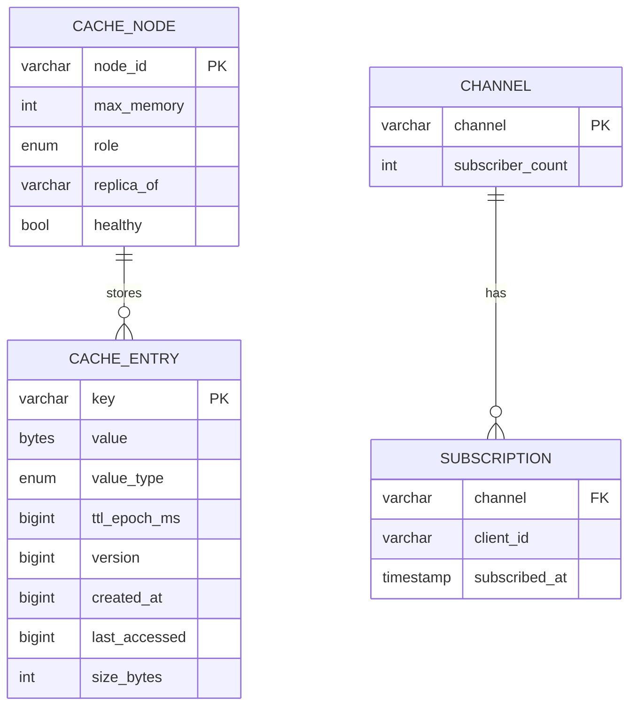
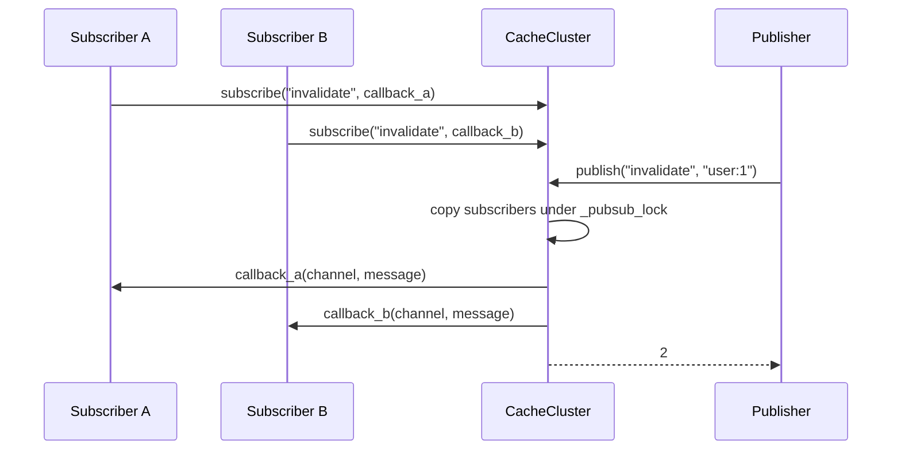

# Distributed Cache (Redis-like) — Architecture

> **Scope of this document.** This is the consolidated architecture reference for
> the Distributed Cache. It preserves the production design in `README.md` and
> maps it to [`distributed_cache.py`](./distributed_cache.py), a single-process,
> in-memory simulation. Sections tagged **[Design-only]** describe production
> concerns not present in code; sections tagged **[Implemented]** map directly to
> classes, methods, and data structures. The current code **does** implement
> thread safety (`CacheNode._lock`, `CacheCluster._pubsub_lock`) and Redis-style
> pub/sub (`subscribe`, `unsubscribe`, `publish`).

---

## 1. Problem Statement

Modern web applications require sub-millisecond access to frequently read data.
Databases alone cannot sustain the read throughput needed at scale. A
distributed, in-memory cache sits between application servers and persistence,
absorbing most reads while providing expiration, eviction, pub/sub messaging,
optional persistence, and horizontal scalability.

---

## 2. Requirements

### 2.1 Functional Requirements

| ID | Requirement | Details | Status |
|----|-------------|---------|--------|
| FR-1 | **GET / SET / DELETE** | Core key-value CRUD operations. | ✅ Implemented (`CacheCluster.get/set/delete`, `CacheNode.get/set/delete`) |
| FR-2 | **TTL expiration** | Keys expire after configurable TTL. | ✅ Implemented (`CacheEntry.is_expired`, `CacheNode.get`, `keys`, `active_expire_sweep`) |
| FR-3 | **LRU eviction** | Evict least-recently-used keys when a node exceeds capacity. | ✅ Implemented (`OrderedDict`, `CacheNode._evict_lru`) |
| FR-4 | **Pub/Sub** | Publish messages to channels and subscribe to receive them. | ✅ Implemented (`CacheCluster.subscribe`, `unsubscribe`, `publish`) |
| FR-5 | **Data types** | String, list, hash, set values. | Partially implemented: arbitrary Python values; type-specific Redis commands **[Design-only]** |
| FR-6 | **Atomic operations** | `INCR/DECR`, `LPUSH/RPUSH/LPOP/RPOP`. | **[Design-only]** |
| FR-7 | **Key pattern search** | `KEYS` / `SCAN` with glob patterns. | Partially implemented: per-node `keys()` only; cluster scan **[Design-only]** |
| FR-8 | **Batch operations** | `MGET` / `MSET`. | **[Design-only]** |
| FR-9 | **Consistent hashing** | Route keys to nodes using virtual nodes. | ✅ Implemented (`ConsistentHashRing`) |
| FR-10 | **Thread safety** | Safe node and pub/sub state under concurrent access. | ✅ Implemented with `threading.RLock` in `CacheNode` and `CacheCluster` |

### 2.2 Non-Functional Requirements [Design-only targets]

| ID | Requirement | Target |
|----|-------------|--------|
| NFR-1 | **Latency** | p99 < 1 ms for single-key operations |
| NFR-2 | **Throughput** | >= 100K ops/sec per node |
| NFR-3 | **Availability** | 99.99% uptime |
| NFR-4 | **Durability** | Optional AOF / RDB snapshots |
| NFR-5 | **Scalability** | Linear scale-out via consistent hashing |
| NFR-6 | **Consistency** | Eventual across replicas; strong within one node |
| NFR-7 | **Memory efficiency** | < 100 bytes overhead per key on average |

---

## 3. Capacity Estimation [Design-only]

| Parameter | Value |
|-----------|-------|
| Total unique keys | 1 billion |
| Average key size | 64 bytes |
| Average value size | 256 bytes |
| Metadata per entry | 80 bytes |
| Replication factor | 3 |

```text
Memory per key    = 64 + 256 + 80 = 400 bytes
Total raw memory  = 1B * 400 B    = 400 GB
With replication  = 400 GB * 3    = 1.2 TB
Nodes at 64 GB    = ceil(1200 / 64) = 19 nodes, about 20 with headroom
```

Hit-ratio targets: cache hit ratio >= 95%; top 1% of hot keys may account for
20% of traffic.

---

## 4. High-Level Architecture [Design-only]



Production uses smart clients/proxies, masters, replicas, persistence, and
failover. The simulation implements the smart-client/ring and master nodes only;
replication and persistence remain design-only.

---

## 5. Reference Implementation Overview [Implemented]

`distributed_cache.py` provides `CacheEntry`, `CacheNode`,
`ConsistentHashRing`, and `CacheCluster`. It routes keys via MD5-based virtual
nodes, stores entries in thread-safe `OrderedDict` caches, supports TTL/LRU, and
implements callback-based pub/sub.



### 5.1 Component Deep-Dive (doc → code)

| Design concept | Implemented by | Notes |
|----------------|----------------|-------|
| Key-value entry | `CacheEntry` | Stores key, value, timestamps, and absolute `expire_at`. |
| Thread-safe node operations | `CacheNode._lock: threading.RLock` | Guards `_store` and counters. |
| Lazy expiration | `CacheNode.get`, `CacheNode.keys` | Expired entries are deleted during access/listing. |
| Active expiration | `CacheNode.active_expire_sweep` | Random sample sweep; no background scheduler yet. |
| LRU eviction | `OrderedDict`, `_evict_lru` | Front is least-recently-used; hits move keys to end. |
| Consistent hashing | `ConsistentHashRing` | MD5 modulo `2**32`, `bisect_right`, configurable virtual nodes. |
| Cluster routing | `CacheCluster._route` | Chooses node for key via ring. |
| Pub/Sub | `CacheCluster._channels`, `subscribe`, `unsubscribe`, `publish` | Callback list per channel; publish fans out synchronously. |
| Pub/Sub thread safety | `CacheCluster._pubsub_lock: threading.RLock` | Copies subscribers under lock, invokes callbacks outside lock. |
| Metrics | `CacheNode.stats`, `CacheCluster.cluster_stats` | Hits, misses, evictions, expirations, sets, deletes. |

---

## 6. Data Model

### 6.1 Conceptual production model [Design-only]



Each node maintains a hash table, LRU doubly-linked list, TTL min-heap, and
pub/sub channel map. Production adds persistence offsets, replica state, and ACL
metadata.

### 6.2 As implemented [Implemented]

`CacheEntry` omits explicit `value_type`, `version`, and `size_bytes`; any Python
object can be stored as `value`. The hash table and LRU list are combined in
`CacheNode._store`. There is no TTL heap; active expiration samples random keys.
Pub/sub subscriptions are process-local callbacks in `CacheCluster._channels`.

---

## 7. API Design

### 7.1 Production Redis-like command surface [Design-only]

```text
SET key value [EX seconds] [PX milliseconds] [NX|XX]
GET key
DEL key [key ...]
EXISTS key
EXPIRE key seconds
TTL key
LPUSH/RPUSH/LPOP/RPOP/LRANGE
HSET/HGET/HDEL/HGETALL
SADD/SREM/SMEMBERS/SISMEMBER
INCR/DECR
PUBLISH channel message
SUBSCRIBE channel [channel ...]
UNSUBSCRIBE channel
MGET key [key ...]
MSET key value [key value ...]
```

### 7.2 In-process API [Implemented]

| Method | Signature | Returns / raises |
|--------|-----------|------------------|
| `CacheNode.get` | `(key) -> Any | None` | Miss or expired returns `None`. |
| `CacheNode.set` | `(key, value, ttl_seconds=None) -> None` | May evict LRU entries. |
| `CacheNode.delete` | `(key) -> bool` | True if key existed. |
| `CacheNode.keys` | `() -> list[str]` | Removes expired keys first. |
| `CacheNode.active_expire_sweep` | `(sample_size=20) -> int` | Number expired. |
| `CacheCluster.add_node` | `(node: CacheNode) -> None` | Adds node and vnodes. |
| `CacheCluster.remove_node` | `(node_id) -> None` | Removes node and vnodes; no data migration. |
| `CacheCluster.get` | `(key) -> Any | None` | Routes to node. |
| `CacheCluster.set` | `(key, value, ttl_seconds=None) -> None` | Raises `RuntimeError` if no nodes. |
| `CacheCluster.delete` | `(key) -> bool` | False if no route. |
| `CacheCluster.subscribe` | `(channel, callback) -> None` | Callback receives `(channel, message)`. |
| `CacheCluster.unsubscribe` | `(channel, callback) -> bool` | True if removed. |
| `CacheCluster.publish` | `(channel, message) -> int` | Number of subscribers invoked. |

---

## 8. Key Workflows [Implemented]

### 8.1 Cluster SET and GET

```mermaid
sequenceDiagram
    participant C as Caller
    participant CL as CacheCluster
    participant R as ConsistentHashRing
    participant N as CacheNode
    C->>CL: set(key, value, ttl_seconds)
    CL->>R: get_node(key)
    R-->>CL: node_id
    CL->>N: set(key, value, ttl_seconds)
    N->>N: acquire _lock
    alt at capacity
        N->>N: _evict_lru()
    end
    N-->>CL: stored
    C->>CL: get(key)
    CL->>R: get_node(key)
    CL->>N: get(key)
    alt hit and not expired
        N->>N: move_to_end; touch; hits += 1
        N-->>CL: value
        CL-->>C: value
    else miss or expired
        N->>N: misses += 1; maybe _remove(key)
        CL-->>C: None
    end
```

### 8.2 Pub/Sub fan-out



---

## 9. Detailed Component Design

### 9.1 Consistent hashing [Implemented]

Each physical node maps to `virtual_nodes` positions using
`md5(f"{node_id}#vnode_{i}") % 2**32`. `get_node` hashes a key, uses
`bisect_right`, wraps around, and returns the owning node id. Production
replication to the next `R-1` distinct physical nodes is **[Design-only]** in
this module.

### 9.2 LRU and TTL [Implemented]

`OrderedDict` gives O(1) lookup, promotion, and pop-from-front eviction. Hits and
SET updates move keys to the end. `get` and `keys` perform lazy expiration.
`active_expire_sweep(sample_size=20)` samples random keys; the Redis-style
background loop every 100 ms with CPU caps is **[Design-only]**.

### 9.3 Write-behind persistence [Design-only]

The README describes AOF and RDB: AOF logs every write with configurable fsync
(`always`, `everysec`, `no`); RDB periodically snapshots the full dataset via
copy-on-write; restart loads RDB then replays AOF. The Python simulation has no
persistence.

### 9.4 Pub/Sub [Implemented]

`CacheCluster._channels` maps channel names to callback lists. `publish` copies
subscribers while holding `_pubsub_lock`, then releases the lock before invoking
callbacks so slow subscribers do not block subscription changes.

---

## 10. Architectural Patterns [Design-only]

- **Consistent hashing** — minimizes key movement when nodes join/leave; virtual
  nodes smooth imbalance.
- **Caching strategies** — cache-aside, write-through, write-behind, and
  read-through trade consistency for throughput/latency.
- **Master-replica replication** — asynchronous log streaming, sentinel/gossip
  failover, optional replica reads.
- **Hot-key mitigation** — client-side L1 cache, read replicas, and key
  splitting such as `popular_key:{0..N}`.

---

## 11. Technology Choices & Trade-offs [Design-only]

| Dimension | In-memory Redis | SSD-backed Dragonfly/KeyDB style |
|-----------|-----------------|----------------------------------|
| Latency | < 1 ms | 1-5 ms |
| Cost/GB | High DRAM cost | Lower NVMe cost |
| Capacity | Limited by RAM | 10x+ larger datasets |
| Use case | Hot data, sessions | Warm data, large caches |

| Feature | Redis | Memcached |
|---------|-------|-----------|
| Data types | String, List, Set, Hash, Sorted Set, Stream | String only |
| Persistence | AOF + RDB | None |
| Replication | Built-in master-replica | None, client-side |
| Pub/Sub | Yes | No |
| Clustering | Redis Cluster hash slots | Client-side consistent hashing |
| Threading | Single-threaded command loop with I/O threads | Multi-threaded |
| Memory efficiency | Higher overhead per key | Lower overhead slab allocator |

| Format | Speed | Size | Schema | Best for |
|--------|-------|------|--------|----------|
| Raw bytes | Fastest | Smallest | None | Simple strings/counters |
| MessagePack | Fast | Compact | Schemaless | General structured data |
| Protocol Buffers | Fast | Compact | Required | Cross-service contracts |
| JSON | Moderate | Large | Schemaless | Human-readable debugging |

---

## 12. Scaling, Reliability & Security [Design-only]

- **Horizontal scaling:** add virtual nodes; only `K/N` keys migrate. Current code
  changes routing but does not move existing keys.
- **Reliability:** sentinel/gossip failure detection, replica promotion, `WAIT`,
  stale-serve, jittered TTL, memory alerts, and configurable durability levels.
- **Security:** `AUTH`/ACL users, TLS on client-node and node-node links, private
  VPC deployment, disk encryption for snapshots/logs, value/key size limits.
- **Monitoring:** hit ratio, memory usage, evictions/sec, connected clients,
  replication lag, p99 command latency, TTL key counts, slow-log.

---

## 13. Running the Simulation [Implemented]

```powershell
uv run --no-project python SystemDesign\DistributedCache\distributed_cache.py
```

The demo builds a 3-node cluster, sets and gets keys, demonstrates TTL expiry,
delete, key distribution, cluster stats, node addition routing changes, and
pub/sub invalidation messages.

### Suggested tests

- `CacheNode.get` returns `None` after TTL and increments expiration/miss stats.
- LRU eviction removes the oldest key at capacity.
- `ConsistentHashRing.get_node` is stable for repeated calls.
- `CacheCluster.set/get/delete` route to the same node for a key.
- `subscribe`/`publish` delivers to all subscribers; `unsubscribe` removes one.
- Concurrent `set/get/publish/subscribe` calls do not corrupt shared state.

---

## 14. Future Improvements

- Add type-specific Redis commands (`INCR`, lists, hashes, sets) and batch APIs.
- Implement replicas, failover, and data migration on node add/remove.
- Add background active-expiration scheduler.
- Add AOF/RDB persistence.
- Add `SCAN` with glob-style matching and incremental cursors.
- Add async pub/sub delivery and subscriber error isolation.
