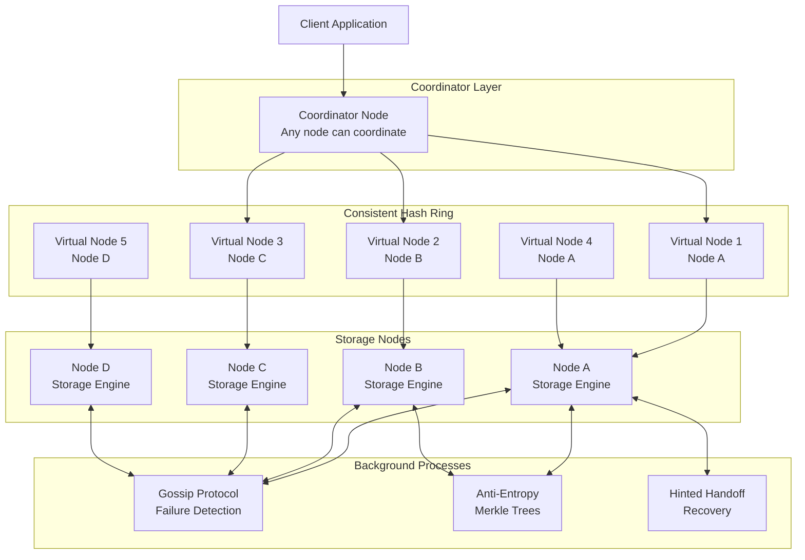
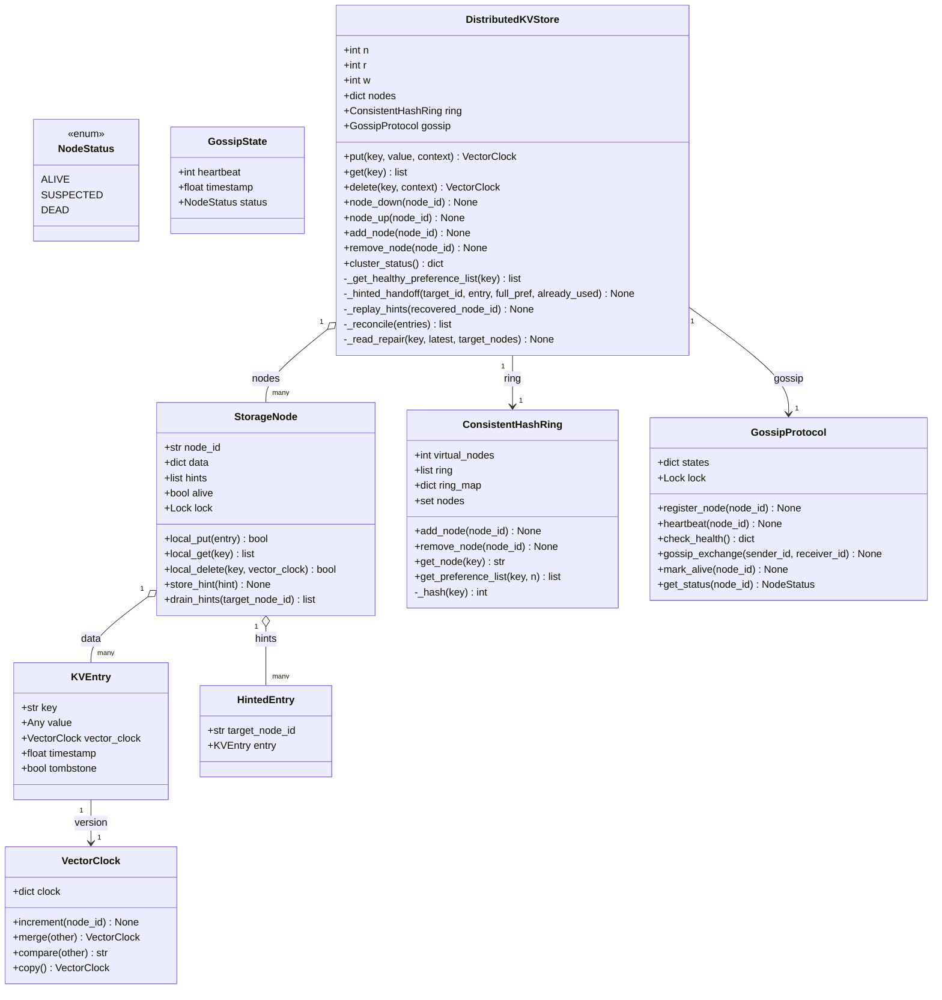
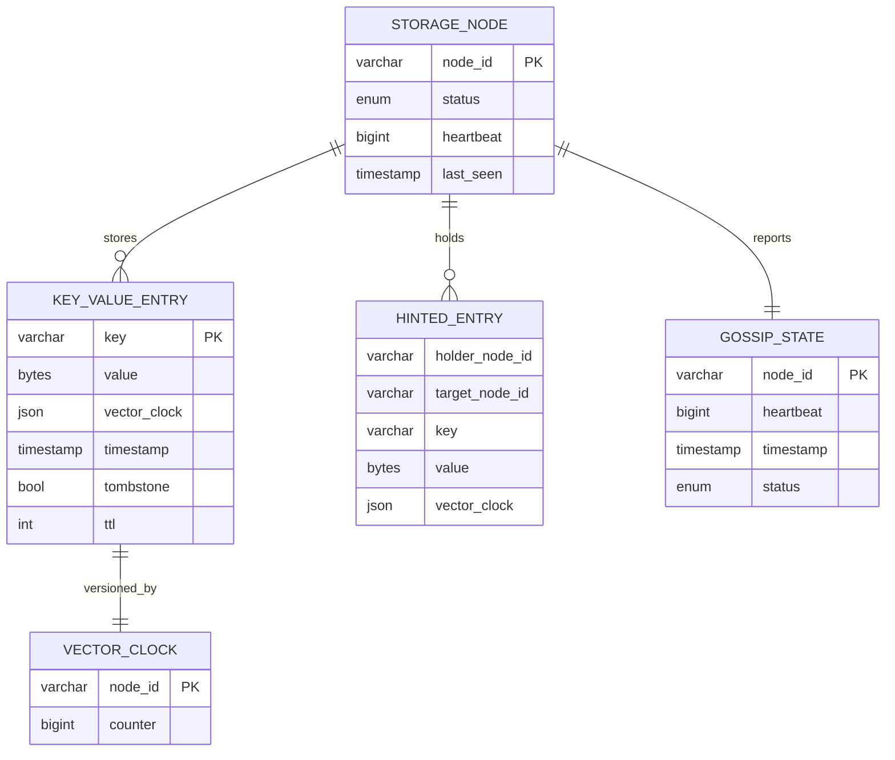
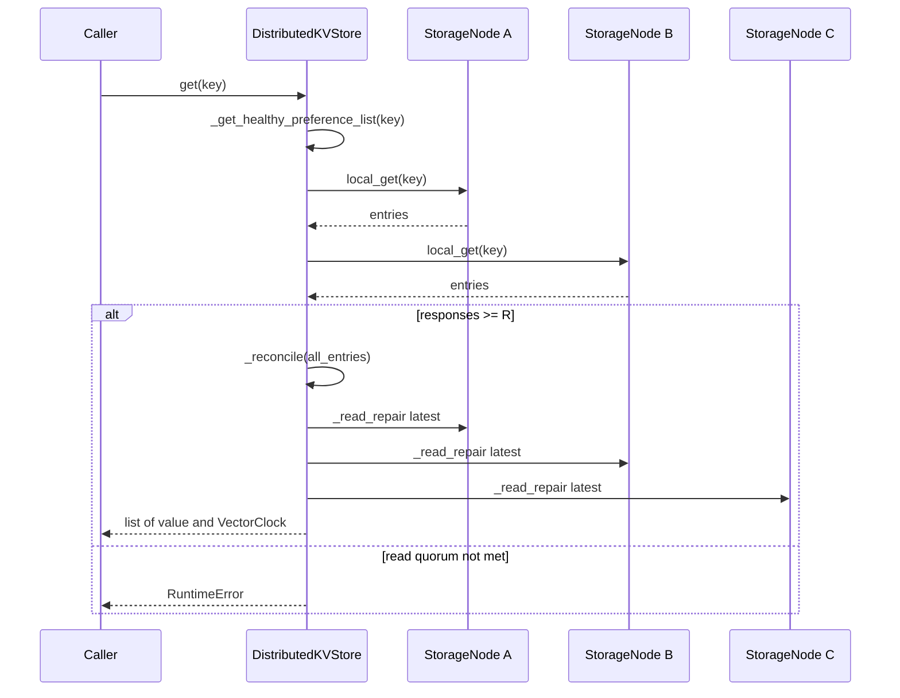

# Distributed Key-Value Store (Dynamo-like) — Architecture

> **Scope of this document.** This is the consolidated architecture reference for
> the Distributed KV Store. It preserves the production design in `README.md` and
> maps it to [`distributed_kv_store.py`](./distributed_kv_store.py), a
> single-process, in-memory simulation. Sections tagged **[Design-only]**
> describe production concerns not present in code; sections tagged
> **[Implemented]** map directly to concrete classes, methods, and data
> structures.

---

## 1. Problem Statement

Design and implement a Dynamo-inspired distributed key-value store with high
availability, fault tolerance, horizontal scaling, low-latency reads/writes, and
tunable consistency. Data is partitioned by consistent hashing, replicated for
durability, coordinated with quorum reads/writes, and versioned with vector
clocks so concurrent writes can be detected without global coordination.

---

## 2. Requirements

### 2.1 Functional Requirements

| ID | Requirement | Details | Status |
|----|-------------|---------|--------|
| FR-1 | `put(key, value)` | Store a key-value pair replicated across N nodes. | ✅ Implemented (`DistributedKVStore.put`) |
| FR-2 | `get(key)` | Retrieve value(s) for a key from R replicas. | ✅ Implemented (`DistributedKVStore.get`) |
| FR-3 | `delete(key)` | Remove a key via tombstone. | ✅ Implemented (`DistributedKVStore.delete`, `StorageNode.local_delete`) |
| FR-4 | Configurable N/R/W | Tunable replication, read quorum, write quorum. | ✅ Implemented constructor args `replication_factor`, `read_quorum`, `write_quorum` |
| FR-5 | Vector clocks | Detect superseded vs concurrent versions. | ✅ Implemented (`VectorClock.compare`, `merge`, `increment`) |
| FR-6 | Consistent hashing | Automatic partitioning with virtual nodes. | ✅ Implemented (`ConsistentHashRing`) |
| FR-7 | Read repair | Stale replicas updated during reads. | ✅ Implemented (`_read_repair`) |
| FR-8 | Hinted handoff | Forward writes for unavailable target nodes. | ✅ Implemented (`HintedEntry`, `_hinted_handoff`, `_replay_hints`) |
| FR-9 | Gossip failure detection | Membership/health state exchange. | Partially implemented (`GossipProtocol`); periodic random gossip loop **[Design-only]** |
| FR-10 | Anti-entropy Merkle trees | Detect/repair divergent replicas. | **[Design-only]**; README describes it, code has no Merkle tree |

### 2.2 Non-Functional Requirements [Design-only targets]

| ID | Requirement | Target |
|----|-------------|--------|
| NFR-1 | Read/write latency | < 10 ms p99 for single-key operations |
| NFR-2 | Availability | AP-style service during partitions, eventual consistency |
| NFR-3 | Tunable consistency | Stronger when `W + R > N`; faster when lower |
| NFR-4 | Failure tolerance | Writes tolerate `N - W`; reads tolerate `N - R` failures |
| NFR-5 | Horizontal scalability | Adding nodes increases throughput linearly |
| NFR-6 | Durability | No acknowledged write lost unless too many replicas fail |
| NFR-7 | Failure detection | Gossip detects failures within ~10 seconds |
| NFR-8 | Anti-entropy | Merkle-tree repair detects divergence efficiently |

---

## 3. Capacity Estimation [Design-only]

Assumptions: 100M keys, 64-byte average key, 1 KB average value, N=3,
read:write ratio 70:30, peak throughput 100K ops/sec.

| Metric | Calculation | Result |
|--------|-------------|--------|
| Raw data per key | 64 B + 1 KB | ~1.1 KB |
| Total raw data | 100M * 1.1 KB | ~110 GB |
| With replication | 110 GB * 3 | ~330 GB |
| Per node, 10 nodes | 330 GB / 10 | ~33 GB/node |
| With 1.3x overhead | 33 GB * 1.3 | ~43 GB/node |

| Metric | Value |
|--------|-------|
| Peak ops/sec | 100,000 |
| Reads/sec | 70,000 |
| Writes/sec | 30,000 |
| Per node, 10 nodes | ~10,000 ops/sec/node |

| Nodes | Storage/Node | Ops/Node | Headroom |
|-------|--------------|----------|----------|
| 10 | 43 GB | 10K ops/s | Moderate |
| 15 | 29 GB | 6.7K ops/s | Good |
| 20 | 22 GB | 5K ops/s | High |

---

## 4. High-Level Architecture [Design-only]



Flow: a client can send requests to any node; the coordinator hashes the key,
finds the preference list, sends writes to N replicas and waits for W acks, sends
reads to replicas and waits for R responses, reconciles vector clocks, and
repairs stale replicas. Gossip, hinted handoff, and anti-entropy maintain
availability and convergence.

---

## 5. Reference Implementation Overview [Implemented]

`distributed_kv_store.py` implements vector clocks, versioned entries, storage
nodes, a virtual-node hash ring, a simple gossip failure detector, quorum
put/get/delete, read repair, hinted handoff, node up/down simulation, and cluster
scaling.



### 5.1 Component Deep-Dive (doc → code)

| Design concept | Implemented by | Notes |
|----------------|----------------|-------|
| Vector clocks | `VectorClock.increment/compare/merge/copy` | `compare` returns `BEFORE`, `AFTER`, `EQUAL`, or `CONCURRENT`. |
| Versioned value | `KVEntry` | Holds key, value, vector clock, timestamp, tombstone flag. |
| Local storage | `StorageNode.data: dict[str, list[KVEntry]]` | Keeps siblings for concurrent versions. |
| Local conflict handling | `StorageNode.local_put` | Drops dominated entries, preserves concurrent siblings. |
| Tombstone delete | `StorageNode.local_delete`, `DistributedKVStore.delete` | Writes a tombstone entry with vector clock. |
| Ring partitioning | `ConsistentHashRing` | MD5 on key and `node#VN{i}` virtual nodes. |
| Preference list | `get_preference_list(key, n)` | Walks clockwise and skips duplicate physical nodes. |
| Quorum write | `DistributedKVStore.put` | Writes to target nodes and requires `self.w` acks. |
| Quorum read | `DistributedKVStore.get` | Reads up to N nodes and requires `self.r` responses. |
| Read repair | `_read_repair` | Writes reconciled latest versions to target nodes. |
| Hinted handoff | `HintedEntry`, `_hinted_handoff`, `_replay_hints` | Stores substitute write and replays when target recovers. |
| Gossip health | `GossipProtocol`, `cluster_status` | Heartbeat freshness marks suspected/dead; node `alive` overrides status. |

---

## 6. Data Model

### 6.1 Conceptual model [Design-only]



### 6.2 As implemented [Implemented]

The implementation stores all data in memory. `StorageNode.data` maps each key
to a list of `KVEntry` siblings. `StorageNode.hints` is a list of `HintedEntry`.
`GossipProtocol.states` maps node id to `GossipState`. There is no LSM tree,
MemTable/SSTable, WAL, disk persistence, Merkle tree, TTL, or background
anti-entropy process in code.

---

## 7. API Design

### 7.1 Production HTTP/node API [Design-only]

| Method & Path | Purpose |
|---------------|---------|
| `PUT /kv/{key}` | Store value and optional context; W replicas must acknowledge. |
| `GET /kv/{key}` | Return one or more sibling values and vector clocks; R replicas respond. |
| `DELETE /kv/{key}` | Write tombstone using supplied context. |
| `GET /admin/ring` | Return nodes and virtual-node topology. |
| `GET /admin/health` | Return alive/suspected/dead state. |
| `POST /internal/replicate` | Node-to-node replication. |
| `POST /internal/read` | Node-to-node local read. |
| `POST /internal/gossip` | Exchange membership and heartbeat state. |
| `POST /internal/merkle` | Exchange Merkle roots/ranges. |

### 7.2 In-process API [Implemented]

| Method | Signature | Raises / returns |
|--------|-----------|------------------|
| `DistributedKVStore.put` | `(key, value, context=None) -> VectorClock` | Raises `RuntimeError` if write quorum cannot be met. |
| `DistributedKVStore.get` | `(key) -> list[tuple[Any, VectorClock]]` | Raises `RuntimeError` if read quorum cannot be met. |
| `DistributedKVStore.delete` | `(key, context=None) -> VectorClock` | Raises `RuntimeError` if write quorum cannot be met. |
| `node_down` / `node_up` | `(node_id) -> None` | Simulates failure/recovery; `node_up` replays hints. |
| `add_node` / `remove_node` | `(node_id) -> None` | Updates node map, ring, and gossip state; no data streaming. |
| `cluster_status` | `() -> dict[str, str]` | Combines gossip and `StorageNode.alive`. |
| `ConsistentHashRing.get_preference_list` | `(key, n) -> list[str]` | N distinct physical nodes. |
| `VectorClock.compare` | `(other) -> str` | `BEFORE`, `AFTER`, `EQUAL`, `CONCURRENT`. |

---

## 8. Key Workflows [Implemented]

### 8.1 Quorum write with vector clock

```mermaid
sequenceDiagram
    participant C as Caller
    participant S as DistributedKVStore
    participant R as ConsistentHashRing
    participant N1 as StorageNode primary
    participant N2 as StorageNode replica
    participant VC as VectorClock
    C->>S: put(key, value, context)
    S->>S: _get_healthy_preference_list(key)
    S->>R: get_preference_list(key, len(nodes))
    R-->>S: healthy preference list
    S->>VC: copy context or create; increment(coordinator_id)
    S->>N1: local_put(KVEntry)
    N1-->>S: ack True
    S->>N2: local_put(KVEntry)
    N2-->>S: ack True
    alt acks >= W
        S-->>C: VectorClock
    else quorum not met
        S-->>C: RuntimeError
    end
```

### 8.2 Quorum read, reconcile, read repair



### 8.3 Node recovery and hinted handoff

```mermaid
sequenceDiagram
    participant C as Caller
    participant S as DistributedKVStore
    participant T as Target StorageNode
    participant H as Substitute StorageNode
    C->>S: node_down(target)
    S->>T: alive = False
    C->>S: put(key, value)
    S->>S: target unavailable; _hinted_handoff(target, entry)
    S->>H: store_hint(HintedEntry)
    C->>S: node_up(target)
    S->>T: alive = True
    S->>S: _replay_hints(target)
    H-->>S: drain_hints(target)
    S->>T: local_put(hint.entry)
```

---

## 9. Detailed Component Design

### 9.1 Consistent hashing with virtual nodes [Implemented]

`ConsistentHashRing.add_node` creates `virtual_nodes` tokens named
`node_id#VN{i}`. `get_preference_list` starts at the hashed key position and
walks clockwise, skipping duplicate physical nodes, until it returns N replicas.

### 9.2 Quorum reads and writes [Implemented]

`DistributedKVStore` exposes N/R/W as `self.n`, `self.r`, and `self.w`. Writes
choose the first healthy node as coordinator, increment that node's vector-clock
component, write to target nodes, and require W acknowledgements. Reads require R
responses, reconcile versions, and trigger read repair. Stronger consistency is
available when `W + R > N`.

### 9.3 Vector clocks and conflict resolution [Implemented]

Vector clocks track causal order. `StorageNode.local_put` discards older entries,
replaces equal/dominated entries, and preserves concurrent siblings. The demo
manually constructs concurrent vector clocks and resolves them by merging clocks
and writing a new value.

### 9.4 Gossip protocol [Partially implemented]

`GossipProtocol` stores heartbeat timestamps and marks nodes `SUSPECTED` after 5
seconds and `DEAD` after 15 seconds without a heartbeat. The full production
protocol—random periodic peer selection, membership-table merge, and automatic
range redistribution—is **[Design-only]**.

### 9.5 Sloppy quorum and hinted handoff [Implemented with caveat]

When a target node fails in a write path, `_hinted_handoff` stores a
`HintedEntry` on another alive node and counts it as an ack. In this
implementation, `_get_healthy_preference_list` filters down nodes before target
selection, so hints are primarily demonstrated through recovery flows rather
than a full strict-target/sloppy-substitute protocol. `node_up` calls
`_replay_hints`.

### 9.6 Merkle tree anti-entropy [Design-only]

The README describes Merkle-tree comparison for efficient replica divergence
repair. No `MerkleTree` class or anti-entropy scheduler exists in code.

---

## 10. Architectural Patterns [Design-only]

- **Consistent hashing** — distributes keys uniformly and minimizes data movement
  on membership changes.
- **Quorum consensus** — `W + R > N` ensures read/write quorum intersection
  without Paxos/Raft.
- **Vector clocks** — detect concurrent writes without synchronized clocks.
- **Gossip protocol** — epidemic health/membership propagation in O(log N)
  rounds.
- **Sloppy quorum + hinted handoff** — preserve availability during node failure.
- **Merkle-tree anti-entropy** — compare hashes from root to leaves to transfer
  only divergent key ranges.

---

## 11. Technology Choices & Trade-offs [Design-only]

| Aspect | LSM Tree | B-Tree |
|--------|----------|--------|
| Write performance | Excellent sequential I/O | Good but random I/O for updates |
| Read performance | Good, may check multiple levels | Excellent single tree lookup |
| Space amplification | Higher due to compaction lag | Lower |
| Write amplification | Higher from compaction rewrites | Lower |
| Best for | Write-heavy KV workloads | Read-heavy indexed workloads |

Choice: LSM tree, because Dynamo-like stores optimize append-heavy writes using
MemTable → SSTable flush → compaction.

| Feature | Amazon Dynamo | Apache Cassandra | Riak KV |
|---------|---------------|------------------|---------|
| Consistency | Tunable N/R/W | Tunable N/R/W | Tunable N/R/W |
| Conflict resolution | Vector clocks | LWW timestamps | Vector clocks/CRDT |
| Partitioning | Consistent hash | Consistent hash | Consistent hash |
| Gossip protocol | Yes | Yes | Yes |
| Query language | Key-value API | CQL | Key-value/search |
| Open source | No | Yes | Yes, partially |

---

## 12. Scaling, Reliability & Security [Design-only]

- **Horizontal scaling:** adding nodes streams key ranges from neighbors; virtual
  nodes move about `1/N` of data. Current code updates the ring but does not move
  stored keys.
- **Vertical scaling:** more RAM for MemTables/page cache, more CPU for
  compaction, NVMe for SSTable reads.
- **Load balancing:** clients cache ring topology and route directly to
  coordinators; hot ranges can be split.
- **Reliability:** sloppy quorum, hinted handoff, quorum reads/writes, tombstone
  GC grace period, speculative reads, checksums, and anti-entropy repair.
- **Security:** mTLS between nodes, API key/OAuth clients, RBAC by key prefix,
  AES-256 at rest, TLS 1.3 in transit, key rotation, private VPC, rate limits,
  and admin IP allowlisting.
- **Monitoring:** p50/p95/p99 read/write latency, ops/sec, read repair rate,
  anti-entropy sync frequency, disk usage, compaction backlog, gossip lag,
  hinted handoff queue depth, replica lag, and quorum errors.

---

## 13. Running the Simulation [Implemented]

```powershell
uv run --no-project python SystemDesign\DistributedKVStore\distributed_kv_store.py
```

The demo creates a 5-node cluster with N=3/R=2/W=2, performs put/get/update,
shows consistent hashing and preference lists, simulates node failure and
recovery with hinted handoff, creates vector-clock conflicts, resolves siblings,
deletes via tombstone, compares vector clocks, checks gossip health, adds a node,
and demonstrates quorum failure.

### Suggested tests

- `VectorClock.compare` returns all four relationships correctly.
- `StorageNode.local_put` drops dominated versions and preserves concurrent
  siblings.
- `put/get` meet quorum with enough nodes and raise `RuntimeError` without
  quorum.
- `delete` hides values via tombstone.
- `node_down` then `node_up` replays hints to recovered nodes.
- `get` triggers read repair to stale replicas.
- `get_preference_list` returns distinct physical nodes.

---

## 14. Future Improvements

- Implement Merkle-tree anti-entropy and background repair.
- Add durable LSM-style storage with WAL, MemTable, SSTable, compaction, and
  tombstone GC grace periods.
- Implement a stricter sloppy-quorum model that starts from designated N
  replicas before choosing substitutes.
- Add real gossip rounds, membership merge, and automatic failure transitions.
- Add data streaming/rebalancing after `add_node` and `remove_node`.
- Add per-operation consistency overrides and client-side sibling resolution API.
