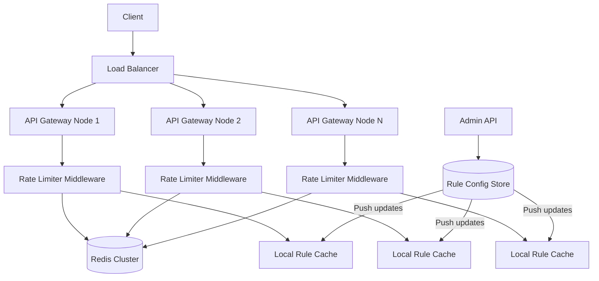
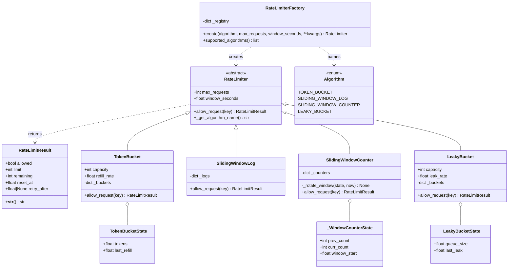
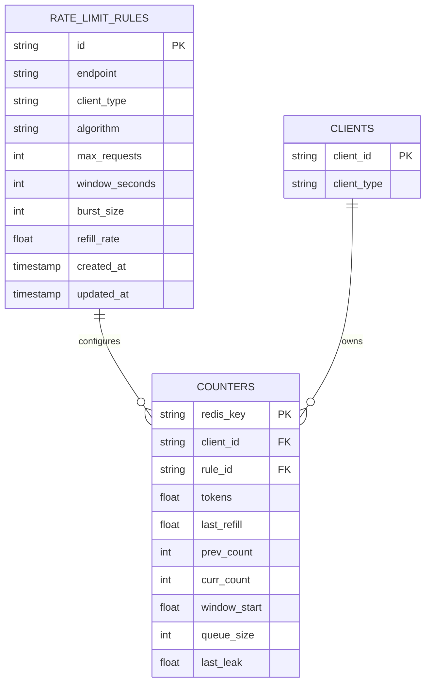
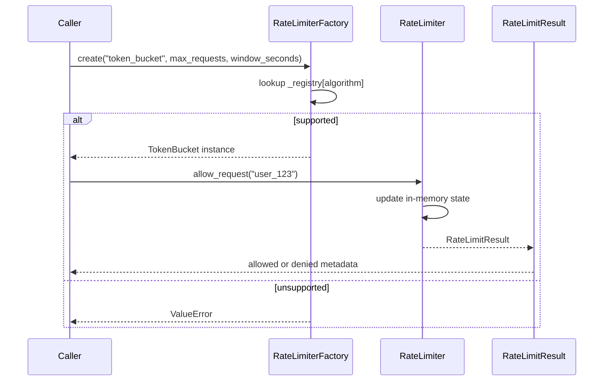
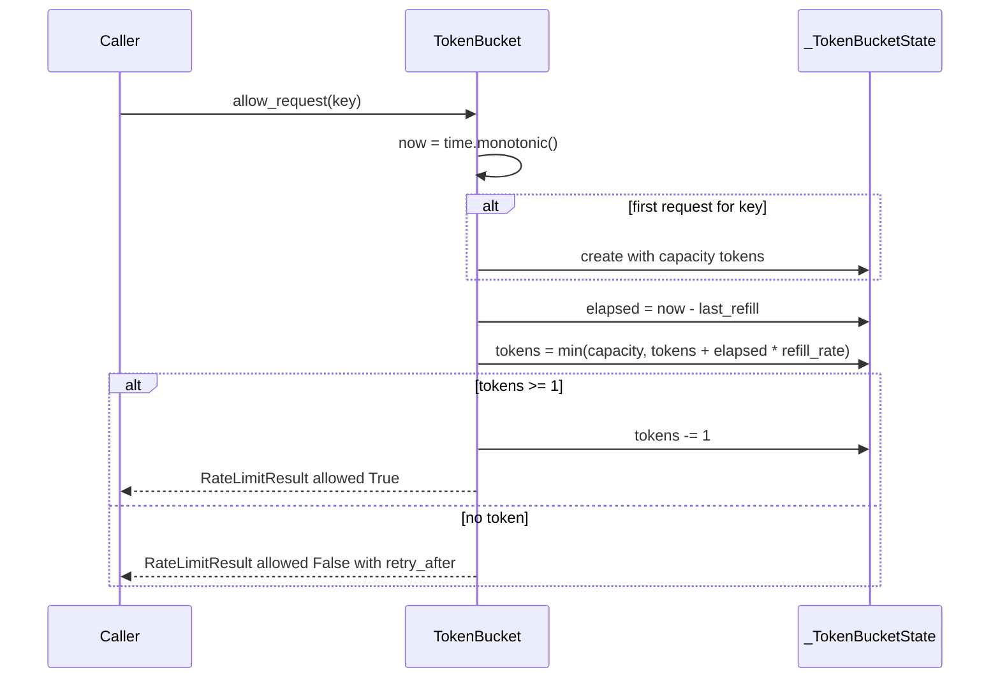
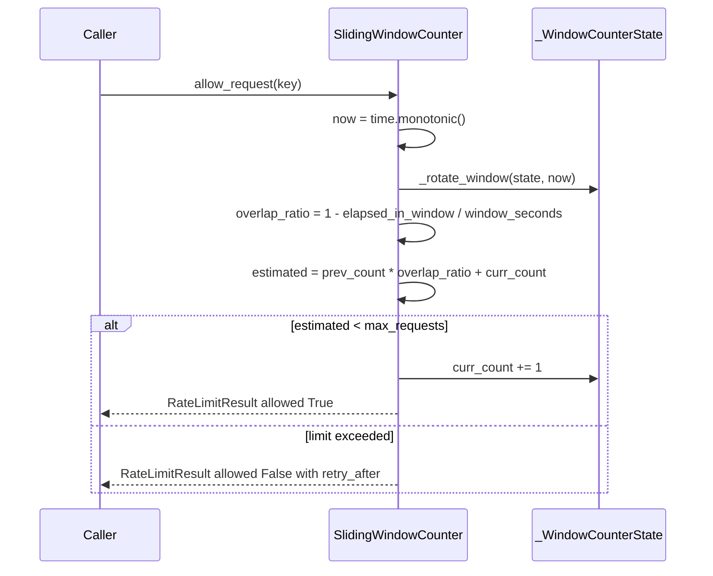

# Distributed Rate Limiter — Architecture

> **Scope of this document.** This is the consolidated architecture reference for
> the Distributed Rate Limiter. It preserves the production system design from
> [`README.md`](./README.md) and maps it to the reference implementation in
> [`distributed_rate_limiter.py`](./distributed_rate_limiter.py), a single-process
> in-memory algorithm simulation. Sections tagged **[Design-only]** describe
> production concerns not present in the simulation; sections tagged
> **[Implemented]** map directly to code.

---

## 1. Problem Statement

Modern APIs and services must protect themselves from abuse, ensure fair resource
allocation, and maintain quality of service under heavy load. A **rate limiter**
controls the rate of requests a client, identified by user ID, IP address, or API
key, can make within a configured time window.

In a **distributed** environment with multiple API gateway nodes, counting must be
consistent across nodes: a user who is rate-limited on node A must also be
limited on node B.

**Key challenges:**

- Accurate counting across distributed nodes with minimal latency.
- Supporting multiple rate-limiting algorithms with different trade-offs.
- Handling clock skew between nodes.
- Graceful degradation when the central counter store is unavailable.

---

## 2. Requirements

### 2.1 Functional Requirements

| ID | Requirement | Details | Status |
|---|---|---|---|
| FR-1 | Rate-limit by identity | User ID, IP address, or API key are modeled as the `key` passed to `allow_request`. | ✅ Implemented (`RateLimiter.allow_request(key)`) |
| FR-2 | Multiple algorithms | Token Bucket, Sliding Window Log, Sliding Window Counter, and Leaky Bucket. | ✅ Implemented (`TokenBucket`, `SlidingWindowLog`, `SlidingWindowCounter`, `LeakyBucket`) |
| FR-3 | Configurable rules per endpoint | Production rules include endpoint, client type, algorithm, max requests, and window. | ⚠️ Partially implemented: algorithm instances are configurable, but no endpoint rule registry/API |
| FR-4 | Standard response metadata | Limit, remaining quota, reset time, and retry-after are returned. | ✅ Implemented (`RateLimitResult`) |
| FR-5 | 429 Too Many Requests | Production middleware maps denied results to HTTP 429. | [Design-only]; code returns `RateLimitResult(allowed=False)` |
| FR-6 | Rule management API | Create, update, delete, and list rules. | [Design-only] |
| FR-7 | Burst allowance and smooth output | Token bucket allows bursts; leaky bucket smooths request admission. | ✅ Implemented (`TokenBucket`, `LeakyBucket`) |
| FR-8 | Algorithm selection | Choose implementation by algorithm name. | ✅ Implemented (`RateLimiterFactory.create`) |

### 2.2 Non-Functional Requirements [Design-only targets]

| ID | Requirement | Target |
|---|---|---|
| NFR-1 | **Latency overhead** | < 1 ms per rate-limit check at p99 |
| NFR-2 | **Consistency** | Distributed multi-node consistent counting via centralized store |
| NFR-3 | **Availability** | 99.99% uptime; fail-open if counter store is unreachable |
| NFR-4 | **Clock skew tolerance** | Use server-side timestamps such as Redis `TIME`; tolerate up to 100 ms skew |
| NFR-5 | **Scalability** | 1M+ checks/sec across all nodes |
| NFR-6 | **Observability** | Metrics for allowed/rejected counts, latency histograms, and rule hit rates |

---

## 3. Capacity Estimation [Design-only]

### 3.1 Assumptions

- 500 API endpoints, each with 2-3 rules → about **1,500 rules** total.
- 10M unique clients.
- Average 1,000 requests/sec per gateway node, 50 nodes → **50K req/sec**.
- Peak 5x average → **250K rate-limit checks/sec**.

### 3.2 Redis Operations

| Operation | Per Check | Total at Peak |
|---|---:|---:|
| Read counter | 1 | 250K/sec |
| Write counter | 1 | 250K/sec |
| **Total Redis ops** | **2** | **500K ops/sec** |

### 3.3 Storage

| Item | Size | Count | Total |
|---|---:|---:|---:|
| Token bucket state | ~100 B | 10M clients x 3 rules | ~3 GB |
| Sliding window log entries | ~50 B/entry | 10M x avg 10 entries | ~5 GB |
| Sliding window counter | ~80 B | 10M x 3 rules | ~2.4 GB |
| Rate-limit rules | ~200 B | 1,500 | ~300 KB |

> **Recommendation [Design-only]:** use sliding window counter for memory
> efficiency at scale. Reserve sliding window log for high-precision use cases.

---

## 4. High-Level Architecture [Design-only]



**Flow [Design-only]:**

1. Client request arrives at the load balancer.
2. Request is routed to an API gateway node.
3. Rate limiter middleware intercepts before business logic.
4. Middleware reads rules from a local rule cache.
5. Middleware checks and atomically updates counters in Redis Cluster.
6. Middleware returns allow/deny plus rate-limit headers.

---

## 5. Reference Implementation Overview [Implemented]

The implementation collapses the distributed architecture into in-memory Python
objects. It focuses on algorithm behavior and a common strategy interface rather
than Redis, HTTP middleware, rule management, or multi-node consistency.



### 5.1 Component Deep-Dive (doc → code)

| Design concept | Implemented by | Notes |
|---|---|---|
| Common strategy interface | `RateLimiter` | Abstract base with `allow_request(key)` and `_get_algorithm_name()`. |
| Decision payload and headers | `RateLimitResult` | Carries `allowed`, `limit`, `remaining`, `reset_at`, `retry_after`; production maps this to headers. |
| Algorithm enum | `Algorithm` | String enum values match factory names. |
| Token bucket | `TokenBucket._buckets: dict[str, _TokenBucketState]` | Uses `time.monotonic()`, refill math, and token decrement. |
| Sliding window log | `SlidingWindowLog._logs: dict[str, list[float]]` | Exact timestamp list per key; prunes old entries on every check. |
| Sliding window counter | `SlidingWindowCounter._counters` and `_rotate_window()` | Keeps previous/current counters and weighted overlap. |
| Leaky bucket | `LeakyBucket._buckets: dict[str, _LeakyBucketState]` | Drains a virtual queue at `leak_rate`. |
| Factory selection | `RateLimiterFactory._registry`, `create()`, `supported_algorithms()` | Raises `ValueError` for unknown algorithm names. |
| Demonstration | `_run_comparison_demo()` | Runs burst, wait-and-retry, trickle, and multi-client examples. |

---

## 6. Data Model

### 6.1 Conceptual production schema [Design-only]



**Redis key shapes [Design-only]:**

```text
rate:{client_id}:{rule_id}:tokens     -> float
rate:{client_id}:{rule_id}:last_ts    -> float
rate:{client_id}:{rule_id}:log        -> sorted set
rate:{client_id}:{rule_id}:prev       -> int
rate:{client_id}:{rule_id}:curr       -> int
rate:{client_id}:{rule_id}:win_start  -> float
rate:{client_id}:{rule_id}:queue_size -> int
rate:{client_id}:{rule_id}:last_leak  -> float
```

### 6.2 As implemented [Implemented]

The code stores state in process-local dictionaries keyed by the request key:

- `TokenBucket._buckets` maps key to `_TokenBucketState(tokens, last_refill)`.
- `SlidingWindowLog._logs` maps key to a list of monotonic timestamps.
- `SlidingWindowCounter._counters` maps key to `_WindowCounterState`.
- `LeakyBucket._buckets` maps key to `_LeakyBucketState(queue_size, last_leak)`.

No external Redis, TTL, persistence, or cross-process synchronization exists.

---

## 7. API Design

### 7.1 Production HTTP surface [Design-only]

```text
POST /internal/ratelimit/check
POST /admin/rules
GET /admin/rules
GET /admin/rules/{id}
PUT /admin/rules/{id}
DELETE /admin/rules/{id}
```

**Check request:**

```json
{
  "client_id": "user_12345",
  "client_type": "user_id",
  "endpoint": "/api/search",
  "method": "GET"
}
```

**Allowed response:**

```json
{
  "allowed": true,
  "limit": 100,
  "remaining": 73,
  "reset_at": 1700000060,
  "retry_after": null
}
```

**Rejected response:**

```json
{
  "allowed": false,
  "limit": 100,
  "remaining": 0,
  "reset_at": 1700000060,
  "retry_after": 12
}
```

### 7.2 In-process API [Implemented]

| Method | Signature | Raises |
|---|---|---|
| `RateLimiter.allow_request` | `(key: str) -> RateLimitResult` | Abstract in base; concrete implementations do not intentionally raise for normal limits |
| `RateLimiterFactory.create` | `(algorithm: str, max_requests: int, window_seconds: float, **kwargs) -> RateLimiter` | `ValueError` for unknown algorithm |
| `RateLimiterFactory.supported_algorithms` | `() -> list[str]` | — |
| `TokenBucket.__init__` | `(max_requests: int, window_seconds: float, refill_rate: float | None = None)` | — |
| `LeakyBucket.__init__` | `(max_requests: int, window_seconds: float, leak_rate: float | None = None)` | — |

---

## 8. Key Workflows [Implemented]

### 8.1 Factory selection and request check



### 8.2 Token Bucket decision path



### 8.3 Sliding Window Counter decision path



---

## 9. Detailed Component Design

### 9.1 Token Bucket [Implemented]

A bucket holds up to `capacity` tokens. Tokens refill at
`refill_rate` tokens per second, defaulting to `max_requests / window_seconds`.
Each request consumes one token. The implementation allows a burst up to the
full capacity and then admits future requests as tokens refill.

**Trade-offs [Design-only]:**

| Pros | Cons |
|---|---|
| Allows controlled bursts | Burst can cause momentary downstream overload |
| Memory efficient with 2 values per client | Requires atomic read-modify-write in production |
| Simple to implement | Refill rate tuning is workload-sensitive |

### 9.2 Sliding Window Log [Implemented]

`SlidingWindowLog` stores every accepted request timestamp in `_logs[key]`.
On every check it removes timestamps outside `window_seconds`, then allows only
if the remaining timestamp count is below `max_requests`.

| Pros | Cons |
|---|---|
| Exact per-window accuracy | High memory usage because every timestamp is stored |
| No fixed-window boundary spikes | O(N) pruning in this Python list implementation |
| Smooth enforcement | Production Redis sorted-set operations add overhead |

### 9.3 Sliding Window Counter [Implemented]

`SlidingWindowCounter` keeps `prev_count`, `curr_count`, and `window_start`.
The estimated request count is:

```text
estimated = prev_count * overlap_ratio + curr_count
```

This is the recommended default for a production-scale API limiter because it
keeps O(1) state while approximating a true sliding window.

### 9.4 Leaky Bucket [Implemented]

`LeakyBucket` maintains a virtual queue depth and drains it continuously at
`leak_rate`, defaulting to `max_requests / window_seconds`. Requests are allowed
only while `queue_size < capacity`.

| Pros | Cons |
|---|---|
| Produces constant-rate output | No burst tolerance |
| Memory efficient | Requests may experience queuing delay in a real queue |
| Predictable downstream load | Old work is processed before new work |

### 9.5 Redis Lua and central consistency [Design-only]

Production should use Redis Lua scripts so check-and-update executes atomically
on the Redis server. The Python implementation does not use Redis, scripts,
distributed locks, TTL, or server-side time.

---

## 10. Architectural Patterns [Design-only]

- **Middleware / Interceptor Pattern** — the limiter runs before business logic
  and provides consistent enforcement for every request.
- **Strategy Pattern** — each algorithm is encapsulated behind `RateLimiter`;
  `RateLimiterFactory` selects the concrete strategy.
- **Sliding Window Pattern** — the counter variant trades exactness for O(1)
  memory and fast operations.
- **Fail-open Degradation** — if Redis is unavailable, production systems often
  allow requests and emit alerts rather than failing the entire API.

---

## 11. Technology Choices & Trade-offs [Design-only]

### 11.1 Redis + Lua Scripts

- **Why Redis:** sub-millisecond latency, atomic operations, TTL support.
- **Why Lua:** check-and-update happens atomically without distributed locks.
- **Why Redis Cluster:** hash slots distribute counter keys horizontally.

### 11.2 Local Cache vs Centralized Store

| Approach | Pros | Cons |
|---|---|---|
| **Centralized Redis only** | Exact global counts | Network hop per request |
| **Local cache + periodic sync** | Lower latency and Redis-failure resilience | Allows slight over-limit during sync gap |
| **Hybrid** | Balances precision and hot-path speed | More complex |

> **Recommendation:** use centralized Redis for most endpoints. Use local cache
> with periodic sync for extremely high-throughput endpoints.

---

## 12. Scaling, Reliability & Security [Design-only]

- **Horizontal scaling:** add API gateway nodes; Redis Cluster handles increased
  load via hash-slot redistribution.
- **Key sharding:** use `{client_id}:{rule_id}` hash tags to colocate state used
  by a Lua script.
- **Local rule caching:** cache rules for about 30 seconds and push invalidations
  from the config store.
- **Connection pooling:** each gateway maintains a Redis pool to reduce
  connection overhead.
- **Fail-open policy:** if Redis is unreachable, allow the request, log the
  event, and alert.
- **Circuit breaker:** if Redis failures exceed a threshold, trip and fall back
  to local-only limiting.
- **Security:** admin rule APIs require JWT with `rate_limit:admin` scope; client
  identity extraction must validate API keys, JWT subjects, and trusted proxy IPs.
- **Monitoring:** track `ratelimit.check.total`, `allowed`, `rejected`,
  `latency`, `redis.errors`, `fallback.active`, and `rules.count`.

---

## 13. Running the Simulation [Implemented]

```powershell
uv run --no-project python SystemDesign\DistributedRateLimiter\distributed_rate_limiter.py
```

The demo compares all four algorithms across a burst, a wait-and-retry phase, a
steady trickle phase, and a two-client shared-limiter phase.

### Suggested tests

- `RateLimiterFactory.supported_algorithms()` returns all four enum values.
- `RateLimiterFactory.create()` returns the expected class and raises
  `ValueError` for an unknown name.
- `TokenBucket` allows an initial burst of `max_requests` and then denies until
  refill.
- `SlidingWindowLog` prunes old timestamps and enforces exact limits.
- `SlidingWindowCounter._rotate_window()` carries current count to previous
  count for one elapsed window and resets stale state after multiple windows.
- `LeakyBucket` drains queue size over time and denies at capacity.

---

## 14. Future Improvements

- Add a `RateLimitRule` model and rule registry keyed by endpoint and client
  type.
- Add a middleware wrapper that maps `RateLimitResult` to HTTP headers and 429
  responses.
- Add Redis-backed implementations with atomic Lua scripts and server-side time.
- Add thread safety for in-memory dictionaries if shared across threads.
- Add metrics collection for allowed, rejected, retry-after, and latency.
- Add property-based tests around boundary timing and clock movement.

