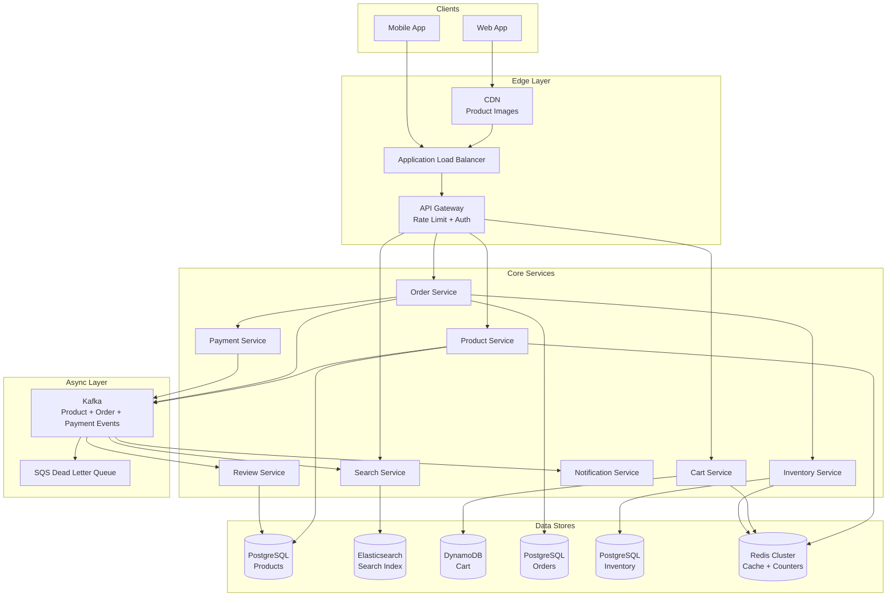
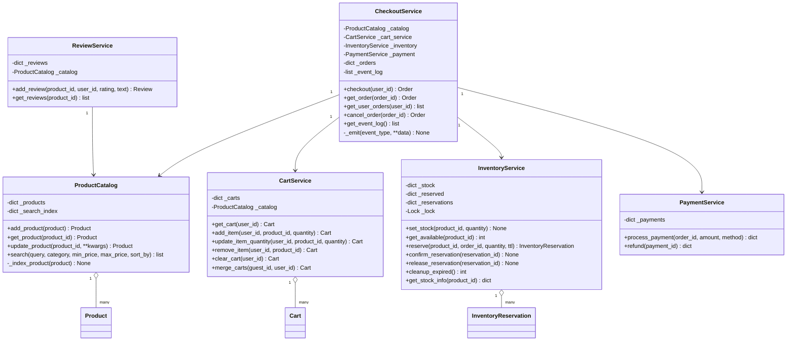
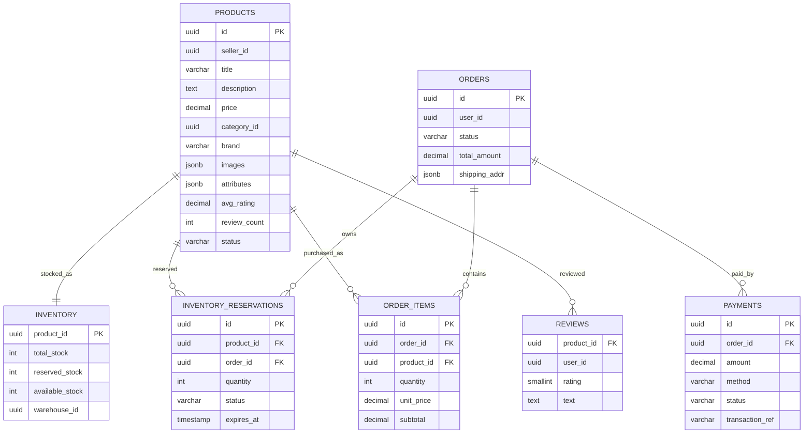
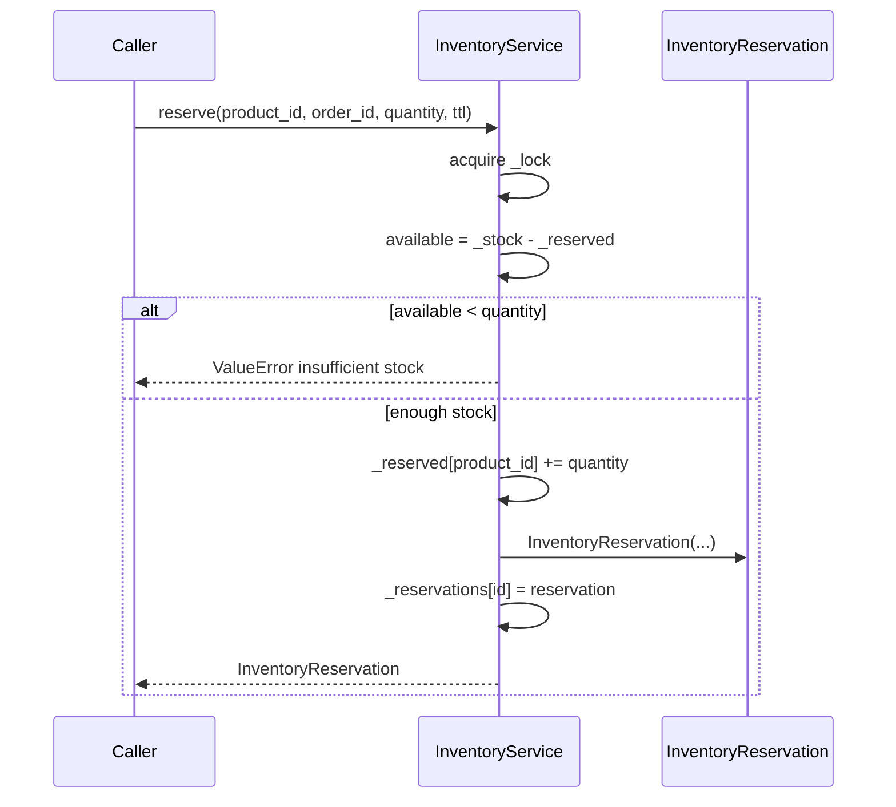
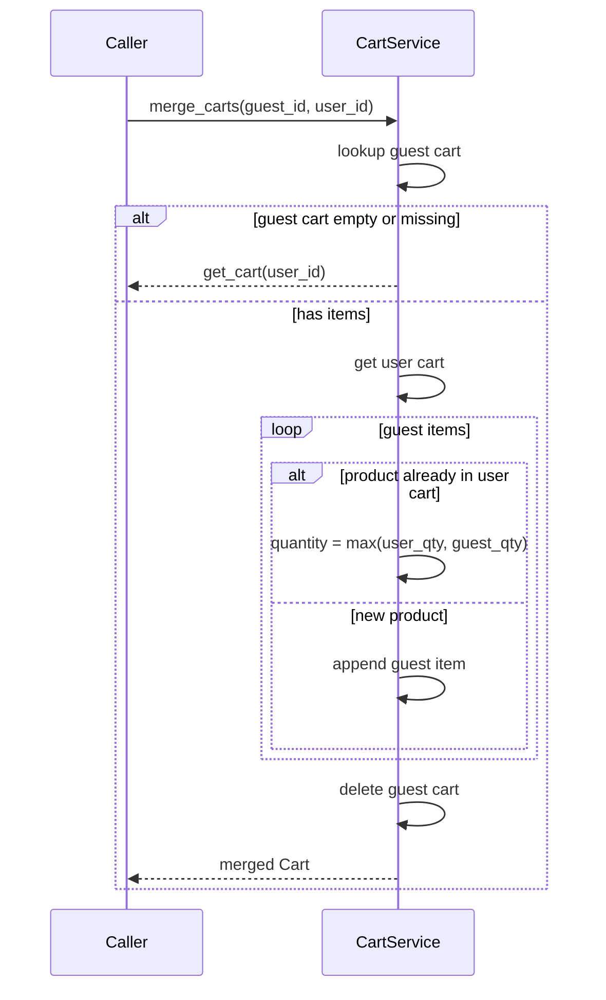

# E-Commerce Platform — Architecture

> **Scope of this document.** This is the consolidated architecture reference for
> the E-Commerce Platform. It preserves the production design from `README.md`
> and maps it to the reference implementation in
> [`ecommerce.py`](./ecommerce.py), a single-process, in-memory simulation.
> Sections tagged **[Design-only]** describe production capabilities not present
> in the simulation; sections tagged **[Implemented]** map directly to code.

---

## 1. Problem Statement

Design an Amazon-like e-commerce platform where millions of users browse and
search products, manage carts, place orders, make payments, and review products.
The system must deliver low-latency reads across tens of millions of products
while preventing inventory overselling during normal checkout and flash sales.

---

## 2. Requirements

### 2.1 Functional Requirements

| # | Requirement | Details | Status |
|---|-------------|---------|--------|
| F1 | Product Catalog | CRUD over products with title, description, price, category, brand, rating, and attributes. | ✅ Implemented (`ProductCatalog.add_product`, `get_product`, `update_product`); delete/images/sellers are **[Design-only]** |
| F2 | Search & Browse | Full-text search, category/price filters, and sorting. | ✅ Implemented (`ProductCatalog.search`); autocomplete and rich relevance are **[Design-only]** |
| F3 | Shopping Cart | Add, remove, update items, persist carts, and merge guest cart on login. | ✅ Implemented (`CartService`); external persistence and stock validation on cart writes are **[Design-only]** |
| F4 | Checkout & Payment | Reserve inventory, process payment, confirm order. | ✅ Implemented (`CheckoutService.checkout`, `PaymentService.process_payment`) |
| F5 | Order Management | Order lifecycle and history. | ⚠️ Partially implemented (`OrderStatus`, `get_order`, `get_user_orders`, `cancel_order`); shipping/delivery/returns are **[Design-only]** |
| F6 | Inventory Management | Stock tracking, reservation TTL, release expired reservations, prevent overselling. | ✅ Implemented (`InventoryService.reserve`, `cleanup_expired`); low-stock alerts are **[Design-only]** |
| F7 | Reviews & Ratings | Add reviews and update aggregate rating. | ✅ Implemented (`ReviewService.add_review`, `get_reviews`) |
| F8 | Notifications | Order confirmations, shipping updates, receipts, seller alerts. | ❌ **[Design-only]**; event log exists but no notification service |

### 2.2 Non-Functional Requirements [Design-only targets]

| Requirement | Target |
|-------------|--------|
| **Search latency** | p99 < 100 ms |
| **Concurrency** | 100K concurrent users |
| **Inventory consistency** | Zero overselling with strong stock decrement |
| **Checkout availability** | 99.99% uptime |
| **Cart availability** | 99.9%, eventual consistency acceptable |
| **Order durability** | 11 nines durability |
| **Read/write ratio** | ~100:1 |
| **Data retention** | Orders retained indefinitely; carts expire after 30 days |

---

## 3. Capacity Estimation [Design-only]

### 3.1 Assumptions

| Metric | Value |
|--------|-------|
| Total products | 50 million |
| Daily active users | 10 million |
| Average searches per user/day | 5 |
| Average product views per user/day | 15 |
| Orders per day | 1 million |
| Average items per order | 3 |
| Average product data size | 10 KB |

### 3.2 Derived numbers

| Metric | Calculation | Result |
|--------|-------------|--------|
| Search QPS | 10M x 5 / 86400 | ~580 QPS, peak ~2,900 |
| Product view QPS | 10M x 15 / 86400 | ~1,740 QPS, peak ~8,700 |
| Order write QPS | 1M / 86400 | ~12 QPS, peak ~60 |
| Cart write QPS | ~3x orders | ~35 QPS, peak ~175 |
| Product storage | 50M x 10 KB | ~500 GB |
| Order storage/year | 1M x 3 items x 1 KB x 365 | ~1.1 TB/year |
| Search index size | 50M x 2 KB indexed fields | ~100 GB |

---

## 4. High-Level Architecture [Design-only]



The production system splits read-heavy product discovery from transactional
checkout. PostgreSQL owns source-of-truth product, order, and inventory state;
Elasticsearch and Redis optimize reads; Kafka propagates changes.

---

## 5. Reference Implementation Overview [Implemented]

`ecommerce.py` implements the core bounded contexts as in-memory classes. The
inventory service is intentionally thread-safe: `InventoryService.reserve()` wraps
the check-and-decrement-equivalent reservation logic in `with self._lock:`, making
the available-stock check and reserved-stock increment atomic.



### 5.1 Component Deep-Dive (doc → code)

| Design concept | Implemented by | Notes |
|----------------|----------------|-------|
| Product source of truth | `ProductCatalog._products` | In-memory dict keyed by `product_id`. |
| Search index | `ProductCatalog._search_index` | Token-to-product-id inverted index; partial substring matching in `search()`. |
| Product updates | `update_product()` | Mutates dataclass fields and re-indexes; old tokens are not removed, a known gap. |
| Cart storage | `CartService._carts` | Same dict stores guest and logged-in carts; no TTL. |
| Cart merge | `CartService.merge_carts()` | Merges guest into user cart using max quantity for duplicate products. |
| Atomic inventory reservation | `InventoryService.reserve()` | `with self._lock:` guards available-stock check and `_reserved` increment. |
| Reservation TTL | `InventoryReservation.expires_at`, `cleanup_expired()` | Manual cleanup releases active expired reservations. |
| Payment simulation | `PaymentService.process_payment()` | Succeeds when `amount < 10000`; otherwise marks FAILED. |
| Checkout saga | `CheckoutService.checkout()` | Creates order, reserves inventory, processes payment, confirms reservations, clears cart. |
| Compensation | `release_reservation()` in checkout failure paths | Inventory reservation failures and payment failures release prior reservations. |
| Event log | `CheckoutService._event_log`, `_emit()` | In-memory event list substitutes for Kafka. |
| Reviews | `ReviewService.add_review()` | Validates 1..5, stores review, updates product aggregate rating synchronously. |

---

## 6. Data Model

### 6.1 Conceptual production model [Design-only]



The README's cart model is a DynamoDB item keyed by `PK = USER#<user_id>` and
`SK = CART`, with `items`, `updated_at`, and `ttl`. That is **[Design-only]**;
the implementation uses `CartService._carts`.

### 6.2 As implemented [Implemented]

Implemented dataclasses include `Product`, `CartItem`, `Cart`, `OrderItem`,
`Order`, `InventoryReservation`, and `Review`. Stock is split across
`_stock[product_id]` and `_reserved[product_id]`; available stock is computed as
`total - reserved`.

---

## 7. API Design

### 7.1 Production HTTP surface [Design-only]

| Service | Endpoints |
|---------|-----------|
| Product | `GET /api/v1/products/{product_id}`, `GET /api/v1/products?...`, `POST /api/v1/products`, `PUT /api/v1/products/{product_id}`, `DELETE /api/v1/products/{product_id}` |
| Search | `GET /api/v1/search?q=&category=&sort=&page=&size=`, `GET /api/v1/search/autocomplete?prefix=` |
| Cart | `GET /api/v1/cart`, `POST /api/v1/cart/items`, `PUT /api/v1/cart/items/{item_id}`, `DELETE /api/v1/cart/items/{item_id}`, `DELETE /api/v1/cart` |
| Order | `POST /api/v1/orders`, `GET /api/v1/orders/{order_id}`, `GET /api/v1/orders?user_id=&status=&page=`, `PUT /api/v1/orders/{order_id}/cancel` |
| Payment | `POST /api/v1/payments`, `GET /api/v1/payments/{payment_id}`, `POST /api/v1/payments/{payment_id}/refund` |
| Review | `POST /api/v1/products/{product_id}/reviews`, `GET /api/v1/products/{product_id}/reviews?page=&size=` |

### 7.2 In-process API [Implemented]

| Method | Signature | Raises / Failure |
|--------|-----------|------------------|
| `ProductCatalog.search` | `(query="", category=None, min_price=None, max_price=None, sort_by="relevance") -> list[Product]` | — |
| `CartService.add_item` | `(user_id, product_id, quantity=1) -> Cart` | `ValueError` for missing product or non-positive quantity |
| `CartService.update_item_quantity` | `(user_id, product_id, quantity) -> Cart` | `ValueError` when product not in cart |
| `InventoryService.reserve` | `(product_id, order_id, quantity, ttl=None) -> InventoryReservation` | `ValueError` for insufficient stock |
| `InventoryService.confirm_reservation` | `(reservation_id) -> None` | `ValueError` if reservation not active |
| `PaymentService.process_payment` | `(order_id, amount, method="CREDIT_CARD") -> dict` | Returns FAILED for amount >= 10000 |
| `CheckoutService.checkout` | `(user_id) -> Order` | `ValueError` for empty cart, missing product, inventory failure, or payment failure |
| `CheckoutService.cancel_order` | `(order_id) -> Order` | `ValueError` for missing or non-confirmed order |
| `ReviewService.add_review` | `(product_id, user_id, rating, text) -> Review` | `ValueError` for invalid rating or product |

---

## 8. Key Workflows [Implemented]

### 8.1 Checkout saga

```mermaid
sequenceDiagram
    participant C as Caller
    participant CO as CheckoutService
    participant Cart as CartService
    participant Cat as ProductCatalog
    participant Inv as InventoryService
    participant Pay as PaymentService
    C->>CO: checkout(user_id)
    CO->>Cart: get_cart(user_id)
    CO->>Cat: get_product(product_id) per cart item
    CO->>CO: create Order and emit OrderCreated
    loop order items
        CO->>Inv: reserve(product_id, order_id, quantity)
        Inv->>Inv: with _lock check available and increment reserved
    end
    alt inventory reservation failure
        CO->>Inv: release_reservation() for prior reservations
        CO->>CO: order.status = CANCELLED
        CO-->>C: ValueError
    else inventory reserved
        CO->>Pay: process_payment(order_id, total)
        alt payment failed
            CO->>Inv: release_reservation() for all reservations
            CO->>CO: order.status = CANCELLED
            CO-->>C: ValueError
        else payment completed
            loop reservations
                CO->>Inv: confirm_reservation(reservation_id)
                Inv->>Inv: stock -= qty; reserved -= qty
            end
            CO->>CO: order.status = CONFIRMED
            CO->>Cart: clear_cart(user_id)
            CO-->>C: Order
        end
    end
```

### 8.2 Inventory reservation with atomic check-and-reserve



### 8.3 Cart merge on login



---

## 9. Detailed Component Design

### 9.1 Product Catalog and Search [Implemented]

`ProductCatalog._index_product()` tokenizes `title`, `description`, `category`,
and `brand` into an inverted index. `search()` intersects token matches for a
query, then applies category and price filters, and finally supports
`price_asc`, `price_desc`, and `rating` sorting. Elasticsearch, autocomplete,
faceting, synonyms, and ranking models are **[Design-only]**.

### 9.2 Cart Management [Implemented]

The code implements the README's two-cart concept in one dict:

- Guest cart and user cart both live in `_carts`.
- `add_item()` increments quantity when an item already exists.
- `update_item_quantity(..., 0)` removes an item.
- `merge_carts()` takes the max quantity for duplicate products and deletes the
  guest cart.

Redis/DynamoDB TTL and stock validation before checkout are **[Design-only]**.

### 9.3 Inventory Reservation [Implemented]

`InventoryService` maintains `_stock`, `_reserved`, and `_reservations`.
`reserve()` is correctly guarded by `with self._lock:`, so the availability check
and reserved-stock increment are atomic. `confirm_reservation()` deducts from
`_stock` and `_reserved`; `release_reservation()` and `cleanup_expired()` reduce
`_reserved` when a reservation is not used.

### 9.4 Checkout Saga [Implemented]

`CheckoutService.checkout()` is an orchestration saga:

1. Build an `Order` from the cart.
2. Reserve inventory for each `OrderItem`.
3. Process payment.
4. Confirm reservations and order.
5. Clear cart.

It compensates by releasing already-created reservations on inventory or payment
failure. Notifications and Kafka are represented only by `_event_log`.

---

## 10. Architectural Patterns [Design-only]

- **Microservices:** Product, Cart, Order, Inventory, Payment, Review, and
  Notification are separate bounded contexts.
- **Database per Service:** each service owns its persistence.
- **Saga Pattern:** Order Service orchestrates reserve, pay, confirm, notify,
  and compensation.
- **CQRS:** PostgreSQL handles source-of-truth writes; Elasticsearch handles
  search reads with Kafka/Debezium sync.
- **Event-Driven Inventory:** product, order, payment, and low-stock events flow
  through Kafka.
- **Cache-Aside:** Redis caches product details, session carts, and rate-limit
  counters.

---

## 11. Technology Choices & Trade-offs [Design-only]

| Component | Technology | Rationale |
|-----------|------------|-----------|
| Search | Elasticsearch | Full-text search, filters, autocomplete, horizontal scaling for 50M products |
| Cart Storage | DynamoDB | Low latency, auto-scaling, TTL, high availability |
| Orders & Inventory | PostgreSQL | ACID transactions and constraints prevent overselling |
| Caching | Redis Cluster | Product cache, session carts, rate limits |
| Message Broker | Kafka | Durable saga, CQRS, analytics event log |
| API Gateway | Kong / AWS API Gateway | Auth, throttling, routing, circuit breaking |
| CDN | CloudFront | Static assets and images at edge |
| Orchestration | Kubernetes | Autoscaling and rolling deployments |
| Monitoring | Prometheus + Grafana | Service metrics and alerts |
| Tracing | Jaeger / AWS X-Ray | Distributed checkout traces |

PostgreSQL gives strong consistency for orders and inventory but requires careful
partitioning and connection pooling at scale. DynamoDB is a good fit for carts
because eventual consistency is acceptable and TTL is native.

---

## 12. Scaling, Reliability & Security [Design-only]

### Scaling

| Service | Scaling Trigger | Target |
|---------|-----------------|--------|
| Product Service | CPU > 70% | 5-20 pods |
| Search Service | QPS > 500/pod | 10-50 pods |
| Cart Service | DynamoDB auto-scales | On-demand |
| Order Service | CPU > 60% | 5-15 pods |
| Inventory Service | CPU > 50% | 3-10 pods |
| Payment Service | QPS > 100/pod | 5-15 pods |

Database scaling includes product read replicas, monthly order partitioning,
Elasticsearch shards by category, DynamoDB on-demand capacity with DAX for hot
items, and Redis cluster mode. Flash sales use pre-warming, queue-based checkout,
dedicated Redis counters, and per-user limits.

### Reliability

| Operation | Retries | Backoff | Timeout |
|-----------|---------|---------|---------|
| Payment API | 3 | Exponential, 1s, 2s, 4s | 10s |
| Inventory reservation | 2 | Linear, 500 ms | 5s |
| Kafka publish | 5 | Exponential, 100 ms base | 30s |
| Elasticsearch query | 2 | Immediate | 3s |

PostgreSQL uses synchronous standby plus WAL archiving; Kafka uses replication
factor 3 and `acks=all`; DynamoDB Global Tables support multi-region carts. DR
targets are RTO < 15 minutes and RPO < 1 minute.

### Security

- JWT access tokens, refresh tokens, OAuth2 integrations, and Buyer/Seller/Admin
  roles.
- PCI-DSS payment isolation, tokenized card data, and 3D Secure for high-value
  transactions.
- Rate limits of 100 req/min general and 10 req/min checkout.
- Input validation, SQL parameterization, CORS allowlists, TLS 1.3, AES-256 at
  rest, PII masking, and GDPR export/deletion APIs.

### Observability

Alert on checkout success rate < 98%, search p99 > 100 ms, payment failure rate
> 2%, inventory reservation timeout rate > 5%, cart abandonment > 70%, and order
processing time > 30 seconds. Logs should be structured JSON with `trace_id`,
`service_name`, `user_id`, `timestamp`, `level`, and `message`.

---

## 13. Running the Simulation [Implemented]

```powershell
uv run --no-project python SystemDesign\ECommerce\ecommerce.py
```

The demo loads sample products, searches and filters catalog results, manages and
merges carts, runs checkout, verifies inventory deduction and cart clearing,
demonstrates insufficient-stock compensation, expires a short TTL reservation,
adds reviews, prints saga events, and lists order history.

### Suggested tests

- `InventoryService.reserve()` rejects requests above available stock and leaves
  `_reserved` unchanged.
- Concurrent reservations cannot oversell because `reserve()` is locked.
- Payment failure releases all active reservations and cancels the order.
- Successful checkout confirms reservations, reduces total stock, and clears the
  cart.
- `merge_carts()` keeps max quantity for duplicate items.
- `ReviewService.add_review()` updates average rating and count.

---

## 14. Future Improvements

- Remove stale tokens from `_search_index` when products are updated.
- Add delete product, seller authorization, images, categories, and autocomplete.
- Validate cart quantities against inventory before checkout.
- Persist orders, inventory reservations, carts, reviews, and event log.
- Store payment ids on orders so `cancel_order()` can trigger refunds.
- Add shipping, delivery, return, and notification workflows.
- Add pytest coverage for checkout compensation and concurrent inventory safety.
