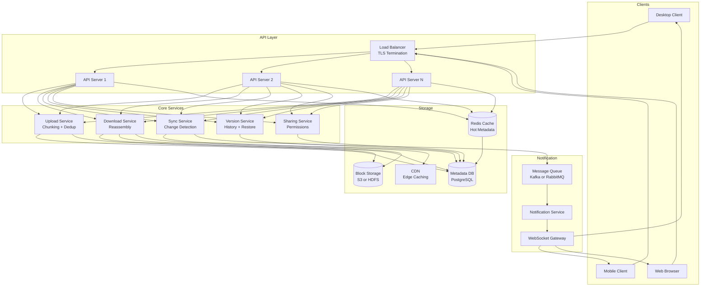
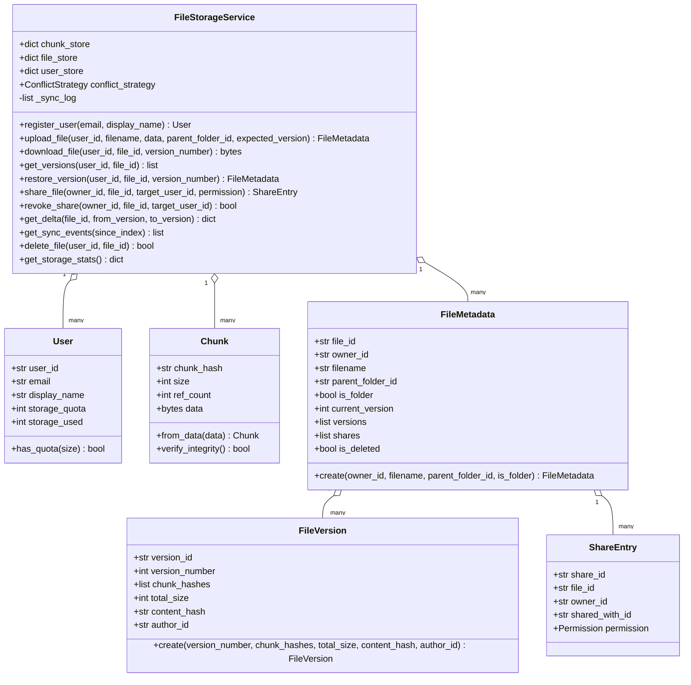
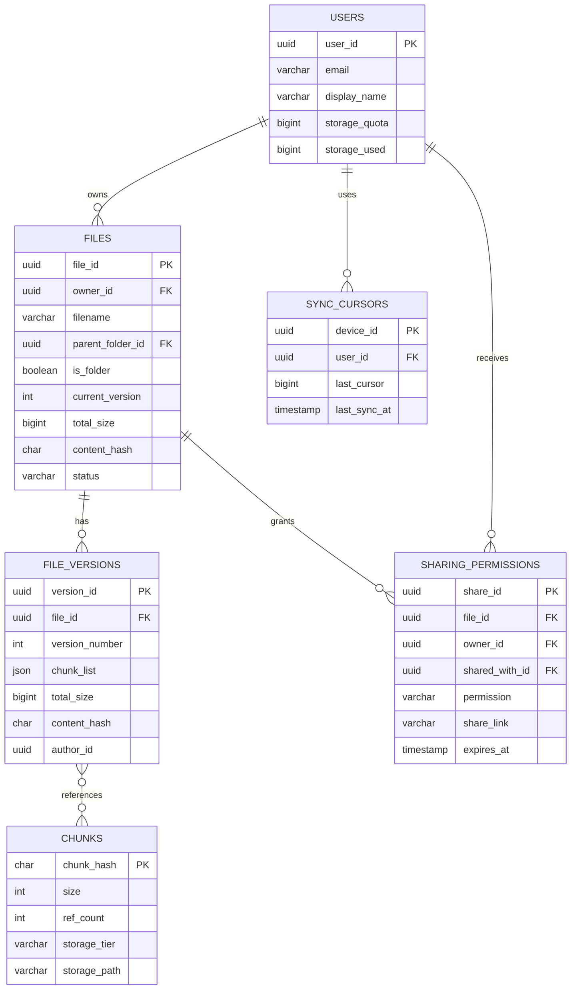
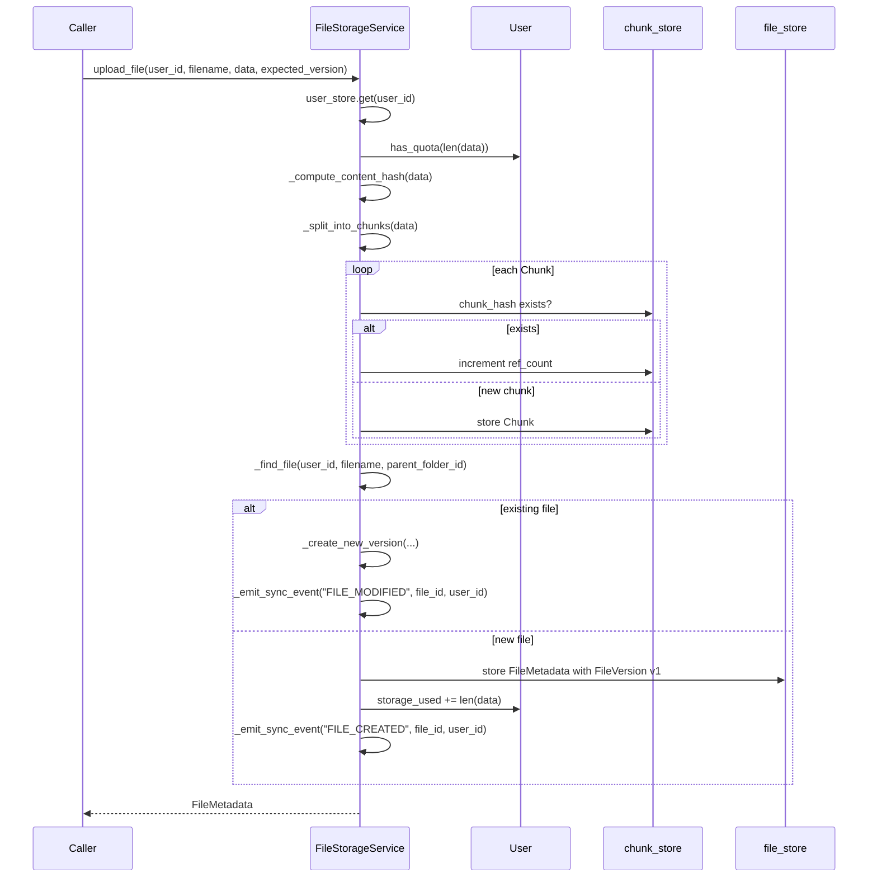
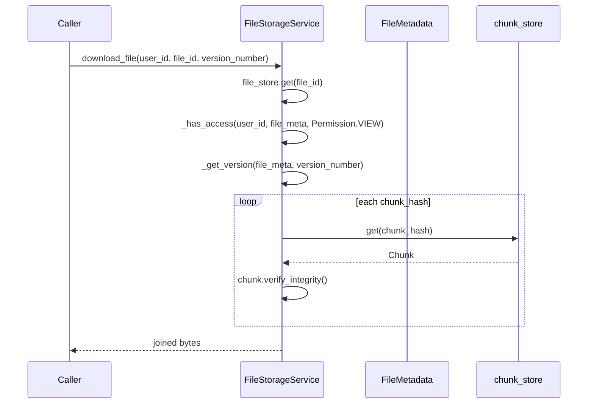

# File Storage System (Dropbox / Google Drive) — Architecture

> **Scope of this document.** This is the consolidated architecture reference for the File Storage System. It preserves the original README design and maps it to [`file_storage.py`](./file_storage.py), a single-process, in-memory simulation. Sections tagged **[Design-only]** describe production concerns not present in the simulation; sections tagged **[Implemented]** map directly to code.

---

## 1. Problem Statement

Design a cloud-based file storage and synchronization service that allows users to upload, download, and sync files across multiple devices. The system must handle large files efficiently through chunking, minimize bandwidth through deduplication and delta sync, support file versioning, and enable secure sharing with granular permissions.

Key challenges:

- **Scale:** billions of files, petabytes of storage, millions of concurrent users.
- **Consistency:** keeping files in sync across devices with conflict resolution.
- **Efficiency:** minimizing bandwidth and storage through content-addressable chunking.
- **Durability:** ensuring no data loss, with an 11-nines durability target.

The Python implementation demonstrates chunking, SHA-256 content addressing, deduplication, immutable versions, permission checks, soft delete, a sync event log, and simple delta calculations.

---

## 2. Requirements

### 2.1 Functional Requirements

| ID | Requirement | Details | Status |
|----|-------------|---------|--------|
| FR-1 | **Upload files** | Users can upload files of any size; large files are chunked into 4 MB blocks. | ✅ Implemented via `FileStorageService.upload_file()`, `_split_into_chunks()`, and `CHUNK_SIZE`. |
| FR-2 | **Download files** | Users can download files; chunks are reassembled transparently. | ✅ Implemented via `download_file()` and `_reassemble_chunks()`. |
| FR-3 | **Sync across devices** | Changes on one device propagate to linked devices. | ⚠️ Partially implemented as an in-memory event log via `_emit_sync_event()` and `get_sync_events()`; real push/WebSocket sync is **[Design-only]**. |
| FR-4 | **File versioning** | Every modification creates a new version; users can view and restore versions. | ✅ Implemented via `FileVersion`, `FileMetadata.versions`, `get_versions()`, and `restore_version()`. |
| FR-5 | **File sharing** | Users can share files/folders with view/edit/owner permissions. | ⚠️ File-level sharing is implemented with `share_file()`, `revoke_share()`, and `_has_access()`. Folder inheritance, share links, and expirations are **[Design-only]**. |
| FR-6 | **Conflict resolution** | Handle concurrent edits via last-writer-wins or merge strategies. | ⚠️ `expected_version` and `ConflictStrategy` are implemented. Last-writer-wins works; conflict-copy mode creates an empty conflict file, so rich conflict copies and OT/CRDT are **[Design-only]**. |
| FR-7 | **Folder organization** | Hierarchical folders with move, rename, delete. | ⚠️ `FileMetadata.parent_folder_id` and `is_folder` exist, but no public create-folder, move, or rename APIs are implemented. |
| FR-8 | **File deduplication** | Identical content blocks are stored once using content-addressable hashes. | ✅ Implemented via `Chunk.from_data()`, `_store_chunks()`, and `chunk_store` ref counts. |

### 2.2 Non-Functional Requirements [Design-only targets]

| ID | Requirement | Target |
|----|-------------|--------|
| NFR-1 | **Durability** | 99.999999999% durability, no data loss. |
| NFR-2 | **Sync latency** | < 500 ms notification delivery for file changes. |
| NFR-3 | **Large file support** | Files > 1 GB handled through chunked upload/download. |
| NFR-4 | **Bandwidth optimization** | Delta sync transfers only changed chunks. |
| NFR-5 | **Availability** | 99.99% uptime for reads and 99.9% for writes. |
| NFR-6 | **Consistency** | Eventual consistency for sync, strong consistency for metadata. |
| NFR-7 | **Scalability** | 500M users, 10B files, 1 EB total storage. |
| NFR-8 | **Security** | End-to-end encryption, at-rest encryption, TLS in transit. |

---

## 3. Capacity Estimation [Design-only]

### 3.1 Assumptions

| Parameter | Value |
|-----------|-------|
| Total users | 500 million |
| Daily active users | 100 million |
| Avg files per user | 200 |
| Avg file size | 500 KB |
| New uploads per user per day | 2 |
| Avg file versions | 5 |
| Chunk size | 4 MB |

### 3.2 Storage

```text
Total files          = 500M users * 200 files = 100 billion files
Raw storage          = 100B files * 500KB     = 50 PB
With versioning      = 50 PB * 5 versions     = 250 PB
With dedup savings   = 250 PB * 0.6           = 150 PB effective storage
With replication 3x  = 150 PB * 3             = 450 PB raw disk
```

### 3.3 Daily Throughput

```text
Uploads/day        = 100M DAU * 2 uploads       = 200 million uploads/day
Upload bandwidth   = 200M * 500KB               = 100 TB/day ingress
Sync events/day    = 200M uploads * 3 devices   = 600M sync notifications/day
QPS uploads        = 200M / 86400               ~ 2,300 uploads/sec
Peak QPS           = 2,300 * 3                  ~ 7,000 uploads/sec
Metadata reads     = 10x writes                 ~ 70,000 QPS
```

### 3.4 Metadata Storage

```text
File metadata      = 100B files * 1KB each             = 100 TB
Chunk index        = 100B files * 10 chunks * 100B     = 100 TB
Version metadata   = 500B versions * 200B              = 100 TB
Total metadata     ~ 300 TB
```

---

## 4. High-Level Architecture [Design-only]



The production architecture separates binary chunks from metadata. Chunks are immutable, content-addressed objects in block storage; metadata tracks ownership, versions, shares, and sync cursors.

---

## 5. Reference Implementation Overview [Implemented]

`file_storage.py` collapses upload, download, versioning, sharing, and sync events into one `FileStorageService` object with three main in-memory stores: `chunk_store`, `file_store`, and `user_store`.



### 5.1 Component Deep-Dive (doc → code)

| Design concept | Implemented by | Notes |
|----------------|----------------|-------|
| User quota | `User.has_quota()`, `storage_quota`, `storage_used` | Upload checks quota before storing. Code increments on new file upload but does not decrement on delete. |
| Chunking | `CHUNK_SIZE`, `_split_into_chunks()` | Fixed 4 MB chunks. |
| Content-addressable storage | `Chunk.from_data()`, `chunk_hash`, `chunk_store` | SHA-256 of chunk bytes is the storage key. |
| Deduplication | `_store_chunks()` | Existing chunks increment `ref_count`; new chunks are stored once. |
| File metadata | `FileMetadata` and `file_store` | Includes ownership, parent folder ID, current version, content hash, versions, shares, soft-delete flag. |
| Versioning | `FileVersion.create()`, `_create_new_version()`, `restore_version()` | Versions are immutable snapshots of ordered chunk hashes. |
| Downloads | `download_file()`, `_get_version()`, `_reassemble_chunks()` | Verifies each chunk hash before concatenation. |
| Sharing | `ShareEntry`, `share_file()`, `_has_access()`, `revoke_share()` | Supports view/edit/owner enum; owner can always access. |
| Delta sync | `get_delta()` | Computes added, removed, unchanged chunk hashes using set differences. |
| Sync events | `_emit_sync_event()`, `get_sync_events()` | In-memory append-only event list for demos. |
| Soft delete | `delete_file()` | Marks file deleted and decrements chunk references; no garbage collector. |

---

## 6. Data Model

### 6.1 Conceptual production schema [Design-only]



### 6.2 README schema preserved [Design-only]

The original design includes `files`, `chunks`, `file_versions`, `users`, `sharing_permissions`, and `sync_cursors`. Important indexes include `idx_owner_parent`, `idx_content_hash`, `idx_storage_tier`, `idx_file_id`, `idx_shared_with`, and `idx_user_id`. `file_versions.chunk_list` is an ordered list of content-addressed chunk hashes.

### 6.3 As implemented [Implemented]

The dataclasses replace tables: `User`, `Chunk`, `FileVersion`, `ShareEntry`, and `FileMetadata`. In-memory stores are `user_store: dict[str, User]`, `chunk_store: dict[str, Chunk]`, and `file_store: dict[str, FileMetadata]`. `_sync_log` acts like a minimal change log. There is no durable metadata database, no block storage, no device cursor table, and no background garbage collector.

---

## 7. API Design

### 7.1 Production HTTP surface [Design-only]

| Method & Path | Purpose |
|---------------|---------|
| `POST /api/v1/files/upload/init` | Initialize chunked upload with filename, size, parent folder, and content hash. |
| `PUT /api/v1/files/upload/{upload_id}/chunks/{chunk_index}` | Upload one binary chunk with `Content-SHA256`. |
| `POST /api/v1/files/upload/{upload_id}/complete` | Commit ordered chunk IDs into a file version. |
| `GET /api/v1/files/{file_id}` | Fetch file metadata and download URLs, optionally by version. |
| `GET /api/v1/files/{file_id}/download` | Download binary content, ideally with range support. |
| `DELETE /api/v1/files/{file_id}` | Soft-delete a file. |
| `GET /api/v1/sync/changes` | Get changes since a sync cursor. |
| `POST /api/v1/sync/register` | Register a device for sync. |
| `WS /api/v1/sync/stream` | Real-time sync notifications. |
| `GET /api/v1/files/{file_id}/versions` | List versions. |
| `POST /api/v1/files/{file_id}/versions/{version_id}/restore` | Restore a version. |
| `POST /api/v1/files/{file_id}/share` | Share file with permission. |
| `GET /api/v1/files/{file_id}/shares` | List shares. |
| `DELETE /api/v1/files/{file_id}/shares/{share_id}` | Revoke share. |

### 7.2 In-process API [Implemented]

| Method | Signature | Raises / behavior |
|--------|-----------|-------------------|
| `register_user` | `(email: str, display_name: str) -> User` | Creates UUID user. |
| `upload_file` | `(user_id, filename, data, parent_folder_id=None, expected_version=None) -> FileMetadata` | Raises `ValueError` for missing user or quota. Creates file or new version. |
| `download_file` | `(user_id, file_id, version_number=None) -> bytes` | Raises `ValueError` for missing file/chunk/version and `PermissionError` for access denied. |
| `get_versions` | `(user_id, file_id) -> list[FileVersion]` | Requires view access. |
| `restore_version` | `(user_id, file_id, version_number) -> FileMetadata` | Requires edit access; creates a new version from old chunks. |
| `share_file` | `(owner_id, file_id, target_user_id, permission) -> ShareEntry` | Owner only. |
| `revoke_share` | `(owner_id, file_id, target_user_id) -> bool` | Owner only. |
| `get_delta` | `(file_id, from_version, to_version) -> dict` | Returns added, removed, unchanged chunks and transfer size. |
| `get_sync_events` | `(since_index=0) -> list[dict]` | Returns event log slice. |
| `delete_file` | `(user_id, file_id) -> bool` | Owner only; soft-deletes and decrements refs. |
| `get_storage_stats` | `() -> dict` | Returns logical/physical storage and dedup ratio. |

---

## 8. Key Workflows [Implemented]

### 8.1 Upload with chunking and deduplication



### 8.2 Download and integrity verification



---

## 9. Detailed Component Design

### 9.1 Chunking strategy [Implemented]

`CHUNK_SIZE` is `4 * 1024 * 1024`. `_split_into_chunks()` slices a byte string from offset `0` to end in fixed-size blocks. Each block becomes a `Chunk` using `Chunk.from_data()`, which stores the bytes and SHA-256 digest.

### 9.2 Content-addressable deduplication [Implemented]

`_store_chunks()` uses `chunk_hash` as the key. If a hash already exists, it increments `ref_count`; otherwise it stores the new chunk. This demonstrates cross-user and cross-version deduplication because all users share one `chunk_store`.

### 9.3 Versioning and restore [Implemented]

When an upload matches an existing `(owner_id, filename, parent_folder_id)`, `_create_new_version()` appends a `FileVersion` with a new version number. `restore_version()` finds an old version and creates a new latest version pointing to that old chunk list.

### 9.4 Delta sync [Implemented]

`get_delta()` compares two version chunk-hash sets and returns `added_chunks`, `removed_chunks`, `unchanged_chunks`, `old_size`, `new_size`, and `transfer_size`. This is chunk-level set comparison, not rolling-hash byte-range delta detection. Rabin fingerprints and upload-session negotiation are **[Design-only]**.

### 9.5 Conflict resolution [Implemented core]

`upload_file(..., expected_version=...)` implements optimistic concurrency. If the expected version is stale and `conflict_strategy` is `LAST_WRITER_WINS`, the upload still creates the next version. If the strategy is `CONFLICT_COPY`, the code calls `upload_file()` with a generated conflict filename and empty bytes. A production conflict copy should preserve the conflicting content and device metadata; that richer behavior is **[Design-only]**.

### 9.6 Sharing and permissions [Implemented]

`share_file()` appends a `ShareEntry` to `FileMetadata.shares`. `_has_access()` compares permission levels: view < edit < owner. `revoke_share()` removes entries for a target user. Folder-level inheritance, public links, link expiry, and audit logs are **[Design-only]**.

### 9.7 Sync event log [Implemented core]

`_emit_sync_event()` appends dictionaries with `event_type`, `file_id`, `user_id`, and `timestamp`. This is enough for polling demos via `get_sync_events()`, but there is no durable cursor, WebSocket, Kafka, or retry mechanism.

---

## 10. Architectural Patterns [Design-only]

- **Content-addressable storage:** data is addressed by SHA-256 hash rather than by location. This enables deduplication, integrity verification, and immutable chunk caching.
- **Event-driven sync:** file changes produce events that flow through a message queue to notification and sync consumers.
- **Optimistic concurrency control:** clients upload with an expected version; conflicts are detected at commit time.
- **Cache-aside:** hot metadata and folder listings are cached in Redis, with the metadata DB as source of truth.
- **CQRS:** write-heavy upload/versioning paths and read-heavy download/sync paths use different storage and caches.

---

## 11. Technology Choices & Trade-offs [Design-only]

### 11.1 Block storage: S3 vs HDFS

| Criteria | Amazon S3 | HDFS |
|----------|-----------|------|
| Durability | 11 nines built in | Requires replication configuration |
| Scalability | Virtually unlimited | Namenode bottleneck at scale |
| Cost | Pay per use, lifecycle tiering | Fixed infrastructure cost |
| Operations | Fully managed | Dedicated ops team |
| Latency | ~50-100 ms first byte | ~10-20 ms with data locality |
| Best for | Cloud-native variable load | On-prem predictable load |

**Choice:** S3 for 11-nines durability, lifecycle policies, and lower operational overhead.

### 11.2 Metadata DB: MySQL vs PostgreSQL

| Criteria | MySQL | PostgreSQL |
|----------|-------|------------|
| JSON support | Basic JSON type | Advanced JSONB and indexing |
| Partitioning | Range/hash/list | Declarative partitioning |
| Replication | Group Replication | Streaming and logical replication |
| UUID performance | Poorer with clustered indexes | Good heap storage behavior |
| Advisory locks | Available | Richer API |

**Choice:** PostgreSQL for JSONB chunk lists, UUID handling, and mature relational features.

### 11.3 Sync mechanism and queues

- **CDC:** PostgreSQL WAL -> Debezium -> Kafka -> sync consumers.
- **Kafka:** ordered per partition, persistent, replayable, consumer groups for sync workers.
- **Redis:** hot metadata, upload sessions, sync cursors, Pub/Sub, rate limiting.

---

## 12. Scaling, Reliability & Security [Design-only]

- **Horizontal scaling:** stateless API servers, independently scaled upload/download/sync services, metadata read replicas, block storage that scales automatically.
- **Sharding:** metadata by `user_id`; chunks by `chunk_hash`; sync events by `user_id` for per-user ordering.
- **CDN integration:** frequently downloaded files served from edge caches using pre-signed URLs with TTL.
- **Durability:** S3 multi-AZ chunk storage, metadata DB synchronous replicas, WAL archival, client-side hash verification.
- **Failure handling:** resumable upload sessions, retry individual chunks, cursor-based sync resume, database failover, cross-region replication.
- **Consistency:** strong metadata writes; eventual sync; atomic upload completion so a version points only to committed chunks.
- **Security:** OAuth/OIDC, MFA, device tokens, role-based file permissions, inherited folder permissions, TLS, at-rest encryption, KMS, audit logs, GDPR erasure workflows.
- **Monitoring:** upload latency, success rate, chunk dedup ratio, download latency, CDN hit ratio, sync lag, active WebSockets, storage growth, alerting on upload success < 99% or sync lag > 30 seconds.

---

## 13. Running the Simulation [Implemented]

```powershell
uv run --no-project python SystemDesign\FileStorage\file_storage.py
```

The demo registers users, uploads files with chunking and deduplication, creates versions, calculates deltas, downloads and verifies chunks, restores a version, shares/revokes access, demonstrates last-writer-wins conflicts, prints sync events, shows storage stats, and soft-deletes a file.

### Suggested tests

- Upload duplicate bytes from two users and verify physical storage is less than logical storage.
- Download version 1 and version 2 and verify exact byte equality.
- `restore_version()` creates a new version with old content.
- `share_file()` grants view/edit access and `revoke_share()` removes access.
- `get_delta()` reports only changed chunk hashes between versions.
- Corrupt a stored chunk and verify `download_file()` raises an integrity error.

---

## 14. Future Improvements

- Add durable storage backends for metadata and chunks.
- Implement upload sessions with resumable chunk commits.
- Add explicit folder creation, rename, move, recursive delete, and inherited permissions.
- Implement real conflict copies that preserve the conflicting content.
- Add device registration, sync cursors, and WebSocket notifications.
- Add garbage collection for chunks with zero `ref_count` and correct quota accounting on delete.
- Support range downloads and streaming reassembly for large files.
- Add encryption and audit logging layers.
