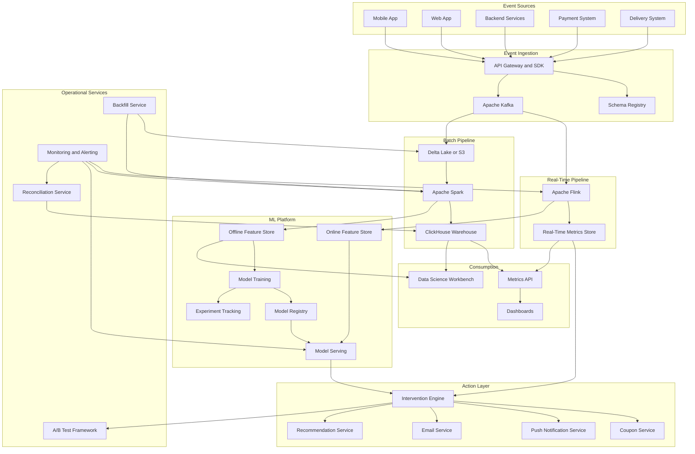
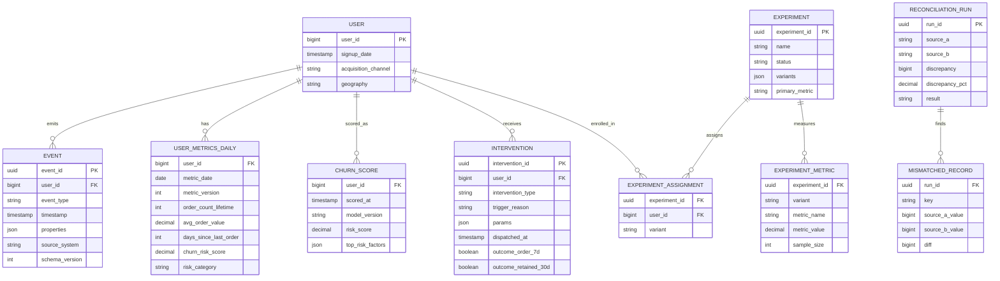
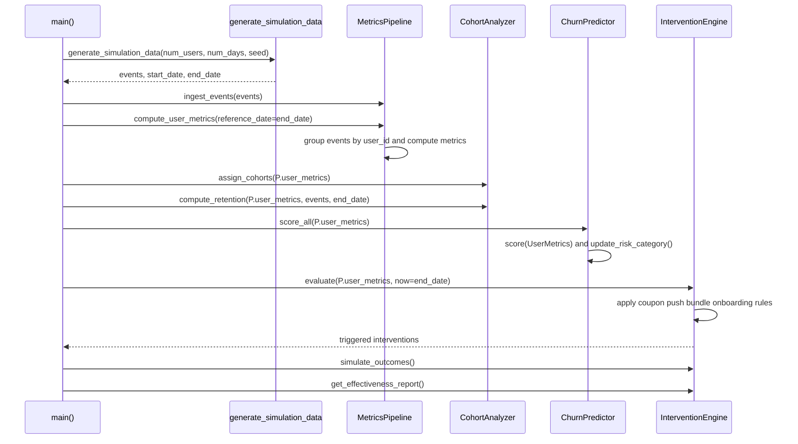
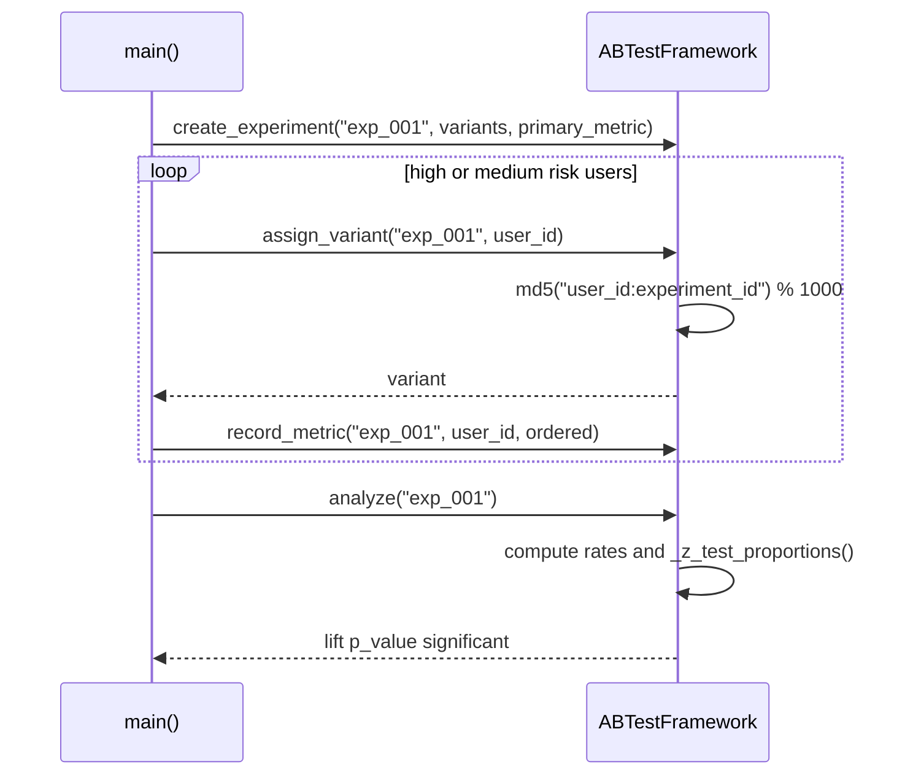
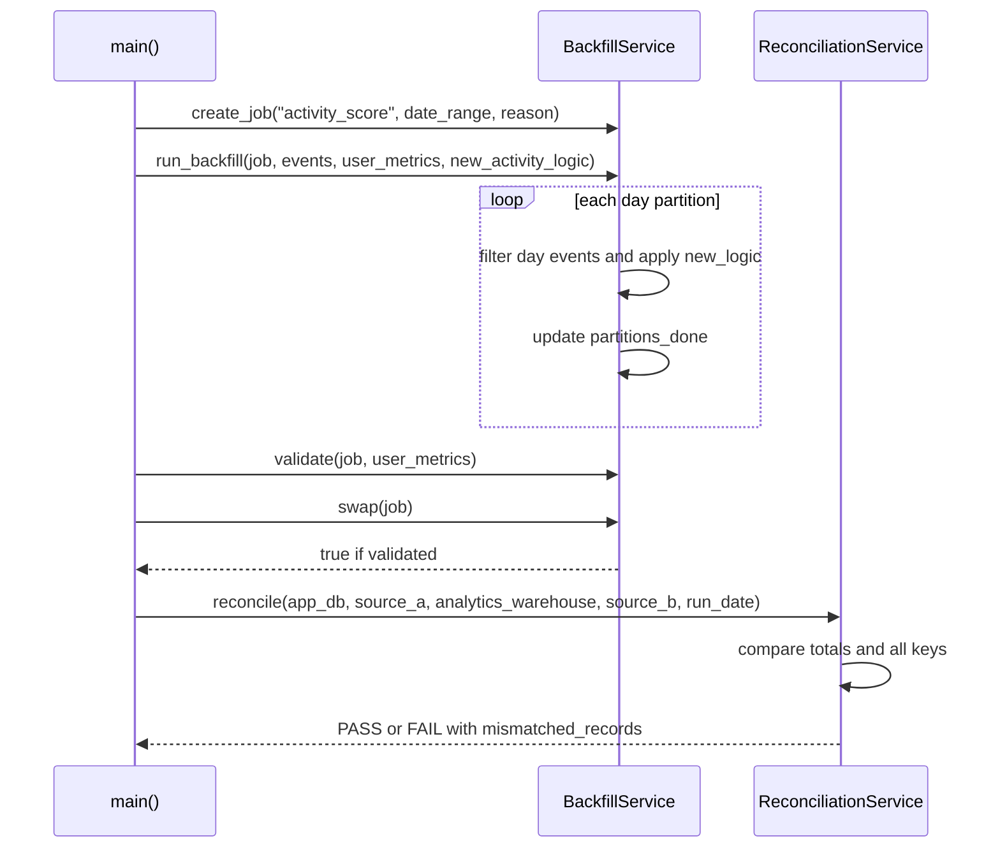

# Food Ordering Metrics & Attrition Reduction — Architecture

> **Scope of this document.** This is the consolidated architecture reference for
> the Food Ordering App User Metrics & Attrition Reduction system. It preserves
> the README system-design material and maps it to the reference implementation
> in `food_ordering_metrics.py`, a single-process simulation. Sections tagged
> **[Design-only]** describe production concerns not present in the simulation;
> sections tagged **[Implemented]** map directly to code.

---

## 1. Problem Statement

A large food ordering platform is experiencing attrition. Monthly active users
have plateaued and 90-day retention dropped from 35% to 22%. The business lacks:

- **Visibility:** order, clickstream, and delivery data live in separate systems.
- **Understanding:** no cohort analysis or retention curves.
- **Prediction:** churn is only detected after long inactivity.
- **Action:** win-back campaigns are manual and untargeted.
- **Trust:** discrepancies between app DB counts and analytics reduce confidence.

### Goals

1. Track the full lifecycle from signup through churn.
2. Compute user and cohort metrics in near-real-time.
3. Identify at-risk users 14-30 days before churn.
4. Trigger automated coupons, notifications, recommendations, and bundles.
5. Measure interventions through A/B tests.
6. Support backfilling when metric definitions change.
7. Detect and reconcile discrepancies automatically.
8. Integrate with data science workflows: feature store, model registry, and
   experiment tracking.

### Success Criteria [Design-only targets]

| Metric | Current | Target in 6 months |
|--------|---------|--------------------|
| 90-day retention | 22% | 30% |
| Churn prediction lead time | N/A reactive | 14 days |
| Intervention response rate | 2% manual | 8% automated |
| Metric freshness | T+1 day | < 5 min real-time, T+4 hours batch |
| Cross-system order-count drift | ~2% | < 0.01% |
| A/B test time to significance | Weeks manual | Automated daily checks |

---

## 2. Requirements

### 2.1 Functional Requirements

| ID | Requirement | Details | Status |
|----|-------------|---------|--------|
| FR-1 | Lifecycle event tracking | Capture signup, app open, search, cart, order, delivery, support, coupons, push, deletion. | ⚠️ `Event` and `generate_simulation_data()` implement signup/app_open/order_placed/order_delivered/rating; other event types are **[Design-only]**. |
| FR-2 | User-level metrics | Order counts, AOV, total spent, recency, time to first order, sessions, reorder rate, satisfaction, churn risk. | ✅ Implemented by `MetricsPipeline.compute_user_metrics()` and `UserMetrics`; rolling 30-day order count is **[Design-only]**. |
| FR-3 | Cohort analysis | Signup-week/month cohorts and W1/W2/W4/W8/W12 retention. | ✅ Signup-week retention implemented by `CohortAnalyzer`; filters by channel/geo/category are **[Design-only]**. |
| FR-4 | Churn prediction | Score and categorize every active user. | ✅ Fixed-weight scorer in `ChurnPredictor`; trained ML pipeline/registry are **[Design-only]**. |
| FR-5 | Automated interventions | Coupons, personalized pushes, bundles, onboarding. | ✅ Rules in `InterventionEngine.evaluate()`; external dispatch and timing/offer ML are **[Design-only]**. |
| FR-6 | A/B testing | Deterministic assignment, metrics, statistical significance, guardrails. | ⚠️ Assignment and z-test implemented by `ABTestFramework`; Bayesian, guardrails, sequential tests are **[Design-only]**. |
| FR-7 | Backfilling | Reprocess historical events for metric changes. | ✅ Simulated by `BackfillService`; shadow tables and atomic rename are **[Design-only]**. |
| FR-8 | Bug detection/reconciliation | Compare sources and produce correction reports. | ✅ Count comparison in `ReconciliationService.reconcile()`; automated correction workflow is **[Design-only]**. |
| FR-9 | Data science integration | Feature store, experiment tracking, model registry. | ⚠️ `FeatureStore` has in-memory online/offline stores; MLflow/Feast/model registry are **[Design-only]**. |

### 2.2 Non-Functional Requirements [Design-only targets]

| Requirement | Target |
|-------------|--------|
| Real-time metric latency | < 5 minutes |
| Batch aggregation latency | < 4 hours |
| User scale | 50M registered, 10M MAU |
| Order throughput | 10M orders/day, 50K orders/min peak |
| Event throughput | 500M events/day |
| Data accuracy | > 99.99% reconciled |
| Metric query latency | p50 < 50 ms, p99 < 500 ms |
| Availability | 99.95% pipeline, 99.99% intervention engine |
| Data retention | Raw 2 years, aggregates 5 years, PII per GDPR |
| Backfill speed | 90-day backfill in < 6 hours |
| Reconciliation | Every 4 hours |

---

## 3. Capacity Estimation [Design-only]

```text
Events per day:     500,000,000
Events per second:  ~5,800 average, ~30,000 peak
Avg event size:     500 bytes JSON, compressed ~200 bytes
Daily raw volume:   250 GB uncompressed, 100 GB compressed
Monthly raw volume: ~3 TB compressed
Yearly raw volume:  ~36 TB compressed

User metrics:       50M users * 200 bytes = 10 GB/day
Cohort metrics:     ~240 KB/day
Churn scores:       10M active users * 50 bytes hourly = 12 GB/day
Online features:    10M users * 500 bytes = 5 GB
Offline features:   50M users * 2KB * 365 days = 36 TB/year

Streaming compute:  4-8 Flink task managers, peak to 20
Batch compute:      50-node Spark daily aggregation, 100-node 90-day backfill
ML inference:       ~2,800 inferences/sec, < 10 ms model latency
Network:            ~25 Mbps sustained Kafka ingestion, ~125 Mbps peak
```

---

## 4. High-Level Architecture [Design-only]



---

## 5. Reference Implementation Overview [Implemented]

`food_ordering_metrics.py` generates synthetic user behavior, computes metrics,
builds cohort-retention curves, scores churn risk, triggers interventions,
simulates outcomes, runs an A/B test, backfills an activity-score change,
reconciles count sources, and materializes features.

```mermaid
classDiagram
    class Event {
        +str event_id
        +int user_id
        +str event_type
        +datetime timestamp
        +dict properties
        +str source_system
        +int schema_version
        +create(user_id, event_type, timestamp, properties, source) Event
    }
    class UserMetrics {
        +int user_id
        +datetime signup_date
        +int order_count
        +float total_spent
        +float avg_order_value
        +int days_since_last_order
        +float time_to_first_order_hrs
        +int session_count_30d
        +float avg_session_duration_s
        +float reorder_rate
        +float delivery_satisfaction
        +float churn_risk_score
        +str risk_category
        +float order_frequency_trend
        +update_risk_category() None
    }
    class CohortAnalyzer {
        +dict cohorts
        +dict retention
        +assign_cohorts(user_metrics) None
        +compute_retention(user_metrics, events, reference_date) dict
        +print_retention_table() None
    }
    class ChurnPredictor {
        +list WEIGHTS
        +float BIAS
        -_extract_features(m) list
        +score(m) float
        +score_all(user_metrics) dict
        +get_risk_distribution(user_metrics) dict
    }
    class InterventionEngine {
        +list interventions
        +dict user_intervention_count
        -_can_intervene(user_id) bool
        +evaluate(user_metrics, now) list
        +simulate_outcomes() None
        +get_effectiveness_report() dict
    }
    class ABTestFramework {
        +dict experiments
        +dict assignments
        +dict metrics
        +create_experiment(experiment_id, name, variants, primary_metric) None
        +assign_variant(experiment_id, user_id) str
        +record_metric(experiment_id, user_id, value) None
        +analyze(experiment_id) dict
    }
    class BackfillService {
        +list jobs
        +dict metric_versions
        +create_job(metric_name, date_range, reason) dict
        +run_backfill(job, events, user_metrics, new_logic) dict
        +validate(job, user_metrics) dict
        +swap(job) bool
    }
    class ReconciliationService {
        +float threshold_pct
        +list runs
        +reconcile(source_a_name, source_a_data, source_b_name, source_b_data, run_date) dict
    }
    class FeatureStore {
        +dict online_store
        +dict offline_store
        +materialize_online(user_metrics) int
        +write_offline(user_id, features, timestamp) None
        +get_online_features(user_id) dict
        +get_offline_features(user_id, as_of) dict
    }
    class MetricsPipeline {
        +list events
        +dict user_metrics
        +CohortAnalyzer cohort_analyzer
        +ChurnPredictor churn_predictor
        +InterventionEngine intervention_engine
        +ABTestFramework ab_framework
        +BackfillService backfill_service
        +ReconciliationService reconciliation_service
        +FeatureStore feature_store
        +ingest_events(events) None
        +compute_user_metrics(reference_date) None
        +get_metrics_distribution() dict
    }
    MetricsPipeline "1" o-- "many" Event
    MetricsPipeline "1" o-- "many" UserMetrics
    MetricsPipeline "1" o-- "1" CohortAnalyzer
    MetricsPipeline "1" o-- "1" ChurnPredictor
    MetricsPipeline "1" o-- "1" InterventionEngine
    MetricsPipeline "1" o-- "1" ABTestFramework
    MetricsPipeline "1" o-- "1" BackfillService
    MetricsPipeline "1" o-- "1" ReconciliationService
    MetricsPipeline "1" o-- "1" FeatureStore
```



### 5.1 Component Deep-Dive (doc → code)

| Design concept | Implemented by | Notes |
|----------------|----------------|-------|
| Lifecycle event | `Event`, `Event.create()` | UUID, user, type, timestamp, properties, source, schema version. |
| Synthetic event stream | `generate_simulation_data()` | Users, archetypes, signups, app opens, orders, deliveries, ratings. |
| Metrics state | `MetricsPipeline.user_metrics` | In-memory `dict[int, UserMetrics]`. |
| User metrics | `MetricsPipeline.compute_user_metrics()` | Orders, spend, AOV, recency, first order, sessions, satisfaction, reorder rate, trend. |
| Cohorts | `CohortAnalyzer.assign_cohorts()` | ISO signup week. |
| Retention | `CohortAnalyzer.compute_retention()` | Uses `order_delivered` events in milestone windows. |
| Churn score | `ChurnPredictor.score_all()` | Fixed-weight logistic-style scorer. |
| Risk categories | `UserMetrics.update_risk_category()` | high > 0.7, medium > 0.3, else low. |
| Intervention rules | `InterventionEngine.evaluate()` | Coupon, recommendation push, bundle push, onboarding push. |
| Outcome reporting | `simulate_outcomes()`, `get_effectiveness_report()` | Random outcomes aggregated by type. |
| Experiment assignment | `ABTestFramework.assign_variant()` | md5 hash of `user_id:experiment_id`. |
| Statistics | `ABTestFramework.analyze()` | Two-proportion z-test vs. control. |
| Backfill | `BackfillService.run_backfill()` | Day-partition reprocessing into `shadow_data`. |
| Reconciliation | `ReconciliationService.reconcile()` | Total and per-key mismatch report. |
| Feature store | `FeatureStore` | Online dict, offline history list, point-in-time lookup. |

---

## 6. Data Model

### 6.1 Conceptual production model [Design-only]



### 6.2 As implemented [Implemented]

Events live in `MetricsPipeline.events`, not Kafka or Delta Lake. `UserMetrics`
is a current snapshot, not a versioned daily table. `Intervention` has outcomes
but no experiment linkage. `ABTestFramework`, `BackfillService`,
`ReconciliationService`, and `FeatureStore` all store data in in-memory dicts or
lists.

---

## 7. API Design

### 7.1 Production HTTP surface [Design-only]

| Method & Path | Purpose |
|---------------|---------|
| `GET /api/v1/users/{user_id}/metrics` | Current metrics. |
| `GET /api/v1/users/{user_id}/metrics/history` | Historical snapshots. |
| `GET /api/v1/cohorts?signup_week=...&metric=retention` | Cohort retention. |
| `GET /api/v1/metrics/aggregate` | Segment aggregate metrics. |
| `POST /api/v1/metrics/query` | Flexible filtered/grouped query. |
| `POST /api/v1/interventions/trigger` | Dispatch intervention. |
| `GET /api/v1/interventions/{intervention_id}/outcome` | Outcome tracking. |
| `POST /api/v1/backfill/jobs` | Create backfill. |
| `GET /api/v1/backfill/jobs/{job_id}` | Poll progress. |
| `POST /api/v1/backfill/jobs/{job_id}/validate` | Validate backfill. |
| `POST /api/v1/backfill/jobs/{job_id}/swap` | Promote version. |
| `POST /api/v1/reconciliation/runs` | Run reconciliation. |
| `GET /api/v1/reconciliation/runs/{run_id}` | Get run details. |
| `POST /api/v1/experiments` | Create experiment. |
| `GET /api/v1/experiments/{experiment_id}/results` | Analyze experiment. |
| `POST /api/v1/experiments/{experiment_id}/stop` | Stop experiment. |

### 7.2 In-process API [Implemented]

| Method | Signature | Notes |
|--------|-----------|-------|
| `Event.create` | `(user_id, event_type, timestamp, properties=None, source='backend') -> Event` | Generates UUID. |
| `MetricsPipeline.ingest_events` | `(events: list[Event]) -> None` | Extends event list. |
| `MetricsPipeline.compute_user_metrics` | `(reference_date: datetime) -> None` | Mutates `user_metrics`. |
| `CohortAnalyzer.compute_retention` | `(user_metrics, events, reference_date) -> dict` | Uses `order_delivered`. |
| `ChurnPredictor.score_all` | `(user_metrics) -> dict[int, float]` | Mutates scores and categories. |
| `InterventionEngine.evaluate` | `(user_metrics, now) -> list[Intervention]` | One rule path per user. |
| `ABTestFramework.assign_variant` | `(experiment_id, user_id) -> str` | Deterministic; missing experiment raises `KeyError`. |
| `ABTestFramework.analyze` | `(experiment_id) -> dict` | First variant is control. |
| `BackfillService.run_backfill` | `(job, events, user_metrics, new_logic) -> dict` | Adds `shadow_data`. |
| `BackfillService.swap` | `(job) -> bool` | Only succeeds after validation. |
| `ReconciliationService.reconcile` | `(source_a_name, source_a_data, source_b_name, source_b_data, run_date) -> dict` | Count-map comparison. |
| `FeatureStore.get_offline_features` | `(user_id, as_of=None) -> dict | None` | Point-in-time latest before `as_of`. |

---

## 8. Key Workflows [Implemented]

### 8.1 Metrics, cohorts, churn, interventions



### 8.2 A/B test workflow



### 8.3 Backfill and reconciliation



---

## 9. Detailed Component Design

### 9.1 Event generation [Implemented + Design-only]

`generate_simulation_data()` creates power, regular, casual, and churned user
archetypes with signups, app opens, order placement, delivery, and ratings. It
does not implement schema registry validation, deduplication, late arrivals, or
the full README event list.

### 9.2 User metrics [Implemented]

`MetricsPipeline.compute_user_metrics()` calculates order count, total spent,
AOV, last order date, days since last order, time to first order, reorder rate,
order frequency trend, 30-day app opens, simulated session duration, and delivery
satisfaction.

### 9.3 Cohorts and churn [Implemented + Design-only]

`CohortAnalyzer` groups by ISO signup week and computes W1/W2/W4/W8/W12
retention. `ChurnPredictor` uses fixed feature weights for recency, order count,
satisfaction, trend, and session count. Trained XGBoost, calibration, model
registry, and hourly serving are **[Design-only]**.

### 9.4 Intervention engine [Implemented + Design-only]

Rules trigger high-risk inactive coupons, medium-risk recommendation pushes,
low-AOV bundle pushes, and new-user onboarding pushes. Production cooldowns,
opt-out checks, coupon/push/email dispatch, recommendation calls, and outcome
schedulers are **[Design-only]**.

### 9.5 Experiments, backfill, reconciliation, features [Implemented + Design-only]

`ABTestFramework` implements deterministic assignment and z-test analysis only.
`BackfillService` reprocesses partitions into an in-memory shadow result.
`ReconciliationService` compares count maps and stores run reports. `FeatureStore`
implements online dict features and offline historical feature lists. Bayesian
statistics, guardrails, sequential testing, atomic table swaps, correction
events, and Feast/MLflow/model registry are **[Design-only]**.

---

## 10. Architectural Patterns [Design-only]

- **Lambda / Kappa Hybrid:** streaming for freshness, batch for cohorts/features/backfills.
- **Event Sourcing:** immutable lifecycle events reconstruct user state.
- **CQRS:** write path processes events; read path serves Redis/ClickHouse views.
- **Feature Store Pattern:** central online/offline feature definitions.
- **Experiment-Driven Development:** interventions and models roll out through tests.
- **Reconciliation Pattern:** scheduled source comparisons and audit records.
- **SCD Type 2:** versioned user metric snapshots; not implemented in code.

---

## 11. Technology Choices & Trade-offs [Design-only]

| Area | Choice | Alternative | Rationale |
|------|--------|-------------|-----------|
| Event streaming | Kafka | Kinesis | Ecosystem and lower cost at 500M events/day. |
| Real-time processing | Flink | Spark Structured Streaming | Lower latency and strong state/window semantics. |
| Batch lake | Delta Lake | Iceberg | Spark/Databricks fit; Iceberg is stronger for multi-engine. |
| Experiment/model tracking | MLflow | SageMaker | Portable and framework-agnostic. |
| Feature store | Feast + Redis online | Custom Redis only | Point-in-time joins and declarative definitions. |
| Metrics store | ClickHouse | PostgreSQL | Faster large analytical aggregations; PostgreSQL remains transactional store. |

---

## 12. Scaling, Reliability & Security [Design-only]

Partition Kafka by `user_id % 256`, Delta Lake by date, ClickHouse by date plus
user hash, and Redis by consistent hash. Mitigate hot keys with salting and
two-phase aggregation. Pre-aggregate dashboards and use HyperLogLog/t-digest for
approximate real-time analytics.

Reliability relies on Flink checkpointed offsets, idempotent Redis writes, Delta
write-ahead logs, reconciliation every 4 hours, backfill validation, and model
rollback when intervention conversion drops.

Security requires AES-256 at rest, TLS 1.3 in transit, PII tokenization, column
access control, GDPR access/deletion/portability APIs, event redaction, consent
checks before interventions, and deletion from Redis, ClickHouse, feature store,
and active experiments.

Monitoring covers Kafka lag, checkpoint duration, Spark duration, DLQ depth,
freshness, schema failures, model drift, calibration error, intervention ROI,
experiment guardrails, and system health dashboards.

---

## 13. Running the Simulation [Implemented]

```powershell
uv run --no-project python SystemDesign\FoodOrderingMetrics\food_ordering_metrics.py
```

The demo runs data generation, metric computation, cohorts, churn scoring,
interventions, A/B testing, backfill, reconciliation, feature serving, and a
summary.

### Suggested tests

- `generate_simulation_data(seed=...)` is deterministic.
- `compute_user_metrics()` computes known AOV, recency, and reorder rate.
- `compute_retention()` handles ineligible later weeks correctly.
- `score_all()` updates risk score and category.
- `evaluate()` triggers the expected rule and respects the fatigue cap.
- `assign_variant()` is deterministic.
- `swap()` fails before validation and succeeds after validation.
- `reconcile()` reports correct totals and mismatched keys.
- `get_offline_features(as_of=...)` returns the latest record before `as_of`.

---

## 14. Future Improvements

- Add schema validation and all README lifecycle event types.
- Replace fixed churn weights with trained/versioned models.
- Add feature definitions and point-in-time training set generation.
- Add real cooldown windows, opt-out checks, and dispatch adapters.
- Extend A/B testing with Bayesian analysis, guardrails, sequential testing, and
  mutual exclusion.
- Persist metrics as versioned daily snapshots.
- Add reconciliation correction events and root-cause classification.
- Make backfill jobs durable and resumable.
- Add unit tests for deterministic data generation and service methods.
