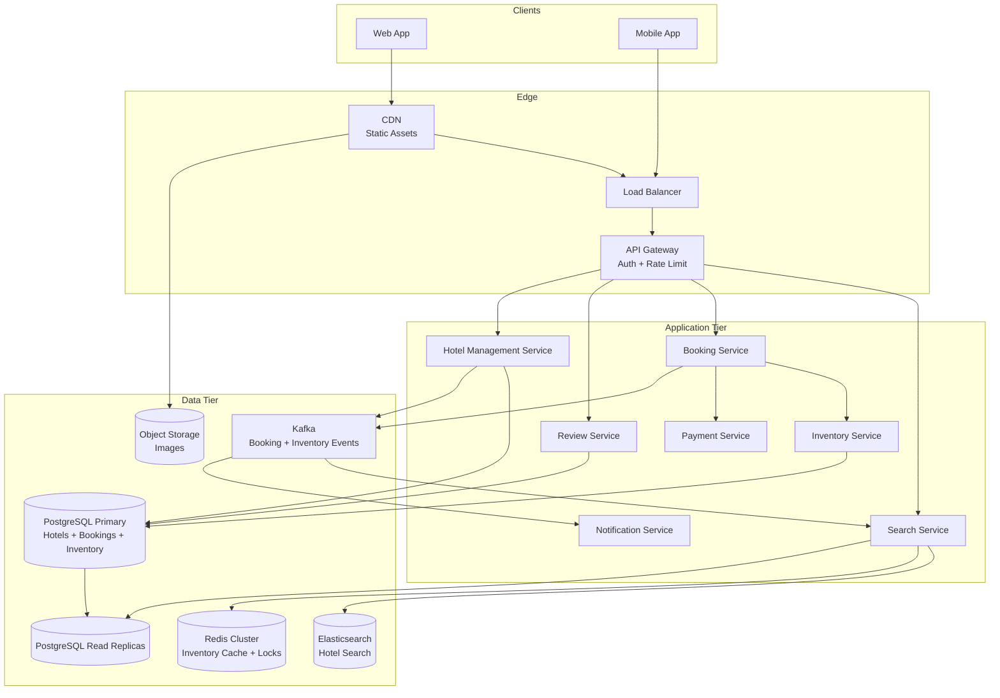
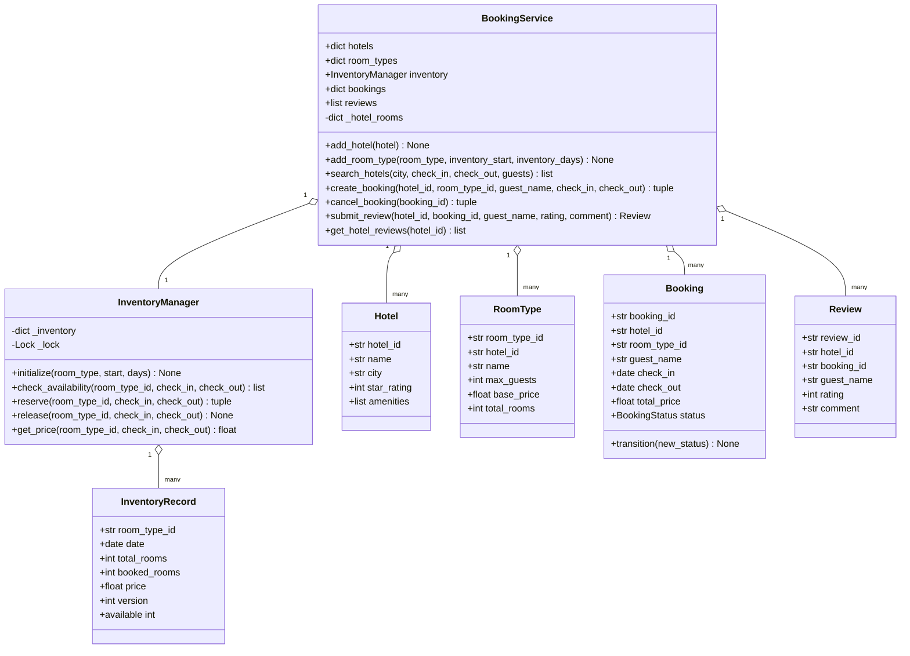
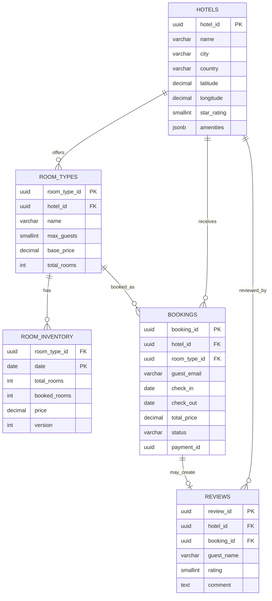
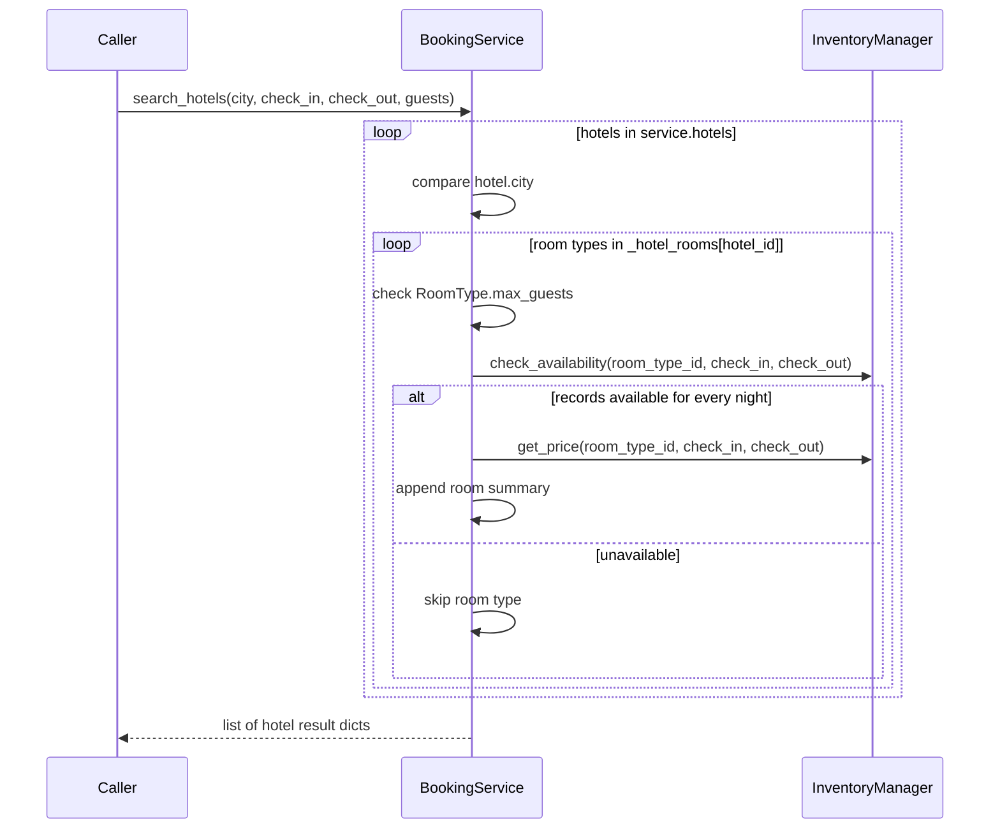
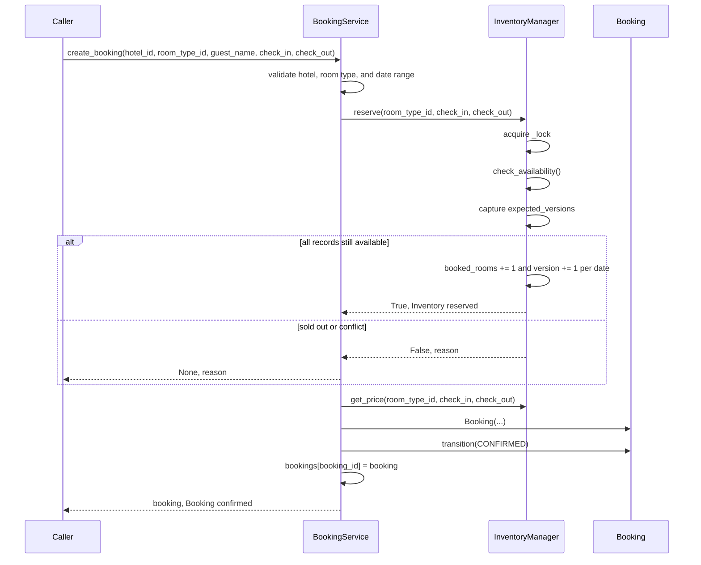
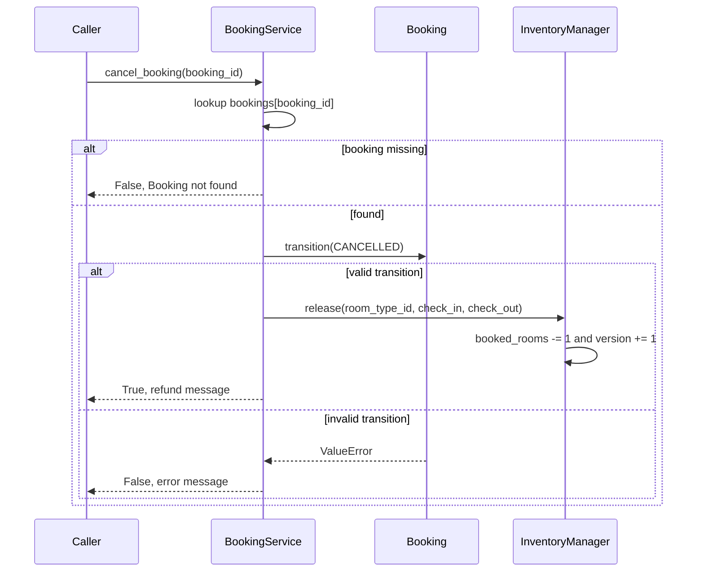
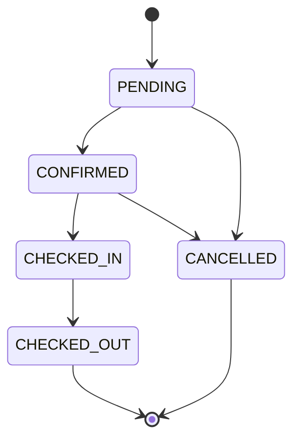

# Hotel Booking System — Architecture

> **Scope of this document.** This is the consolidated architecture reference for
> the Hotel Booking System. It preserves the production-oriented design from
> `README.md` and maps it to the reference implementation in
> [`hotel_booking.py`](./hotel_booking.py), a single-process, in-memory
> simulation. Sections tagged **[Design-only]** describe production capabilities
> not present in the simulation; sections tagged **[Implemented]** map directly
> to the current Python code.

---

## 1. Problem Statement

Design a Booking.com-like hotel booking platform that lets users search hotels,
view room availability, book rooms, cancel reservations, and submit reviews. The
system has a read-heavy workload: searches and hotel-detail views vastly
outnumber bookings, but inventory mutation must remain strongly consistent so two
guests never book the same room type for the same date range beyond available
capacity.

Key challenges:

- **Inventory accuracy:** two users must never overbook the same room type for
  the same dates.
- **High read-to-write ratio:** searches are approximately 100:1 versus booking
  writes.
- **Flash sale handling:** popular hotels can receive thousands of concurrent
  booking attempts.
- **Global scale:** users and hotels span multiple geographic regions.

---

## 2. Requirements

### 2.1 Functional Requirements

| ID | Requirement | Details | Status |
|----|-------------|---------|--------|
| FR-1 | Search hotels | Search by city, check-in/check-out dates, and guest count. | ✅ Implemented (`BookingService.search_hotels`) |
| FR-2 | View hotel details | Return hotel name, city, star rating, amenities, rooms, pricing, and availability. Photos and rich descriptions are not modeled. | ⚠️ Partially implemented (`search_hotels` result shape); media/details are **[Design-only]** |
| FR-3 | Check real-time room availability | Check per-date availability for a room type across a stay. | ✅ Implemented (`InventoryManager.check_availability`) |
| FR-4 | Book a room | Reserve inventory, compute price, create a booking, and transition it to confirmed. Payment is simulated as an immediate success. | ✅ Inventory and confirmation implemented (`create_booking`); payment is **[Design-only]** |
| FR-5 | Cancel booking | Transition booking to cancelled and release inventory. | ✅ Implemented (`BookingService.cancel_booking`, `InventoryManager.release`) |
| FR-6 | View booking history | Query upcoming/past reservations by guest. | ❌ **[Design-only]**; `bookings` exists but no public history API |
| FR-7 | Submit/read reviews | Add hotel reviews and read reviews by hotel. | ✅ Implemented (`submit_review`, `get_hotel_reviews`) |
| FR-8 | Hotel managers update inventory/pricing | Add hotels and room types; dynamic price/inventory edits are not exposed after initialization. | ⚠️ Partially implemented (`add_hotel`, `add_room_type`); manager workflow is **[Design-only]** |
| FR-9 | Price comparison | Search returns multiple room types with nightly and total prices. | ✅ Implemented (`search_hotels`, `InventoryManager.get_price`) |
| FR-10 | Notifications | Confirmation/cancellation notifications. | ❌ **[Design-only]** |

### 2.2 Non-Functional Requirements [Design-only targets]

| Requirement | Target |
|-------------|--------|
| **Consistency** | Strong consistency for inventory; no double booking |
| **Search latency** | p99 < 200 ms |
| **Booking latency** | p99 < 500 ms end-to-end |
| **Availability** | 99.99% uptime for booking service |
| **Flash sale support** | 10,000+ concurrent booking attempts per hotel |
| **Scalability** | 500K hotels, 50M rooms globally |
| **Durability** | Zero data loss for confirmed bookings |
| **Data isolation** | PCI-DSS isolation for payment data |

---

## 3. Capacity Estimation [Design-only]

### 3.1 Traffic

| Metric | Estimate |
|--------|----------|
| Daily active users | 10 million |
| Searches per day | 50 million, about 580 QPS average and 2,000 QPS peak |
| Hotel detail views per day | 20 million |
| Bookings per day | 500,000, about 6 QPS average and 50 QPS peak |
| Cancellations per day | 50,000 |
| Reviews per day | 100,000 |

### 3.2 Storage

| Data | Size Estimate |
|------|---------------|
| Hotel metadata, 500K hotels | ~5 GB |
| Room records, 50M rooms | ~50 GB |
| Room inventory, 50M rooms x 365 days | ~180 GB/year |
| Bookings, 500K/day x 365 days | ~100 GB/year |
| Reviews, 100K/day x 365 days | ~20 GB/year |
| Search index, denormalized | ~100 GB |
| Images/media | ~50 TB in object storage |

### 3.3 Bandwidth

- Inbound: ~200 MB/s for search and booking requests.
- Outbound: ~2 GB/s for search results with thumbnails.

---

## 4. High-Level Architecture [Design-only]



Search is a read-optimized query path backed by Elasticsearch and cache. Booking
is a command path backed by PostgreSQL transactions and inventory concurrency
control. Kafka decouples search-index refreshes, notifications, and audit
pipelines.

---

## 5. Reference Implementation Overview [Implemented]

`hotel_booking.py` collapses the production system into an in-memory service
layer. It still demonstrates the key consistency idea: per-date `InventoryRecord`
objects are mutated through `InventoryManager.reserve()` under a process-local
lock, with a version field to illustrate optimistic concurrency control.



### 5.1 Component Deep-Dive (doc → code)

| Design concept | Implemented by | Notes |
|----------------|----------------|-------|
| Hotel catalog | `BookingService.hotels`, `add_hotel()` | In-memory dict keyed by `hotel_id`. |
| Room-type catalog | `BookingService.room_types`, `_hotel_rooms`, `add_room_type()` | `room_type_id` maps to `RoomType`; `_hotel_rooms` links hotels to room types. |
| Per-date inventory | `InventoryManager._inventory: dict[tuple[str, date], InventoryRecord]` | Simulates `room_inventory(room_type_id, date)` rows. |
| Availability search | `search_hotels()` + `check_availability()` | Filters city, guest capacity, and all dates in `[check_in, check_out)`. |
| Double-booking prevention | `InventoryManager.reserve()` | Uses `threading.Lock` around check-and-update and increments `InventoryRecord.version`. |
| Booking state machine | `BookingStatus`, `VALID_TRANSITIONS`, `Booking.transition()` | Enforces valid transitions; `create_booking()` uses PENDING → CONFIRMED. |
| Cancellation compensation | `cancel_booking()` + `InventoryManager.release()` | Transitions to CANCELLED and decrements `booked_rooms`. |
| Reviews | `Review`, `submit_review()`, `get_hotel_reviews()` | No verified-stay check beyond supplied `booking_id`. |
| Flash-sale demo | `run_concurrent_booking_demo()` | Uses threads to prove capacity-bound success and rejected overbooking. |

---

## 6. Data Model

### 6.1 Conceptual production model [Design-only]



The README SQL tables are preserved in this model: `hotels`, `room_types`,
`room_inventory`, `bookings`, and `reviews`. Production indexing includes
`idx_hotels_city`, `idx_room_types_hotel`, `idx_inventory_date`,
`idx_bookings_hotel`, `idx_bookings_guest`, `idx_bookings_dates`, and
`idx_reviews_hotel`.

### 6.2 As implemented [Implemented]

The simulation stores each table as Python objects:

- `hotels: dict[str, Hotel]`
- `room_types: dict[str, RoomType]`
- `_inventory: dict[tuple[str, date], InventoryRecord]`
- `bookings: dict[str, Booking]`
- `reviews: list[Review]`

There is no user table, payment table, email field, refund record, media store,
or persisted audit trail in code.

---

## 7. API Design

### 7.1 Production HTTP surface [Design-only]

| Method & Path | Purpose | Success |
|---------------|---------|---------|
| `GET /api/v1/hotels/search?location=&check_in=&check_out=&guests=&page=&sort_by=&filters=` | Search hotels by city/coordinates, dates, guests, and filters. | `200 OK` with hotel cards, min price, and availability |
| `GET /api/v1/hotels/{hotel_id}?check_in=&check_out=&guests=` | Get hotel details, room types, and review summary. | `200 OK` |
| `POST /api/v1/bookings` | Create booking for hotel, room type, dates, guest info, and payment method. | `201 Created` with `CONFIRMED` booking |
| `POST /api/v1/bookings/{booking_id}/cancel` | Cancel booking and process refund. | `200 OK` |
| `POST /api/v1/hotels/{hotel_id}/reviews` | Submit review for a completed booking. | `201 Created` |
| `GET /health` / `GET /health/ready` | Liveness and readiness checks. | `200 OK` |

### 7.2 In-process API [Implemented]

| Method | Signature | Raises / Failure |
|--------|-----------|------------------|
| `add_hotel` | `(hotel: Hotel) -> None` | — |
| `add_room_type` | `(room_type: RoomType, inventory_start: date, inventory_days: int = 90) -> None` | — |
| `search_hotels` | `(city: str, check_in: date, check_out: date, guests: int = 1) -> list[dict]` | Returns empty list when none available |
| `create_booking` | `(hotel_id: str, room_type_id: str, guest_name: str, check_in: date, check_out: date) -> tuple[Optional[Booking], str]` | Returns `(None, message)` for invalid hotel, room type, date range, or no inventory |
| `cancel_booking` | `(booking_id: str) -> tuple[bool, str]` | Returns `(False, message)` for missing booking or invalid transition |
| `submit_review` | `(hotel_id: str, booking_id: str, guest_name: str, rating: int, comment: str) -> Review` | `ValueError` if rating is outside 1..10 |
| `get_hotel_reviews` | `(hotel_id: str) -> list[Review]` | — |

---

## 8. Key Workflows [Implemented]

### 8.1 Search hotels



### 8.2 Create booking with inventory reservation



### 8.3 Cancel booking



---

## 9. Detailed Component Design

### 9.1 Inventory Management [Implemented]

The implemented inventory layout is intentionally close to the README's
`room_inventory` table:

```python
_inventory[(room_type_id, date)] -> InventoryRecord
```

`InventoryManager.reserve()` guards the entire check-and-update section with
`self._lock`, reads all dates, captures `expected_versions`, verifies each record
is still available, then increments `booked_rooms` and `version`. In a real
database this maps to a transaction with conditional updates or row locks. In the
simulation, the lock provides the thread-safety and the version field explains
the optimistic-locking mechanism.

### 9.2 Booking State Machine [Implemented]

`BookingStatus` supports:



`Booking.transition()` enforces `VALID_TRANSITIONS`. The demo deliberately tries
to move a cancelled booking back to `CONFIRMED` and catches the `ValueError`.

### 9.3 Search with Denormalized Data [Design-only]

Production search uses Elasticsearch with a denormalized hotel document that
contains hotel metadata, geo location, review aggregates, room summaries, minimum
price, and approximate available dates. Exact availability remains checked in the
booking path. Hotel or inventory changes publish Kafka events that refresh the
search index.

### 9.4 Double-Booking Prevention Layers [Design-only]

Production uses layered defenses:

1. Redis distributed lock per `room_type_id + date_range` to reduce DB
   contention.
2. PostgreSQL transaction with `SELECT ... FOR UPDATE` or conditional versioned
   updates.
3. Database check constraint so `booked_rooms <= total_rooms`.

The implementation demonstrates the same invariant in-process with
`InventoryManager._lock`, `booked_rooms`, and `version`.

---

## 10. Architectural Patterns [Design-only]

- **Optimistic Concurrency Control:** use a `version` column in
  `room_inventory`; failed conditional updates signal a conflict and trigger
  retry or rejection.
- **Saga Pattern:** booking coordinates inventory reservation, payment capture,
  booking confirmation, notification, and compensations such as inventory release
  and refund.
- **CQRS:** search queries use Elasticsearch and caches; bookings and inventory
  mutations go through PostgreSQL as source of truth.
- **Cache-Aside:** hot hotel details and availability snapshots are cached in
  Redis and invalidated by booking/inventory events.
- **Event-Driven Architecture:** Kafka propagates booking, inventory, review, and
  hotel-management changes to search, notification, analytics, and audit
  consumers.

---

## 11. Technology Choices & Trade-offs [Design-only]

| Component | Choice | Rationale |
|-----------|--------|-----------|
| Search Engine | Elasticsearch | Geo-query support, faceted filters, aggregations, and fast denormalized hotel search. |
| Primary DB | PostgreSQL | ACID transactions for booking integrity, JSONB amenities, and mature replication. |
| Cache + Locks | Redis Cluster | Sub-ms inventory cache and distributed locks such as Redlock. |
| Message Queue | Kafka | Durable event log for saga orchestration and search-index updates. |
| API Gateway | Kong / Envoy | Rate limiting, JWT validation, routing, and circuit breakers. |
| Object Storage | S3 / Azure Blob | Cost-effective hotel images and CDN integration. |
| Monitoring | Prometheus + Grafana | Metrics, dashboards, and alerting. |
| Tracing | Jaeger / OpenTelemetry | Distributed traces across booking saga steps. |

Trade-off summary: PostgreSQL simplifies strong inventory consistency, while
Elasticsearch accepts eventual consistency for fast reads. Redis locks reduce
contention but must be backed by database constraints because lock TTL expiry and
network partitions can still happen.

---

## 12. Scaling, Reliability & Security [Design-only]

### Scaling

- Elasticsearch shards by city/region with replicas for read throughput.
- Redis caches hot hotel records and availability snapshots, reducing search
  datastore load.
- PostgreSQL read replicas serve reviews and booking-history reads.
- `room_inventory` and `bookings` shard by `hotel_id` to co-locate transactional
  data.
- Kafka partitions by `hotel_id` for ordered processing per property.
- Flash sales use request queues, Redis pre-checks, exponential backoff, and
  per-user rate limits.

### Reliability

| Mechanism | Implementation |
|-----------|----------------|
| Replication | PostgreSQL streaming replication; synchronous primary region and async DR |
| Failover | Patroni or managed database failover |
| Circuit breaker | Payment calls fail fast and leave bookings pending or cancelled |
| Idempotency | Booking requests carry idempotency keys |
| Retry | Saga steps retry with backoff before compensation |
| Dead letter queue | Failed Kafka messages routed to DLQ |
| Backup | WAL archiving and point-in-time recovery |
| Multi-region DR | Active-passive, RPO < 1 min, RTO < 5 min |

### Security

| Threat | Mitigation |
|--------|------------|
| Unauthorized access | JWT/OAuth2 plus roles for guest, hotel admin, and platform admin |
| SQL injection | Parameterized queries and ORM layer |
| Rate abuse | Per-IP and per-user throttles |
| Payment data theft | PCI-DSS isolation and tokenized payments |
| Data in transit | TLS 1.3 and mTLS between services |
| Data at rest | AES-256 encryption for PII |
| Inventory manipulation | Server-side price and availability validation |
| DDoS | CDN/WAF and geo-based blocking |
| Audit trail | Immutable event log for state transitions |

### Observability

Important metrics include search p99 > 200 ms, booking p99 > 500 ms, booking
success rate < 95%, inventory conflict rate > 5%, payment failure rate > 2%,
Kafka consumer lag > 10,000 messages, DB pool utilization > 80%, and Redis hit
rate < 90%.

---

## 13. Running the Simulation [Implemented]

```powershell
uv run --no-project python SystemDesign\HotelBooking\hotel_booking.py
```

The demo seeds hotels and room types, searches New York hotels, creates and
cancels a booking, submits a review, validates an invalid state transition, and
runs a concurrent flash-sale simulation where only available capacity succeeds.

### Suggested tests

- `InventoryManager.reserve()` allows exactly `total_rooms` successful bookings
  for the same room/date range and rejects the next one.
- `Booking.transition()` rejects invalid transitions such as CANCELLED →
  CONFIRMED.
- `cancel_booking()` restores availability across every booked night.
- `search_hotels()` filters by city, guest count, and full date-range
  availability.
- `submit_review()` rejects ratings outside 1..10.

---

## 14. Future Improvements

- Add a public booking-history API keyed by user/guest.
- Model payment as a separate service and implement saga compensation for failed
  payment after inventory reservation.
- Replace the process-local lock with a repository abstraction so tests can use
  SQLite/PostgreSQL transactions.
- Add dynamic pricing and manager inventory-update workflows.
- Persist reviews and validate that reviews come from completed stays.
- Add notification events for booking confirmation and cancellation.
- Add targeted pytest coverage for concurrency and state-machine behavior.
