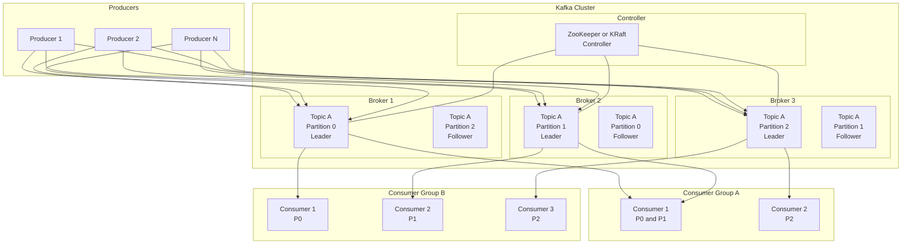
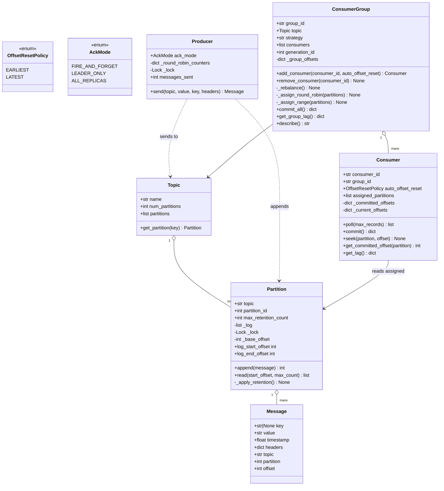
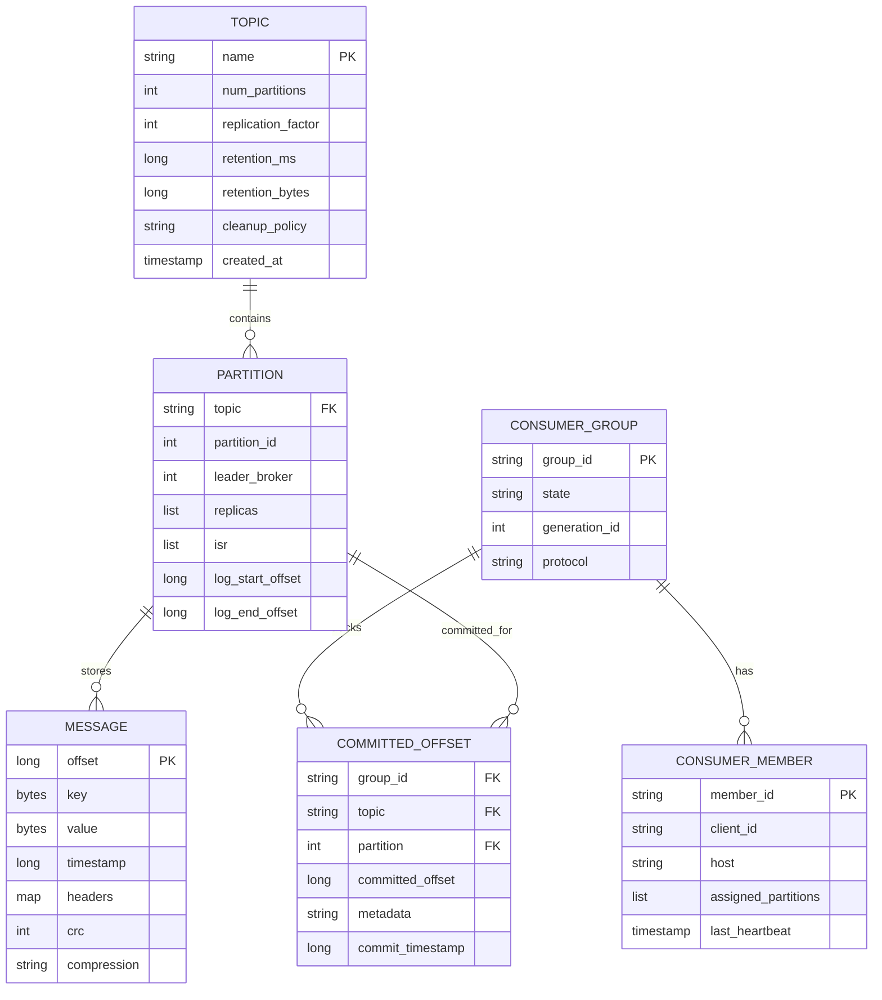
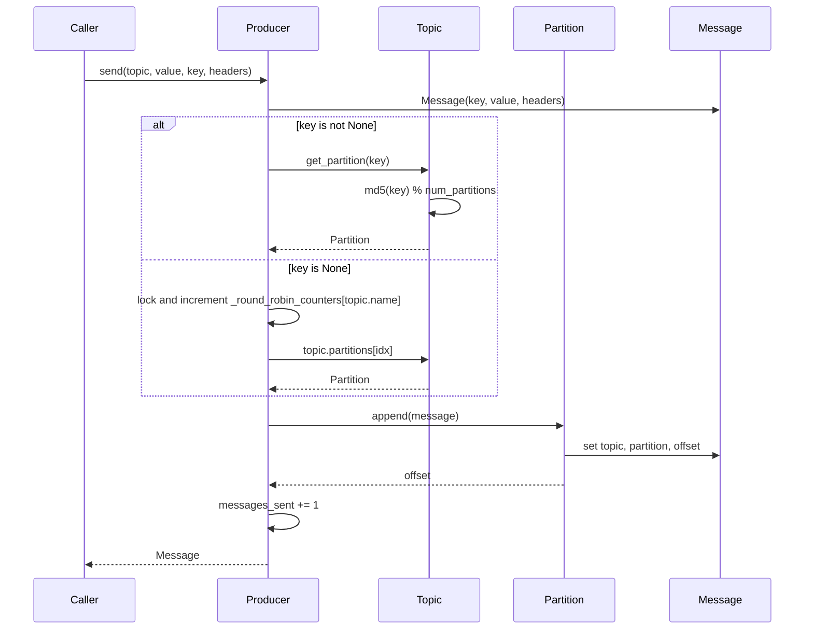
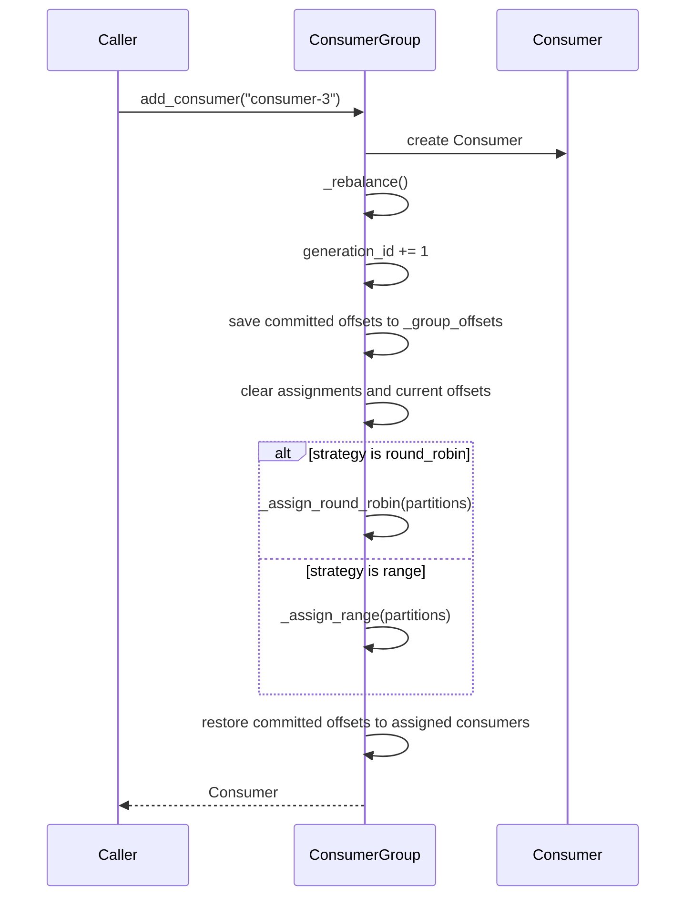
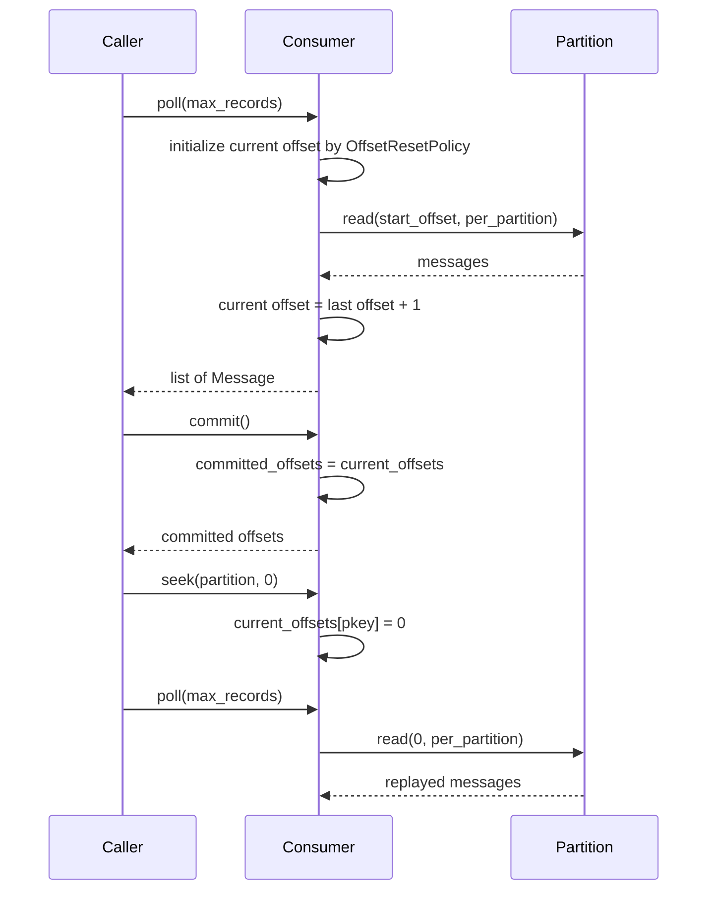

# Message Queue (Kafka-like) — Architecture

> **Scope of this document.** This is the consolidated architecture reference for
> the Kafka-like Message Queue. It preserves the production design from
> [`README.md`](./README.md) and maps it to the reference implementation in
> [`message_queue.py`](./message_queue.py), a single-process in-memory simulation.
> Sections tagged **[Design-only]** describe production cluster concerns not
> present in the simulation; sections tagged **[Implemented]** map directly to
> code.

---

## 1. Problem Statement

Design a distributed message queue similar to Apache Kafka that enables
asynchronous, reliable, high-throughput communication between producers and
consumers. The system must support publish/subscribe semantics, horizontal
scalability through topic partitioning, consumer group coordination, durable
message storage with configurable retention, and replay.

Modern microservice architectures require decoupled communication where producers
and consumers operate independently. The system must handle bursty traffic,
guarantee ordering within a partition, support multiple independent consumer
groups reading the same data at different rates, and provide at-least-once,
optionally exactly-once, delivery semantics.

---

## 2. Requirements

### 2.1 Functional Requirements

| # | Requirement | Details | Status |
|---|---|---|---|
| F1 | Topic management | Create, delete, list topics with configurable partitions. | ⚠️ Partially implemented: `Topic(name, num_partitions)` creates topics; no broker/admin registry or delete/list API |
| F2 | Publish messages | Producers send messages to a topic using key-based or round-robin partitioning. | ✅ Implemented (`Producer.send`) |
| F3 | Subscribe and consume | Consumers subscribe and poll messages, tracking offsets. | ✅ Implemented through `ConsumerGroup.add_consumer`, `Consumer.poll`, offsets per assigned partition |
| F4 | Partitions | Each topic has N ordered append-only logs. | ✅ Implemented (`Partition._log`, `append`, `read`) |
| F5 | Consumer groups | Consumers in a group share partitions; different groups consume independently. | ✅ Implemented (`ConsumerGroup`) for one topic per group |
| F6 | Message ordering | Strict ordering within a partition only. | ✅ Implemented by monotonically increasing `Message.offset` in `Partition.append` |
| F7 | Offset management | Commit offsets, resume, and support earliest/latest reset. | ✅ Implemented (`Consumer.commit`, `ConsumerGroup._group_offsets`, `OffsetResetPolicy`) |
| F8 | Rebalancing | Redistribute partitions on join/leave. | ✅ Implemented (`ConsumerGroup._rebalance`, `_assign_round_robin`, `_assign_range`) |
| F9 | Retention | Retain messages by policy, not delete on consumption. | ⚠️ Partially implemented: count-based retention via `Partition.max_retention_count`; no time/size retention |
| F10 | Replay | Seek to an offset and reread. | ✅ Implemented (`Consumer.seek`) |
| F11 | Replication and ISR | Leader/follower replication, high watermark, failover. | [Design-only] |
| F12 | Log compaction | Keep latest value by key and tombstones. | [Design-only] |

### 2.2 Non-Functional Requirements [Design-only targets]

| # | Requirement | Target |
|---|---|---|
| NF1 | **Throughput** | 1M+ messages/sec aggregate |
| NF2 | **Latency** | p99 < 10 ms produce, p99 < 50 ms consume |
| NF3 | **Durability** | No message loss once acknowledged; replicated across brokers |
| NF4 | **Availability** | 99.99% uptime; automatic broker failover |
| NF5 | **Delivery semantics** | At-least-once by default; exactly-once via idempotent producers and transactions |
| NF6 | **Scalability** | Add brokers and partitions horizontally |
| NF7 | **Fault tolerance** | Survive broker failures with ISR replication |
| NF8 | **Storage efficiency** | Log compaction and configurable retention |

---

## 3. Capacity Estimation [Design-only]

### 3.1 Assumptions

- Peak throughput: **1 million messages/sec**.
- Average message size: **1 KB**.
- Retention period: **7 days**.
- Replication factor: **3**.

### 3.2 Storage

```text
Daily volume      = 1M msg/sec * 86,400 sec/day * 1 KB = ~84 TB/day raw
With replication  = 84 TB * 3 = ~252 TB/day
7-day retention   = 252 TB * 7 = ~1.76 PB
```

### 3.3 Bandwidth and Broker Count

```text
Ingress = 1M msg/sec * 1 KB = ~1 GB/sec
Egress  = 1 GB/sec * 3 replication + consumer reads = ~5-10 GB/sec

Single broker throughput ~100-200 MB/sec
Brokers needed = 1 GB/sec / 150 MB/sec = ~7-10 minimum
With headroom and replication = 15-20 brokers
```

### 3.4 Partitions

```text
Target parallelism: 100-500 partitions per high-throughput topic
Total cluster partitions: 10,000-50,000
```

---

## 4. High-Level Architecture [Design-only]



Producers publish to topic partitions. Brokers append to durable logs and
replicate partitions. Consumer groups independently read offsets from partitions;
within one group a partition is assigned to exactly one consumer.

---

## 5. Reference Implementation Overview [Implemented]

The implementation models Kafka's core mechanics in memory: topics, partitions,
messages with offsets, producers, consumers, consumer groups, rebalancing,
offset commits, lag calculation, retention by count, and replay by seek.



### 5.1 Component Deep-Dive (doc → code)

| Design concept | Implemented by | Notes |
|---|---|---|
| Log entry | `Message` | Holds key, value, timestamp, headers, topic, partition, and offset. |
| Append-only partition | `Partition._log`, `append()`, `read()` | Offsets are monotonically assigned from `_base_offset + len(_log)`. |
| Retention | `Partition._apply_retention()` | Count-based trimming only; advances `_base_offset`. |
| Topic | `Topic` | Owns a list of `Partition` instances. |
| Key-based partitioning | `Topic.get_partition(key)` | MD5 hash modulo partition count. |
| Keyless fallback | `Topic.get_partition(None)` | Returns partition 0 deterministically; return type is always `Partition`. |
| Keyless load balancing | `Producer.send(..., key=None)` | Does not use `Topic.get_partition(None)`; uses `_round_robin_counters` under `_lock`. |
| Producer acknowledgments | `AckMode` | Enum is modeled, but code does not alter behavior by ack mode. |
| Consumer offsets | `Consumer._current_offsets`, `_committed_offsets` | Poll advances current offsets; commit copies current to committed. |
| Consumer groups | `ConsumerGroup.consumers`, `_group_offsets`, `generation_id` | Rebalance on add/remove and restore committed offsets. |
| Assignment strategies | `_assign_round_robin()`, `_assign_range()` | Unknown strategy raises `ValueError` during `_rebalance()`. |
| Lag monitoring | `Consumer.get_lag()`, `ConsumerGroup.get_group_lag()` | Computes `log_end_offset - current_offset`. |
| Replay | `Consumer.seek(partition, offset)` | Sets current offset; next `poll()` rereads from that point. |

---

## 6. Data Model

### 6.1 Conceptual production model [Design-only]



### 6.2 As implemented [Implemented]

- `Topic` stores `name`, `num_partitions`, and `partitions`.
- `Partition` stores `_log: list[Message]`, `_base_offset`, and a `threading.Lock`.
- `Message` stores text payloads and metadata directly in memory.
- `ConsumerGroup` stores one topic, members, generation id, and `_group_offsets`.
- There is no broker, replica, ISR, high watermark, controller, on-disk segment,
  checksum, compression, transaction, or network protocol in code.

---

## 7. API Design

### 7.1 Production HTTP surface [Design-only]

**Producer API**

```text
POST /topics/{topic}/messages
```

```json
{
  "key": "user-123",
  "value": "<base64-encoded-payload>",
  "headers": {"trace-id": "abc-123"},
  "timestamp": 1700000000000
}
```

Response:

```json
{
  "topic": "orders",
  "partition": 3,
  "offset": 84729,
  "timestamp": 1700000000000
}
```

**Consumer and admin APIs [Design-only]**

```text
POST /consumers/{group}/subscribe
GET  /consumers/{group}/{consumer_id}/poll?max_records=100&timeout_ms=500
POST /consumers/{group}/{consumer_id}/commit
POST /admin/topics
DELETE /admin/topics/{topic}
GET /admin/topics
GET /admin/groups/{group}
```

### 7.2 In-process API [Implemented]

| Method | Signature | Raises |
|---|---|---|
| `Topic.__init__` | `(name: str, num_partitions: int = 4)` | `ValueError` if `num_partitions < 1` |
| `Topic.get_partition` | `(key: str | None) -> Partition` | — |
| `Producer.send` | `(topic: Topic, value: str, key: str | None = None, headers: dict | None = None) -> Message` | — |
| `Partition.append` | `(message: Message) -> int` | — |
| `Partition.read` | `(start_offset: int, max_count: int = 100) -> list[Message]` | — |
| `Consumer.poll` | `(max_records: int = 100) -> list[Message]` | — |
| `Consumer.commit` | `() -> dict[str, int]` | — |
| `Consumer.seek` | `(partition: Partition, offset: int) -> None` | — |
| `ConsumerGroup.add_consumer` | `(consumer_id: str, auto_offset_reset=OffsetResetPolicy.EARLIEST) -> Consumer` | `ValueError` indirectly if strategy invalid |
| `ConsumerGroup.remove_consumer` | `(consumer_id: str) -> None` | — |
| `ConsumerGroup.commit_all` | `() -> dict[str, dict[str, int]]` | — |
| `ConsumerGroup.get_group_lag` | `() -> dict[str, int]` | — |

---

## 8. Key Workflows [Implemented]

### 8.1 Produce a keyed or keyless message



### 8.2 Consumer group rebalance



### 8.3 Poll, commit, seek, and replay



---

## 9. Detailed Component Design

### 9.1 Partition Strategy [Implemented]

Key-based partitioning uses:

```text
partition = md5(message.key) % topic.num_partitions
```

Messages with the same key always go to the same partition, preserving per-key
ordering. For no key, **the production design says round-robin**. The code
implements this in `Producer.send` under `_lock` using
`_round_robin_counters[topic.name]`. `Topic.get_partition(None)` returns
partition 0 only as a deterministic fallback and always returns a `Partition`.

### 9.2 Append-only log [Implemented]

`Partition.append()` appends the message, assigns `topic`, `partition`, and
`offset`, then calls `_apply_retention()`. `Partition.read()` clamps reads below
`log_start_offset` to `_base_offset` and returns an empty list when the start is
at or beyond `log_end_offset`.

### 9.3 Replication and ISR [Design-only]

Production Kafka uses leader-follower replication. Each partition has one leader
and N-1 followers. Followers continuously fetch from the leader. The **high
watermark** is the minimum replicated offset across in-sync replicas; consumers
only see messages below it. If the leader fails, the controller elects a new
leader from the ISR. This is not modeled in the Python implementation.

### 9.4 Consumer Group Rebalancing [Implemented]

`ConsumerGroup` supports eager rebalancing: assignments are cleared, then
partitions are reassigned by `round_robin` or `range`. Committed offsets are
saved to `_group_offsets` before reassignment and restored to the newly assigned
consumer.

### 9.5 Log Compaction [Design-only]

Production compacted topics keep only the latest value per key and retain
tombstones briefly for deletes. The code has no compaction, tombstones, segment
files, indexes, or background cleaner.

---

## 10. Architectural Patterns [Design-only]

- **Publish/Subscribe** — producers do not know consumers; multiple consumer
  groups read independently.
- **Log-Based Messaging** — messages are immutable log entries retained after
  consumption, enabling replay.
- **Partition-Based Parallelism** — partitions provide write/read parallelism;
  group parallelism is capped by partition count.
- **Leader-Follower Replication** — production brokers replicate partition logs
  and fail over leaders.
- **Consumer Group Coordination** — partitions are balanced across members and
  reassigned on membership changes.

---

## 11. Technology Choices & Trade-offs [Design-only]

### 11.1 Message Queue Comparison

| Feature | **Kafka** | **RabbitMQ** | **AWS SQS** |
|---|---|---|---|
| Model | Pull-based log | Push-based queue | Pull-based queue |
| Ordering | Per-partition | Per-queue | Best-effort; FIFO queues for strict |
| Throughput | Very high, 1M+ msg/sec | Moderate, ~50K msg/sec | High managed service |
| Retention | Time/size-based | Until consumed | 14 days max |
| Replay | Yes | No | No |
| Consumer Groups | Native | Competing consumers | Not native |
| Exactly-once | Supported | Not native | FIFO dedup window |
| Operational Cost | High self-managed | Moderate | Low serverless |

**Choice:** Pull-based Kafka-like log, because it supports replay, consumer
backpressure, high-throughput batching, and independent consumer speeds.

### 11.2 Acknowledgment Modes [Design-only]

- `acks=0`: no acknowledgment; fastest but may lose data.
- `acks=1`: leader acknowledges after local write.
- `acks=all`: leader acknowledges after all ISR replicas confirm.

The code defines `AckMode.FIRE_AND_FORGET`, `LEADER_ONLY`, and `ALL_REPLICAS`,
but `Producer.send` does not currently vary behavior based on ack mode.

---

## 12. Scaling, Reliability & Security [Design-only]

- **Scale writes:** add partitions and distribute leaders across brokers.
- **Scale reads:** add consumers up to the number of partitions per group.
- **Scale storage:** add brokers and reassign partitions.
- **Hot partitions:** improve key distribution or add partitions.
- **Large messages:** use claim-check with object storage references.
- **Consumer lag:** add consumers, optimize processing, or parallelize within a
  consumer.
- **Failure handling:** broker crash triggers leader election; consumer crash
  triggers rebalance; producer crash recovers with idempotent retries.
- **Data integrity:** CRC32 per batch and replica repair.
- **Security:** SASL/PLAIN, SASL/SCRAM, mTLS, OAuth bearer tokens, ACLs, TLS in
  transit, disk encryption, and audit logs.
- **Monitoring:** under-replicated partitions, active controller count,
  offline partitions, request rate, bytes in/out, flush latency, producer error
  rate, consumer lag, commit latency, and rebalance rate.

---

## 13. Running the Simulation [Implemented]

```powershell
uv run --no-project python SystemDesign\MessageQueue\message_queue.py
```

The demo creates topics, produces keyed and keyless messages, validates
key-partition consistency, creates consumer groups, polls and commits messages,
adds/removes consumers to rebalance, monitors lag, seeks for replay, and shows
range assignment.

### Suggested tests

- `Topic("x", 0)` raises `ValueError`.
- Same key maps to the same partition through `Topic.get_partition`.
- Keyless `Producer.send` distributes messages round-robin across partitions.
- `Partition.read()` clamps below-retention offsets and returns empty beyond end.
- `Consumer.poll()` advances current offsets but does not commit.
- `ConsumerGroup.commit_all()` persists offsets across rebalance.
- `Consumer.seek()` enables replay from an older offset.

---

## 14. Future Improvements

- Add a broker/admin layer for topic create/list/delete.
- Implement time-based and byte-based retention alongside count retention.
- Make `AckMode` meaningful, even in simulation, by modeling leader-only vs all.
- Add broker, replica, ISR, high watermark, and leader-election simulations.
- Add compacted topic support and tombstone handling.
- Add idempotent producer sequence numbers and transaction-like semantics.
- Add tests for concurrent producers and retention edge cases.

