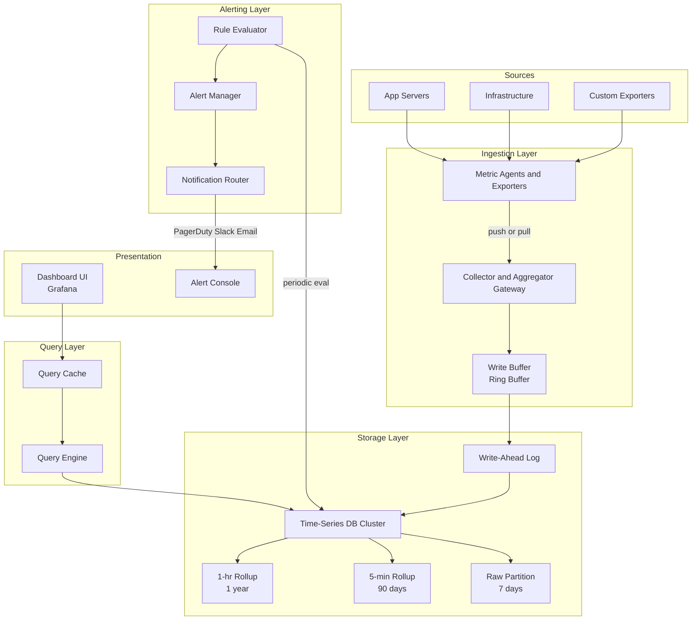
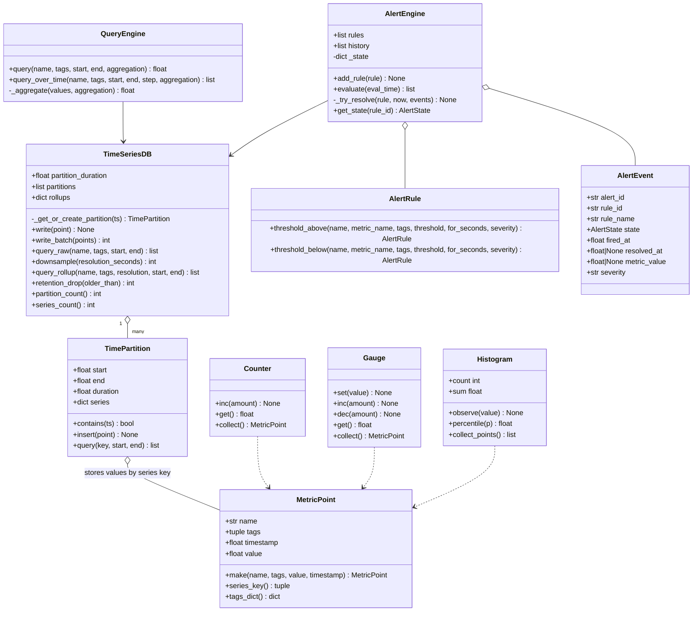
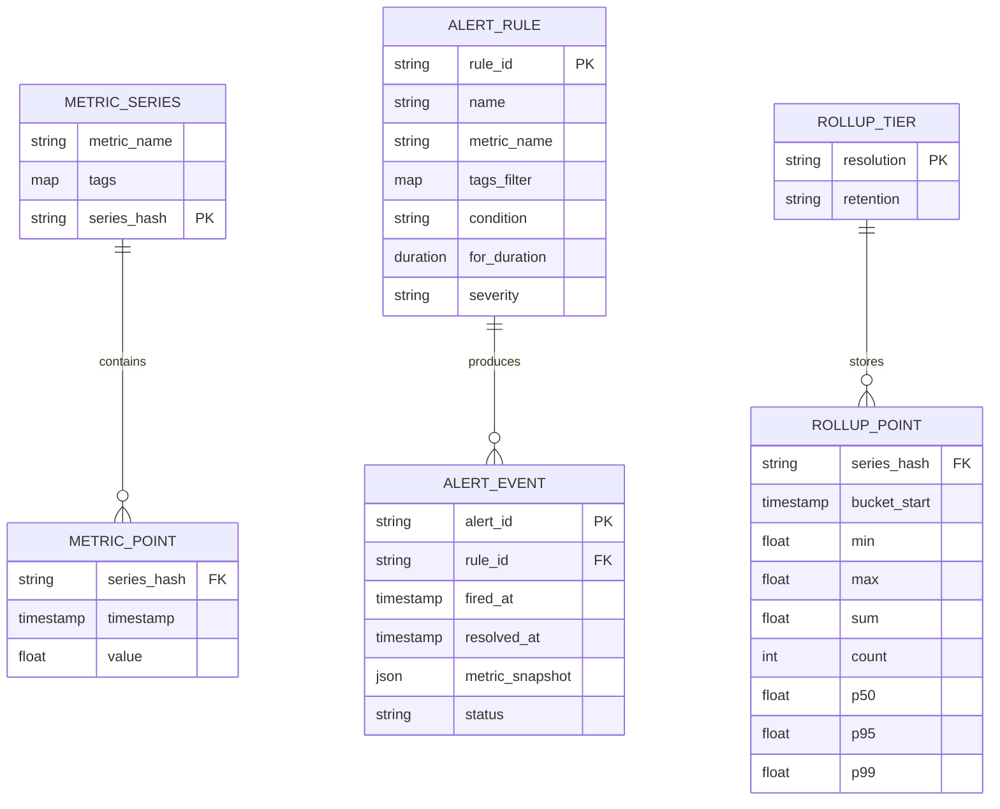
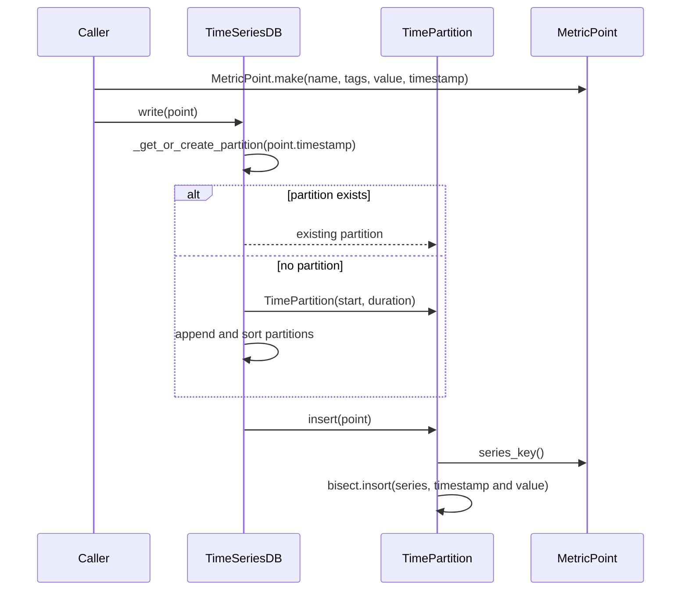
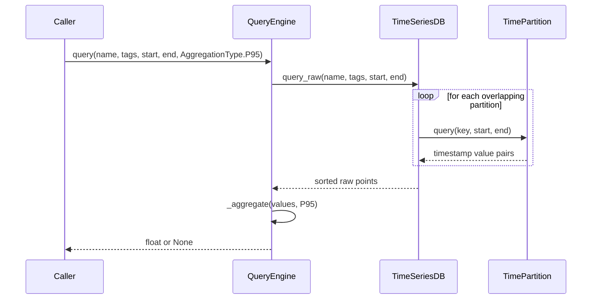
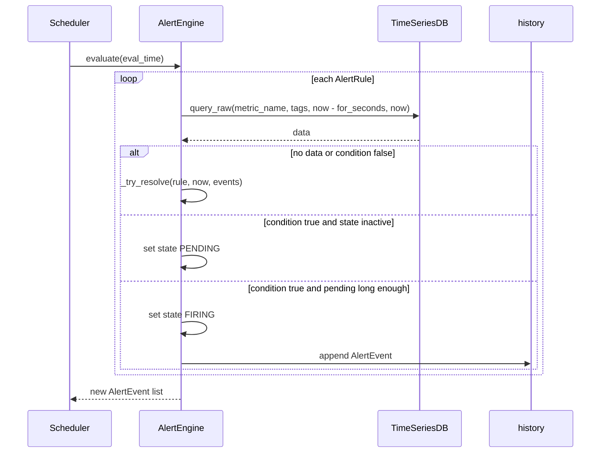

# Metrics & Monitoring System — Architecture

> **Scope of this document.** This is the consolidated architecture reference for
> the Metrics & Monitoring System. It preserves the production design from
> [`README.md`](./README.md) and maps it to the reference implementation in
> [`metrics_monitoring.py`](./metrics_monitoring.py), a single-process in-memory
> simulation. Sections tagged **[Design-only]** describe production concerns not
> present in the simulation; sections tagged **[Implemented]** map directly to
> code.

---

## 1. Problem Statement

Modern distributed systems generate vast amounts of operational data: CPU usage,
request latency, error rates, queue depths, and business KPIs. Engineers need a
centralized platform that **collects**, **stores**, **queries**, and **alerts** on
metrics in near real time so they can detect incidents before users are impacted
and make data-driven capacity decisions.

**Key challenges:**

| Challenge | Detail |
|---|---|
| **Volume** | Thousands of hosts each emitting hundreds of metric streams |
| **Velocity** | Millions of data points per second at peak |
| **Variety** | Counters, gauges, histograms, and summaries with different semantics |
| **Retention** | Raw data for days, downsampled data for months or years |
| **Freshness** | Alerts must fire within seconds of a threshold breach |

---

## 2. Requirements

### 2.1 Functional Requirements

| ID | Requirement | Description | Status |
|---|---|---|---|
| FR-1 | Metric collection | Ingest counters, gauges, and histograms. | ✅ Implemented (`Counter.collect`, `Gauge.collect`, `Histogram.collect_points`, `TimeSeriesDB.write`) |
| FR-2 | Time-series storage | Store metric name, tags, timestamp, and value. | ✅ Implemented (`MetricPoint`, `TimePartition`, `TimeSeriesDB`) |
| FR-3 | Query engine | Aggregations: avg, sum, min, max, count, p50, p95, p99. | ✅ Implemented (`QueryEngine.query`, `_aggregate`, `AggregationType`) |
| FR-4 | Downsampling | Roll up raw data to lower resolution tiers. | ⚠️ Partially implemented (`TimeSeriesDB.downsample`) stores average only per bucket |
| FR-5 | Alerting rules | Threshold-based rules with a pending/firing/resolved state machine. | ✅ Implemented (`AlertRule`, `AlertEngine.evaluate`) |
| FR-6 | Alert history | Record alert firing and resolution events. | ✅ Implemented (`AlertEngine.history`, `AlertEvent`) |
| FR-7 | Dashboards | UI/API for graphs and tables. | [Design-only] |
| FR-8 | Tag filtering | Filter by exact metric name and exact tag set. | ⚠️ Partially implemented (`query_raw` exact tags); arbitrary filtering/group-by is [Design-only] |
| FR-9 | Retention | Drop old partitions. | ✅ Implemented (`TimeSeriesDB.retention_drop`) for raw partitions only |

### 2.2 Non-Functional Requirements [Design-only targets]

| Attribute | Target |
|---|---|
| **Write Throughput** | 10 million data points/sec |
| **Query Latency** | < 1 second for recent dashboard queries |
| **Alerting Latency** | < 30 seconds from breach to notification |
| **Alerting Availability** | 99.9% |
| **Retention** | Raw 7 days, 5-min rollup 90 days, 1-hr rollup 1 year |
| **Durability** | No data loss for committed writes via replicated WAL |
| **Horizontal Scalability** | Linear scale-out for ingestion and query |

---

## 3. Capacity Estimation [Design-only]

### 3.1 Write Path

| Parameter | Value |
|---|---:|
| Hosts | 100,000 |
| Metrics per host | 200 |
| Scrape interval | 15 seconds |
| Data points/sec | 100,000 x 200 / 15 = ~1.3M/sec, burst to 10M/sec |
| Bytes per point | ~40 B |
| Raw write bandwidth | 10M x 40 B = **400 MB/sec** |

### 3.2 Storage

| Tier | Resolution | Retention | Size |
|---|---|---|---:|
| Raw | 15 s | 7 days | 400 MB/sec x 86,400 x 7 = **235 TB** before compression |
| 5-min rollup | 5 min | 90 days | ~4 TB |
| 1-hr rollup | 1 hr | 365 days | ~0.5 TB |
| **Total compressed 10x** | | | **~24 TB** |

### 3.3 Query Path

| Parameter | Value |
|---|---:|
| Dashboard queries/sec | 5,000 |
| Alert rule evaluations/sec | 50,000 |
| Average query fan-out | 3 TSDB shards |

---

## 4. High-Level Architecture [Design-only]



The production path uses a hybrid push/pull ingestion layer, a durable WAL,
time-partitioned TSDB storage, query fan-out with caching, and alert evaluation
with notification routing.

---

## 5. Reference Implementation Overview [Implemented]

The simulation implements the essential in-process mechanics: immutable metric
points, time partitions, exact tag-key lookups, rollups by average, typed metric
collectors, query aggregation, and threshold alert state transitions.



### 5.1 Component Deep-Dive (doc → code)

| Design concept | Implemented by | Notes |
|---|---|---|
| Metric point | `MetricPoint` | Frozen dataclass with sorted tuple tags for hashability. |
| Series identity | `MetricPoint.series_key()` | `(name, sorted_tags)`; exact tag set required. |
| Time partitioning | `TimePartition(start, duration)` | Stores `series: dict[tuple, list[tuple[float, float]]]` sorted by timestamp. |
| Raw storage | `TimeSeriesDB.partitions` | List of `TimePartition`; created by `_get_or_create_partition`. |
| Batch ingest | `TimeSeriesDB.write_batch` | Loops over `write`; no WAL or buffering. |
| Downsampling | `TimeSeriesDB.downsample` | Creates average rollup per bucket for a given resolution. |
| Retention | `TimeSeriesDB.retention_drop` | Drops raw partitions where `partition.end <= older_than`. |
| Metric types | `Counter`, `Gauge`, `Histogram` | Counter rejects negative increments; histogram emits sum/count/bucket points. |
| Query aggregation | `QueryEngine`, `AggregationType`, `_percentile` | Supports avg, sum, min, max, count, p50, p95, p99. |
| Alert rules | `AlertRule.threshold_above`, `threshold_below` | Build callable conditions with string descriptions. |
| Alert state machine | `AlertEngine._state`, `evaluate`, `_try_resolve` | `INACTIVE`, `PENDING`, `FIRING`, `RESOLVED`. |
| Demo | `main()` | Exercises collectors, writes, queries, downsampling, alerting, retention, and batch write speed. |

---

## 6. Data Model

### 6.1 Conceptual production model [Design-only]



### 6.2 As implemented [Implemented]

- `MetricPoint` contains `name`, `tags`, `timestamp`, and `value`.
- `TimePartition.series` maps a series key to sorted `(timestamp, value)` pairs.
- `TimeSeriesDB.rollups` maps `resolution_seconds` to series-key rollup lists.
- `AlertRule` stores a Python callable `condition`, not a parsed expression.
- `AlertEvent` stores one metric value and state, not a full metric snapshot JSON.

---

## 7. API Design

### 7.1 Production HTTP surface [Design-only]

**Write metrics**

```text
POST /api/v1/write
Content-Type: application/x-protobuf
```

```text
TimeSeries {
  repeated Sample {
    string metric_name
    map<string,string> tags
    int64 timestamp_ms
    double value
  }
}
```

**Query metrics**

```json
{
  "metric": "http_request_duration_seconds",
  "tags": {"service": "api-gateway", "region": "us-east-1"},
  "aggregation": "p95",
  "group_by": ["host"],
  "start": "2025-01-01T00:00:00Z",
  "end": "2025-01-01T01:00:00Z",
  "step": "5m"
}
```

**Alert rules**

```text
POST /api/v1/alerts/rules
GET  /api/v1/alerts/rules
GET  /api/v1/alerts/history?start=...&end=...
```

### 7.2 In-process API [Implemented]

| Method | Signature | Raises |
|---|---|---|
| `MetricPoint.make` | `(name: str, tags: dict[str, str], value: float, timestamp: float | None = None) -> MetricPoint` | — |
| `TimeSeriesDB.write` | `(point: MetricPoint) -> None` | — |
| `TimeSeriesDB.write_batch` | `(points: list[MetricPoint]) -> int` | — |
| `TimeSeriesDB.query_raw` | `(name: str, tags: dict[str, str], start: float, end: float) -> list[tuple[float, float]]` | — |
| `TimeSeriesDB.downsample` | `(resolution_seconds: int) -> int` | — |
| `TimeSeriesDB.query_rollup` | `(name: str, tags: dict[str, str], resolution: int, start: float, end: float) -> list[tuple[float, float]]` | — |
| `Counter.inc` | `(amount: float = 1.0) -> None` | `ValueError` for negative increments |
| `Histogram.observe` | `(value: float) -> None` | — |
| `QueryEngine.query` | `(name, tags, start, end, aggregation) -> float | None` | — |
| `QueryEngine.query_over_time` | `(name, tags, start, end, step, aggregation) -> list[tuple[float, float]]` | — |
| `AlertEngine.add_rule` | `(rule: AlertRule) -> None` | — |
| `AlertEngine.evaluate` | `(eval_time: float | None = None) -> list[AlertEvent]` | — |

---

## 8. Key Workflows [Implemented]

### 8.1 Write metric point to a time partition



### 8.2 Query with aggregation



### 8.3 Alert evaluation state machine



---

## 9. Detailed Component Design

### 9.1 Time-Series Storage Engine [Implemented]

The simulation uses time-based partitions. Each `TimePartition` owns a fixed
time window and stores sorted values per series key. Writes use `bisect.insort`
to keep each series sorted; queries use `bisect_left` and `bisect_right` to slice
within a time range.

**Production extension [Design-only]:** use an LSM-tree with an in-memory
MemTable, a replicated WAL, immutable SSTable-like time blocks, and background
compaction. Gorilla timestamp delta-of-delta and XOR float encoding can reduce
storage by about 12x.

### 9.2 Downsampling Pipeline

```text
Raw 15s -> 1-min rollup -> 5-min rollup -> 1-hr rollup -> 1-day rollup
```

| Rollup Tier | Input | Output Resolution | Trigger | Status |
|---|---|---|---|---|
| 1-min | Raw points | 1 minute | Streaming | ⚠️ Average-only via `downsample(60)` |
| 5-min | 1-min rollup | 5 minutes | Batch | [Design-only] |
| 1-hr | 5-min rollup | 1 hour | Batch | [Design-only] |
| 1-day | 1-hr rollup | 1 day | Batch | [Design-only] |

Production rollups store `min`, `max`, `sum`, `count`, `p50`, `p95`, and `p99`.
The current code stores only an average value per bucket.

### 9.3 Metric Types [Implemented]

- `Counter` is monotonically increasing and rejects negative increments.
- `Gauge` supports `set`, `inc`, and `dec`.
- `Histogram` tracks raw observed values, bucket counts, sum, count, and
  percentile calculations. `collect_points()` emits `_sum`, `_count`, and
  `_bucket` metrics with `le` tags.

### 9.4 Alert Evaluation Pipeline [Implemented]

`AlertEngine.evaluate()` queries the average value over `rule.for_seconds` and
applies the rule condition. The state flow is:

```text
INACTIVE -> PENDING -> FIRING -> RESOLVED
```

The implementation prevents immediate firing by requiring a second evaluation
after the pending duration. It records `AlertEvent` objects on firing and
resolution.

### 9.5 Push vs Pull Collection [Design-only]

| Approach | How It Works | Pros | Cons |
|---|---|---|---|
| **Pull** | Collector scrapes `/metrics` endpoints | Simple agents, collector controls rate | Requires service discovery |
| **Push** | Agents push to a collector gateway | Works for short-lived jobs | Gateway can be overloaded |
| **Hybrid** | Pull long-running services, push batch jobs | Best coverage | More complex ingestion |

---

## 10. Architectural Patterns [Design-only]

- **Time-Series Partitioning** — fixed blocks enable efficient range queries and
  simple retention.
- **Ring Buffer for Ingestion** — bounded buffer provides backpressure, batching,
  and decoupling between collector and storage.
- **Push/Pull Hybrid Ingestion** — pull stable services; push ephemeral jobs.
- **Rule-Based Alerting with State Machine** — prevents flapping and emits
  notifications only on state transitions.
- **Downsampling as Materialized Views** — pre-computed rollups reduce query scan
  size for long time ranges.

---

## 11. Technology Choices & Trade-offs [Design-only]

| Component | Option A | Option B | Option C | Recommendation |
|---|---|---|---|---|
| **TSDB** | Prometheus | InfluxDB | TimescaleDB | Prometheus for pull metrics + TimescaleDB for long-term storage |
| **Dashboard** | Grafana | Kibana | Custom | Grafana |
| **Alerting** | Alertmanager | PagerDuty native rules | Custom engine | Alertmanager + PagerDuty |
| **Message Bus** | Kafka | NATS | Redis Streams | Kafka for durable metric streaming |
| **Cache** | Redis | Memcached | In-process | Redis for query cache |
| **Compression** | Gorilla | LZ4 | Zstd | Gorilla for hot time series, Zstd for cold storage |

Prometheus excels at pull-based collection and short-term TSDB storage.
TimescaleDB provides SQL-based long-term storage with partitioning, compression,
and continuous aggregates.

---

## 12. Scaling, Reliability & Security [Design-only]

- **Sharding:** hash by metric name or series hash; query engine fans out to
  relevant shards.
- **Write batching:** collectors batch points, e.g. 1000 points or 1 second.
- **Read scaling:** dashboards use read replicas and query cache.
- **Tiered storage:** SSD for hot data, HDD for rollups, S3 for archives.
- **Cardinality limits:** reject or sample high-cardinality tag sets such as
  user IDs.
- **WAL replication:** sync to 2 replicas before ACK; replay on recovery.
- **Alert evaluator HA:** consistent hash ring assigns each rule to one evaluator
  with standby failover.
- **Security:** mTLS between agents and collectors, API keys for dashboard,
  RBAC, TLS 1.3, AES-256 at rest, tenant-id enforcement, and audit logging.
- **Meta-monitoring:** track ingest rate, write latency, query latency, alert
  evaluation lag, WAL size, dropped points, and compaction backlog.

---

## 13. Running the Simulation [Implemented]

```powershell
uv run --no-project python SystemDesign\MetricsMonitoring\metrics_monitoring.py
```

The demo exercises metric types, writes five minutes of CPU data, runs aggregate
and step queries, creates 1-minute rollups, evaluates alert rules, prints alert
history, drops old partitions, and benchmarks batch writes.

### Suggested tests

- `MetricPoint.make()` sorts tags and defaults timestamp.
- `Counter.inc(-1)` raises `ValueError`.
- `TimeSeriesDB.query_raw()` returns sorted points across partitions.
- `TimeSeriesDB.downsample()` creates expected average bucket values.
- `QueryEngine` returns correct avg, sum, min, max, count, and percentiles.
- `AlertEngine.evaluate()` transitions inactive → pending → firing → resolved.
- `retention_drop()` removes only partitions ending before the cutoff.

---

## 14. Future Improvements

- Add a WAL and recovery replay to make writes durable.
- Add query support for tag subset filtering and group-by.
- Store full rollup aggregates instead of average-only points.
- Add ingestion buffers and backpressure behavior.
- Add pluggable notification channels for alert events.
- Add tests with deterministic timestamps around alert pending windows.
- Add a lightweight HTTP layer for write, query, and alert-rule APIs.

