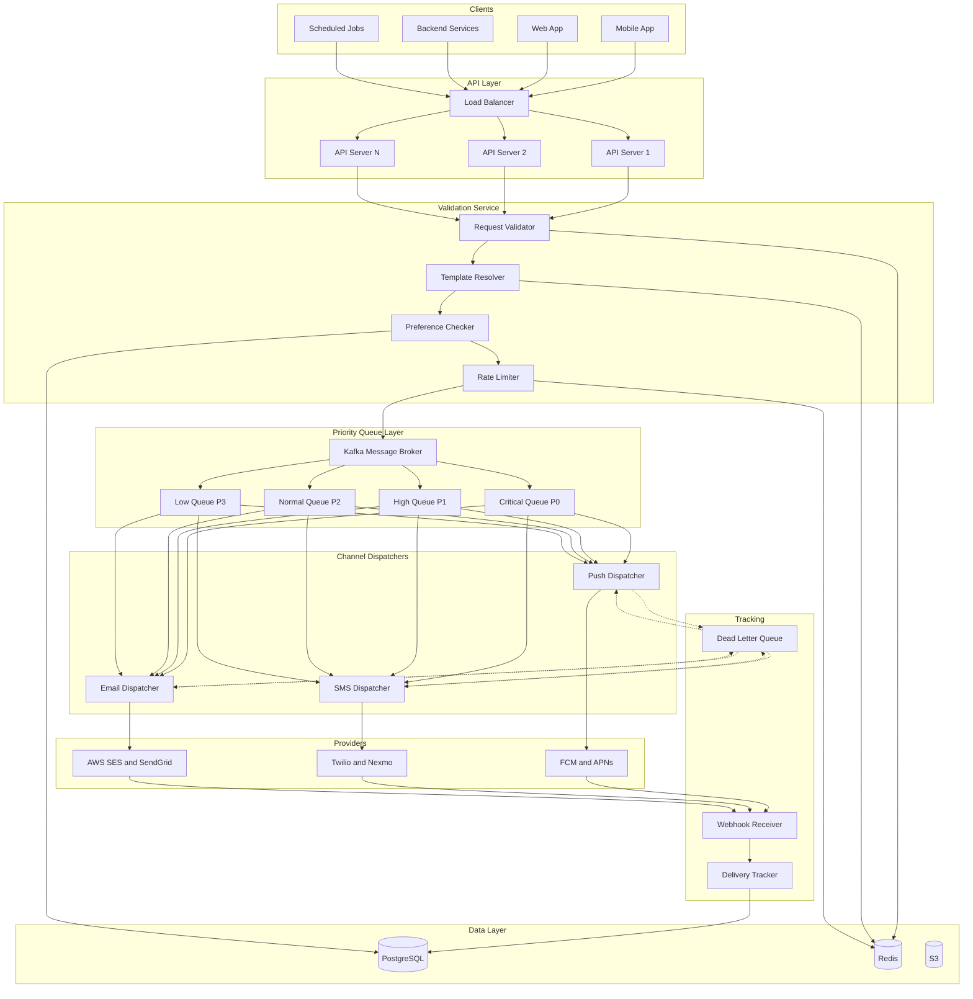
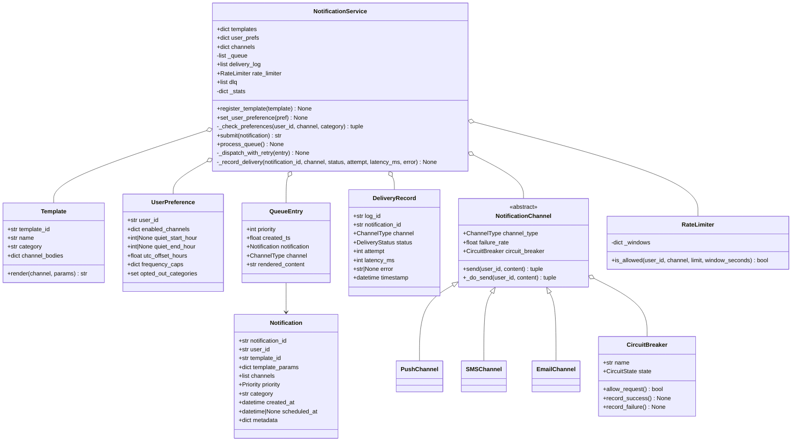
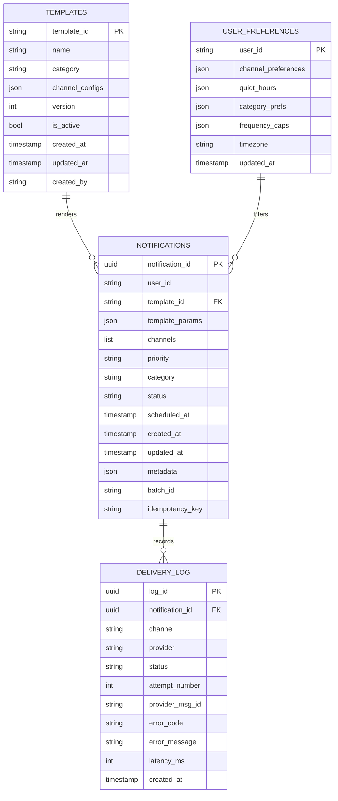
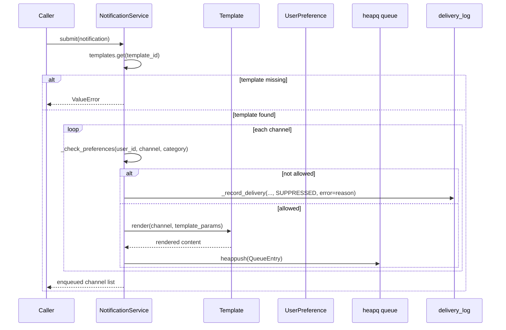
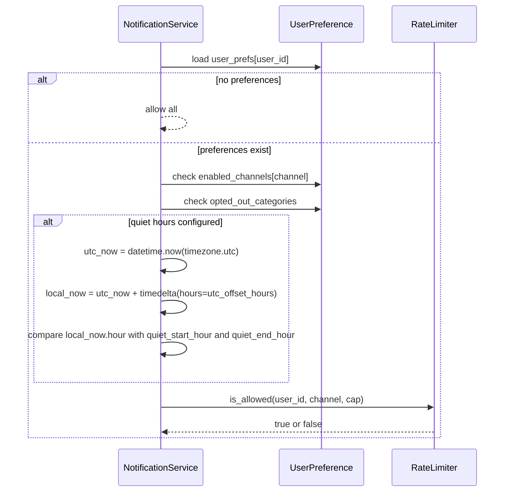
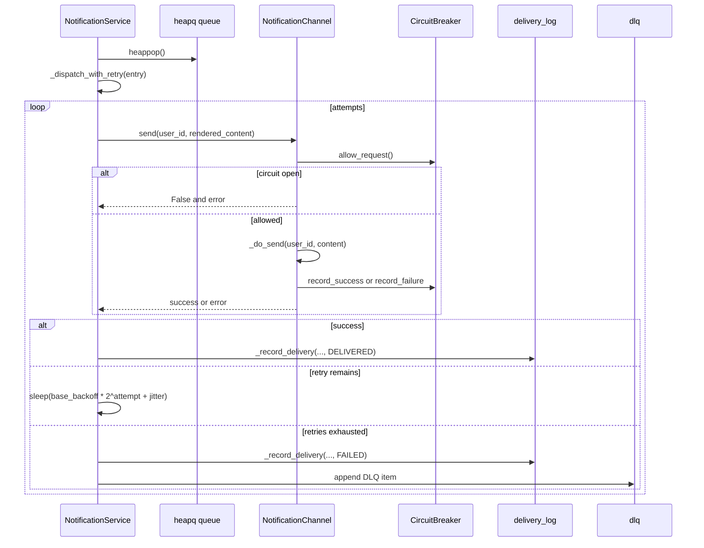

# Notification System — Architecture

> **Scope of this document.** This is the consolidated architecture reference for
> the Notification System. It preserves the production design from
> [`README.md`](./README.md) and maps it to the reference implementation in
> [`notification_system.py`](./notification_system.py), a single-process in-memory
> simulation. Sections tagged **[Design-only]** describe production concerns not
> present in the simulation; sections tagged **[Implemented]** map directly to
> code.

---

## 1. Problem Statement

Modern applications need a centralized, reliable notification system capable of
delivering messages across multiple channels: push notifications, SMS, and
email. The system must provide low latency, high throughput, user preferences,
message templates, scheduling, batch sends, priority-based delivery, delivery
tracking, retries, and compliance support while handling millions of
notifications per minute.

**Key challenges:**

- Delivering through heterogeneous channels with different protocols and SLAs.
- Guaranteeing at-least-once delivery without overwhelming users with duplicates.
- Supporting real-time and scheduled delivery modes.
- Scaling horizontally for campaigns and incident spikes.
- Respecting opt-outs, quiet hours, frequency caps, and regulations.

---

## 2. Requirements

### 2.1 Functional Requirements

| # | Requirement | Details | Status |
|---|---|---|---|
| FR-1 | Multi-channel delivery | Push, SMS, and email through a unified service. | ✅ Implemented (`PushChannel`, `SMSChannel`, `EmailChannel`, `NotificationService.channels`) |
| FR-2 | Template engine | Parameterized templates with variable substitution. | ✅ Implemented (`Template.render`) |
| FR-3 | User preferences | Channel opt-in/out, category opt-out, quiet hours, frequency caps. | ✅ Implemented (`UserPreference`, `NotificationService._check_preferences`) |
| FR-4 | Local quiet hours | Evaluate quiet hours in the user's local time. | ✅ Implemented via `UserPreference.utc_offset_hours` and `datetime.now(timezone.utc) + timedelta(...)` |
| FR-5 | Scheduling | Schedule notifications for future delivery. | ⚠️ Data field exists (`Notification.scheduled_at`), but scheduling queue is [Design-only] |
| FR-6 | Batch sends | Bulk delivery to user segments. | [Design-only] |
| FR-7 | Priority levels | Critical, high, normal, low. | ✅ Implemented (`Priority`, `QueueEntry`, `heapq`) |
| FR-8 | Delivery tracking | Queued, sent, delivered, failed, bounced, suppressed. | ✅ Implemented as delivery records; actual queued/sent/bounced transitions are mostly [Design-only] |
| FR-9 | Retry mechanism | Exponential backoff for transient failures. | ✅ Implemented (`NotificationService._dispatch_with_retry`) |
| FR-10 | Circuit breaker | Stop sending to unhealthy providers. | ✅ Implemented (`CircuitBreaker`, `NotificationChannel.send`) |
| FR-11 | Dead letter queue | Store permanently failed messages. | ✅ Implemented (`NotificationService.dlq`) |

### 2.2 Non-Functional Requirements [Design-only targets]

| Requirement | Target | Notes |
|---|---|---|
| **Throughput** | 1,000,000 notifications/min | Sustained, burst to 2M/min |
| **Real-time Latency** | < 30 seconds | API call to delivery attempt |
| **Availability** | 99.99% | ~52 minutes downtime/year |
| **Delivery Guarantee** | At-least-once | With deduplication at consumer |
| **Data Retention** | 90 days delivery logs | 1 year analytics |
| **Consistency** | Eventual | Across read replicas |
| **Fault Tolerance** | No single point of failure | Active-active regions |
| **Compliance** | GDPR, CAN-SPAM, TCPA | Opt-out within 24 hours |

### 2.3 SLA by Priority [Design-only targets]

| Priority | Max Latency | Retry Window | Max Retries |
|---|---:|---:|---:|
| Critical | 5 seconds | 1 hour | 10 |
| High | 15 seconds | 4 hours | 5 |
| Normal | 30 seconds | 24 hours | 3 |
| Low | 5 minutes | 48 hours | 2 |

The simulation uses smaller retry counts and very small backoff delays for a fast
demo: critical 5, high 3, normal 2, low 1 in `MAX_RETRIES_BY_PRIORITY`.

---

## 3. Capacity Estimation [Design-only]

### 3.1 Traffic Estimates

| Metric | Value |
|---|---:|
| Total users | 500 million |
| Daily active users | 100 million |
| Average notifications/user/day | 10 |
| **Total notifications/day** | **1 billion** |
| Peak QPS | ~17,000 |
| Average QPS | ~11,574 |

### 3.2 Per-Channel Breakdown

| Channel | % of Total | Notifications/Day | Peak QPS |
|---|---:|---:|---:|
| Push | 60% | 600M | 10,200 |
| Email | 30% | 300M | 5,100 |
| SMS | 10% | 100M | 1,700 |

### 3.3 Storage Estimates

| Data | Size per Record | Daily Volume | Daily Storage |
|---|---:|---:|---:|
| Notification record | ~500 B | 1B | ~500 GB |
| Delivery log entry | ~200 B | 1B | ~200 GB |
| Template | ~2 KB | 10K templates | ~20 MB |
| User preferences | ~500 B | 500M users | ~250 GB total |

### 3.4 Infrastructure

| Component | Estimate |
|---|---|
| **Message queue** | 50 Kafka brokers at 20K msgs/sec each |
| **API servers** | 100 instances at 200 RPS each |
| **Worker nodes** | 200 push, 100 email, 50 SMS |
| **Database** | Sharded across 20 nodes |
| **Cache** | 50 Redis nodes for preferences, templates, and rate limits |

---

## 4. High-Level Architecture [Design-only]



---

## 5. Reference Implementation Overview [Implemented]

The simulation runs the entire pipeline in one Python process: template
registration, preference checks, local-time quiet-hours evaluation, heap-backed
priority queueing, channel strategy dispatch, retry with jitter, circuit breaker
state transitions, delivery logging, and DLQ reporting.



### 5.1 Component Deep-Dive (doc → code)

| Design concept | Implemented by | Notes |
|---|---|---|
| Notification payload | `Notification` | Contains template, params, channels, priority, category, schedule field, and metadata. |
| Template rendering | `Template.render(channel, params)` | Simple `{{key}}` string replacement by channel. |
| User preferences | `UserPreference` | Stores channel enables, category opt-outs, frequency caps, quiet hours, and `utc_offset_hours`. |
| Local quiet-hours evaluation | `NotificationService._check_preferences` | Uses UTC now plus `timedelta(hours=pref.utc_offset_hours)` to get local hour. |
| Frequency caps | `RateLimiter.is_allowed` | Sliding timestamp window per `(user_id, channel)`, default 1 hour. |
| Priority queue | `QueueEntry(order=True)` and `heapq` | Lower numeric priority is dequeued first: critical 0 through low 3. |
| Channel Strategy | `NotificationChannel`, `PushChannel`, `SMSChannel`, `EmailChannel` | Common `send()` wraps `_do_send()` and circuit breaker. |
| Circuit breaker | `CircuitBreaker.allow_request`, `record_success`, `record_failure` | States: closed, open, half-open. |
| Retry and backoff | `NotificationService._dispatch_with_retry` | Priority-specific retry count and base delay with jitter. |
| Delivery log | `DeliveryRecord`, `NotificationService.delivery_log` | Records delivered, failed, and suppressed outcomes. |
| Dead letter queue | `NotificationService.dlq` | Failed after final attempt appends a dict with notification id, channel, error, attempts. |
| Demo | `main()` | Registers templates/preferences, submits notifications, processes queue, prints reports. |

---

## 6. Data Model

### 6.1 Conceptual production schema [Design-only]



**Indexes [Design-only]:**

- `notifications(user_id, created_at DESC)`
- `notifications(status, priority, created_at)`
- `notifications(scheduled_at) WHERE status = 'pending'`
- `notifications(batch_id) WHERE batch_id IS NOT NULL`
- `templates(category, is_active)`
- `delivery_log(notification_id)`, `delivery_log(status, created_at)`,
  `delivery_log(channel, status, created_at)`

### 6.2 As implemented [Implemented]

- `Template` objects are stored in `NotificationService.templates`.
- `UserPreference` objects are stored in `NotificationService.user_prefs`.
- `Notification` objects are embedded in `QueueEntry` items in `_queue`.
- `DeliveryRecord` objects are appended to `delivery_log`.
- DLQ entries are plain dictionaries in `NotificationService.dlq`.
- There is no PostgreSQL, Redis, S3, provider webhook table, idempotency key, or
  batch progress table in code.

---

## 7. API Design

### 7.1 Production HTTP surface [Design-only]

**Send Notification**

```text
POST /api/v1/notifications
```

```json
{
  "notification_id": "uuid-v4",
  "user_id": "user_12345",
  "template_id": "welcome_v2",
  "template_params": {
    "user_name": "Alice",
    "action_url": "https://app.example.com/verify"
  },
  "channels": ["push", "email"],
  "priority": "high",
  "category": "transactional",
  "scheduled_at": null,
  "metadata": {"campaign_id": "onboarding_2024"}
}
```

**Other production endpoints [Design-only]:**

```text
POST /api/v1/notifications/batch
GET  /api/v1/notifications/{notification_id}
PUT  /api/v1/users/{user_id}/preferences
POST /api/v1/templates
GET  /api/v1/templates/{template_id}
PUT  /api/v1/templates/{template_id}
```

### 7.2 In-process API [Implemented]

| Method | Signature | Raises |
|---|---|---|
| `Template.render` | `(channel: ChannelType, params: dict[str, str]) -> str` | — |
| `NotificationService.register_template` | `(template: Template) -> None` | — |
| `NotificationService.set_user_preference` | `(pref: UserPreference) -> None` | — |
| `NotificationService.submit` | `(notification: Notification) -> str` | `ValueError` if template id is missing |
| `NotificationService.process_queue` | `() -> None` | — |
| `RateLimiter.is_allowed` | `(user_id: str, channel: ChannelType, limit: int, window_seconds: float = 3600.0) -> bool` | — |
| `NotificationChannel.send` | `(user_id: str, content: str) -> tuple[bool, str | None]` | — |
| `CircuitBreaker.allow_request` | `() -> bool` | — |

---

## 8. Key Workflows [Implemented]

### 8.1 Submit notification



### 8.2 Preference check with local quiet hours



### 8.3 Dispatch with retry and circuit breaker



---

## 9. Detailed Component Design

### 9.1 Priority Handling

**Production [Design-only]:** use separate Kafka topics per priority:

```text
notifications.critical -> 50 partitions, immediate poll
notifications.high     -> 30 partitions, 100 ms poll
notifications.normal   -> 20 partitions, 500 ms poll
notifications.low      -> 10 partitions, 2 s poll
```

**Implementation [Implemented]:** `Priority` is an `IntEnum` where smaller
values have higher priority. `QueueEntry(order=True)` sorts first by priority and
then `created_ts`, and `NotificationService` uses `heapq`.

### 9.2 Rate Limiting and Quiet Hours

**Production [Design-only]:** API-level token bucket plus per-user per-channel
sliding windows in Redis.

**Implementation [Implemented]:** `RateLimiter.is_allowed()` keeps
`_windows[(user_id, channel)]` timestamp lists and prunes entries older than the
window. Quiet-hours logic is implemented in `NotificationService._check_preferences`:
it takes `datetime.now(timezone.utc)`, adds `UserPreference.utc_offset_hours`, and
compares the resulting local hour to `quiet_start_hour` and `quiet_end_hour`.
This means quiet hours are evaluated in the user's local time, not UTC.

### 9.3 Template Rendering

**Production [Design-only]:** Mustache-style templates with local cache, Redis
cache, PostgreSQL source of truth, HTML escaping, SMS truncation, and versioning.

**Implementation [Implemented]:** `Template.render()` performs straightforward
string replacement for `{{variable}}` tokens in the channel-specific body.

### 9.4 Retry with Exponential Backoff [Implemented]

The code computes:

```text
delay = base_backoff * (2 ** (attempt - 1))
jitter = random.uniform(0, delay * 0.5)
```

After all attempts fail, `_record_delivery(..., DeliveryStatus.FAILED, ...)` is
called and a DLQ dictionary is appended.

### 9.5 Circuit Breaker [Implemented]

`CircuitBreaker` supports `CLOSED`, `OPEN`, and `HALF_OPEN`. Failures increment
`failure_count`; reaching `failure_threshold` opens the circuit. After
`recovery_timeout`, `allow_request()` transitions to half-open. Enough successes
close the circuit again.

---

## 10. Architectural Patterns [Design-only]

- **Publisher/Subscriber** — API servers publish notification events; channel
  dispatchers consume independently.
- **Strategy Pattern** — `NotificationChannel` allows push, SMS, and email
  implementations to share a common `send()` contract.
- **Template Method Pipeline** — validation, preferences, rendering, queueing,
  dispatch, and tracking happen in a fixed order.
- **Circuit Breaker** — provider calls fail fast when a provider is unhealthy.
- **Priority Queue** — urgent notifications bypass lower-priority backlog.
- **Dead Letter Queue** — permanently failed messages are isolated for review.

---

## 11. Technology Choices & Trade-offs [Design-only]

### 11.1 Message Broker

| Factor | Kafka | RabbitMQ |
|---|---|---|
| Throughput | Millions/sec | ~50K/sec |
| Message replay | Yes | No |
| Ordering | Per-partition | Per-queue |
| Consumer groups | Built in | Plugin |
| **Verdict** | **Selected** | Better for low-latency RPC |

### 11.2 Providers

| Channel | Primary | Fallback | Notes |
|---|---|---|---|
| Push | FCM and APNs | Platform dependent | FCM for Android/Web, APNs for Apple |
| SMS | Twilio | Nexmo/Vonage | Global reach and webhooks |
| Email | AWS SES | SendGrid | Lower cost at scale |

### 11.3 Database and Cache

- **PostgreSQL:** notifications, templates, preferences, JSONB support.
- **Redis:** rate limits, template cache, preference cache, dedup keys.
- **S3:** email assets, attachments, delivery-log archives.

---

## 12. Scaling, Reliability & Security [Design-only]

### Scaling

| Component | Mechanism | Trigger |
|---|---|---|
| API Servers | Auto-scale pods | CPU > 70% |
| Kafka Partitions | Add partitions | Consumer lag > 10K |
| Push Dispatchers | Scale consumers | Queue depth > 5K |
| SMS Dispatchers | Scale consumers | Queue depth > 1K |
| Email Dispatchers | Scale consumers | Queue depth > 10K |
| PostgreSQL | Read replicas and sharding | QPS > 50K |
| Redis | Cluster mode | Memory > 75% |

Notifications are sharded by `user_id` with consistent hashing so all
notifications for a user are colocated. Large batches are split into
micro-batches of 1000 users and distributed across workers.

### Reliability

- **Deduplication:** idempotency key at API level and message-level dedup per
  notification/channel.
- **Provider idempotency:** FCM message IDs, Twilio idempotency headers, SES
  deduplication IDs.
- **DLQ processing:** automatic retries every 6 hours, manual dashboard, and
  alerts on depth.
- **Failure recovery:** load balancer reroutes API crashes; Kafka replication
  handles broker failures; circuit breakers protect provider outages; database
  failover and queues buffer writes; Redis failure degrades rate limiting.

### Security and Compliance

- OAuth 2.0 bearer tokens, mTLS for service-to-service calls, API keys with
  channel restrictions.
- TLS 1.3 in transit and AES-256 at rest.
- Application-level encryption for phone and email; logs mask PII.
- GDPR erasure, CAN-SPAM unsubscribe, TCPA SMS consent, SOC 2 audit trail.
- Abuse prevention through rate limits, content scanning, anomaly detection, and
  admin IP allowlists.

### Monitoring

Track notifications sent/min, p50/p95/p99 latency, delivery rate by channel,
failed deliveries, queue depth by priority, DLQ depth, provider latency, circuit
breaker state, suppression reasons, opt-out trends, batch progress, and
OpenTelemetry traces.

---

## 13. Running the Simulation [Implemented]

```powershell
uv run --no-project python SystemDesign\NotificationSystem\notification_system.py
```

The demo registers three templates, creates preferences for Alice, Bob, and
Charlie, submits critical/high/normal/low notifications, suppresses Bob's SMS
and marketing promo, applies Charlie's push frequency cap, processes the queue,
prints delivery stats, prints the DLQ, and displays circuit breaker state.

### Suggested tests

- `Template.render()` replaces known variables and leaves unknown placeholders as-is.
- Missing template in `NotificationService.submit()` raises `ValueError`.
- Channel opt-out records `DeliveryStatus.SUPPRESSED`.
- Category opt-out suppresses matching notifications.
- Quiet hours are evaluated with `utc_offset_hours` local time, including
  windows crossing midnight.
- Frequency caps deny after the configured number within the window.
- Priority queue dispatches critical before high, normal, and low.
- Circuit breaker opens after threshold failures and half-opens after timeout.
- Exhausted retries create a failed `DeliveryRecord` and a DLQ item.

---

## 14. Future Improvements

- Implement real scheduling using `Notification.scheduled_at`.
- Add idempotency keys and deduplication for repeat submits and redeliveries.
- Add batch send and segment resolution.
- Add provider abstraction with real FCM, Twilio, and SES clients behind safe
  test doubles.
- Add persistent repositories for templates, preferences, notifications, and
  delivery logs.
- Add async worker pools so slow channels do not block each other.
- Add tests around local quiet-hours boundaries and half-hour offsets.
- Add metrics and tracing for every notification lifecycle stage.

