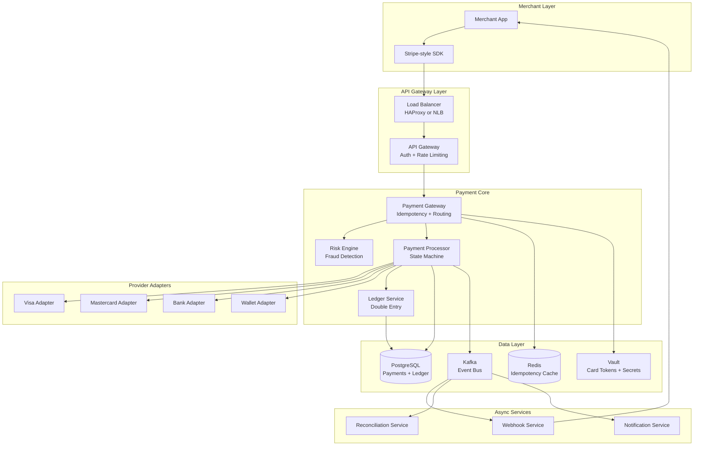
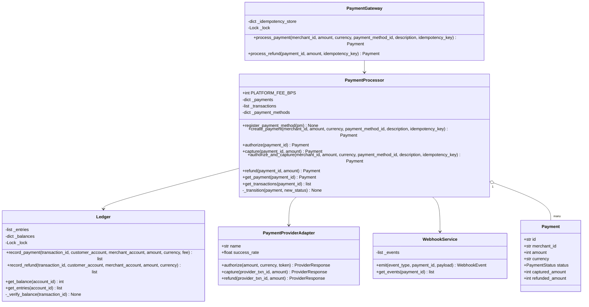
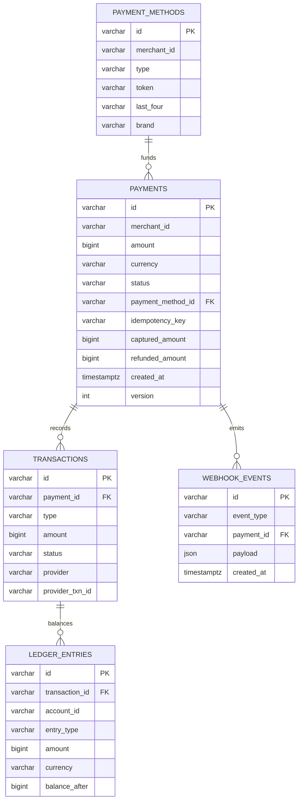
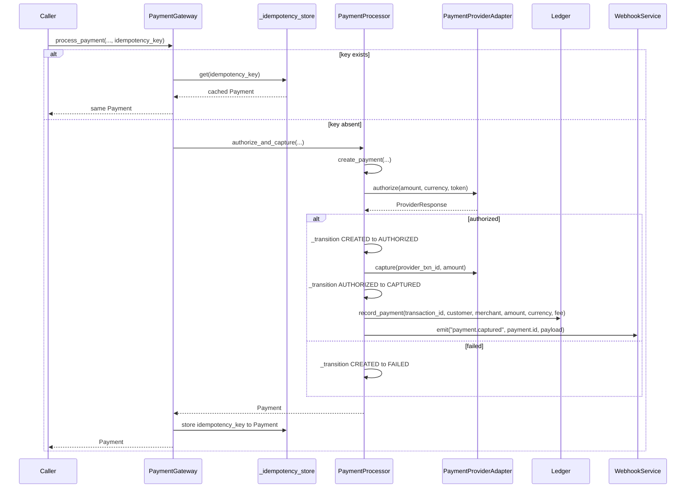
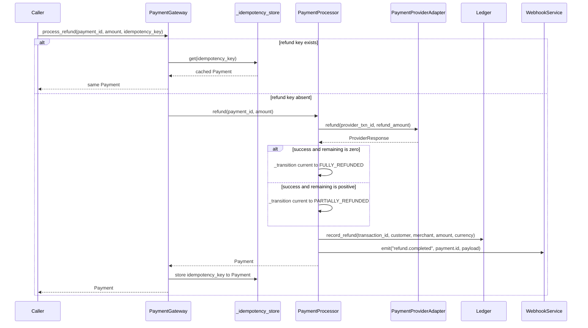

# Payment System (Stripe-like) — Architecture

> **Scope of this document.** This is the consolidated architecture reference for the Payment System. It preserves the original system-design README content and maps it to [`payment_system.py`](./payment_system.py), a single-process, in-memory simulation. Sections tagged **[Design-only]** describe production concerns not present in the simulation; sections tagged **[Implemented]** map directly to code. Where the design and code differ, the gap is called out explicitly.

---

## 1. Problem Statement

Design a payment processing platform similar to Stripe that enables merchants to accept online payments securely and reliably. The system must handle the full payment lifecycle: authorization, capture, settlement, and refunds. It must guarantee exactly-once payment processing, maintain a consistent financial ledger, and integrate with multiple external payment providers such as card networks, banks, and digital wallets while abstracting away their complexity behind a unified API.

Key challenges:

- **Financial correctness:** every cent must be accounted for; no money can be created or lost.
- **Idempotency:** network retries must never result in duplicate charges.
- **Reliability:** payment failures must be handled gracefully with clear state transitions.
- **Compliance:** PCI-DSS requirements demand strict data handling and audit trails.
- **Multi-provider routing:** intelligent routing across payment processors for cost and reliability.

The Python implementation focuses on the core mechanics: idempotent gateway calls, provider authorization/capture/refund simulation, a payment state machine, double-entry ledger entries, and webhook event collection.

---

## 2. Requirements

### 2.1 Functional Requirements

| ID | Requirement | Details | Status |
|----|-------------|---------|--------|
| FR-1 | **Process payments** | Accept amount, currency, payment method, and merchant context. Support authorize-only and authorize+capture flows. | ✅ Implemented in-process via `PaymentGateway.process_payment()` for authorize+capture and `PaymentProcessor.create_payment()`, `authorize()`, `capture()` for auth-only. |
| FR-2 | **Refunds** | Full and partial refunds with idempotency; update original payment and ledger. | ✅ Implemented via `PaymentGateway.process_refund()` and `PaymentProcessor.refund()`. |
| FR-3 | **Idempotent requests** | Mutating calls accept an idempotency key and return cached result on retry. | ✅ Implemented. `process_payment()` and `process_refund()` check `_idempotency_store` before executing and cache the returned `Payment`. |
| FR-4 | **Payment methods** | Support credit/debit cards, ACH, and wallets through tokenized references. | ⚠️ Partially implemented. `PaymentMethod.create()` creates tokenized method records with `method_type`, but provider behavior is generic and card/bank/wallet differences are **[Design-only]**. |
| FR-5 | **Transaction history** | Query payment events per merchant with filters. | ⚠️ Partially implemented. `PaymentProcessor.get_transactions(payment_id)` returns transactions for one payment only; merchant/date/status filtering is **[Design-only]**. |
| FR-6 | **Webhooks** | Notify merchants of payment and refund events with retry logic. | ⚠️ Partially implemented. `WebhookService.emit()` stores `WebhookEvent` objects; endpoint registration, signatures, delivery, and retries are **[Design-only]**. |
| FR-7 | **Payment state machine** | Enforce transitions such as `CREATED -> AUTHORIZED -> CAPTURED` and refund states. | ✅ Implemented for payment statuses through `VALID_TRANSITIONS` and `PaymentProcessor._transition()`. Separate refund entity states like `REFUND_INITIATED` are **[Design-only]**. |
| FR-8 | **Reconciliation** | Daily reconciliation with external settlement reports. | ❌ **[Design-only]**. No reconciliation job or settlement-file ingestion exists in code. |

### 2.2 Non-Functional Requirements [Design-only targets]

| ID | Requirement | Target |
|----|-------------|--------|
| NFR-1 | **Exactly-once processing** | Idempotency keys plus transactional outbox ensure no duplicate charges under retries and crashes. |
| NFR-2 | **Latency** | p99 < 500 ms for payment authorization, excluding provider latency. |
| NFR-3 | **Availability** | 99.999% uptime for the critical payment path, about 5.26 minutes downtime per year. |
| NFR-4 | **PCI compliance** | PCI-DSS Level 1: tokenize card data, encrypt at rest and in transit, restrict access, maintain audit logs. |
| NFR-5 | **Consistency** | Strong consistency for payment state transitions and ledger entries, ideally serializable isolation. |
| NFR-6 | **Durability** | Zero data loss for financial transactions through WAL and synchronous replication. |
| NFR-7 | **Throughput** | Handle 10,000+ transactions per second at peak. |
| NFR-8 | **Auditability** | Immutable append-only audit log for every state change. |

---

## 3. Capacity Estimation [Design-only]

### 3.1 Transaction Volume

| Metric | Value |
|--------|-------|
| Average TPS | 3,000 |
| Peak TPS | 10,000 |
| Daily transactions | ~260 million |
| Monthly transactions | ~7.8 billion |

### 3.2 Storage Estimation

| Data | Size per record | Daily volume | Daily storage |
|------|-----------------|--------------|---------------|
| Payment records | ~1 KB | 260M | ~250 GB |
| Ledger entries | ~500 B, 2+ per transaction | 520M | ~250 GB |
| Audit log entries | ~300 B | 1B+ | ~300 GB |
| Webhook delivery logs | ~200 B | 520M | ~100 GB |
| **Total daily** | | | **~900 GB** |

### 3.3 Reconciliation Volume

- Daily: ~260M transactions to reconcile across providers.
- Batch window: 2-4 hours off-peak.
- Discrepancy rate target: < 0.001%.

### 3.4 Network Bandwidth

- Inbound API requests: ~50 MB/s average, ~170 MB/s peak.
- Outbound webhooks: ~30 MB/s average.
- Provider API calls: ~40 MB/s average.

---

## 4. High-Level Architecture [Design-only]



The production design separates a latency-sensitive payment path from asynchronous webhooks, reconciliation, and notifications. The simulation collapses these tiers into in-memory objects while preserving the central domain rules.

---

## 5. Reference Implementation Overview [Implemented]

`payment_system.py` is a standard-library simulation. The gateway stores idempotency results in a dict, the processor keeps payments and transactions in memory, the ledger keeps append-only entries and running balances, the provider adapter simulates external calls, and the webhook service collects events.



### 5.1 Component Deep-Dive (doc → code)

| Design concept | Implemented by | Notes |
|----------------|----------------|-------|
| API gateway and idempotency | `PaymentGateway`, `_idempotency_store`, `_lock` | Both `process_payment()` and `process_refund()` check the store before processing and cache the result after processing. |
| Payment lifecycle | `PaymentProcessor`, `PaymentStatus`, `VALID_TRANSITIONS`, `_transition()` | Invalid state changes raise `ValueError`. |
| Provider abstraction | `PaymentProviderAdapter`, `ProviderResponse`, `call_provider_with_retry()` | One generic adapter simulates card-network behavior; provider routing is design-only. |
| Double-entry ledger | `Ledger.record_payment()`, `Ledger.record_refund()`, `Ledger._verify_balance()` | Creates debit and credit entries and validates equal totals by transaction. |
| Payment methods | `PaymentMethod.create()`, `_payment_methods` | Token-like IDs are generated; no raw card data is stored. |
| Transaction history | `Transaction`, `_transactions`, `get_transactions(payment_id)` | In-memory per-payment list, no merchant-level index. |
| Webhook events | `WebhookService.emit()`, `WebhookEvent` | Stores events only; no network delivery. |
| Demo workflow | `run_demo()` | Exercises payment, idempotency, refunds, balances, events, invalid capture, and a second payment. |

---

## 6. Data Model

### 6.1 Conceptual production schema [Design-only]



### 6.2 README schema preserved [Design-only]

The production README defines `payments`, `payment_methods`, `transactions`, `ledger_entries`, `webhook_endpoints`, and `webhook_deliveries`. The intended indexes are `idx_payments_merchant`, `idx_payments_idempotency`, `idx_payments_status`, `idx_transactions_payment`, `idx_ledger_account`, and `idx_deliveries_retry`. The ledger invariant is `SUM(debits) == SUM(credits)` per `transaction_id`.

### 6.3 As implemented [Implemented]

The schema is represented by dataclasses: `Payment`, `PaymentMethod`, `Transaction`, `LedgerEntry`, and `WebhookEvent`. `PaymentProcessor._payments`, `PaymentProcessor._transactions`, `PaymentProcessor._payment_methods`, `Ledger._entries`, `Ledger._balances`, and `WebhookService._events` act as the in-memory tables. There is no durable database, no secondary indexes, no webhook endpoint table, and no outbox table.

---

## 7. API Design

### 7.1 Production HTTP surface [Design-only]

| Method & Path | Purpose | Success |
|---------------|---------|---------|
| `POST /v1/payments` | Create payment with `Idempotency-Key`, `amount`, `currency`, `payment_method_id`, `capture`, `description`, and metadata. | `200 OK` with payment object. |
| `POST /v1/payments/{payment_id}/capture` | Capture an auth-only payment, optionally for a lower amount. | `200 OK`. |
| `POST /v1/refunds` | Create full or partial refund with idempotency key. | `200 OK` with refund object. |
| `GET /v1/payments?status=...&created_gte=...&limit=...` | List transaction history. | `200 OK` with paginated data. |
| `POST /v1/webhooks` | Register merchant webhook URL and subscribed events. | `201 Created`. |

### 7.2 In-process API [Implemented]

| Method | Signature | Raises / behavior |
|--------|-----------|-------------------|
| `PaymentMethod.create` | `(method_type: str, last_four: str, brand: str) -> PaymentMethod` | Generates `pm_...` ID and `tok_...` token. |
| `PaymentProcessor.register_payment_method` | `(pm: PaymentMethod) -> None` | Stores method by ID. |
| `PaymentGateway.process_payment` | `(merchant_id, amount, currency, payment_method_id, description="", idempotency_key=None) -> Payment` | Returns cached payment if key exists; otherwise creates, authorizes, captures. |
| `PaymentGateway.process_refund` | `(payment_id, amount=None, idempotency_key=None) -> Payment` | Returns cached refund result if key exists; otherwise delegates to `refund()`. |
| `PaymentProcessor.authorize` | `(payment_id: str) -> Payment` | May transition to `AUTHORIZED` or `FAILED`. |
| `PaymentProcessor.capture` | `(payment_id: str, amount: int | None = None) -> Payment` | Raises `ValueError` if no successful authorization or invalid transition. |
| `PaymentProcessor.refund` | `(payment_id: str, amount: int | None = None) -> Payment` | Raises `ValueError` for invalid amounts or missing capture. |
| `Ledger.get_entries` | `(account_id: str | None = None) -> list[LedgerEntry]` | Returns append-only ledger entries. |
| `WebhookService.get_events` | `(payment_id: str | None = None) -> list[WebhookEvent]` | Returns stored events. |

---

## 8. Key Workflows [Implemented]

### 8.1 Idempotent authorize and capture



### 8.2 Idempotent refund



---

## 9. Detailed Component Design

### 9.1 Gateway idempotency [Implemented]

`PaymentGateway` is the entry point for mutating operations. It uses a thread lock around `_idempotency_store` lookups and writes. This is a real implementation of idempotency in the reference code. It is in-memory only, so it does not survive process restart and does not store a request fingerprint; those durability and conflict semantics are **[Design-only]**.

### 9.2 Payment state machine [Implemented]

`PaymentStatus` defines `CREATED`, `AUTHORIZED`, `CAPTURED`, `SETTLED`, `FAILED`, `PARTIALLY_REFUNDED`, and `FULLY_REFUNDED`. `VALID_TRANSITIONS` allows created payments to authorize or fail, authorized payments to capture or fail, captured/settled payments to partially refund, and partially refunded payments to continue refunding or fully refund. `PaymentProcessor._transition()` enforces this map and increments `Payment.version`. The code never automatically transitions to `SETTLED`; settlement and provider settlement reports are **[Design-only]**.

### 9.3 Double-entry ledger [Implemented]

`Ledger.record_payment()` debits a customer account and credits the merchant account, with an optional `platform:fees` credit. `Ledger.record_refund()` reverses the flow by debiting the merchant and crediting the customer. `_verify_balance()` checks all entries for the transaction ID and raises if debits and credits differ.

### 9.4 Provider adapter and retry [Implemented]

`PaymentProviderAdapter` exposes `authorize()`, `capture()`, and `refund()`. `call_provider_with_retry()` calls the requested operation with up to three attempts, returning immediately on success or hard decline (`card_declined`) and sleeping briefly with jitter between attempts. Multi-provider routing, circuit breakers, and provider-specific adapters are **[Design-only]**.

### 9.5 Webhooks [Implemented core, Design-only delivery]

`WebhookService.emit()` creates `WebhookEvent` records for `payment.captured` and `refund.completed`. It does not sign payloads, call merchant URLs, persist delivery attempts, or retry failed deliveries.

### 9.6 Reconciliation [Design-only]

The intended daily batch flow is: pull settlement files, match provider transactions to internal `Transaction` and `LedgerEntry` records, categorize missing or mismatched records, auto-resolve timing differences, and produce exception reports. No corresponding class exists in the simulation.

---

## 10. Architectural Patterns [Design-only]

- **Double-entry bookkeeping:** every financial movement creates balanced debit and credit entries. Corrections should use reversing entries rather than mutation.
- **Saga pattern:** payment processing spans risk checks, provider authorization, ledger writes, and events. Production needs compensating actions such as voiding an authorization if ledger persistence fails.
- **Idempotency pattern:** clients provide an idempotency key; repeated identical requests return the stored result. The simulation implements this in memory; production stores it in Redis and the database.
- **State machine pattern:** strict transitions prevent illegal operations such as capturing before authorization.
- **Adapter pattern:** production provider adapters implement a common port for Visa, Mastercard, ACH, wallets, and failover providers.
- **Transactional outbox:** database writes and event publishes should be atomically recorded by writing an outbox row in the same transaction and relaying it to Kafka later.

---

## 11. Technology Choices & Trade-offs [Design-only]

| Component | Technology | Rationale |
|-----------|------------|-----------|
| Primary database | PostgreSQL | ACID guarantees, serializable isolation, JSONB metadata, mature replication. |
| Event bus | Apache Kafka | Durable ordered streaming, replay, exactly-once features for reconciliation. |
| Idempotency cache | Redis Cluster | Sub-millisecond reads, TTL support, distributed locking or processing sentinels. |
| Secrets management | HashiCorp Vault | Card token storage, encryption key management, dynamic credentials. |
| API gateway | Kong or Envoy | Rate limiting, authentication, request routing, TLS termination. |
| Container orchestration | Kubernetes | Auto-scaling, rolling deployments, zero-downtime changes. |
| Monitoring | Prometheus + Grafana | Real-time metrics and alerting on success rates. |
| Tracing | Jaeger / OpenTelemetry | End-to-end latency analysis. |
| Log aggregation | ELK Stack | Centralized logs with PCI-compliant field masking. |

---

## 12. Scaling, Reliability & Security [Design-only]

- **Horizontal scaling:** keep gateway, risk engine, webhook workers, and provider adapters stateless; shard payment tables by `merchant_id` with read replicas for dashboards.
- **Read/write separation:** write path goes to primaries; dashboard reads go to replicas; ledger balance reads use strong consistency.
- **Caching strategy:** in-process short TTL cache for payment method metadata, Redis for idempotency/rate limits/session data, no caching for authoritative payment status.
- **Failure handling:** per-provider circuit breaker, primary-to-secondary routing, bounded timeout budgets, dead-letter queues for webhooks.
- **Data durability:** synchronous PostgreSQL replication, WAL archiving, Kafka RF=3, encrypted backups with restore tests.
- **Disaster recovery:** active-passive regions with RPO < 1 s and RTO < 30 s for the payment path.
- **PCI-DSS controls:** tokenization, TLS 1.3, AES-256 at rest, network segmentation, RBAC, log masking, quarterly penetration testing.
- **Fraud prevention:** real-time risk scoring, velocity checks, device fingerprinting, 3D Secure for high-risk charges, blocklists.
- **Observability:** payment success rate, p99 authorization latency, provider error rate, webhook delivery success, reconciliation match rate, and any ledger imbalance as P0.

---

## 13. Running the Simulation [Implemented]

```powershell
uv run --no-project python SystemDesign\PaymentSystem\payment_system.py
```

The demo runs payment processing, idempotent replay, partial and full refunds, ledger balance reporting, transaction history, webhook event collection, invalid state transition rejection, and a second successful payment.

### Suggested tests

- `process_payment()` with the same idempotency key returns the same `Payment.id` and creates no extra ledger entries.
- `process_refund()` with the same idempotency key does not double-increment `refunded_amount`.
- `Ledger._verify_balance()` rejects unbalanced entries.
- `PaymentProcessor.capture()` before `authorize()` raises `ValueError`.
- Partial refund transitions to `PARTIALLY_REFUNDED`; remaining refund transitions to `FULLY_REFUNDED`.

---

## 14. Future Improvements

- Persist payments, transactions, ledger entries, webhook events, and idempotency keys to PostgreSQL.
- Store request fingerprints with idempotency keys and reject conflicting retries with the same key.
- Add a gateway method for auth-only creation and capture with idempotency.
- Implement webhook endpoint registration, HMAC signatures, retry backoff, and delivery logs.
- Add settlement and reconciliation jobs.
- Introduce provider-specific adapters and routing policies.
- Model refunds as first-class objects instead of only changing `Payment.refunded_amount`.
- Add pytest coverage for all state transitions, idempotency paths, and ledger invariants.
