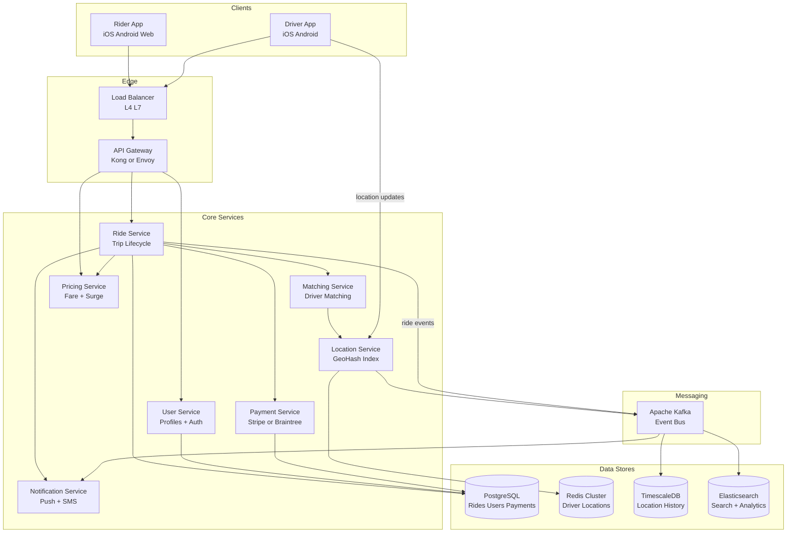
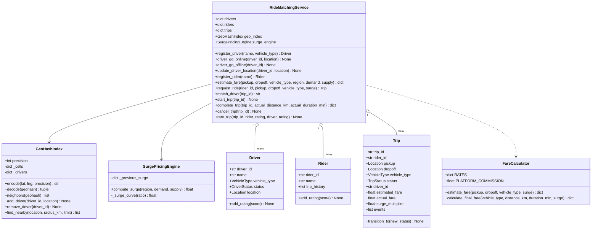
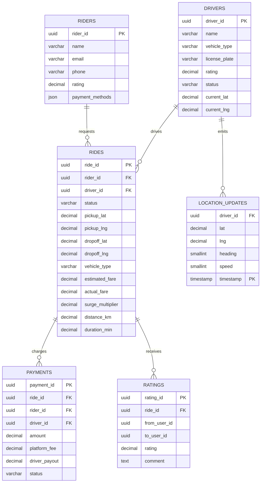
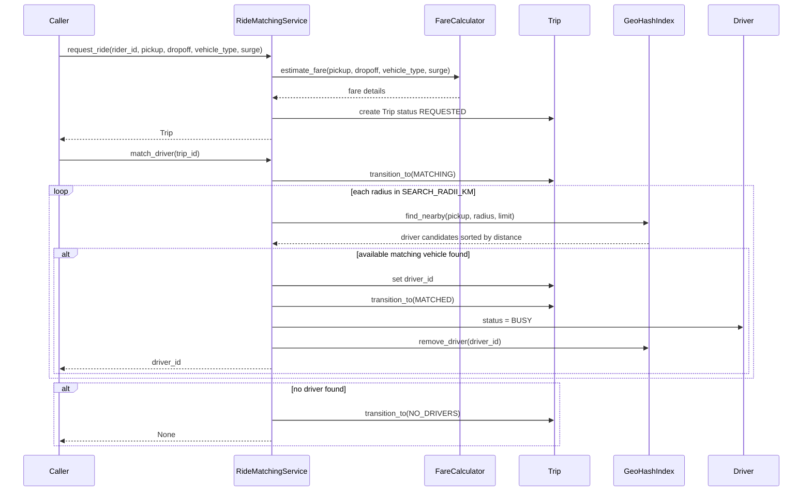
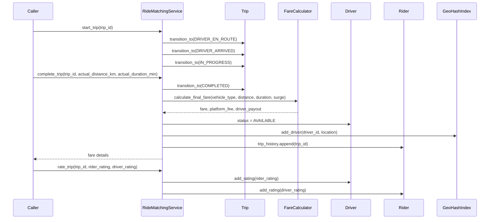

# Ride Sharing System (Uber/Lyft) — Architecture

> **Scope of this document.** This is the consolidated architecture reference for the Ride Sharing System. It preserves the original README design and maps it to [`ride_sharing.py`](./ride_sharing.py), a standard-library, single-process simulation. Sections tagged **[Design-only]** describe production concerns not present in the simulation; sections tagged **[Implemented]** map directly to code.

---

## 1. Problem Statement

Design a ride-sharing platform similar to Uber or Lyft that connects riders needing transportation with nearby drivers who have available vehicles. The system must handle real-time location tracking, intelligent driver matching using geospatial indexing, dynamic surge pricing, fare estimation, trip lifecycle management, and payment processing at massive scale with millions of concurrent users.

The core challenge is the **real-time matching problem**: given a rider's pickup location, find the nearest available driver within seconds while continuously ingesting millions of location updates per second from active drivers.

The Python implementation demonstrates geohash-style proximity search, a trip state machine, fare calculation, surge pricing, matching orchestration, ratings, and trip history.

---

## 2. Requirements

### 2.1 Functional Requirements

| # | Requirement | Details | Status |
|---|-------------|---------|--------|
| FR-1 | **Request ride** | Rider specifies pickup/dropoff and vehicle type. | ✅ Implemented via `RideMatchingService.request_ride()`. |
| FR-2 | **Fare estimation** | Show estimated fare before confirmation. | ✅ Implemented via `RideMatchingService.estimate_fare()` and `FareCalculator.estimate_fare()`. |
| FR-3 | **Driver matching** | Match with nearest available driver using geospatial index. | ✅ Implemented via `match_driver()` and `GeoHashIndex.find_nearby()` with expanding radii. |
| FR-4 | **Real-time tracking** | Stream driver location to rider. | ⚠️ Driver location updates are implemented via `update_driver_location()` and `GeoHashIndex`; streaming to rider is **[Design-only]**. |
| FR-5 | **Trip state machine** | Manage `REQUESTED -> MATCHED -> ... -> COMPLETED/CANCELLED`. | ✅ Implemented via `TripStatus`, `VALID_TRANSITIONS`, and `Trip.transition_to()`. |
| FR-6 | **Fare calculation** | Calculate final fare from distance, duration, surge. | ✅ Implemented via `FareCalculator.calculate_final_fare()` and `complete_trip()`. |
| FR-7 | **Payment processing** | Charge rider, credit driver, handle refunds. | ❌ **[Design-only]**. Code calculates `platform_fee` and `driver_payout` but does not process payments. |
| FR-8 | **Trip history** | Riders and drivers can view past trips. | ⚠️ Partially implemented: completed trip IDs are appended to `Rider.trip_history`; driver history/query APIs are **[Design-only]**. |
| FR-9 | **Ratings and reviews** | Riders rate drivers and drivers rate riders. | ✅ Implemented via `rate_trip()`, `Driver.add_rating()`, and `Rider.add_rating()`. Comments/reviews are **[Design-only]**. |
| FR-10 | **Surge pricing** | Adjust prices based on supply/demand ratio. | ✅ Implemented via `SurgePricingEngine.compute_surge()` and `_surge_curve()`. H3 cell aggregation is **[Design-only]**. |

### 2.2 Non-Functional Requirements [Design-only targets]

| # | Requirement | Target |
|---|-------------|--------|
| NFR-1 | **Match latency** | Match within < 10 seconds of ride request. |
| NFR-2 | **Location freshness** | Updates every 3-5 seconds from active drivers. |
| NFR-3 | **Availability** | 99.99% uptime for ride matching, < 53 min downtime/year. |
| NFR-4 | **Scale** | 1 million concurrent rides globally. |
| NFR-5 | **Throughput** | 5M+ location updates per second. |
| NFR-6 | **Consistency** | Strong consistency for trip transitions and payments. |
| NFR-7 | **Data durability** | Zero loss for payment and trip records. |
| NFR-8 | **Global reach** | Multi-region deployment with geo-aware routing. |

---

## 3. Capacity Estimation [Design-only]

### 3.1 Traffic Estimates

| Metric | Value |
|--------|-------|
| Daily Active Riders | 20 million |
| Daily Active Drivers | 5 million |
| Rides per Day | 15 million |
| Peak Concurrent Rides | 1 million |
| Ride Requests per Second average | ~175 RPS |
| Ride Requests per Second peak | ~1,500 RPS |

### 3.2 Location Update Estimates

| Metric | Value |
|--------|-------|
| Active Drivers online | 5 million |
| Update Frequency | Every 4 seconds |
| Location Updates per Second | ~1.25 million |
| Payload per Update | ~100 bytes |
| Bandwidth for Location Updates | ~125 MB/s ingress |

### 3.3 Storage Estimates

| Data Type | Size per Record | Records per Day | Daily Storage | Annual Storage |
|-----------|-----------------|-----------------|---------------|----------------|
| Ride Records | ~2 KB | 15M | 30 GB | ~11 TB |
| Location History | ~100 bytes | 27B | 2.7 TB | ~1 PB |
| User Profiles | ~1 KB | - | - | ~25 GB |
| Payment Records | ~500 bytes | 15M | 7.5 GB | ~2.7 TB |
| Ratings | ~200 bytes | 30M | 6 GB | ~2.2 TB |

Summary: total daily write throughput is ~1.25M writes/sec, dominated by location updates. Hot location data for the last 24 hours is ~2.7 TB in Redis or memory; cold historical data is ~1 PB/year in tiered object storage.

---

## 4. High-Level Architecture [Design-only]



Component responsibilities:

| Component | Responsibility |
|-----------|----------------|
| API Gateway | Auth, rate limiting, request routing, TLS termination. |
| Ride Service | Trip lifecycle, matching/pricing/payment orchestration. |
| Matching Service | Finds nearest available driver using geospatial queries. |
| Location Service | Ingests driver locations and maintains geo index. |
| Pricing Service | Fare estimation, surge calculation, dynamic pricing. |
| Payment Service | Charge riders, payout drivers, handle refunds. |
| Notification Service | Push notifications and SMS alerts for ride events. |
| User Service | Registration, authentication, profiles, ratings. |

---

## 5. Reference Implementation Overview [Implemented]

`ride_sharing.py` combines domain models, geospatial indexing, pricing, surge, and ride orchestration in one module. It uses in-memory dicts for drivers, riders, and trips.



### 5.1 Component Deep-Dive (doc → code)

| Design concept | Implemented by | Notes |
|----------------|----------------|-------|
| Location and distance | `Location.distance_km()` | Haversine great-circle distance. |
| Driver/rider profiles | `Driver`, `Rider`, `register_driver()`, `register_rider()` | Minimal profile fields and ratings. |
| Geo index | `GeoHashIndex.encode()`, `neighbors()`, `add_driver()`, `find_nearby()` | In-memory geohash-style grid, scans target and adjacent cells. |
| Driver availability | `DriverStatus`, `driver_go_online()`, `driver_go_offline()`, `update_driver_location()` | Available drivers are present in geo index; busy/offline drivers are removed. |
| Trip lifecycle | `TripStatus`, `VALID_TRANSITIONS`, `Trip.transition_to()` | Invalid transitions raise `InvalidTransitionError`. |
| Ride matching | `RideMatchingService.match_driver()` | Expands through `SEARCH_RADII_KM`; filters by `VehicleType`; selects closest available driver. |
| Fare estimation | `FareCalculator.estimate_fare()` | Uses Haversine * 1.35 road factor and 30 km/h estimate. |
| Final fare | `FareCalculator.calculate_final_fare()`, `complete_trip()` | Computes fare, platform fee, driver payout and stores trip metrics. |
| Surge pricing | `SurgePricingEngine.compute_surge()` | Piecewise curve with smoothing and 3x cap. |
| Ratings | `rate_trip()`, `Driver.add_rating()`, `Rider.add_rating()` | Ratings only after completed trips. |
| Event log | `Trip.events` | Records state transitions inside each trip. |

---

## 6. Data Model

### 6.1 Conceptual production schema [Design-only]



### 6.2 README data model preserved [Design-only]

The design includes Riders, Drivers, Rides, Location Updates, and Payments tables. Driver status is `AVAILABLE`, `BUSY`, or `OFFLINE`; ride status includes `REQUESTED`, `MATCHED`, `DRIVER_EN_ROUTE`, `IN_PROGRESS`, `COMPLETED`, and `CANCELLED`; location history is time-series; payments track amount, platform fee, driver payout, and status.

### 6.3 As implemented [Implemented]

The code uses dataclasses `Rider`, `Driver`, `Trip`, and `Location`; enums `VehicleType`, `DriverStatus`, and `TripStatus`; and dict stores `RideMatchingService.riders`, `drivers`, and `trips`. `GeoHashIndex._cells` and `_drivers` represent hot driver locations. There is no payment table, persistent location history table, user email/phone fields, or review comments.

---

## 7. API Design

### 7.1 Production HTTP surface [Design-only]

| Method & Path | Purpose |
|---------------|---------|
| `POST /api/v1/rides/estimate` | Estimate fare for pickup/dropoff and vehicle type. |
| `POST /api/v1/rides` | Request a ride with payment method. |
| `GET /api/v1/rides/{ride_id}` | Fetch ride status, driver, locations, and fare. |
| `PUT /api/v1/rides/{ride_id}/cancel` | Cancel ride, possibly with cancellation fee. |
| `GET /api/v1/rides/{ride_id}/track` | Stream driver location and ETA. |
| `GET /api/v1/riders/{rider_id}/history` | Paginated rider history. |
| `POST /api/v1/rides/{ride_id}/rate` | Submit rating/comment. |
| `PUT /api/v1/drivers/{driver_id}/status` | Set driver status. |
| `PUT /api/v1/drivers/{driver_id}/location` | Update driver location, heading, speed. |
| `GET /api/v1/drivers/{driver_id}/ride-requests` | Stream ride offers to driver. |
| `PUT /api/v1/rides/{ride_id}/accept` | Driver accepts ride. |
| `PUT /api/v1/rides/{ride_id}/arrive` | Driver arrived at pickup. |
| `PUT /api/v1/rides/{ride_id}/start` | Trip begins. |
| `PUT /api/v1/rides/{ride_id}/complete` | Complete trip. |
| `GET /api/v1/admin/surge?region=...` | Inspect surge state. |

### 7.2 In-process API [Implemented]

| Method | Signature | Raises / behavior |
|--------|-----------|-------------------|
| `register_driver` | `(name: str, vehicle_type: VehicleType) -> Driver` | Creates `drv_...` driver offline. |
| `driver_go_online` | `(driver_id: str, location: Location) -> None` | Marks available and adds to geo index. |
| `driver_go_offline` | `(driver_id: str) -> None` | Marks offline and removes from index. |
| `update_driver_location` | `(driver_id: str, location: Location) -> None` | Updates driver and geo index if available. |
| `register_rider` | `(name: str) -> Rider` | Creates `rdr_...` rider. |
| `estimate_fare` | `(pickup, dropoff, vehicle_type, region="default", demand=10, supply=10) -> dict` | Computes surge then estimated fare. |
| `request_ride` | `(rider_id, pickup, dropoff, vehicle_type=ECONOMY, surge=1.0) -> Trip` | Creates `REQUESTED` trip but does not match automatically. |
| `match_driver` | `(trip_id: str) -> str | None` | Transitions to `MATCHING`, then `MATCHED` or `NO_DRIVERS`. |
| `start_trip` | `(trip_id: str) -> None` | Transitions through en-route, arrived, in-progress. |
| `complete_trip` | `(trip_id, actual_distance_km, actual_duration_min) -> dict` | Transitions to completed, calculates fare, frees driver, adds rider history. |
| `cancel_trip` | `(trip_id: str) -> None` | Transitions to cancelled and frees driver if assigned. |
| `rate_trip` | `(trip_id, rider_rating, driver_rating) -> None` | Requires completed trip. |

---

## 8. Key Workflows [Implemented]

### 8.1 Ride request and matching



### 8.2 Start, complete, fare, and ratings



---

## 9. Detailed Component Design

### 9.1 Geospatial indexing [Implemented]

`GeoHashIndex` encodes coordinates into base32 geohash-like strings. `_cells` maps a geohash cell to driver IDs, and `_drivers` maps driver IDs to `(geohash, Location)`. `find_nearby()` scans the target cell and its eight neighboring cells, computes exact Haversine distance, filters by radius, sorts by distance, and returns the nearest results. Production Redis `GEOADD`/`GEORADIUS`, city-level sharding, and H3 aggregation are **[Design-only]**.

### 9.2 Driver matching algorithm [Implemented]

`match_driver()` transitions a trip to `MATCHING`, searches expanding radii `[3, 5, 8, 15]`, filters candidates by `DriverStatus.AVAILABLE` and requested `VehicleType`, assigns the first closest match, marks the driver `BUSY`, removes them from the available geo index, and transitions to `MATCHED`. If none are found, it transitions to `NO_DRIVERS`. Offer timeout, candidate retries on decline, road-network ETA ranking, notifications, and re-search loops are **[Design-only]**.

### 9.3 Trip state machine [Implemented]

`VALID_TRANSITIONS` allows `REQUESTED -> MATCHING`, `MATCHING -> MATCHED | NO_DRIVERS | CANCELLED`, `MATCHED -> DRIVER_EN_ROUTE | CANCELLED`, `DRIVER_EN_ROUTE -> DRIVER_ARRIVED | CANCELLED`, `DRIVER_ARRIVED -> IN_PROGRESS | CANCELLED`, and `IN_PROGRESS -> COMPLETED`. `Trip.transition_to()` records every transition in `Trip.events` and sets timestamps for matched, started, and completed states.

### 9.4 Surge pricing [Implemented]

`SurgePricingEngine.compute_surge(region, demand, supply)` computes demand/supply ratio, applies `_surge_curve()`, smooths with `0.7 * raw + 0.3 * previous`, and caps extreme cases at 3.0x. If supply is zero, raw surge is 3.0. City H3 cells and 30-second surge-map publication are **[Design-only]**.

### 9.5 ETA and fare calculation [Implemented core]

`FareCalculator.estimate_fare()` uses Haversine distance multiplied by 1.35 as a road-network factor and assumes 30 km/h city speed. `_calculate()` applies base, per-km, per-minute, surge, and minimum fare for `ECONOMY`, `PREMIUM`, and `XL`; it also computes 25% platform commission. Real traffic, OSRM/Google Directions, and turn-by-turn routing are **[Design-only]**.

### 9.6 Payments and notifications [Design-only]

The code returns `platform_fee` and `driver_payout`, but it does not charge a payment method, issue payouts, handle refunds, or notify riders/drivers. Production should integrate a payment service and event-driven notification service.

---

## 10. Architectural Patterns [Design-only]

- **Geospatial indexing:** Redis GeoHash for hot matching, H3 for surge aggregation, PostGIS for analytics.
- **State machine pattern:** trip transitions are explicit, validated, and event-emitting.
- **CQRS:** write-heavy location updates use Redis/TimescaleDB; trip reads/history can be served from read models.
- **Event sourcing:** ride lifecycle events and location updates are stored in Kafka for replay, analytics, and ML training.
- **Circuit breaker:** protect matching, pricing, payment, routing, and notification dependencies.

---

## 11. Technology Choices & Trade-offs [Design-only]

| Component | Technology | Rationale |
|-----------|------------|-----------|
| Geospatial index | Redis 7 GeoHash | Sub-ms radius queries and high throughput. |
| Primary DB | PostgreSQL 15 | ACID for rides, users, and payments. |
| Time-series | TimescaleDB | Hypertables for location history. |
| Event bus | Apache Kafka | Durable event log and replay support. |
| Search/analytics | Elasticsearch | Trip search and Kibana dashboards. |
| Cache | Redis Cluster | Sessions, surge cache, rate limits. |
| Hex grid | H3 | Uniform cells for surge pricing. |
| Routing | OSRM | Open-source road-network ETA. |
| API gateway | Kong / Envoy | Rate limiting, auth, circuit breaking. |
| Service mesh | Istio | mTLS, traffic management, observability. |
| Orchestration | Kubernetes | Auto-scaling and rolling deployments. |
| Dynamic pricing | Custom ML model | Supply/demand feature model. |

### Redis GeoHash vs PostGIS

| Factor | Redis GeoHash | PostGIS |
|--------|---------------|---------|
| Latency | < 1 ms | 5-50 ms |
| Throughput | 100K+ ops/sec/node | 1-5K queries/sec |
| Persistence | Optional AOF/RDB | Full ACID |
| Query richness | Basic radius/box | Complex spatial queries |
| Memory | All in RAM | Disk-backed |
| Use case | Real-time matching | Historical analytics |

**Decision:** Redis for hot matching, PostGIS for warm/cold analytics.

---

## 12. Scaling, Reliability & Security [Design-only]

- **Horizontal scaling:** shard location service by geohash prefix; run regional matching instances; make ride service stateless and shard by ride ID.
- **Redis GeoIndex:** cluster by city or region; active drivers expire with TTL if updates stop.
- **Kafka partitioning:** partition by city/region for location and ride events; consumer groups per service.
- **Auto-scaling:** location service scales on CPU or ingestion lag; matching scales on p99 latency; ride service scales on queue depth.
- **Data partitioning:** location by time and region, ride records by month with rider/driver indexes, older location data to S3/Glacier.
- **Reliability:** Redis failover, Kafka RF=3, fallback wider radius, payment retry/dead-letter queues, stale driver detection, multi-AZ and cross-region replication.
- **Consistency:** strong trip transitions with optimistic locking; two-phase payment authorization/capture; eventual consistency for location within 4-8 seconds.
- **Security:** OAuth 2.0/JWT, OTP, RBAC, TLS 1.3, certificate pinning, rate limits, AES-256 for PII, tokenized payments, fuzzy location sharing before matching, fraud scoring, driver verification, immutable audit logs.
- **Monitoring:** match p99 latency, match success rate, location lag, active rides, payment failure rate, app crash rate, API 5xx, real-time supply/demand maps, surge heatmaps.

---

## 13. Running the Simulation [Implemented]

```powershell
uv run --no-project python SystemDesign\RideSharing\ride_sharing.py
```

The demo registers drivers/riders, brings drivers online around San Francisco, demonstrates geohash encode/decode and neighbor lookup, runs proximity search, computes surge and fares, completes a full ride flow, rates rider/driver, prints trip events, validates invalid transitions, cancels a matched trip, and prints system statistics.

### Suggested tests

- `GeoHashIndex.encode()` and `decode()` round-trip to approximate coordinates.
- `find_nearby()` returns drivers sorted by distance and respects radius.
- `match_driver()` chooses only available drivers with matching vehicle type and removes matched driver from index.
- Invalid `Trip.transition_to()` raises `InvalidTransitionError`.
- `complete_trip()` frees driver, appends rider trip history, and calculates fare fields.
- `SurgePricingEngine.compute_surge()` handles zero supply and smoothing.
- `rate_trip()` rejects non-completed trips.

---

## 14. Future Improvements

- Add durable storage for users, drivers, trips, location history, and payments.
- Implement HTTP APIs or service layer wrappers around `RideMatchingService`.
- Add payment integration with authorization before trip and capture after completion.
- Add driver offer/accept/decline timeout flow and retry candidates.
- Add real-time rider tracking streams and ETA updates.
- Replace grid scan with Redis GEO or H3-backed geo shards.
- Add route-aware ETA and fare calculation using OSRM or a directions API.
- Add cancellation fees, refunds, support workflows, and review comments.
- Add pytest coverage for matching, transitions, surge, and fare calculations.
