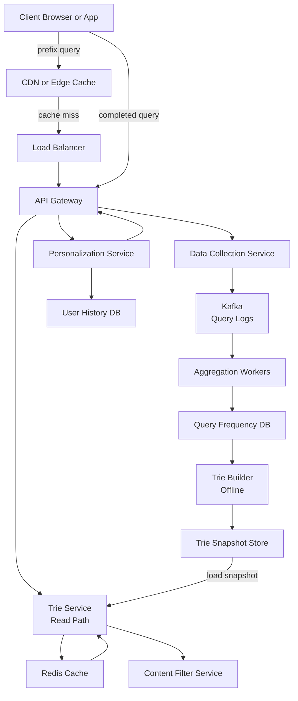
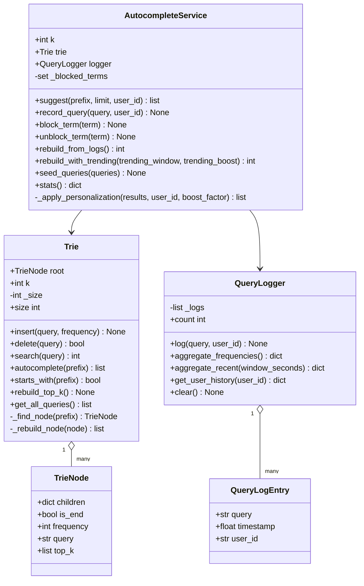
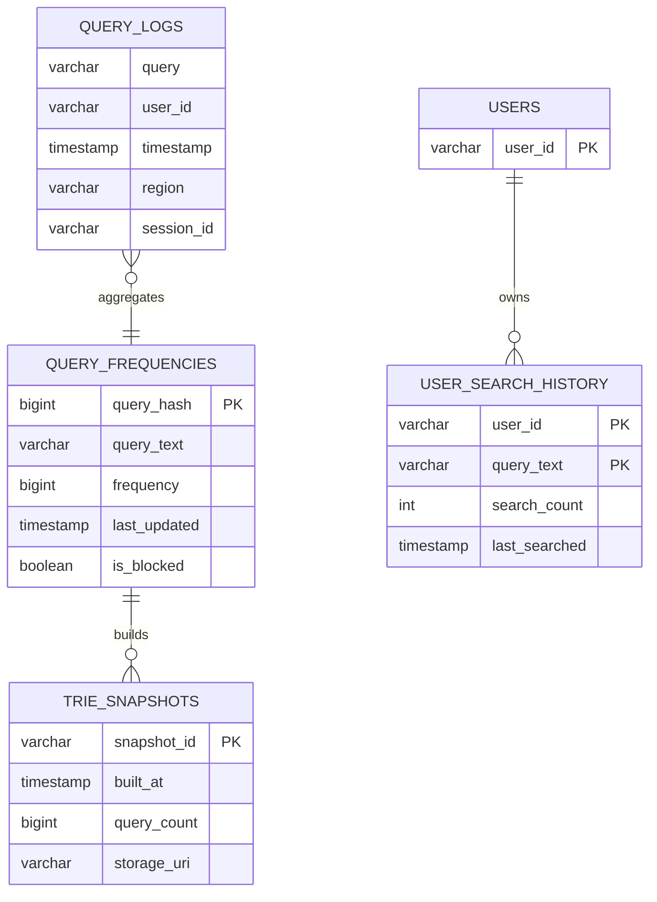
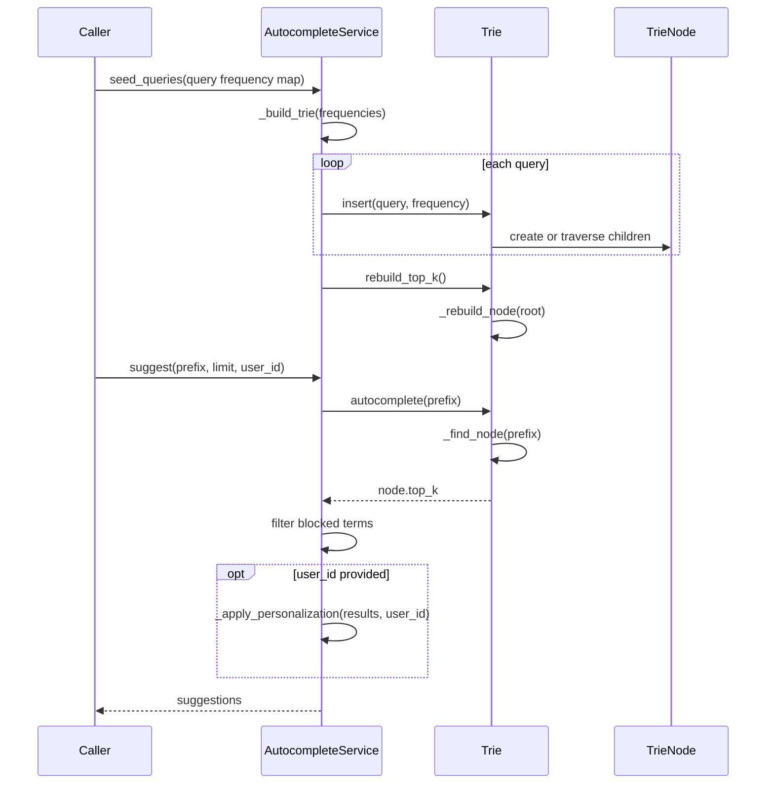
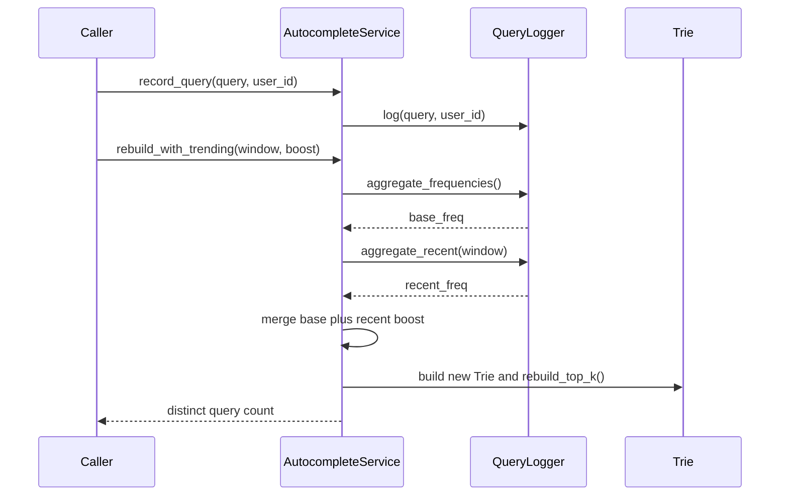

# Search Autocomplete / Typeahead System — Architecture

> **Scope of this document.** This is the consolidated architecture reference for the Search Autocomplete system. It preserves the README design and maps it to [`search_autocomplete.py`](./search_autocomplete.py), a single-process, in-memory simulation. Sections tagged **[Design-only]** describe production concerns not present in the simulation; sections tagged **[Implemented]** map directly to code.

---

## 1. Problem Statement

Design a search autocomplete system that returns the top-k most relevant search suggestions as a user types a query prefix. The system must handle billions of queries per day with sub-50 ms latency, support prefix matching, integrate trending queries, and optionally personalize results per user.

Real-world examples include Google Search suggestions, Amazon product search, and YouTube autocomplete. The core challenge is serving prefix lookups after every keystroke with extremely low latency while continuously ingesting completed search queries and rebuilding ranked suggestions.

---

## 2. Requirements

### 2.1 Functional Requirements

| ID | Requirement | Details | Status |
|----|-------------|---------|--------|
| FR-1 | **Top-k suggestions** | Return top-k suggestions for a prefix, default k=10. | ✅ Implemented via `AutocompleteService.suggest()` and `Trie.autocomplete()`. |
| FR-2 | **Popularity ranking** | Rank suggestions by global query frequency. | ✅ Implemented via `TrieNode.frequency`, `Trie.rebuild_top_k()`, and sorted `top_k`. |
| FR-3 | **Prefix matching** | Typing `face` returns completions like `facebook`. | ✅ Implemented by `Trie._find_node()` and trie traversal. |
| FR-4 | **Trending boost** | Recent/viral queries should surface quickly. | ✅ Implemented in-process via `QueryLogger.aggregate_recent()` and `AutocompleteService.rebuild_with_trending()`. Production streaming overlay is **[Design-only]**. |
| FR-5 | **Personalization** | Weight suggestions by a user's past searches. | ✅ Implemented in-process by `QueryLogger.get_user_history()` and `_apply_personalization()`. Privacy controls are **[Design-only]**. |
| FR-6 | **Per-keystroke updates** | Results update after every character. | ✅ Implemented as repeated calls to `suggest()`; `demo_incremental_typing()` demonstrates character-by-character lookup. Client debounce is **[Design-only]**. |
| FR-7 | **Multi-word queries** | Support phrases such as `how to cook rice`. | ✅ Implemented naturally because queries are stored as strings including spaces. |
| FR-8 | **Offensive term filtering** | Block offensive or disallowed suggestions. | ✅ Implemented via `_blocked_terms`, `block_term()`, `unblock_term()`, and filtering in `suggest()`. ML moderation and admin workflows are **[Design-only]**. |

### 2.2 Non-Functional Requirements [Design-only targets]

| ID | Requirement | Target |
|----|-------------|--------|
| NFR-1 | **Latency** | p99 < 50 ms for suggestion lookup. |
| NFR-2 | **Scale** | 10 billion queries/day, about 115K QPS average and 350K QPS peak. |
| NFR-3 | **Availability** | 99.99% uptime, less than 53 minutes downtime per year. |
| NFR-4 | **Consistency** | Eventual consistency; new trending queries can appear within minutes. |
| NFR-5 | **Graceful degradation** | Return cached or empty results if trie service is unavailable. |
| NFR-6 | **Privacy** | Do not surface other users' personal queries. |

---

## 3. Capacity Estimation [Design-only]

### 3.1 Query Volume

- 10B completed queries/day.
- Average query length: 20 characters, producing about 20 prefix lookups per query.
- Prefix lookup QPS: `10B * 20 / 86400 ~ 2.3M QPS` before client-side cache and debounce.
- After ~200 ms debounce: effective server peak QPS ~350K.

### 3.2 Trie Storage

- Unique queries to store: ~100M distinct queries.
- Average query: 20 chars plus 8-byte frequency counter and pointer overhead.
- Trie node: ~60 bytes average, including character, children map, and top-k pointer.
- Total trie nodes: ~2B with average 20 nodes/query and prefix sharing.
- Raw trie size: `2B * 60 bytes ~ 120 GB`.
- Compressed/pruned trie for top 5M queries: ~5-10 GB, fitting in RAM on a single large machine.

### 3.3 Cache

- Top 20% of prefixes serve 80% of traffic.
- Cache top 1M prefixes with ~1 KB responses: ~1 GB Redis cache.
- TTL: 60 seconds for trending prefixes, 15 minutes for stable prefixes.

### 3.4 Log Storage

- Raw query logs: `10B * ~50 bytes = 500 GB/day`.
- Retain 30 days of aggregated logs: ~500 GB compressed with rollups.

---

## 4. High-Level Architecture [Design-only]



The read path is optimized for low latency: edge cache, Redis, then an in-memory trie. The write path is asynchronous: query logs flow through Kafka, aggregators update frequency tables, and offline builders produce trie snapshots.

---

## 5. Reference Implementation Overview [Implemented]

`search_autocomplete.py` implements the core data structure and scoring in memory: `TrieNode` stores children and top-k lists, `Trie` supports insert/search/delete/autocomplete and top-k rebuilding, `QueryLogger` stores query events, and `AutocompleteService` orchestrates seeding, logging, rebuilds, trending boosts, personalization, filtering, and stats.



### 5.1 Component Deep-Dive (doc → code)

| Design concept | Implemented by | Notes |
|----------------|----------------|-------|
| Prefix trie | `TrieNode.children`, `Trie.insert()`, `Trie._find_node()` | Stores lowercase characters including spaces for multi-word queries. |
| Top-k cache | `TrieNode.top_k`, `Trie.rebuild_top_k()`, `_rebuild_node()` | Post-order traversal propagates top-k completions to every node. |
| Autocomplete lookup | `Trie.autocomplete(prefix)` | Traverses prefix and returns a copy of `node.top_k`. |
| Query logging | `QueryLogger.log()`, `QueryLogEntry` | Append-only in-memory list with timestamp and user ID. |
| Frequency aggregation | `aggregate_frequencies()` | Counts all logged completed queries. |
| Trending boost | `aggregate_recent()`, `rebuild_with_trending()` | Adds `count * trending_boost` to recent query scores. |
| Personalization | `get_user_history()`, `_apply_personalization()` | Multiplies matching user-history scores by `boost_factor`. |
| Content filtering | `_blocked_terms`, `block_term()`, `unblock_term()` | Exact lowercase term blocklist; no substring/ML filtering. |
| Delete and rebuild | `Trie.delete()`, `rebuild_top_k()` | Deletion prunes empty leaves; caller rebuilds top-k afterward. |

---

## 6. Data Model

### 6.1 Conceptual production model [Design-only]



### 6.2 README data structures preserved [Design-only]

The README defines a `TrieNode` with `char`, `children`, `is_end`, `frequency`, and `top_k`; a `query_frequencies` database table; an append-only query log with `query`, `user_id`, `timestamp`, `region`, and `session_id`; and a `user_search_history` table keyed by `(user_id, query_text)`.

### 6.3 As implemented [Implemented]

`TrieNode` contains `children`, `is_end`, `frequency`, `query`, and `top_k`. The trie does not store a separate `char`; the incoming edge character is represented by the parent `children` key. `QueryLogger._logs` stores `QueryLogEntry(query, timestamp, user_id)`. There is no external DB, Kafka topic, Redis cache, serialized snapshot, region field, or session ID.

---

## 7. API Design

### 7.1 Production HTTP surface [Design-only]

| Method & Path | Purpose | Example response |
|---------------|---------|------------------|
| `GET /v1/suggestions?prefix={prefix}&limit={k}&user_id={uid}` | Return suggestions for a prefix, optionally personalized. | `{ "prefix": "face", "suggestions": [{"query": "facebook", "score": 98500}], "is_personalized": true }` |
| `POST /v1/queries` | Fire-and-forget completed query log with query, user ID, timestamp. | `202 Accepted` |
| `POST /v1/suggestions/report` | Report offensive suggestion for review. | `200 OK` |

### 7.2 In-process API [Implemented]

| Method | Signature | Behavior |
|--------|-----------|----------|
| `Trie.insert` | `(query: str, frequency: int = 1) -> None` | Lowercases and inserts a query. |
| `Trie.delete` | `(query: str) -> bool` | Removes an exact query and prunes empty leaf nodes. |
| `Trie.search` | `(query: str) -> int | None` | Returns exact frequency or `None`. |
| `Trie.autocomplete` | `(prefix: str) -> list[tuple[str, int]]` | Returns precomputed top-k for a prefix. |
| `Trie.rebuild_top_k` | `() -> None` | Recomputes all node caches. |
| `QueryLogger.log` | `(query: str, user_id="anonymous") -> None` | Appends normalized query event. |
| `AutocompleteService.suggest` | `(prefix: str, limit: int | None = None, user_id: str | None = None) -> list[tuple[str, int]]` | Applies trie lookup, blocklist filtering, optional personalization, and limit. |
| `AutocompleteService.rebuild_with_trending` | `(trending_window=300.0, trending_boost=100) -> int` | Rebuilds trie with recent query boost. |
| `AutocompleteService.seed_queries` | `(queries: dict[str, int]) -> None` | Bulk loads initial frequencies. |

---

## 8. Key Workflows [Implemented]

### 8.1 Build trie and serve suggestions



### 8.2 Log queries and rebuild with trending



---

## 9. Detailed Component Design

### 9.1 Trie with frequency counts [Implemented]

`Trie.insert()` lowercases the query, creates nodes for missing characters, marks the terminal node with `is_end = True`, stores the full lowercase query in `node.query`, and sets `node.frequency`. `Trie.search()` performs an exact lookup.

### 9.2 Top-k precomputation [Implemented]

`Trie.rebuild_top_k()` calls `_rebuild_node()` recursively. Each node combines its own terminal query, if any, with child `top_k` lists, sorts by frequency descending, and keeps only `self.k`. This converts lookup to prefix traversal plus returning an existing list.

### 9.3 Trie rebuild vs real-time update [Implemented core, Design-only production]

The code supports full rebuilds from logs through `rebuild_from_logs()` and trending rebuilds through `rebuild_with_trending()`. The README's hybrid architecture, with an offline base trie and near-real-time trending overlay trie, is **[Design-only]**; the simulation rebuilds a single trie.

### 9.4 Sampling and data collection [Design-only]

At 10B queries/day, production should use client-side debounce, query sampling, full or higher-rate logging for trending detection, and adaptive sampling for rare prefixes. The code logs every call to `record_query()` in memory.

### 9.5 Trie serving [Design-only]

Production trie servers memory-map serialized snapshots, load full tries into RAM, deploy snapshots with blue-green rollouts, and use Redis for hot prefixes. The simulation serves from one mutable in-process `Trie`.

### 9.6 Content filtering and privacy [Implemented core]

`block_term()` and `unblock_term()` manage exact blocked terms. `suggest()` filters exact blocked suggestions before personalization. Production moderation, admin review, per-locale blocklists, privacy-preserving aggregation, and user-history erasure are **[Design-only]**.

---

## 10. Architectural Patterns [Design-only]

- **Trie data structure:** O(L) prefix lookup where L is prefix length; with top-k caches, returning suggestions is O(L + k).
- **CQRS:** trie servers serve read-only lookups while data collection and aggregation update derived datasets asynchronously.
- **Offline/online separation:** online prefix lookup is low latency; offline batch jobs rebuild snapshots; near-line streaming detects trends.
- **Event sourcing:** raw query events are the source of truth; frequency tables and tries are derived views.
- **Cache-aside:** Redis stores hot prefix responses; trie servers compute and populate on cache miss.

---

## 11. Technology Choices & Trade-offs [Design-only]

### 11.1 Trie vs inverted index

| Criteria | Trie | Inverted Index |
|----------|------|----------------|
| Prefix lookup speed | O(L), optimal for prefixes | Prefix queries are slower |
| Memory efficiency | Good with compression | Higher document overhead |
| Top-k precomputation | Natural fit | Scoring at query time |
| Fuzzy matching | Needs extension | Built in |
| Operational complexity | Custom service | Managed service available |

**Decision:** custom trie for primary autocomplete; Elasticsearch fallback for fuzzy or typo-tolerant suggestions.

### 11.2 Redis vs custom trie server

| Criteria | Redis | Custom Trie Server |
|----------|-------|--------------------|
| Prefix lookup | Sorted sets with lexicographic ranges | Native O(L) traversal |
| Top-k | Manual scoring | Precomputed at each node |
| Memory | Higher structure overhead | Optimized for workload |
| Ops complexity | Lower with managed Redis | Higher |
| Latency | Sub-ms cache hits | Sub-ms trie lookup |

**Decision:** custom trie servers for primary lookups; Redis as a hot-prefix cache.

### 11.3 Kafka for log collection

Kafka handles 10B+ events/day, provides durable replayable logs, decouples data collection from aggregation, and integrates with Spark Streaming or Flink.

---

## 12. Scaling, Reliability & Security [Design-only]

- **Trie replicas:** stateless readers of immutable snapshots; scale horizontally behind load balancers.
- **Sharding:** if the trie exceeds RAM, shard by first character or prefix range; use consistent hashing to handle uneven distributions.
- **Multi-region:** deploy trie servers in each region with regional trending overlays.
- **Pipeline scaling:** Kafka partitioned by query hash; aggregation workers auto-scale on lag; trie build parallelized by prefix range.
- **Reliability:** at least three trie replicas per region, Redis replication, Kafka RF=3, continue serving previous snapshots if builds fail.
- **Deployment safety:** blue-green snapshot deployment, canary traffic, rollback in under one minute.
- **Security:** prefix length limits, input sanitization, rate limiting, offensive term blocklists, ML toxicity filters, JWT for personalized endpoint, RBAC for admin endpoints.
- **Privacy:** anonymized aggregate counts, encrypted user history, user deletion workflows for GDPR/CCPA.
- **Monitoring:** p50 < 10 ms, p99 < 50 ms, cache hit ratio > 90%, trie build duration < 10 min, snapshot freshness < 20 min, 5xx < 0.01%.

---

## 13. Running the Simulation [Implemented]

```powershell
uv run --no-project python SystemDesign\SearchAutocomplete\search_autocomplete.py
```

The demo exercises basic trie operations, query logging and aggregation, service rebuilds, trending boost, personalization, blocked terms, character-by-character typing, deletion, and re-ranking.

### Suggested tests

- `Trie.insert()`, `search()`, and `starts_with()` handle lowercase normalization and missing queries.
- `Trie.rebuild_top_k()` orders suggestions by frequency for shared prefixes.
- `Trie.delete()` removes a query and prunes empty nodes without deleting shared prefixes.
- `AutocompleteService.rebuild_with_trending()` boosts recent queries.
- `block_term()` removes an exact suggestion and `unblock_term()` restores it after rebuild or existing lookup.
- Personalized suggestions rank a user's previous query higher.

---

## 14. Future Improvements

- Add serialized trie snapshots and atomic snapshot swapping.
- Split base trie and trending overlay, then merge results at query time.
- Add Redis hot-prefix caching.
- Add query sampling, privacy controls, and user-history deletion.
- Support fuzzy matching and typo tolerance with a secondary index.
- Add per-locale dictionaries, normalization, and Unicode handling.
- Add pytest coverage and benchmark large tries.
