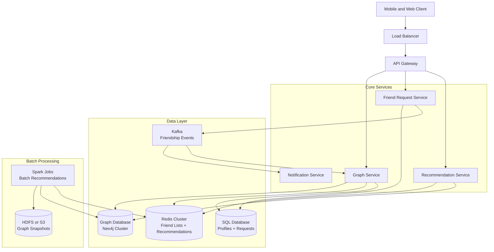
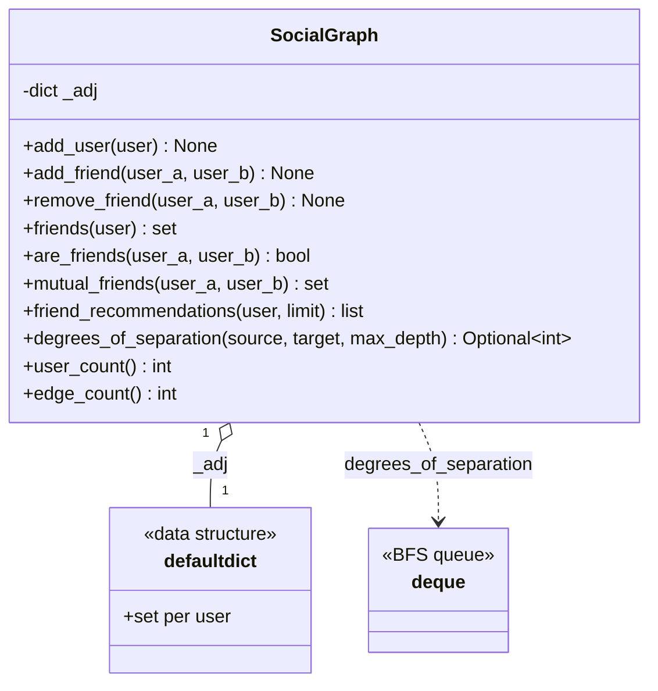
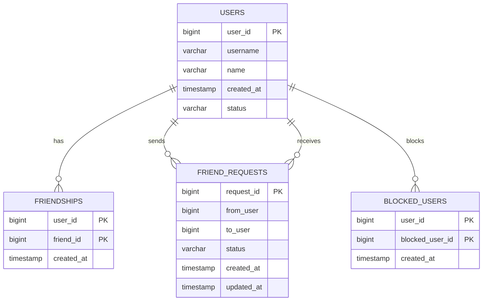
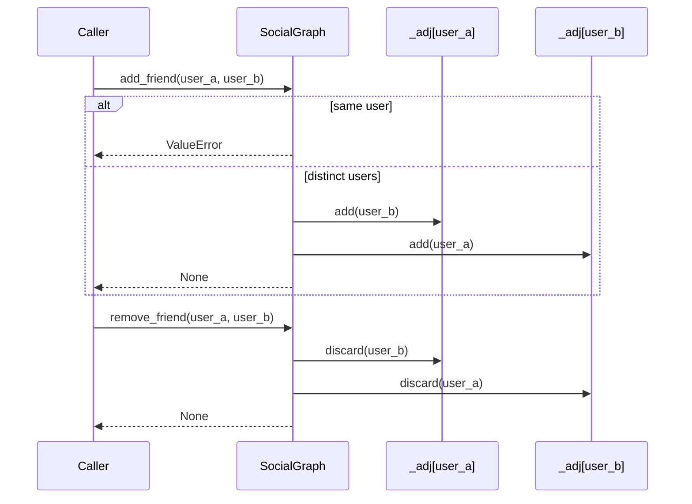
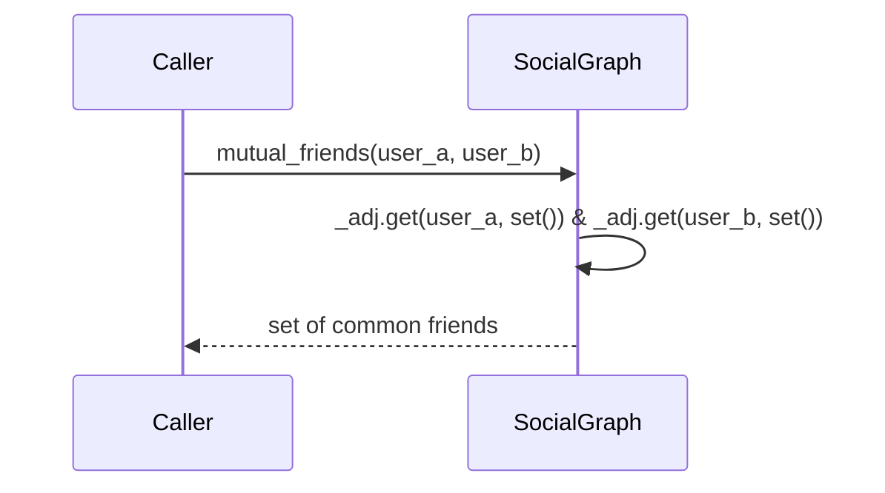
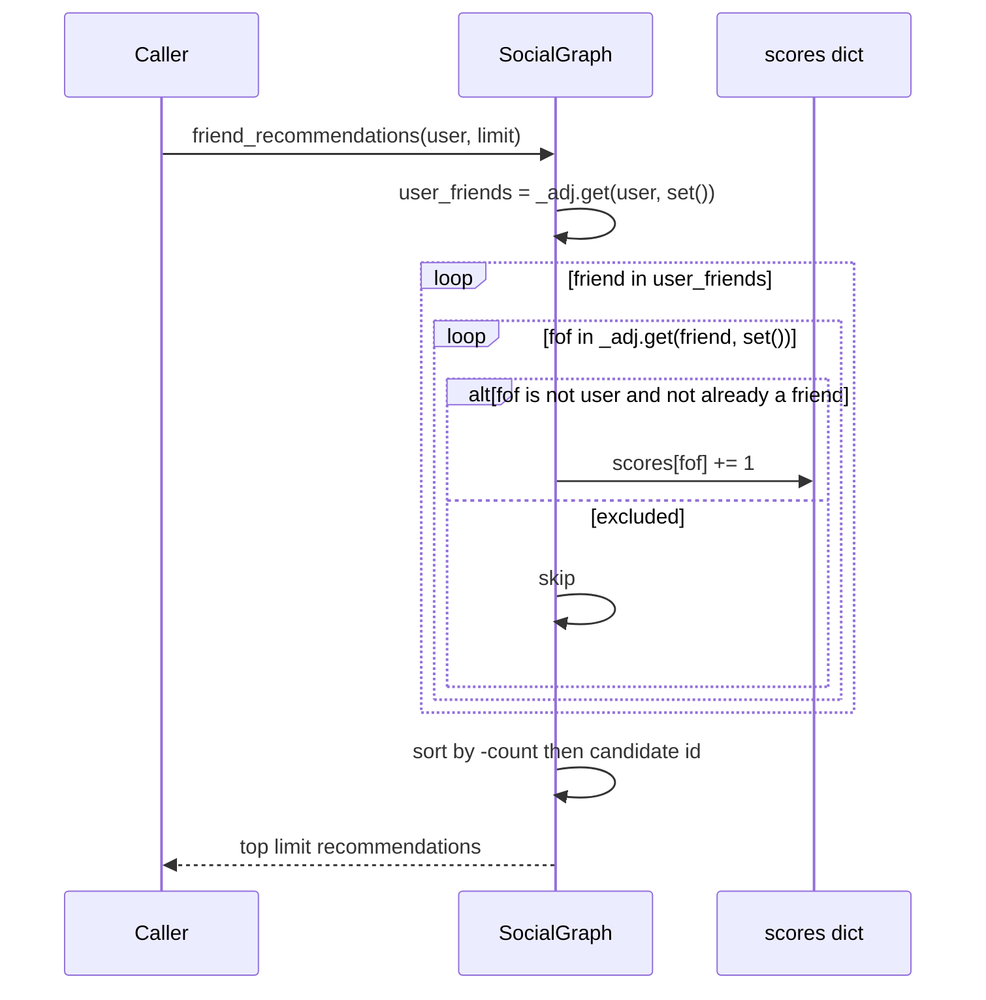
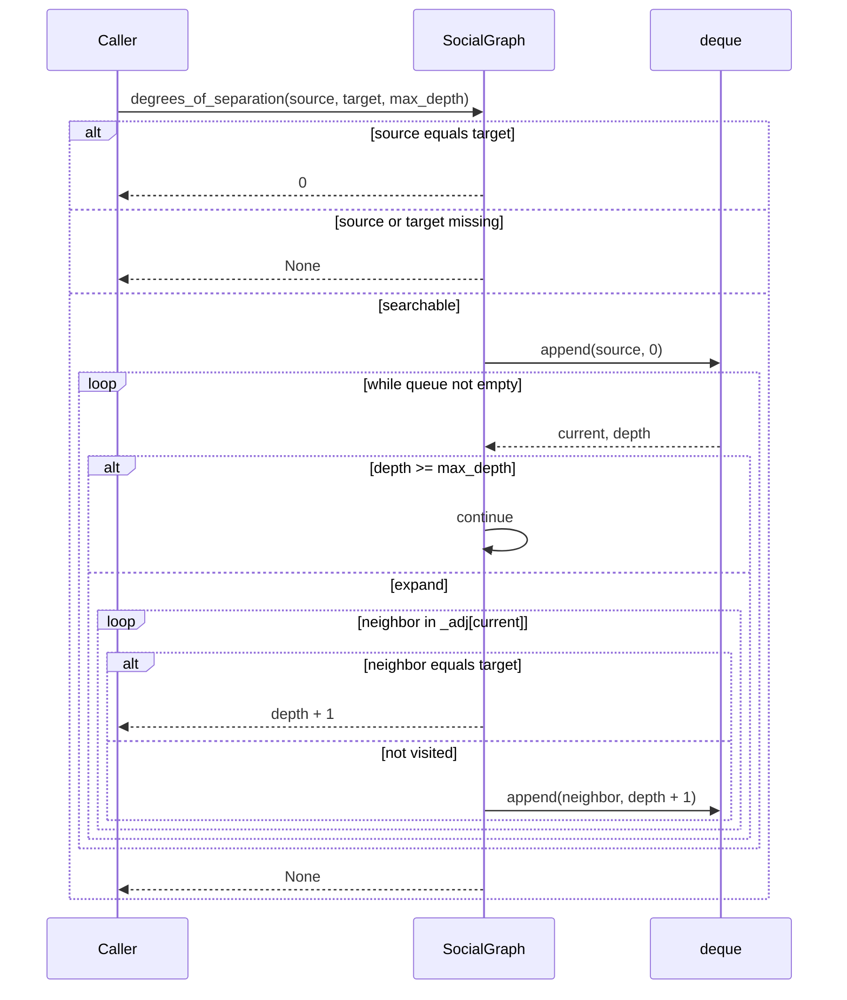

# Social Graph System — Architecture

> **Scope of this document.** This is the consolidated architecture reference for
> the Social Graph System. It preserves the production design from `README.md`
> and maps it to the reference implementation in
> [`social_graph.py`](./social_graph.py), a single-process, in-memory graph
> simulation. Sections tagged **[Design-only]** describe production capabilities
> not present in the simulation; sections tagged **[Implemented]** map directly
> to code.

---

## 1. Problem Statement

Design a Facebook-like social graph that models user relationships and supports
friend operations: adding and removing friends, listing friends, finding mutual
friends, generating "People You May Know" recommendations, and computing degrees
of separation. At production scale this system must support billions of users,
hundreds of billions of edges, sub-second interactive reads, and background graph
analytics.

---

## 2. Requirements

### 2.1 Functional Requirements

| ID | Requirement | Details | Status |
|----|-------------|---------|--------|
| FR-1 | Add Friend | Send and accept a request, creating a bidirectional edge. | ⚠️ Edge creation implemented (`add_friend`); request workflow is **[Design-only]** |
| FR-2 | Remove Friend | Delete the bidirectional friendship edge. | ✅ Implemented (`remove_friend`) |
| FR-3 | Friend List | Retrieve a user's friends. Pagination is production-only. | ✅ Implemented (`friends`); pagination is **[Design-only]** |
| FR-4 | Mutual Friends | Return common friends for two users. | ✅ Implemented (`mutual_friends`) |
| FR-5 | Recommendations | Friend-of-friend ranking by mutual count. | ✅ Implemented (`friend_recommendations`) |
| FR-6 | Degrees of Separation | Compute shortest path length. | ✅ Implemented (`degrees_of_separation`) |
| FR-7 | Friend Request Management | Send, accept, reject, cancel pending requests. | ❌ **[Design-only]** |
| FR-8 | Block User | Prevent requests or visibility in recommendations. | ❌ **[Design-only]** |

### 2.2 Non-Functional Requirements [Design-only targets]

| Requirement | Target |
|-------------|--------|
| Friend lookup latency | p99 < 50 ms |
| Scale | 1 billion users, ~200 average friends/user |
| Recommendation generation | Online < 200 ms; batch within 1 hour |
| Availability | 99.99% uptime |
| Consistency | Strong for friendship mutations; eventual for recommendations |
| Data durability | No friendship data loss with replicated storage |

---

## 3. Capacity Estimation [Design-only]

### 3.1 Users and edges

| Metric | Value |
|--------|-------|
| Total users | 1,000,000,000 |
| Average friends per user | 200 |
| Total friendship edges | 1B x 200 / 2 = 100B undirected edges |
| Edge storage | ~64 bytes/edge |
| Total edge storage | 100B x 64B = ~6.4 TB |
| User profile storage | ~500 bytes/user |
| Total user storage | ~500 GB |

### 3.2 Query load

| Operation | Estimated QPS |
|-----------|---------------|
| Friend list reads | 500,000 |
| Mutual friend queries | 100,000 |
| Add/remove friend writes | 50,000 |
| Recommendation requests | 200,000 |
| Degrees of separation | 10,000 |

### 3.3 Cache requirements

Friend-list cache for top 100M active users:

```text
100M users x 200 friends x 8 bytes = ~160 GB
```

A production Redis cluster would need 20+ nodes plus replicas and overhead.

---

## 4. High-Level Architecture [Design-only]



The online graph path serves friend lists, mutual friends, and bounded BFS. The
recommendation path uses cached online friend-of-friend scores plus batch Spark
jobs for expensive refreshes.

---

## 5. Reference Implementation Overview [Implemented]

`social_graph.py` implements the graph as an adjacency list:

```python
_adj: dict[str, set[str]]
```

Every friendship is stored twice, once in each user's set, enabling O(1)
average-case direct-edge checks and O(degree) friend-list reads.



### 5.1 Component Deep-Dive (doc → code)

| Design concept | Implemented by | Notes |
|----------------|----------------|-------|
| User node registration | `add_user(user)` | Adds empty set if absent. |
| Bidirectional edge | `add_friend(user_a, user_b)` | Adds `user_b` to `user_a` and `user_a` to `user_b`; rejects self-friendship. |
| Edge deletion | `remove_friend(user_a, user_b)` | Uses `discard`, so removing a missing edge is idempotent. |
| Friend list | `friends(user)` | Returns a copy of the set to avoid direct mutation. |
| Direct edge check | `are_friends(user_a, user_b)` | Membership test in `_adj[user_a]`. |
| Mutual friends | `mutual_friends(user_a, user_b)` | Hash-set intersection. |
| Recommendations | `friend_recommendations(user, limit)` | Counts friends-of-friends excluding self and existing friends; sorts by count desc then user id asc. |
| Degrees of separation | `degrees_of_separation(source, target, max_depth)` | Single-source BFS with `deque`; returns hop count or `None`. |
| Graph metrics | `user_count()`, `edge_count()` | Edge count divides total adjacency sizes by two. |

---

## 6. Data Model

### 6.1 Conceptual production model [Design-only]



Production SQL stores each friendship as two rows `(A, B)` and `(B, A)` to enable
single-key friend-list reads. A graph database model can also represent
`(:User {id})-[:FRIENDS_WITH {since}]->(:User {id})`.

### 6.2 As implemented [Implemented]

The implementation has only `_adj`; it does not store user profiles,
friend-request states, blocked users, timestamps, privacy settings, or pagination
cursors. The graph is fully in memory and is not thread-safe or persisted.

---

## 7. API Design

### 7.1 Production HTTP surface [Design-only]

| Method & Path | Purpose | Success |
|---------------|---------|---------|
| `POST /v1/friends/request` | Create request from one user to another. | `201 Created` |
| `POST /v1/friends/accept` | Accept request and create bidirectional edge. | `200 OK` |
| `DELETE /v1/friends/{user_id}/{friend_id}` | Remove friendship. | `204 No Content` |
| `GET /v1/friends/{user_id}?cursor=&limit=20` | Paginated friend list. | `200 OK` |
| `GET /v1/friends/mutual?user1=&user2=` | Mutual friends. | `200 OK` |
| `GET /v1/friends/recommendations/{user_id}?limit=10` | People You May Know. | `200 OK` |
| `GET /v1/friends/degrees?user1=&user2=&max_depth=6` | Degrees and path. | `200 OK` |

Rate limits from the README: read endpoints 1000 req/min per user, write
endpoints 100 req/min per user, and degrees-of-separation 10 req/min per user.

### 7.2 In-process API [Implemented]

| Method | Signature | Raises / Failure |
|--------|-----------|------------------|
| `add_user` | `(user: str) -> None` | — |
| `add_friend` | `(user_a: str, user_b: str) -> None` | `ValueError` for self-friendship |
| `remove_friend` | `(user_a: str, user_b: str) -> None` | Idempotent no-op for missing edge |
| `friends` | `(user: str) -> set[str]` | Empty set for unknown user |
| `are_friends` | `(user_a: str, user_b: str) -> bool` | False for unknown user |
| `mutual_friends` | `(user_a: str, user_b: str) -> set[str]` | Empty set for unknown user |
| `friend_recommendations` | `(user: str, limit: int = 10) -> list[tuple[str, int]]` | Empty list if no candidates |
| `degrees_of_separation` | `(source: str, target: str, max_depth: int = 6) -> Optional[int]` | `None` for unknown/disconnected beyond depth |
| `user_count` | `() -> int` | — |
| `edge_count` | `() -> int` | — |

---

## 8. Key Workflows [Implemented]

### 8.1 Add and remove friendship



### 8.2 Mutual friends



### 8.3 Friend recommendations



### 8.4 Degrees of separation BFS



---

## 9. Detailed Component Design

### 9.1 Adjacency List [Implemented]

The core data structure is `defaultdict(set)`. It matches the README's
adjacency-list design:

```python
graph = {
    "alice": {"bob", "charlie", "diana"},
    "bob": {"alice", "eve"},
}
```

Bidirectional storage makes direct friend lookups and deletions simple. The
trade-off is duplicated edge storage and the need for atomic two-row updates in
production.

### 9.2 Mutual Friends [Implemented]

`mutual_friends()` uses set intersection:

```python
self._adj.get(user_a, set()) & self._adj.get(user_b, set())
```

With hash sets, the effective complexity is O(min(deg(A), deg(B))). At
production scale this is efficient if both friend sets are in cache; otherwise
the service must fetch two adjacency lists from the graph store or Redis.

### 9.3 Friend-of-Friend Recommendations [Implemented]

The code counts every two-hop candidate reachable through the user's direct
friends. Existing friends and the user are excluded. Ranking is deterministic:
first by descending mutual count, then by candidate id alphabetically. Production
systems add signals such as school, workplace, location, interaction frequency,
and privacy filters; those are **[Design-only]**.

### 9.4 Degrees of Separation [Implemented]

`degrees_of_separation()` uses single-source BFS bounded by `max_depth`. The
README discusses bidirectional BFS as the scalable approach; that optimization is
**[Design-only]** and not implemented. The current method returns only a hop
count, not the full path that the production API example returns.

### 9.5 Graph Partitioning [Design-only]

At billion-user scale:

- **Hash partitioning:** `hash(user_id) % num_partitions`; simple and balanced,
  but friends often live on different partitions.
- **Social-aware partitioning:** cluster connected users to reduce cross-shard
  traversal.
- **High-degree vertex replication:** replicate celebrity nodes to reduce hot
  reads and traversal fan-out.

---

## 10. Architectural Patterns [Design-only]

- **Graph Database Pattern:** native graph storage with index-free adjacency for
  relationship-heavy queries.
- **BFS/DFS Traversal:** BFS for shortest paths; DFS for connected components and
  community detection.
- **Collaborative Filtering:** friend-of-friend scoring combined with profile and
  interaction signals.
- **Cache-Aside:** friend lists in Redis sorted sets; invalidate on add/remove
  friend; recommendation cache TTL around 1 hour.
- **Event-Driven Architecture:** friendship mutations publish Kafka events for
  notifications, recommendation refresh, and analytics.

---

## 11. Technology Choices & Trade-offs [Design-only]

| Component | Choice | Rationale |
|-----------|--------|-----------|
| Graph Storage | Neo4j primary plus SQL adjacency fallback | Native traversal for multi-hop queries; SQL for simple lookups |
| Relational DB | MySQL or PostgreSQL | User profiles, requests, metadata |
| Cache | Redis Cluster | Friend-list sorted sets and recommendation TTL |
| Message Queue | Kafka | Durable friendship events |
| Batch Processing | Spark GraphX | Large-scale graph analytics and recommendations |
| Search | Elasticsearch | User discovery by name and location |
| API Gateway | Kong / Envoy | Rate limiting, auth, routing |
| Monitoring | Prometheus + Grafana | Latency, cache, graph metrics |

### Neo4j vs SQL adjacency list

| Aspect | Neo4j | SQL adjacency list |
|--------|-------|--------------------|
| Multi-hop traversal | Excellent, O(hops x average degree) | Recursive joins are slower |
| Single-hop friends | Fast | Fast with proper index |
| Operational complexity | Higher cluster complexity | Lower if SQL is already used |
| Cost | Enterprise license may be costly | Often already available |
| Recommendations | Better for 2+ hops | Best for 1-hop storage and simple reads |

---

## 12. Scaling, Reliability & Security [Design-only]

### Scaling

- Graph DB sharding with social-aware rebalancing.
- 5-10 read replicas per shard for read-heavy friend-list queries.
- Redis cluster scaled independently by memory and throughput.
- Celebrity users with >100K friends get dedicated shards, precomputed
  recommendations, and traversal rate limits.
- Real-time paths serve add/remove, mutual friends, and friend lists under 50 ms;
  near-real-time Kafka refreshes recommendations in under 5 minutes; nightly Spark
  recomputes full-graph recommendations.

### Reliability

- Neo4j causal clustering with one leader and followers per partition.
- Daily full graph snapshots to S3 and hourly incremental WAL/log shipping.
- Circuit breaker: serve stale cache if graph DB latency exceeds 500 ms.
- Graceful degradation: recommendation outage returns cached/empty results;
  graph outage can serve friend lists from Redis in read-only mode.
- Idempotent add/remove operations because set semantics tolerate retries.

### Security

- OAuth2/JWT authentication for all endpoints.
- Authorization rules so users can access only permitted friend lists.
- Privacy controls: public, friends-only, private, and People You May Know opt-out.
- Block lists must be enforced in requests, mutual friends, recommendations, and
  traversal outputs.
- Per-user rate limits prevent graph scraping.
- TLS in transit, AES-256 at rest, and bounded traversal depth.

### Monitoring

| Metric | Alert Threshold |
|--------|-----------------|
| Friend list p99 latency | > 50 ms |
| Mutual friends p99 latency | > 100 ms |
| Recommendation p99 latency | > 200 ms |
| Graph DB query error rate | > 0.1% |
| Friend-list cache hit rate | < 95% |
| Friendship write throughput | < 40K/s |
| BFS depth distribution | > 6 hops for >1% of queries |

Dashboards should cover graph health, query performance, cache effectiveness,
recommendation quality, partition balance, and graph growth.

---

## 13. Running the Simulation [Implemented]

```powershell
uv run --no-project python SystemDesign\SocialGraph\social_graph.py
```

The demo builds a small graph, prints friend lists, computes mutual friends,
generates recommendations, evaluates degrees of separation, removes a friendship,
and recomputes recommendations.

### Suggested tests

- `add_friend()` creates both directions and rejects self-friendship.
- `remove_friend()` removes both directions and is idempotent for missing edges.
- `friends()` returns a copy rather than the internal mutable set.
- `mutual_friends()` returns expected intersections for connected and unknown
  users.
- `friend_recommendations()` excludes self and existing friends and sorts by
  count then id.
- `degrees_of_separation()` returns 0 for same user, `None` for missing users,
  and respects `max_depth`.

---

## 14. Future Improvements

- Add friend-request lifecycle objects and APIs for pending, accepted, rejected,
  and cancelled requests.
- Add block-list support and privacy filtering across all graph reads.
- Implement bidirectional BFS and optionally return the path, not just hop count.
- Add pagination/cursors for large friend lists.
- Add timestamps and metadata to edges.
- Add persistence behind an adjacency repository interface.
- Add thread-safety or copy-on-write semantics for concurrent mutations.
- Add pytest coverage for edge cases and graph traversal bounds.
