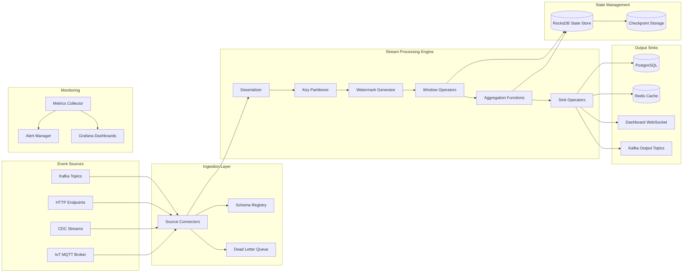
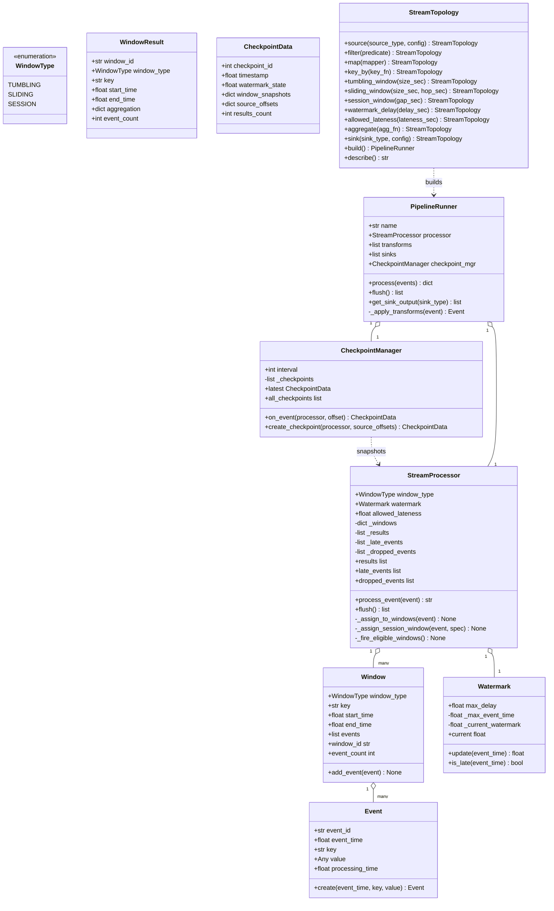
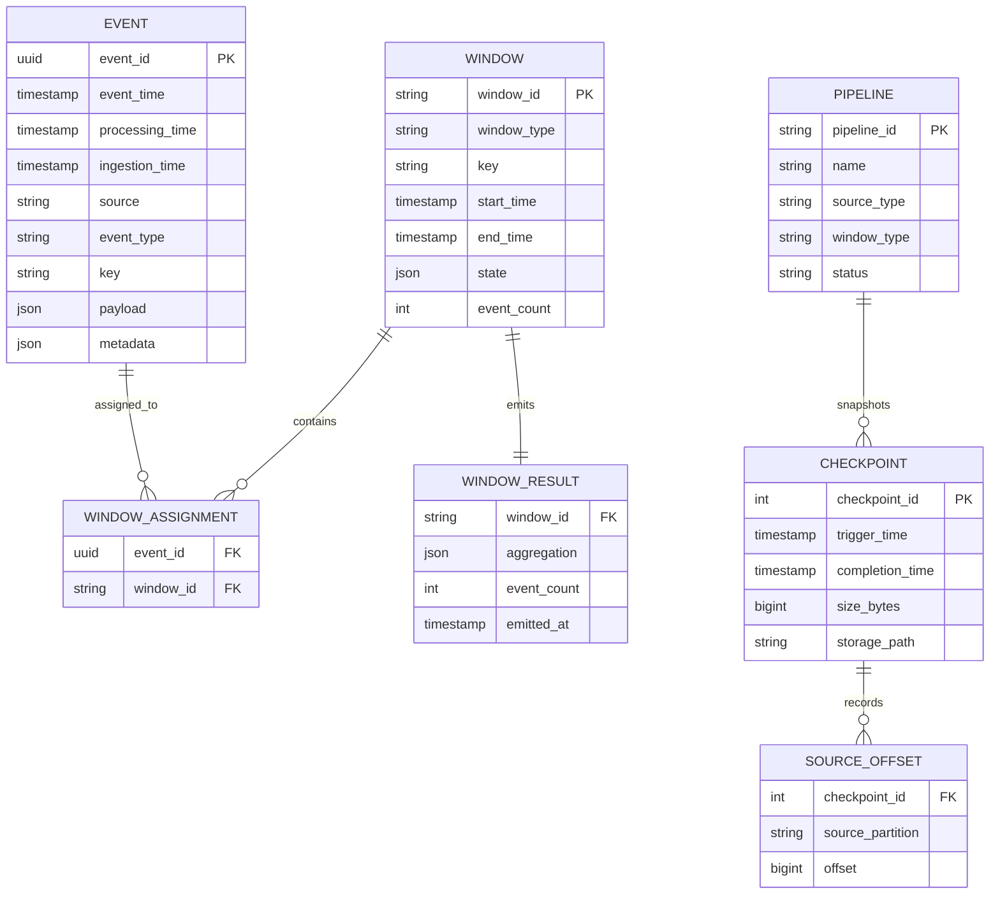
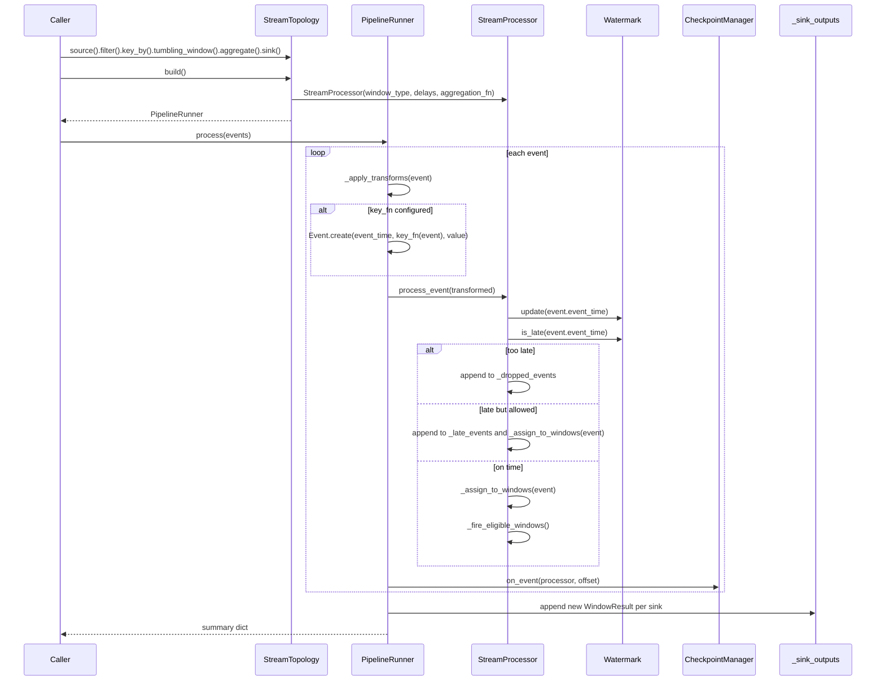
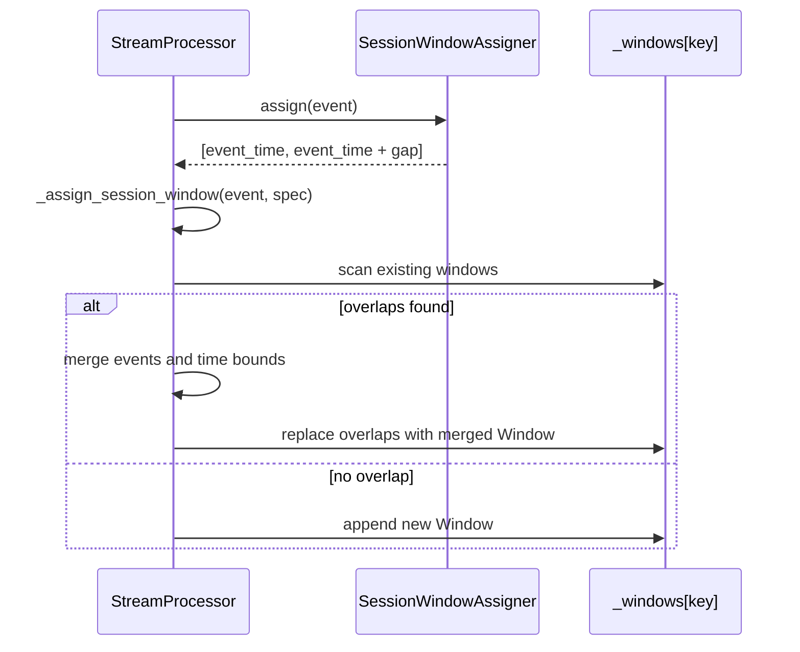
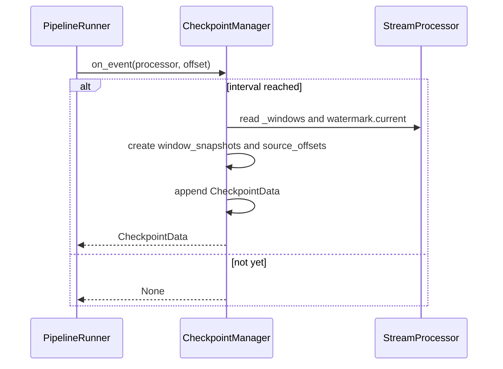

# Real-Time Streaming Data Pipeline — Architecture

> **Scope of this document.** This is the consolidated architecture reference for
> the Streaming Pipeline system. It preserves the README system-design material
> and maps it to the reference implementation in `streaming_pipeline.py`, a
> single-process event-time simulation. Sections tagged **[Design-only]**
> describe production capabilities not present in the simulation; sections tagged
> **[Implemented]** map directly to code.

---

## 1. Problem Statement

Modern businesses generate high-volume events from user interactions, IoT
sensors, financial transactions, application logs, and CDC streams. Real-time
insight enables live analytics, fraud detection, personalized recommendations,
alerting, and anomaly detection.

Nightly ETL introduces hours of latency, so the target is a streaming pipeline
that ingests events, performs event-time windowed computation, handles late and
out-of-order data, writes results to multiple sinks, and recovers from failures
without data loss or duplication.

---

## 2. Requirements

### 2.1 Functional Requirements

| ID | Requirement | Details | Status |
|----|-------------|---------|--------|
| FR-1 | High-velocity event ingestion | Accept Kafka, HTTP, CDC, IoT events at up to 1M events/sec per partition group. | ⚠️ In-memory lists only via `PipelineRunner.process(events)`; real connectors are **[Design-only]**. |
| FR-2 | Windowed aggregations | Tumbling, sliding, and session windows. | ✅ Implemented by `TumblingWindowAssigner`, `SlidingWindowAssigner`, `SessionWindowAssigner`, and `StreamProcessor`. |
| FR-3 | Exactly-once processing | Each event contributes exactly once under retry/failure. | ⚠️ `CheckpointManager` snapshots state summaries; end-to-end exactly-once sinks are **[Design-only]**. |
| FR-4 | Late data handling | Watermarks and allowed lateness thresholds. | ✅ Implemented by `Watermark.update()`, `Watermark.is_late()`, and `StreamProcessor.process_event()`. |
| FR-5 | Multi-sink output | Write to DBs, Redis, WebSockets, Kafka. | ⚠️ Implemented as in-memory `PipelineRunner._sink_outputs`; real sinks are **[Design-only]**. |
| FR-6 | Schema evolution | Integrate with schema registry. | ❌ **[Design-only]**; `Event.value` is untyped `Any`. |
| FR-7 | Dead letter queue | Route malformed/late events. | ⚠️ Too-late events go to `StreamProcessor._dropped_events`; real DLQ topic is **[Design-only]**. |
| FR-8 | Stream topology definition | Builder API source → transform → window → sink. | ✅ Implemented by `StreamTopology` and `PipelineRunner`. |
| FR-9 | Backpressure management | Slow ingestion when downstream cannot keep up. | ❌ **[Design-only]**; execution is synchronous with no flow control. |

### 2.2 Non-Functional Requirements [Design-only targets]

| ID | Requirement | Target |
|----|-------------|--------|
| NFR-1 | End-to-end latency | < 1 second p99 |
| NFR-2 | Throughput | >= 1,000,000 events/sec per horizontally scalable instance |
| NFR-3 | Exactly-once | Zero duplicates and zero data loss for normal operations and single-node failures |
| NFR-4 | Out-of-order handling | Events up to 5 minutes out of order |
| NFR-5 | Availability | 99.99% uptime |
| NFR-6 | Recovery time | Resume within 30 seconds after task-manager failure |
| NFR-7 | State size | Up to 1 TB managed keyed state |
| NFR-8 | Checkpoint duration | Incremental checkpoints in < 5 seconds for 100 GB state |

---

## 3. Capacity Estimation [Design-only]

| Area | Estimate |
|------|----------|
| Peak events/sec | 1,000,000 |
| Average event size | 500 bytes |
| Peak bandwidth | 500 MB/sec, about 4 Gbps |
| Daily event volume | ~50 billion events, ~25 TB raw |
| Tumbling state | ~5 GB for 1-min windows and 100 K keys |
| Sliding state | ~50 GB for 5-min windows, 30-sec hop, 100 K keys |
| Session state | ~20 GB for 30-min gap and 1 M users |
| Total state | ~75 GB typical, up to 1 TB peak |
| Checkpoint interval | 30 seconds |
| Incremental checkpoint | ~500 MB delta |
| 7-day checkpoint storage | ~1 TB |
| Flink cluster | 20-50 task managers, 8-16 cores, 32-64 GB each |
| Kafka partitions | 100-500 input partitions |

---

## 4. High-Level Architecture [Design-only]



---

## 5. Reference Implementation Overview [Implemented]

`streaming_pipeline.py` includes a lightweight `Event`, `Window`, `WindowResult`,
bounded-out-of-orderness `Watermark`, three window assigners, `StreamProcessor`,
`CheckpointManager`, and a fluent `StreamTopology` builder that creates a
`PipelineRunner`.



### 5.1 Component Deep-Dive (doc → code)

| Design concept | Implemented by | Notes |
|----------------|----------------|-------|
| Event-time event | `Event` | `event_id`, `event_time`, `key`, `value`, `processing_time`. |
| Tumbling windows | `TumblingWindowAssigner.assign()` | One fixed, non-overlapping window. |
| Sliding windows | `SlidingWindowAssigner.assign()` | All overlapping windows containing the event. |
| Session windows | `SessionWindowAssigner.assign()` + `_assign_session_window()` | Candidate windows are merged per key. |
| Watermarks | `Watermark.update()` and `is_late()` | `current = max_event_time - max_delay`. |
| Late handling | `StreamProcessor.process_event()` | Accepted within `allowed_lateness`, otherwise dropped. |
| Window firing | `_fire_eligible_windows()` and `flush()` | Emits `WindowResult`. |
| Aggregation | `_default_aggregation()` or custom `aggregation_fn` | Count/sum/min/max/avg for numeric values by default. |
| Checkpointing | `CheckpointManager.create_checkpoint()` | Captures watermark, window summaries, offsets, result count. |
| Builder API | `StreamTopology` | Source, transforms, keying, window, aggregation, sinks. |
| Runner | `PipelineRunner.process()` | Applies transforms, processes events, checkpoints, delivers results to memory sinks. |

---

## 6. Data Model

### 6.1 Conceptual production model [Design-only]



### 6.2 As implemented [Implemented]

`Event` omits source/schema metadata. `Window` stores full `list[Event]` rather
than compact state. `CheckpointData` stores a state summary but cannot restore a
processor. `PipelineRunner._sink_outputs` simulates sinks with
`dict[str, list[WindowResult]]`.

---

## 7. API Design

### 7.1 Production API [Design-only]

| Endpoint | Purpose |
|----------|---------|
| `POST /api/v1/streams` | Define source, transforms, window, aggregation, sinks. |
| `GET /api/v1/topologies` | List topologies. |
| `POST /api/v1/topologies` | Deploy topology. |
| `GET /api/v1/topologies/{id}` | Topology details. |
| `PUT /api/v1/topologies/{id}/scale` | Scale parallelism. |
| `POST /api/v1/topologies/{id}/savepoint` | Trigger savepoint. |
| `POST /api/v1/topologies/{id}/restart` | Restart from savepoint. |
| `DELETE /api/v1/topologies/{id}` | Stop topology. |
| `GET /api/v1/metrics/throughput` | Events/sec. |
| `GET /api/v1/metrics/latency` | p50, p95, p99. |
| `GET /api/v1/metrics/backpressure` | Backpressure per operator. |
| `GET /api/v1/metrics/checkpoints` | Checkpoint duration/size. |
| `GET /api/v1/metrics/watermark` | Watermark per partition. |
| `GET /api/v1/metrics/state-size` | Managed state size. |

### 7.2 In-process API [Implemented]

| Method | Signature | Raises / Notes |
|--------|-----------|----------------|
| `Event.create` | `(event_time: float, key: str, value: Any) -> Event` | Generates UUID. |
| `Watermark.update` | `(event_time: float) -> float` | Advances watermark. |
| `Watermark.is_late` | `(event_time: float) -> bool` | Compares with current watermark. |
| `TumblingWindowAssigner.assign` | `(event: Event) -> list[tuple[float, float]]` | One window. |
| `SlidingWindowAssigner.assign` | `(event: Event) -> list[tuple[float, float]]` | Multiple windows. |
| `SessionWindowAssigner.assign` | `(event: Event) -> list[tuple[float, float]]` | Candidate window; merge in processor. |
| `StreamProcessor.process_event` | `(event: Event) -> str` | `processed`, `late_processed`, or `dropped`. |
| `StreamProcessor.flush` | `() -> list[WindowResult]` | Force-fires open windows. |
| `CheckpointManager.on_event` | `(processor, offset) -> CheckpointData | None` | Interval-triggered checkpoint. |
| `StreamTopology.build` | `() -> PipelineRunner` | `ValueError` if window or sink missing. |
| `PipelineRunner.process` | `(events: list[Event]) -> dict` | Finite-batch processing summary. |
| `PipelineRunner.get_sink_output` | `(sink_type: str) -> list[WindowResult]` | Reads in-memory sink. |

---

## 8. Key Workflows [Implemented]

### 8.1 Event processing through a built topology



### 8.2 Session window merge



### 8.3 Checkpoint creation



---

## 9. Detailed Component Design

### 9.1 Windowing [Implemented]

Tumbling windows use floor division to compute one fixed window. Sliding windows
walk hop-aligned start times to return every overlapping window. Session windows
start as `[event_time, event_time + gap)` and are merged when overlapping windows
exist for the same key.

### 9.2 Watermarks and late data [Implemented]

`Watermark` tracks max observed event time and sets `current` to
`max_event_time - max_delay`. `StreamProcessor.process_event()` appends events to
`_late_events` if lateness is within `allowed_lateness`; otherwise it appends to
`_dropped_events`.

### 9.3 Aggregation and results [Implemented]

The default aggregation returns count, sum, min, max, and avg for numeric values.
Custom functions can be passed to `StreamProcessor` or `StreamTopology.aggregate()`.
Windows fire when `window.end_time <= watermark.current`, or when `flush()` is
called at the end of a finite stream.

### 9.4 Checkpointing [Implemented + Design-only]

`CheckpointManager.create_checkpoint()` captures checkpoint ID, timestamp,
watermark, open window summaries, source offsets, and result count. There is no
restore method; actual RocksDB restore, checkpoint barriers, unaligned
checkpoints, and distributed snapshots are **[Design-only]**.

### 9.5 Topology builder [Implemented]

`StreamTopology` is a Builder pattern implementation. It stores source metadata,
filters, maps, keying, window config, delays, aggregation, and sink descriptors.
`build()` validates required window/sink configuration and creates a runner.

---

## 10. Architectural Patterns [Design-only]

- **Kappa Architecture:** one streaming path over a replayable event log.
- **Event Sourcing:** immutable raw events derive windows and aggregates.
- **Windowed Aggregation:** finite windows over unbounded streams.
- **Watermark-Based Late Data Handling:** watermarks decide when windows can fire.
- **Checkpoint-Barrier Algorithm:** globally consistent snapshots; simulated only
  as `CheckpointData`.
- **Builder Pattern:** `StreamTopology` composes source → transform → window → sink.

---

## 11. Technology Choices & Trade-offs [Design-only]

| Decision | Choice | Alternative | Rationale |
|----------|--------|-------------|-----------|
| Stream engine | Apache Flink | Spark Structured Streaming, Kafka Streams, Storm | True streaming, native exactly-once, rich windows. |
| State backend | RocksDB | JVM heap | TB-scale state and incremental checkpoints. |
| Source log | Kafka | Kinesis | High throughput, ecosystem, replayability. |
| Sinks | Idempotent/transactional | At-least-once only | Needed for end-to-end correctness. |

Exactly-once has trade-offs: idempotent sinks are low overhead, checkpoint
barriers add modest overhead, and transactional two-phase commit adds latency and
complexity.

---

## 12. Scaling, Reliability & Security [Design-only]

Scale by partitioning Kafka topics, mapping partitions to task slots, keying
events by business key, and adding task managers. Mitigate hot keys with local
pre-aggregation, state TTL, incremental checkpoints, co-located operators, async
sink I/O, and multiple sink writers.

Reliability uses Kafka replication factor 3, checkpointed offsets, S3/HDFS
checkpoints, RocksDB WAL, leader election, circuit breakers, DLQs, and graceful
shutdown with savepoints.

Security uses TLS, encrypted checkpoints/state, Kafka mTLS or SASL/SCRAM, Kafka
ACLs, RBAC for Flink UI/API, PII tokenization before windowing, retention TTLs,
audit logs, and private VPC deployment.

Monitoring covers throughput, watermark lag, processing latency p99,
backpressure, checkpoint failures/duration, state size, consumer lag, GC pauses,
and restarts. The README's stack is Flink metrics → Prometheus/Grafana and
AlertManager, Flink UI, Burrow, and Jaeger/Zipkin.

---

## 13. Running the Simulation [Implemented]

```powershell
uv run --no-project python SystemDesign\StreamingPipeline\streaming_pipeline.py
```

The demo runs tumbling windows with late data, sliding windows, session windows,
the topology builder, and checkpoint snapshots.

### Suggested tests

- Assigners place boundary events in expected windows.
- `StreamProcessor.process_event()` returns `late_processed` and `dropped` for
  correct watermark/lateness cases.
- Session windows merge when overlapping events arrive.
- `StreamTopology.build()` raises without window/sink configuration.
- `PipelineRunner.process()` applies filters, keying, aggregation, and sink output.
- `CheckpointManager.create_checkpoint()` captures watermark, offsets, windows.

---

## 14. Future Improvements

- Add Kafka/HTTP/CDC/MQTT source connectors.
- Add schema registry validation and a real DLQ.
- Add restore from `CheckpointData`.
- Add idempotent and transactional sink implementations.
- Add backpressure simulation with bounded queues.
- Deduplicate by `event_id`.
- Add REST APIs for topology deployment, savepoints, scaling, and metrics.
