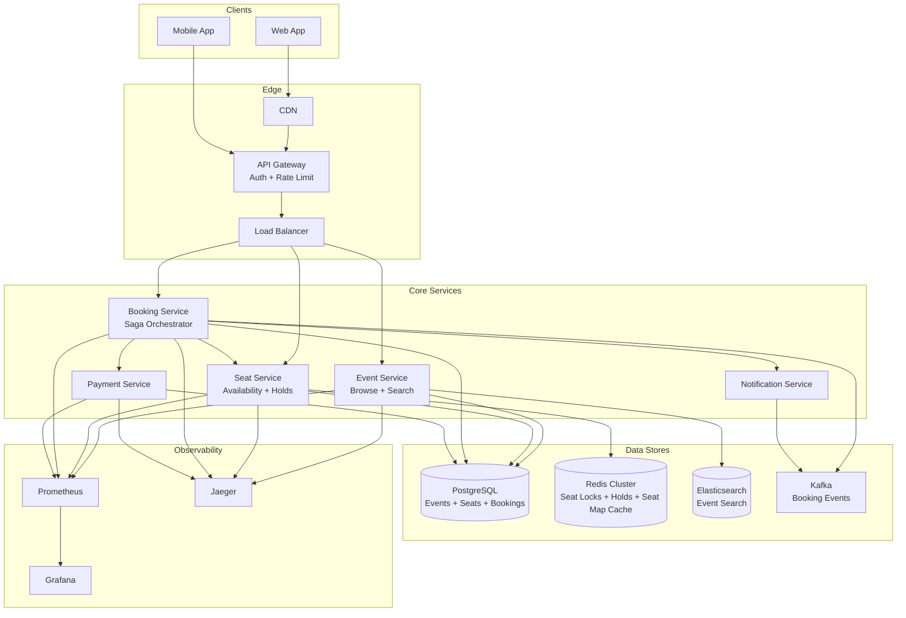
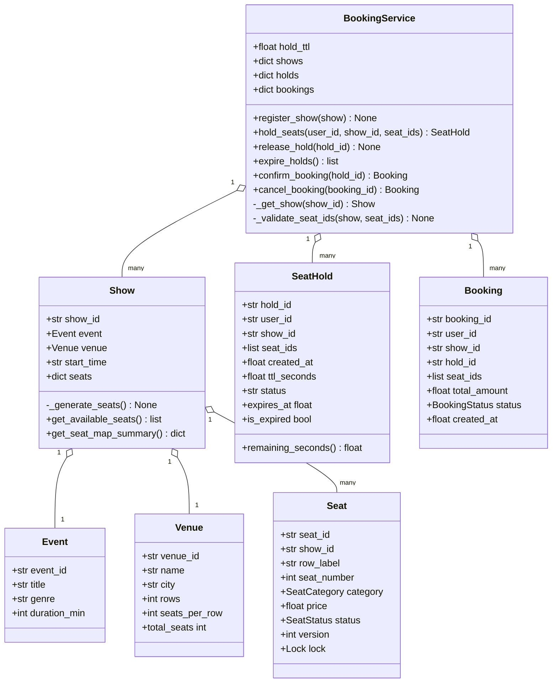
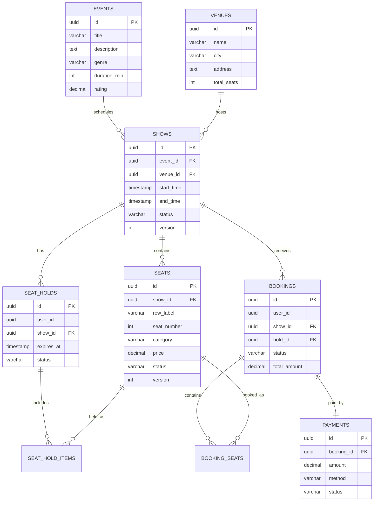
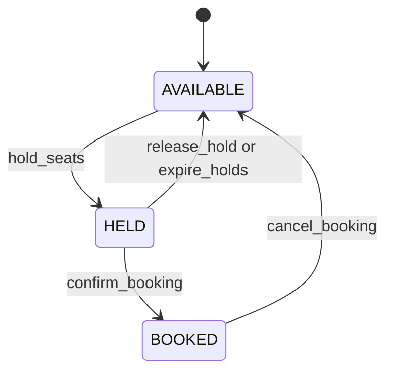

# Ticket Booking System — Architecture

> **Scope of this document.** This is the consolidated architecture reference for
> the Ticket Booking System. It preserves the production design from `README.md`
> and maps it to the reference implementation in
> [`ticket_booking.py`](./ticket_booking.py), a single-process, in-memory
> simulation. Sections tagged **[Design-only]** describe production concerns not
> present in the simulation; sections tagged **[Implemented]** map directly to
> code.

---

## 1. Problem Statement

Design a BookMyShow/Fandango/TicketMaster-like platform where users browse
events, view real-time seat maps, temporarily hold selected seats, complete
payment, and cancel bookings. The key invariant is strict: the same seat for the
same show must never be sold to two users, even during flash sales with
thousands of simultaneous users.

---

## 2. Requirements

### 2.1 Functional Requirements

| ID | Requirement | Details | Status |
|----|-------------|---------|--------|
| FR-1 | Browse events/movies | Search by city, genre, date, and venue. | ⚠️ Domain objects implemented (`Event`, `Venue`, `Show`); search service is **[Design-only]** |
| FR-2 | View seat map | Display available, held, and booked seats for a show. | ✅ Implemented (`Show.get_available_seats`, `Show.get_seat_map_summary`) |
| FR-3 | Select seats | Atomically validate selected seats. | ✅ Implemented (`BookingService.hold_seats`) |
| FR-4 | Hold seats temporarily | Hold selected seats for a configurable TTL. | ✅ Implemented (`SeatHold`, `hold_ttl`, `expire_holds`) |
| FR-5 | Book and pay | Confirm a hold and transition seats to booked; real payment gateway is simulated. | ✅ Booking implemented (`confirm_booking`); payment is **[Design-only]** |
| FR-6 | Cancel booking | Cancel confirmed booking and return seats to available. | ✅ Implemented (`cancel_booking`) |
| FR-7 | View booking history | Return historical bookings for a user. | ❌ **[Design-only]**; `bookings` dict exists but no query API |
| FR-8 | Notifications | Confirmation, cancellation, and reminder messages. | ❌ **[Design-only]** |

### 2.2 Non-Functional Requirements [Design-only targets]

| ID | Requirement | Target |
|----|-------------|--------|
| NFR-1 | No double booking | A seat must never be sold twice for the same show |
| NFR-2 | Seat hold timeout | Auto-release holds after 10 minutes |
| NFR-3 | Flash-sale concurrency | 10,000+ concurrent seat-selection attempts per event |
| NFR-4 | Seat selection latency | p99 < 500 ms |
| NFR-5 | Availability | 99.99% uptime for booking flow |
| NFR-6 | Consistency | Strong consistency for seat state; eventual consistency for read views |
| NFR-7 | Data durability | Zero booking data loss |

---

## 3. Capacity Estimation [Design-only]

### 3.1 Assumptions

| Metric | Value |
|--------|-------|
| Total events per day | 5,000 |
| Average seats per event | 500 |
| Total seats across all events/day | 2,500,000 |
| Bookings per day | 500,000 |
| Average seats per booking | 3 |
| Peak concurrent seat selections | 10,000 for one event |
| Seat map views per day | 5,000,000 |

### 3.2 Storage

| Entity | Record Size | Daily Records | Daily Storage |
|--------|-------------|---------------|---------------|
| Events | ~2 KB | 5,000 | ~10 MB |
| Shows | ~1 KB | 20,000 | ~20 MB |
| Seats per show | ~200 B | 10,000,000 | ~2 GB |
| Seat holds | ~300 B | 1,000,000 | ~300 MB transient |
| Bookings | ~1 KB | 500,000 | ~500 MB |

### 3.3 Throughput

| Operation | QPS average | QPS peak |
|-----------|-------------|----------|
| Browse events | 500 | 5,000 |
| View seat map | 60 | 2,000 |
| Select seats | 20 | 10,000 |
| Confirm booking | 6 | 500 |

---

## 4. High-Level Architecture [Design-only]



The production write path uses per-seat distributed locks plus database
constraints. Read-heavy seat maps can be cached in Redis and refreshed through
Kafka events.

---

## 5. Reference Implementation Overview [Implemented]

`ticket_booking.py` implements one in-memory booking service. The important
current behavior is **per-seat locking**: each `Seat` owns its own
`threading.Lock`, and `BookingService.hold_seats()` acquires requested seat locks
in sorted seat-id order. This gives all-or-nothing holds while avoiding deadlocks.
There is no global booking lock.



### 5.1 Component Deep-Dive (doc → code)

| Design concept | Implemented by | Notes |
|----------------|----------------|-------|
| Event catalog object | `Event` | Holds id, title, genre, and duration; no search index. |
| Venue layout | `Venue.rows`, `Venue.seats_per_row`, `Venue.total_seats` | Determines generated seat map size. |
| Show seat map | `Show._generate_seats()` and `Show.seats` | Creates seat ids like `A1`; row thirds map to PLATINUM, GOLD, SILVER. |
| Seat state | `Seat.status: SeatStatus` | `AVAILABLE`, `HELD`, or `BOOKED`. |
| Optimistic version | `Seat.version` | Incremented on every state mutation; used as an audit/safeguard signal. |
| Per-seat concurrency control | `Seat.lock` and `BookingService.hold_seats()` | Locks are acquired in sorted seat-id order for deadlock avoidance and all-or-nothing holds. |
| Hold TTL | `SeatHold.expires_at`, `is_expired`, `remaining_seconds()` | Expiration is lazy via `expire_holds()` or `confirm_booking()`. |
| Booking confirmation | `confirm_booking()` | Validates active hold, checks expiry, transitions seats from HELD to BOOKED, creates `Booking`. |
| Cancellation compensation | `cancel_booking()` | Transitions seats back to AVAILABLE and marks booking CANCELLED. |
| Flash-sale proof | `main()` race demo | Five threads race for `A1`; assertion requires exactly one winner. |

---

## 6. Data Model

### 6.1 Conceptual production model [Design-only]



The README SQL table definitions are represented here: `events`, `venues`,
`shows`, `seats`, `seat_holds`, `seat_hold_items`, `bookings`,
`booking_seats`, and `payments`. Production indexes include
`idx_seats_show_status` and `idx_holds_expires`.

### 6.2 As implemented [Implemented]

The simulation uses in-memory objects:

- `BookingService.shows: dict[str, Show]`
- `Show.seats: dict[str, Seat]`
- `BookingService.holds: dict[str, SeatHold]`
- `BookingService.bookings: dict[str, Booking]`

There is no persistent user table, payment table, booking-seat join table,
notification log, or search index in code.

---

## 7. API Design

### 7.1 Production HTTP surface [Design-only]

| Method & Path | Purpose | Success / Failure |
|---------------|---------|-------------------|
| `GET /api/v1/events?city=&date=&genre=` | Browse events. | `200 OK` |
| `GET /api/v1/events/{eventId}` | Event details. | `200 OK` |
| `GET /api/v1/events/{eventId}/shows?date=&venueId=` | Shows for event and venue. | `200 OK` |
| `GET /api/v1/shows/{showId}/seats` | Seat map with status, category, price. | `200 OK` |
| `POST /api/v1/shows/{showId}/seats/hold` | Hold seats for a user. | `200 OK` or `409 SEATS_UNAVAILABLE` |
| `DELETE /api/v1/holds/{holdId}` | Release hold. | `200 OK` |
| `POST /api/v1/bookings` | Confirm booking from hold and payment method. | `201 Created`, `400 HOLD_EXPIRED`, or `402 PAYMENT_FAILED` |
| `DELETE /api/v1/bookings/{bookingId}` | Cancel booking and refund. | `200 OK` |
| `GET /api/v1/users/{userId}/bookings` | Booking history. | `200 OK` |
| `POST /api/v1/payments` | Process payment. | `200 SUCCESS` or `402 FAILED` |

### 7.2 In-process API [Implemented]

| Method | Signature | Raises / Failure |
|--------|-----------|------------------|
| `register_show` | `(show: Show) -> None` | — |
| `hold_seats` | `(user_id: str, show_id: str, seat_ids: list[str]) -> SeatHold` | `ValueError` for missing show, invalid seat, timeout, or unavailable seat |
| `release_hold` | `(hold_id: str) -> None` | No-op when missing or inactive |
| `expire_holds` | `() -> list[str]` | Returns expired hold ids |
| `confirm_booking` | `(hold_id: str) -> Booking` | `ValueError` for missing, inactive, expired, or inconsistent hold |
| `cancel_booking` | `(booking_id: str) -> Booking` | `ValueError` for missing or non-confirmed booking |
| `Show.get_available_seats` | `() -> list[Seat]` | — |
| `Show.get_seat_map_summary` | `() -> dict[str, int]` | — |

---

## 8. Key Workflows [Implemented]

### 8.1 Hold seats with per-seat locks

```mermaid
sequenceDiagram
    participant C as Caller
    participant BS as BookingService
    participant SH as Show
    participant SEAT as Seat
    C->>BS: hold_seats(user_id, show_id, seat_ids)
    BS->>BS: _get_show(show_id)
    BS->>BS: _validate_seat_ids(show, seat_ids)
    BS->>BS: sorted_ids = sorted(seat_ids)
    loop each sid in sorted_ids
        BS->>SEAT: seat.lock.acquire(timeout=2.0)
        alt lock timeout
            BS-->>C: ValueError
        else lock acquired
            BS->>SEAT: check status == AVAILABLE
        end
    end
    alt every seat locked and available
        loop locked seats
            BS->>SEAT: status = HELD; version += 1
        end
        BS->>BS: create SeatHold and store holds[hold_id]
        BS-->>C: SeatHold
    else any seat unavailable
        BS->>SEAT: revert only marked seats to AVAILABLE
        BS-->>C: ValueError
    end
    BS->>SEAT: release all acquired locks
```

Sorted lock acquisition is the deadlock-avoidance mechanism: concurrent requests
for overlapping sets acquire seats in the same order, so they cannot wait on each
other cyclically. The operation is all-or-nothing because seats are marked only
after all requested locks and availability checks succeed.

### 8.2 Confirm booking from hold

```mermaid
sequenceDiagram
    participant C as Caller
    participant BS as BookingService
    participant H as SeatHold
    participant S as Seat
    participant B as Booking
    C->>BS: confirm_booking(hold_id)
    BS->>H: lookup hold
    alt hold missing or inactive
        BS-->>C: ValueError
    else hold active
        BS->>H: is_expired?
        alt expired
            BS->>BS: release_hold(hold_id)
            BS->>H: status = EXPIRED
            BS-->>C: ValueError
        else live
            loop seat_ids
                BS->>S: with seat.lock
                BS->>S: require status == HELD
                BS->>S: status = BOOKED; version += 1
            end
            BS->>H: status = BOOKED
            BS->>B: Booking(..., CONFIRMED)
            BS->>BS: bookings[booking_id] = booking
            BS-->>C: Booking
        end
    end
```

### 8.3 Expire and release holds

```mermaid
sequenceDiagram
    participant Timer as Caller
    participant BS as BookingService
    participant H as SeatHold
    participant S as Seat
    Timer->>BS: expire_holds()
    loop holds.values()
        BS->>H: status == ACTIVE and is_expired?
        alt expired
            BS->>BS: release_hold(hold_id)
            loop held seats
                BS->>S: with seat.lock
                BS->>S: HELD to AVAILABLE; version += 1
            end
            BS->>H: status = EXPIRED
        else not expired
            BS->>BS: skip
        end
    end
    BS-->>Timer: list of expired hold ids
```

---

## 9. Detailed Component Design

### 9.1 Seat Selection with Per-Seat Locks [Implemented]

The README describes Redis `SETNX`/distributed locks and optimistic locking. The
current Python code simulates that at object level:

- `Seat.lock` is a `threading.Lock` attached to each seat.
- `BookingService.hold_seats()` sorts the requested `seat_ids` and acquires each
  corresponding lock in that order.
- If any lock times out or any seat is not `AVAILABLE`, the method raises
  `ValueError`.
- Only seats marked by the current attempt are reverted on failure.
- `finally` releases every acquired lock.

This is more precise than a global lock and allows independent seat selections
to proceed concurrently.

### 9.2 Temporary Hold with TTL [Implemented]

`SeatHold` stores `created_at` and `ttl_seconds`; `expires_at` and `is_expired`
are computed properties. Expiration is lazy: `expire_holds()` must be called by
a scheduler/demo, and `confirm_booking()` also checks expiry before booking.
Production Redis key TTL and keyspace notifications are **[Design-only]**.

### 9.3 Booking State Machine [Implemented]



Code-level status enums are `SeatStatus` (`AVAILABLE`, `HELD`, `BOOKED`) and
`BookingStatus` (`PENDING`, `CONFIRMED`, `CANCELLED`, `EXPIRED`). The production
README's `PAYMENT_PENDING` state is **[Design-only]** because payment is not a
separate service in code.

### 9.4 Distributed Lock and Database Safeguards [Design-only]

At production scale, each seat lock would be `seat_lock:{showId}:{seatId}` in
Redis using `SET NX EX`. PostgreSQL keeps the durable seat status and a `version`
column. If Redis fails or a lock expires early, conditional database updates and
unique/constraint checks remain the final defense.

---

## 10. Architectural Patterns [Design-only]

- **Distributed Locking:** Redis `SETNX` per seat protects high-contention seat
  holds.
- **Optimistic Concurrency Control:** seat rows include `version`; updates check
  expected version and current status.
- **Finite State Machine:** valid transitions prevent illegal seat and booking
  states.
- **Saga Pattern:** hold seats, process payment, confirm booking, send
  notification, and compensate by release/refund on failure.
- **CQRS:** write path updates PostgreSQL through locks; read path serves seat
  maps from Redis cache and event updates.

---

## 11. Technology Choices & Trade-offs [Design-only]

| Component | Technology | Rationale |
|-----------|------------|-----------|
| Seat locks | Redis Cluster | Atomic `SETNX`, TTL, sub-ms latency, high throughput |
| Primary DB | PostgreSQL | ACID transactions, constraints, row/version checks |
| Event search | Elasticsearch | Full-text and geo search for events and venues |
| Message bus | Kafka | Durable booking events and replay |
| API gateway | Kong / Envoy | Auth, rate limiting, routing, circuit breaking |
| Cache | Redis | Seat maps, session data, rate counters |
| Notification | SQS + Lambda or Kafka consumers | Async delivery with retry |
| Monitoring | Prometheus + Grafana | Metrics, dashboards, alerting |
| Tracing | Jaeger / OpenTelemetry | Cross-service booking traces |
| Orchestration | Kubernetes | Autoscaling and rolling deploys |

Redis locks are fast but not durable, so PostgreSQL remains the source of truth.
Database locks are safer but create contention under flash-sale traffic; the
hybrid approach gets speed with durable correctness.

---

## 12. Scaling, Reliability & Security [Design-only]

### Scaling

- Shard Seat Service and Redis by `showId`; hot shows can get dedicated shards.
- Use a virtual waiting room and request queue during flash sales.
- Pre-compute and cache seat maps, updating changed seats atomically.
- Serve browse/search from read replicas and Elasticsearch.
- Partition large `seats` tables by `show_id`; archive completed bookings after
  90 days.

### Reliability

| Failure | Impact | Mitigation |
|---------|--------|------------|
| Redis node down | Seat locks unavailable | Redis Cluster failover; fallback to DB locks |
| PostgreSQL primary down | Writes fail | Synchronous replication and automatic failover |
| Payment timeout | Booking stuck | Timeout, retry, idempotency keys, compensation |
| Kafka broker down | Events delayed | Multi-broker cluster and producer retries |
| Hold cleanup missed | Seats stuck HELD | Background cleanup plus Redis keyspace notifications |

All booking operations should be idempotent: `holdId` deduplicates hold retries
and `bookingId`/payment idempotency key deduplicates payment retries. Payment
calls use a circuit breaker with closed, open, and half-open states.

### Security

| Layer | Measure |
|-------|---------|
| Authentication | JWT access tokens and refresh tokens |
| Authorization | Users access only their bookings; admins manage events |
| Rate limiting | Per-user and per-IP limits; stricter seat-hold limits |
| Input validation | Validate show and seat ids server-side |
| Payment security | PCI-DSS and tokenized card data |
| Data encryption | TLS 1.3 in transit and AES-256 at rest |
| Anti-bot | CAPTCHA and device fingerprinting for hot events |
| Audit trail | Immutable state-transition logs |

### Monitoring

Critical alerts include seat-selection p99 > 500 ms, booking success rate < 95%,
seat-hold expiry rate > 30%, payment failure rate > 5%, Redis lock contention >
50%, and any double-booking incident > 0.

---

## 13. Running the Simulation [Implemented]

```powershell
uv run --no-project python SystemDesign\TicketBooking\ticket_booking.py
```

The demo creates an event, venue, generated show seat map, conflicting holds,
TTL expiry, booking confirmation, cancellation, and a five-thread race for the
same seat with an assertion that exactly one booking wins.

### Suggested tests

- Two users cannot hold the same seat concurrently.
- Multi-seat holds are all-or-nothing when one requested seat is unavailable.
- Overlapping multi-seat requests do not deadlock because locks are sorted.
- `expire_holds()` releases held seats and returns expired hold ids.
- `confirm_booking()` rejects expired or inactive holds.
- `cancel_booking()` returns booked seats to `AVAILABLE`.

---

## 14. Future Improvements

- Add event/search APIs and user booking-history queries.
- Add a real payment state and separate payment-failure compensation path.
- Replace in-memory locks with a Redis adapter while retaining per-seat lock
  semantics and sorted acquisition.
- Persist shows, seats, holds, bookings, and payments in a database.
- Add automatic background hold cleanup instead of manual `expire_holds()`.
- Add tests for deadlock avoidance and race-condition behavior.
