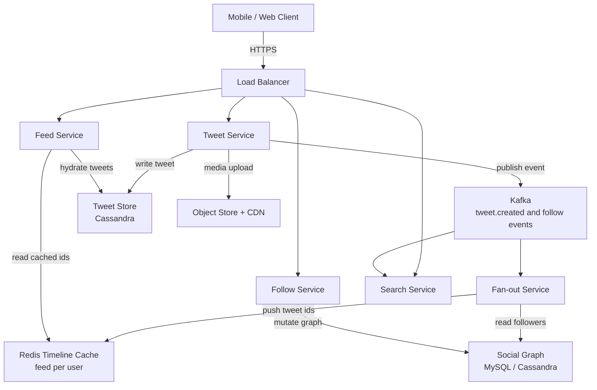
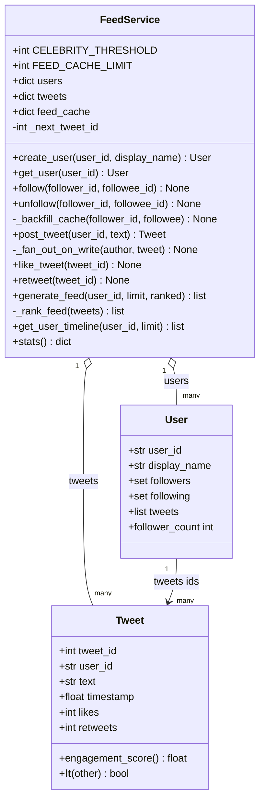
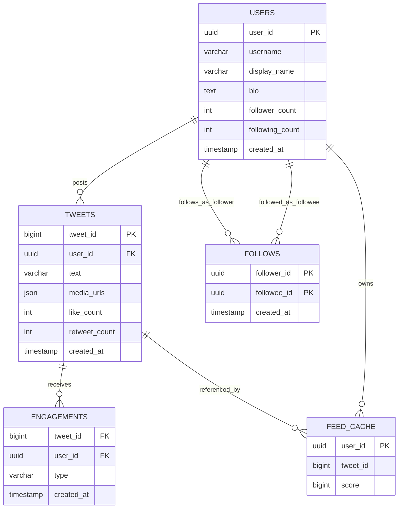
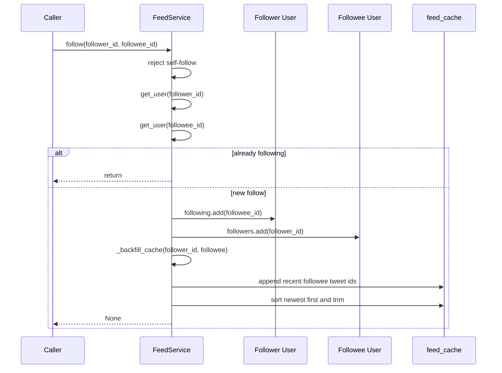
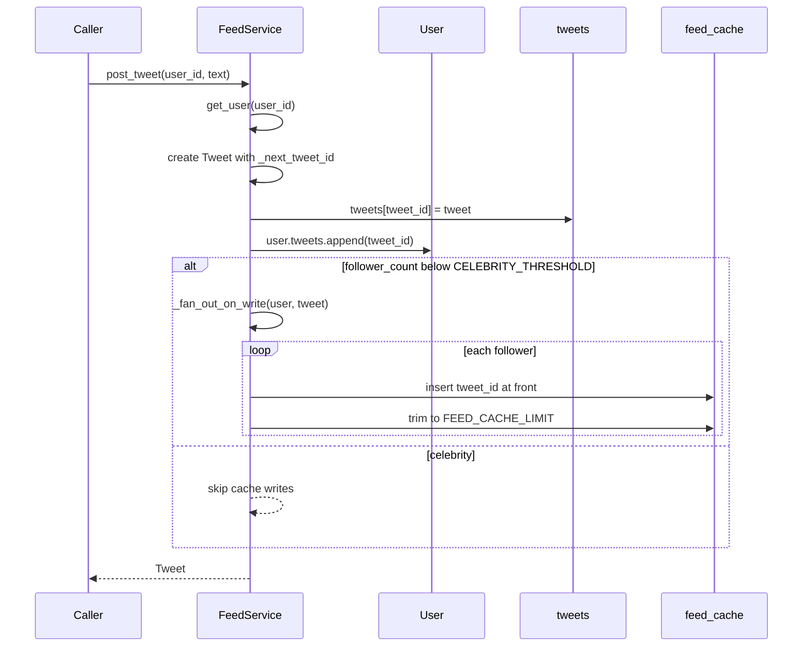
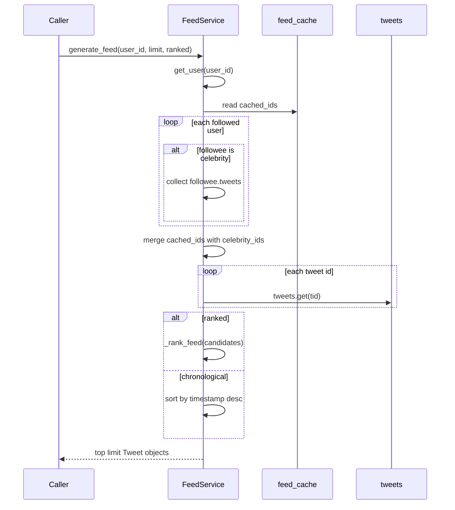

# Twitter / News Feed — Architecture

> **Scope of this document.** This is the consolidated architecture reference for
> the Twitter/News Feed system. It preserves the production design from
> [`README.md`](./README.md) and maps it to the reference implementation in
> [`twitter_feed.py`](./twitter_feed.py), a single-process, in-memory simulation.
> Sections tagged **[Design-only]** describe production capabilities not present
> in the simulation; sections tagged **[Implemented]** map directly to code.

---

## 1. Problem Statement

Design a social media feed system similar to Twitter where users can post short
messages, follow other users, and view a personalized news feed aggregated from
the accounts they follow. The system must handle hundreds of millions of users,
generate feeds with sub-second latency, and remain available even during partial
failures.

The core design challenge is balancing two competing costs:

- **Fast feed reads:** pre-materialize feeds so reads are O(1) or near-O(1).
- **Controlled write amplification:** avoid pushing every celebrity tweet to
  millions of follower caches.

The production design uses a **hybrid fan-out** strategy: normal users fan out on
write; celebrity users fan out on read. The simulation implements that same
decision in `FeedService.post_tweet()` and `FeedService.generate_feed()`.

---

## 2. Requirements

### 2.1 Functional Requirements

| # | Requirement | Details | Status |
|---|-------------|---------|--------|
| FR-1 | **Post Tweet** | A user can publish a short text tweet, with production support for up to 280 characters and optional media attachments. | ✅ Text posting implemented (`FeedService.post_tweet`); 280-character validation and media are **[Design-only]** |
| FR-2 | **Follow / Unfollow** | Users can follow or unfollow another user. | ✅ Implemented (`follow`, `unfollow`) |
| FR-3 | **News Feed** | Home timeline from followed accounts, reverse-chronological or ranked. | ✅ Implemented (`generate_feed(ranked=True/False)`) |
| FR-4 | **Like / Retweet** | Users can like or retweet tweets; engagement affects ranking. | ✅ Implemented as counters (`like_tweet`, `retweet`, `Tweet.engagement_score`); per-user like/retweet identity is **[Design-only]** |
| FR-5 | **User Timeline** | View all tweets posted by a specific user. | ✅ Implemented (`get_user_timeline`) |
| FR-6 | **Search** | Full-text search across tweets. | ❌ **[Design-only]** |
| FR-7 | **Delete Tweet** | API surface includes `DELETE /v1/tweets/{tweet_id}`. | ❌ **[Design-only]**; no delete method in code |
| FR-8 | **Celebrity fan-out strategy** | High-follower accounts are pulled at read time to avoid write amplification. | ✅ Implemented (`CELEBRITY_THRESHOLD`, `generate_feed`) |
| FR-9 | **Follow backfill / cleanup** | Following backfills recent tweets; unfollow removes cached tweets. | ✅ Implemented (`_backfill_cache`, `unfollow`) |

### 2.2 Non-Functional Requirements [Design-only targets]

| Attribute | Target |
|-----------|--------|
| **Latency** | Feed generation < 200 ms p99 |
| **Scale** | 500 M registered users, 200 M DAU |
| **Throughput** | ~600 K tweets/minute at peak |
| **Availability** | 99.99% uptime |
| **Consistency** | Eventual consistency acceptable for feed; strong consistency for follow/unfollow state |
| **Durability** | Zero tweet loss once acknowledged |
| **Security** | OAuth/JWT authentication, scoped tokens, API-gateway rate limiting, content moderation |

---

## 3. Capacity Estimation [Design-only]

### 3.1 Traffic

| Metric | Value |
|--------|-------|
| DAU | 200 M |
| Tweets per day | ~500 M |
| Average tweet reads per user/day | 100 |
| Read QPS average | ~230 K |
| Read QPS peak | ~700 K (3x average) |
| Write QPS average | ~6 K |
| Write QPS peak | ~18 K (3x average) |

### 3.2 Storage (5-year horizon)

| Item | Calculation | Total |
|------|-------------|-------|
| Tweet text | 500 M/day × 280 B × 365 × 5 | ~256 TB |
| Tweet metadata | 500 M/day × 200 B × 365 × 5 | ~183 TB |
| Media images | 50 M images/day × 200 KB × 365 × 5 | ~18.25 PB |
| User data | 500 M users × 1 KB | ~500 GB |
| Follow graph | 500 M users × 200 average follows × 16 B | ~1.6 TB |

### 3.3 Bandwidth

| Direction | Calculation | Rate |
|-----------|-------------|------|
| Ingress tweets | 6 K/s × 300 B | ~1.8 MB/s |
| Egress feeds | 230 K/s × 20 tweets × 300 B | ~1.38 GB/s |
| Media egress | Dominant; served via CDN | ~10+ GB/s |

---

## 4. High-Level Architecture [Design-only]



The write path persists tweets and publishes immutable events. The query path
reads a pre-materialized feed cache and hydrates tweet objects. Kafka decouples
tweet creation from fan-out so feed materialization can lag without blocking the
author.

---

## 5. Reference Implementation Overview [Implemented]

`twitter_feed.py` collapses the production services into a single `FeedService`
object. It uses in-memory dict/list/set structures instead of Redis, Kafka,
Cassandra, and a social-graph database, but it preserves the important feed
mechanics: follow graph mutation, fan-out on write, fan-out on read for
celebrities, ranking, user timelines, and engagement counters.



### 5.1 Component Deep-Dive (doc → code)

| Design concept | Implemented by | Notes |
|----------------|----------------|-------|
| User profile and graph node | `User` | Holds `followers`, `following`, and `tweets` as in-memory sets/lists. |
| Tweet record | `Tweet` | Stores text, author, timestamp, `likes`, and `retweets`. |
| Tweet ID generation | `FeedService._next_tweet_id` | Monotonic integer counter; production would use Snowflake/ULID. |
| Social graph mutation | `follow`, `unfollow`, `get_user` | Raises `ValueError` for self-follow and `KeyError` for unknown users. |
| Feed cache | `feed_cache: dict[str, list[int]]` | Simulates Redis sorted sets; stores tweet IDs newest first. |
| Backfill after follow | `_backfill_cache` | Copies recent followee tweets into follower cache and trims to `FEED_CACHE_LIMIT`. |
| Fan-out on write | `_fan_out_on_write` | Inserts normal-user tweet IDs into each follower's cache. |
| Fan-out on read | `generate_feed` | Pulls tweets from followed users whose `follower_count >= CELEBRITY_THRESHOLD`. |
| Ranking | `_rank_feed` | Score is `recency * 100 + engagement * 0.5`; production ML ranking is **[Design-only]**. |
| User timeline | `get_user_timeline` | Returns a user's own tweets newest first. |
| Stats | `stats` | Returns total users, total tweets, and feed-cache sizes. |

---

## 6. Data Model

### 6.1 Conceptual production schema [Design-only]



### 6.2 As implemented [Implemented]

| Production entity | In-memory equivalent |
|-------------------|----------------------|
| `users` table | `FeedService.users: dict[str, User]` |
| `tweets` table | `FeedService.tweets: dict[int, Tweet]` |
| `follows` table | `User.followers` and `User.following` sets |
| Redis sorted set `feed:{user_id}` | `FeedService.feed_cache[user_id]: list[int]` |
| Engagement table/counters | `Tweet.likes`, `Tweet.retweets` |

The simulation has no durable storage, no secondary indexes, no per-user
engagement identity, and no media metadata.

---

## 7. API Design

### 7.1 Production HTTP surface [Design-only]

| Method & Path | Purpose | Success |
|---------------|---------|---------|
| `POST /v1/tweets` | Create a tweet with `text` and optional `media_ids` | `201 Created` |
| `DELETE /v1/tweets/{tweet_id}` | Delete a tweet | `204 No Content` |
| `GET /v1/users/{user_id}/tweets?cursor=&limit=20` | User timeline | `200 OK` |
| `POST /v1/users/{user_id}/follow` | Follow a target user | `200 OK` |
| `POST /v1/users/{user_id}/unfollow` | Unfollow a target user | `200 OK` |
| `GET /v1/feed?cursor=&limit=20` | Home timeline | `200 OK` |
| `POST /v1/tweets/{tweet_id}/like` | Like a tweet | `200 OK` |
| `POST /v1/tweets/{tweet_id}/retweet` | Retweet | `200 OK` |
| `DELETE /v1/tweets/{tweet_id}/like` | Unlike a tweet | `204 No Content` |

All production endpoints require an `Authorization` header and rate limiting.

### 7.2 In-process API [Implemented]

| Method | Signature | Raises |
|--------|-----------|--------|
| `create_user` | `(user_id: str, display_name: str) -> User` | `ValueError` if user exists |
| `get_user` | `(user_id: str) -> User` | `KeyError` if missing |
| `follow` | `(follower_id: str, followee_id: str) -> None` | `ValueError` for self-follow; `KeyError` for missing users |
| `unfollow` | `(follower_id: str, followee_id: str) -> None` | `KeyError` for missing users |
| `post_tweet` | `(user_id: str, text: str) -> Tweet` | `KeyError` for missing user |
| `like_tweet` | `(tweet_id: int) -> None` | `KeyError` for missing tweet |
| `retweet` | `(tweet_id: int) -> None` | `KeyError` for missing tweet |
| `generate_feed` | `(user_id: str, limit: int = 20, ranked: bool = True) -> list[Tweet]` | `KeyError` for missing user |
| `get_user_timeline` | `(user_id: str, limit: int = 20) -> list[Tweet]` | `KeyError` for missing user |
| `stats` | `() -> dict` | — |

---

## 8. Key Workflows [Implemented]

### 8.1 Follow with feed backfill



### 8.2 Post tweet with hybrid fan-out



### 8.3 Generate home feed



---

## 9. Detailed Component Design

### 9.1 Tweet model [Implemented]

`Tweet` is the immutable-ish content unit plus mutable engagement counters. The
`engagement_score()` method weights retweets twice as heavily as likes. The
`__lt__()` method makes newer tweets sort first when used with `heapq`, although
the current implementation primarily uses list sorting.

### 9.2 User and social graph [Implemented]

`User` stores followers and following as `set[str]`. This makes membership tests
and idempotent follow updates cheap in memory. Production separates this graph
into a strongly consistent social-graph service and shards by `follower_id` so
"who do I follow?" remains a single-shard query.

### 9.3 Fan-out strategy [Implemented]

`FeedService.CELEBRITY_THRESHOLD` is set to `3` for demonstration. A user below
that threshold triggers `_fan_out_on_write()`. A user at or above that threshold
does not write into follower caches; their tweets are pulled inside
`generate_feed()`.

Production uses a much higher threshold, e.g. ~10,000 followers:

```text
IF author.follower_count < CELEBRITY_THRESHOLD:
    fan-out on write
ELSE:
    fan-out on read
```

### 9.4 Feed ranking [Implemented]

`_rank_feed()` computes:

```text
score = recency_weight + engagement_weight
recency_weight = 100 / age_seconds
engagement_weight = 0.5 * (likes + 2 * retweets)
```

This is intentionally simple. Production ranking would include user affinity,
content type boosts, diversity penalties, safety filters, and an ML ranker.

### 9.5 Feed cache [Implemented]

`feed_cache` maps `user_id` to a list of tweet IDs. Normal tweets are inserted at
the front and the list is trimmed to `FEED_CACHE_LIMIT` (800). This simulates a
Redis sorted set where score is tweet timestamp. The in-memory list is volatile
and rebuilt only through follow backfill or future fan-out operations.

---

## 10. Architectural Patterns [Design-only]

- **Hybrid fan-out:** write-time push for normal users and read-time pull for
  celebrities.
- **CQRS:** Tweet Service writes and emits events; Feed Service reads
  materialized timelines.
- **Pub/Sub:** Kafka topics such as `tweet.created`, `user.followed`, and
  `tweet.liked` drive fan-out, search indexing, analytics, and notifications.
- **Event sourcing:** immutable events can rebuild derived views such as feed
  caches and counters.
- **Cache-aside / materialized view:** Redis timelines are rebuildable views over
  durable tweet and graph stores.

---

## 11. Technology Choices & Trade-offs [Design-only]

### 11.1 Redis Timeline Cache vs. Database Reads

| Aspect | Redis Cache | Database |
|--------|-------------|----------|
| Read latency | < 5 ms | 20-100 ms |
| Cost | High RAM cost | Lower disk cost |
| Durability | Volatile and rebuildable | Durable |
| Best for | Hot active feeds | Cold feeds and archival |

**Decision:** Use Redis for active users' feeds; evict inactive users' caches
after 7 days and rebuild on demand.

### 11.2 Cassandra vs. MySQL for Tweet Storage

| Aspect | Cassandra | MySQL |
|--------|-----------|-------|
| Write throughput | Excellent LSM writes | Moderate |
| Read pattern | Partition-key lookups | Flexible queries |
| Scalability | Linear horizontal scaling | Sharding is complex |
| Consistency | Tunable | Strong |

**Decision:** Cassandra for write-heavy tweet storage; MySQL or Cassandra for the
social graph depending on consistency and scale requirements.

### 11.3 Push vs. Pull vs. Hybrid

| Strategy | Write Cost | Read Cost | Latency |
|----------|------------|-----------|---------|
| Pure Push | O(followers) | O(1) | < 50 ms |
| Pure Pull | O(1) | O(followees) | 200-500 ms |
| Hybrid | O(non-celebrity followers) | O(celebrity followees) | < 100 ms |

**Decision:** Hybrid, with a production celebrity threshold around 10,000
followers.

---

## 12. Scaling, Reliability & Security [Design-only]

- **Sharding:** partition tweets by `user_id`, graph by `follower_id`, and Redis
  timelines by `user_id` via Redis Cluster.
- **Fan-out optimization:** batch Redis writes, prioritize online users, trim
  feeds to 800 IDs, and auto-scale fan-out workers on Kafka consumer lag.
- **Hot partitions:** celebrity tweets bypass write-time fan-out and use a
  dedicated recent-celebrity cache.
- **Replication:** Cassandra RF=3, Redis primary/replica with failover, Kafka
  RF=3 with `min.insync.replicas=2`, MySQL primary/replica.
- **Backpressure:** fan-out is asynchronous; Kafka absorbs spikes without
  blocking tweet creation.
- **Idempotency:** Snowflake tweet IDs and Redis sorted-set writes make replay
  safe.
- **Security:** OAuth 2.0/JWT, scoped access tokens, token-bucket rate limits,
  spam detection, toxicity scanning, NSFW media classification, encryption at
  rest and in transit, and GDPR-compliant deletion workflows.
- **Monitoring:** feed p99 latency, fan-out lag, cache hit ratio, tweet write
  latency, error rate, and fan-out throughput.

---

## 13. Running the Simulation [Implemented]

```powershell
uv run --no-project python SystemDesign\TwitterFeed\twitter_feed.py
```

The demo creates users, builds the follow graph, posts normal and celebrity
tweets, increments engagement counters, generates ranked and chronological
feeds, unfollows a user, reads a user timeline, prints stats, and runs assertions.

### Suggested tests

- `create_user` rejects duplicate IDs.
- `follow` rejects self-follow and backfills existing tweets.
- `post_tweet` pushes normal-user tweets into follower caches.
- Celebrity tweets are absent from caches but present in `generate_feed()`.
- `unfollow` removes the followee's cached tweets.
- `generate_feed(ranked=False)` returns reverse-chronological tweets.
- `like_tweet` and `retweet` affect `_rank_feed()` ordering.

---

## 14. Future Improvements

- Enforce the 280-character text limit and add media attachment metadata.
- Add tweet deletion and cache invalidation.
- Track per-user likes/retweets so users cannot like the same tweet repeatedly.
- Add cursor-based pagination for feeds and timelines.
- Replace in-memory stores with repository interfaces for Redis/Cassandra/MySQL.
- Add search indexing and moderation workflows.
- Make `FeedService` thread-safe if used outside a single-threaded demo.
