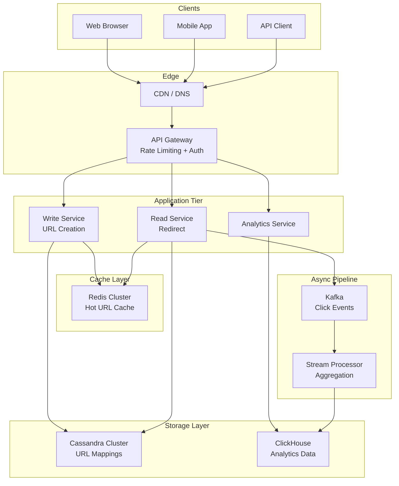
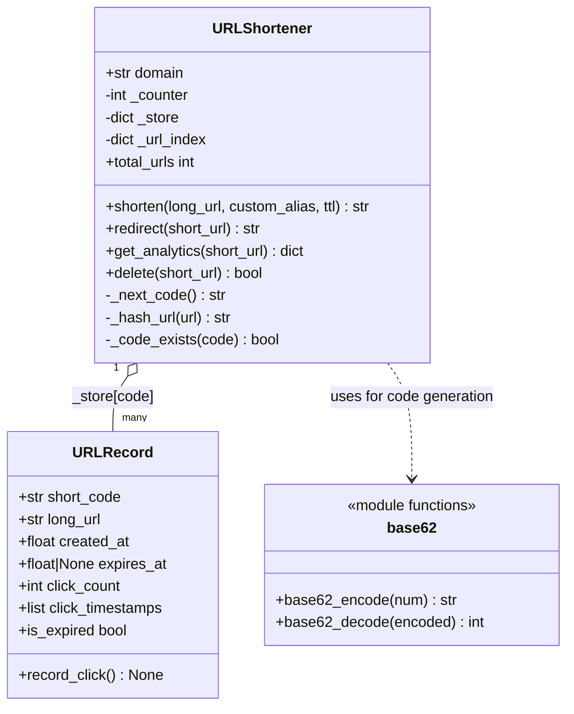
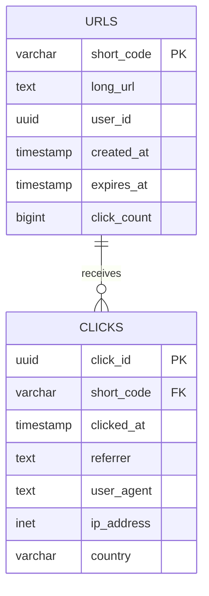
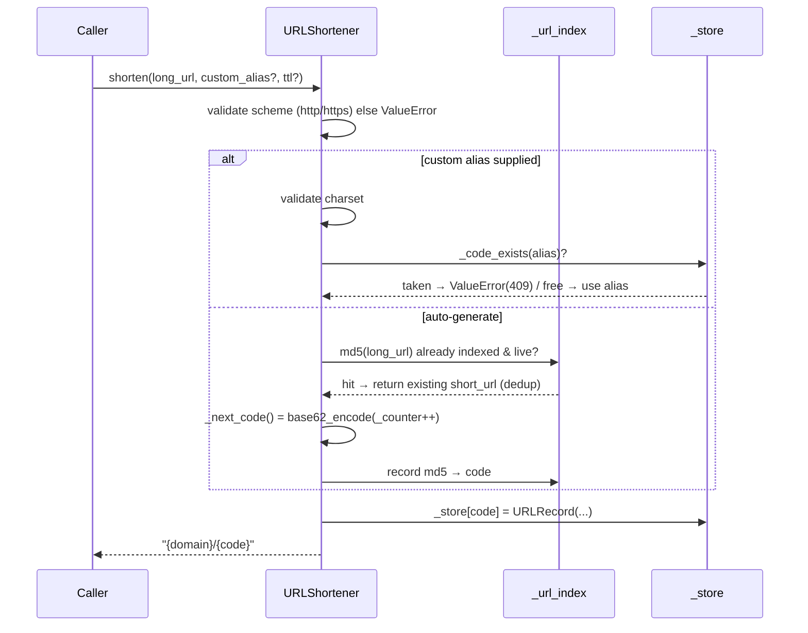

# URL Shortener (TinyURL) — Architecture

> **Scope of this document.** This is the consolidated architecture reference for
> the URL Shortener. It covers both the **production system design** (how you would
> build this at scale) and the **reference implementation** in
> [`url_shortener.py`](./url_shortener.py) (a single-process, in-memory simulation).
> Sections tagged **[Design-only]** describe production concerns not present in the
> simulation; sections tagged **[Implemented]** map directly to code.

---

## 1. Problem Statement

A URL shortener converts long, unwieldy URLs into compact, shareable links
(e.g. `https://tiny.url/abc123`). When a user visits the short URL the service
redirects them to the original destination.

**Why build one?**

- Long URLs break in emails, SMS, and social media posts.
- Short links enable click analytics (who, when, where).
- Custom branded short links improve marketing engagement.
- Link expiration provides temporal access control.

The core challenge is generating globally unique, short identifiers at massive
scale while keeping redirect latency under 100 ms.

---

## 2. Requirements

### 2.1 Functional Requirements

| # | Requirement | Details | Status |
|---|-------------|---------|--------|
| FR-1 | **Create short URL** | Given a long URL, return a unique short code. | ✅ Implemented (`shorten`) |
| FR-2 | **Redirect** | Given a short URL, resolve to the original URL. | ✅ Implemented (`redirect`) |
| FR-3 | **Custom aliases** | Users may supply their own alias (e.g. `my-brand`). | ✅ Implemented (`shorten(custom_alias=...)`) |
| FR-4 | **Expiration (TTL)** | URLs can expire after an optional time-to-live. | ✅ Implemented (`URLRecord.is_expired`) |
| FR-5 | **Analytics** | Track total clicks + timestamps. | ✅ Clicks/timestamps implemented; referrer/geo **[Design-only]** |
| FR-6 | **Deletion** | Owners can delete their short URLs. | ✅ Implemented (`delete`) |
| FR-7 | **Deduplication** | Same long URL returns the same short code. | ✅ Implemented (`_url_index`) |

### 2.2 Non-Functional Requirements [Design-only targets]

| Attribute | Target |
|-----------|--------|
| **Redirect latency** | < 100 ms (p99) |
| **Availability** | 99.99 % uptime (< 53 min downtime / year) |
| **Write throughput** | 100 M new URLs / day (~1 160 writes/s) |
| **Read throughput** | 10 B redirects / day (~115 000 reads/s) — 100:1 read/write |
| **Durability** | Zero data loss — every shortened URL must be retrievable |
| **Consistency** | Eventual for analytics; strong for redirects |
| **Security** | Rate limiting, abuse detection, input validation |

---

## 3. Capacity Estimation [Design-only]

### 3.1 Traffic

```
Writes : 100 M / day  = ~1 160 / s
Reads  : 100 * 1 160  = ~116 000 / s   (100:1 read-heavy)
```

### 3.2 Storage (5-year horizon)

```
URLs created    : 100 M/day * 365 * 5 = 182.5 B records
Avg record size : short_code (7 B) + long_url (256 B) + metadata (100 B) ~ 363 B
Total storage   : 182.5 B * 363 B ~ 66 TB
```

### 3.3 Bandwidth

```
Incoming (writes) : 1 160 req/s * 500 B  = 580 KB/s
Outgoing (reads)  : 116 000 req/s * 500 B = 58 MB/s
```

### 3.4 Cache (80/20 rule)

```
Daily reads       : 10 B
Cache 20 % of hot : 10 B * 0.20 * 500 B ~ 1 TB in-memory cache
```

---

## 4. High-Level Architecture [Design-only]



The write path (**CQRS command side**) owns short-code generation and persists to
Cassandra. The read path (**query side**) serves redirects from Redis first,
falling back to Cassandra. Click events flow asynchronously through Kafka so
analytics never adds latency to a redirect.

---

## 5. Reference Implementation Overview [Implemented]

The simulation in `url_shortener.py` collapses the tiers above into a single
in-process module while preserving the essential mechanics: base62 counter
encoding, custom aliases, TTL expiration, deduplication, and click analytics.



### 5.1 Component Deep-Dive (doc → code)

| Design concept | Implemented by | Notes |
|----------------|----------------|-------|
| Short-code generation | `base62_encode()` + `URLShortener._next_code()` | Monotonic counter (`_counter`, starts at 100 000) encoded in base62. Zero collisions by construction. |
| Reverse mapping / storage | `URLShortener._store: dict[str, URLRecord]` | Simulates the Cassandra `urls` table keyed by `short_code`. |
| Deduplication index | `URLShortener._url_index: dict[str, str]` | `md5(long_url) → short_code`; a repeat `shorten()` of a live URL returns the existing code. |
| Record + metadata | `URLRecord` | Holds `long_url`, `created_at`, `expires_at`, `click_count`, `click_timestamps`. |
| TTL expiration | `URLRecord.is_expired` (property) | Lazy check on read; `redirect()` raises on expiry (simulates HTTP 410). |
| Click analytics | `URLRecord.record_click()` + `get_analytics()` | Increments counter and appends a timestamp per redirect. |
| Custom alias validation | `shorten(custom_alias=...)` | Alphanumeric + `-`/`_`; raises `ValueError` on invalid or taken alias (simulates HTTP 409). |
| Input validation | `shorten()` scheme check | Rejects URLs not starting with `http://`/`https://` — guards open-redirect abuse. |

---

## 6. Data Model

### 6.1 Conceptual (production) schema [Design-only]



**Indexing strategy [Design-only]:** primary index on `short_code` (Cassandra
partition key); secondary index on a `long_url` hash for dedup; TTL index on
`expires_at`; time-series index `clicks(short_code, clicked_at)` for range
analytics.

### 6.2 As implemented [Implemented]

The simulation flattens the two tables into `URLRecord` objects held in
`_store`, with `click_timestamps` playing the role of the `clicks` table. There
is no separate `user_id`, `referrer`, or `geo` capture in code — those are
**[Design-only]**.

---

## 7. API Design

### 7.1 Production HTTP surface [Design-only]

| Method & Path | Purpose | Success |
|---------------|---------|---------|
| `POST /api/v1/urls` | Create short URL (`long_url`, `custom_alias?`, `ttl_seconds?`) | `201 Created` |
| `GET /{short_code}` | Redirect | `301` + `Location` header |
| `GET /api/v1/urls/{short_code}/analytics` | Click analytics | `200 OK` |
| `DELETE /api/v1/urls/{short_code}` | Delete mapping | `204 No Content` |

### 7.2 In-process API [Implemented]

| Method | Signature | Raises |
|--------|-----------|--------|
| `shorten` | `(long_url, custom_alias=None, ttl=None) -> str` | `ValueError` (bad URL / bad or taken alias), `RuntimeError` (code exhaustion) |
| `redirect` | `(short_url) -> str` | `KeyError` (404), `ValueError` (410 expired) |
| `get_analytics` | `(short_url) -> dict` | `KeyError` (404) |
| `delete` | `(short_url) -> bool` | — |

Each maps an HTTP status onto a Python exception, keeping the demo faithful to
the production contract without a web server.

---

## 8. Key Workflows

### 8.1 Create short URL — actual code path [Implemented]



### 8.2 Redirect + click tracking [Implemented]

```mermaid
sequenceDiagram
    participant C as Caller
    participant S as URLShortener
    participant ST as _store
    participant R as URLRecord
    C->>S: redirect("{domain}/{code}")
    S->>S: parse code from tail of URL
    S->>ST: _store.get(code)
    alt missing
        ST-->>S: None → KeyError (404)
    else present
        ST-->>S: record
        S->>R: is_expired?
        R-->>S: True → ValueError (410 Gone)
        R-->>S: False → record_click(); return long_url
    end
    S-->>C: long_url
```

---

## 9. Detailed Component Design

### 9.1 URL Encoding — Base62 [Implemented]

Base62 (`[0-9a-zA-Z]`) converts the integer counter into a compact string.
`62^7 = 3.5 trillion` unique codes — enough for decades. Algorithm:

1. Atomically increment a counter (`_counter`; in production a distributed
   range from ZooKeeper).
2. Encode the value with `base62_encode`.
3. Store the mapping `short_code → URLRecord`.

`base62_encode`/`base62_decode` are exact inverses (verified in the demo's
round-trip section and worth an explicit unit test).

### 9.2 Collision & Deduplication [Implemented]

Counter-based encoding is collision-free by construction, so the `while
_code_exists(code)` guard in `shorten()` is purely defensive (bounded to 10
retries). Deduplication is handled separately via `_url_index`: a repeat
`shorten()` of a **non-expired** URL short-circuits and returns the existing
code.

### 9.3 Cache Strategy — Cache-Aside [Design-only]

```
REDIRECT(short_code):
  1. Check Redis
  2. HIT  → return long_url (< 1 ms)
  3. MISS → query Cassandra, populate Redis, return
  4. Set TTL on the cache entry (e.g. 24 h)
```

Hot URLs (top 20 %) stay cached; cold URLs evict via LRU. The simulation's
`_store` dict stands in for the combined cache+DB.

---

## 10. Architectural Patterns [Design-only]

- **CQRS** — separate write (counter + Cassandra) and read (Redis → Cassandra)
  services so reads scale ~100× independently of writes.
- **Cache-Aside** — the app populates/invalidates the cache; DB is source of
  truth.
- **Consistent Hashing** — `short_code` partition key distributed across
  Cassandra nodes with virtual nodes; adding a node remaps only `K/N` keys.
  (See the repo's [`ConsistentHashing.py`](../Utils/ConsistentHashing.py) for a working
  ring implementation.)

---

## 11. Technology Choices & Trade-offs [Design-only]

| Decision | Chosen | Alternative | Why |
|----------|--------|-------------|-----|
| Database | **Cassandra** | MySQL | Append-only LSM writes, native horizontal scaling, PK access pattern. MySQL fine below ~10 M URLs. |
| Cache | **Redis** | Memcached | Rich structures (sorted sets for top-K), persistence, native cluster. |
| Encoding | **Base62 counter** | MD5 hash | Zero collisions, no pre-write DB lookup. Keep MD5 only for the dedup index. |

---

## 12. Scaling, Reliability & Security [Design-only]

- **Sharding:** hash-partition on `short_code`; app servers draw 1 M-ID counter
  ranges from ZooKeeper to avoid contention.
- **Caching layers:** browser `Cache-Control` → CDN edge → Redis → Cassandra row
  cache.
- **Replication/failover:** Cassandra RF=3 across AZs with hinted handoff + read
  repair; Redis Sentinel/Cluster; circuit breakers around DB/cache calls.
- **Security:** token-bucket rate limits, Safe-Browsing blocklist, strict URL/
  alias validation, OAuth for the dashboard.
- **Monitoring:** redirect p99 < 100 ms, cache hit ratio > 90 %, 5xx < 0.01 %,
  counter-range-exhaustion alert at < 10 % remaining.

---

## 13. Running the Simulation [Implemented]

```powershell
# stdlib-only — no third-party dependencies required
uv run --no-project python SystemDesign\URLShortener\url_shortener.py
```

The `main()` demo walks through: basic shortening, custom aliases, redirect +
click tracking, analytics, deduplication, TTL expiration, error handling,
deletion, and a base62 round-trip table.

### Suggested tests (not yet present)

- `base62_encode`/`base62_decode` round-trip for a range of integers.
- `shorten` dedup returns identical code for the same live URL.
- `redirect` raises `ValueError` after TTL and `KeyError` after `delete`.
- Custom-alias collision raises `ValueError`.

---

## 14. Future Improvements

- **Thread safety:** guard `_counter`, `_store`, and `_url_index` with a lock (or
  an atomic counter) if the class is shared across threads.
- **Analytics enrichment:** capture referrer/user-agent/geo to match the
  `clicks` model.
- **Pluggable storage:** abstract `_store` behind a repository interface to swap
  in Redis/Cassandra backends.
- **Bulk API + expiry sweeper:** batch creation and a background job to purge
  expired records (today expiry is lazy-only).
