# Distributed-Systems Primitives (`SystemDesign/Utils`) — Architecture

This folder collects five small, self-contained **building blocks** that larger
system designs reuse: two placement strategies, a storage engine, a rate
limiter, and a network load balancer. Each is a single stdlib-only module with a
runnable `__main__` demo and pytest coverage.

Unlike the folders elsewhere in `SystemDesign/` (which each model *one* end-to-end
system), these are **primitives** — the reusable mechanisms that those systems are
built from. This document is the shared architecture reference for all five.

> **Legend** — `[Implemented]` = present and exercised by the demo/tests in this
> repo. `[Design-only]` = discussed as a production consideration but not coded here.

---

## 1. Primitives at a Glance

| Module | Problem it solves | Core type(s) | Lookup / op cost | Thread-safe |
|--------|-------------------|--------------|------------------|:-----------:|
| `ConsistentHashing.py` | Spread keys over nodes, minimal reshuffle on membership change | `ConsistentHashRing`, `Node` | `get_node` O(log v·n) | ✅ `RLock` |
| `RendezvousHashing.py` | Same goal, index-free, naturally weighted | `Node`, `determine_responsible_node` | O(n) per key | ✅ stateless |
| `SSTable.py` | Durable, write-optimized key-value storage (LSM tree) | `LSMTree`, `MemTable`, `SSTable`, `BloomFilter` | write O(log m), read O(log m + Σ log k) | ✅ `RLock` |
| `RateLimiter.py` | Cap request rate per client with O(1) memory | `SlidingWindow` | `handle` O(1) | ✅ `Lock` |
| `LoadBalancerSocket.py` | Distribute TCP connections across a backend pool | `LoadBalancer`, `Backend` | O(1) pick | ✅ threaded |

### Where these fit

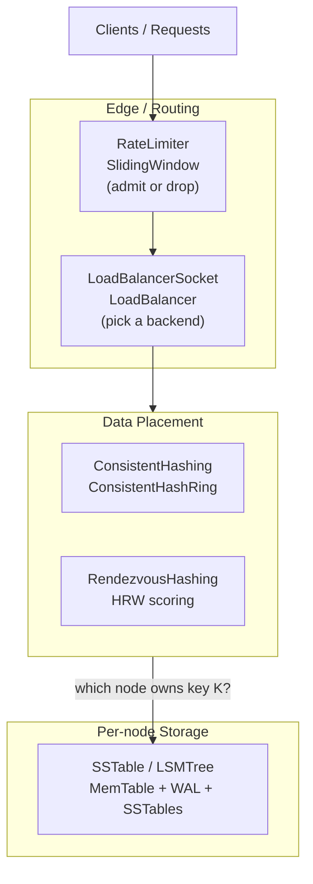

---

## 2. Consistent Hashing — `ConsistentHashing.py` [Implemented]

A hash **ring** over `[0, 2^32)`. Each physical `Node` is placed at
`num_replicas` positions (*virtual nodes*) computed with MD5. A key is owned by
the first virtual node found clockwise from `hash(key)`, resolved with a binary
search (`bisect`) over a sorted list of ring positions.

### API

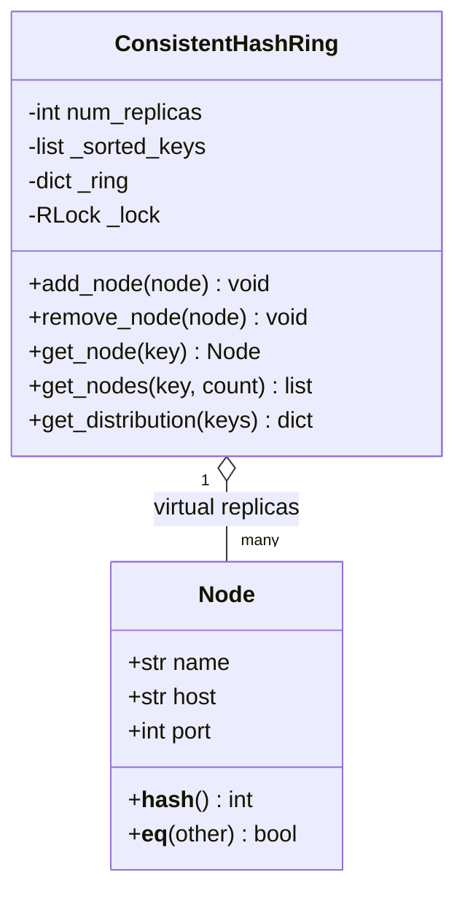

### Lookup path

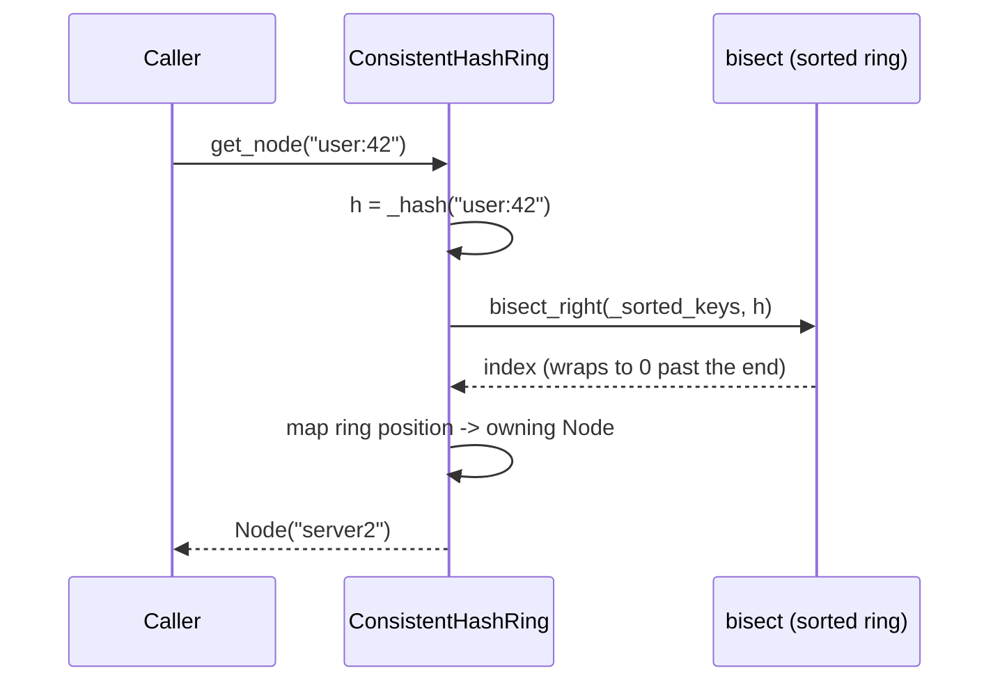

- **Add / remove** — `O(v·n)`: `v` virtual-node inserts, each an `O(n)`
  `bisect.insort` list shift. (The search is `O(log n)`; the list shift to keep
  `_sorted_keys` ordered dominates — the module docstring calls this out.)
- **Minimal remapping** — removing 1 of N nodes moves only `~K/N` keys.
  Verified by `tests/test_consistent_hashing.py::test_remove_node_minimal_remapping`.
- **Thread-safety** `[Implemented]` — all public ops guarded by an `RLock`.
- **Production notes** `[Design-only]` — a balanced tree / skip list would make
  add/remove `O(v·log n)`; bounded-load variants and replica-aware placement
  are common extensions.

---

## 3. Rendezvous (HRW) Hashing — `RendezvousHashing.py` [Implemented]

Highest-Random-Weight hashing reaches the *same* goal as the ring — agreed,
minimal-disruption placement — without any ring data structure. For each
`(node, key)` pair it computes a deterministic score and assigns the key to the
**highest-scoring** node.

```
score(node, key) = node.weight * (1 / -ln(h)),  h = int_to_float(_hash64(key, node.seed)) in [0,1)
```

Scaling by `weight` yields **Weighted** Rendezvous Hashing: a node with weight
`2w` wins ~2× the keys of a weight-`w` node.

### Scoring and selection

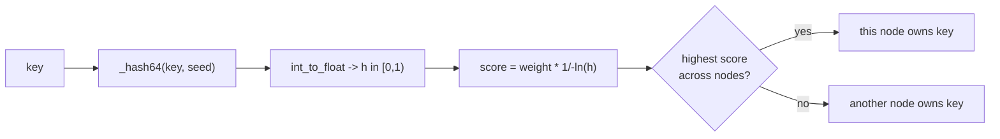

- **Lookup** — `O(n)`: every node is scored for each key. Trades the ring's
  `O(log n)` lookup for index-free code and naturally even weighted placement;
  best when `N` is small (tens of nodes) or weighting matters.
- **Dependency hygiene** `[Implemented]` — the previous version imported the
  third-party `mmh3`; it now uses stdlib `hashlib` (MD5) via `_hash64`, matching
  the rest of the repo.
- **Add / remove is minimal by construction** — since ownership is “argmax of
  independent scores”, removing a node moves *only* the keys it owned, and adding
  a node *only* steals keys to itself (nothing reshuffles among incumbents).
  Verified by `test_removal_only_moves_owned_keys` and `test_adding_node_only_steals_keys`.

### Consistent Hashing vs. Rendezvous

| | Consistent Hash Ring | Rendezvous (HRW) |
|---|---|---|
| Lookup cost | `O(log n)` binary search | `O(n)` score-all |
| Extra state | sorted ring of `v·n` points | none (recompute per key) |
| Load evenness | needs many virtual nodes | even without virtual nodes |
| Weighting | replica-count tuning | native (`weight` factor) |
| Best when | large N, hot lookups | small N, weighted placement |

---

## 4. SSTable + LSM Tree — `SSTable.py` [Implemented]

A log-structured merge tree: writes hit an in-memory `MemTable`, are made durable
via a **write-ahead log**, and are periodically flushed to immutable `SSTable`
files. Reads check the MemTable then SSTables newest-first, using a per-table
**right-sized bloom filter** and a **sparse index** to skip work.

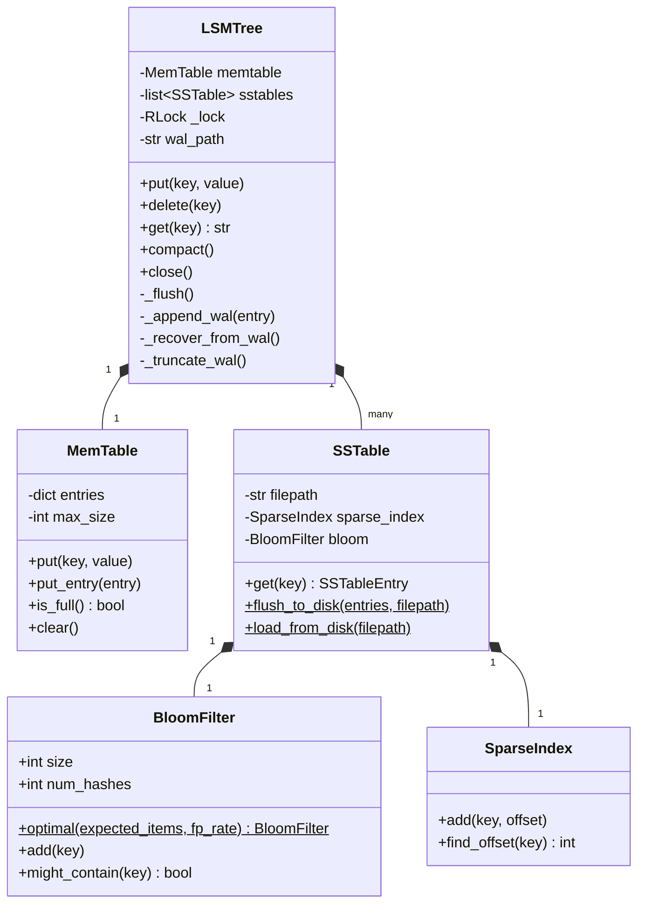

### Write path (durability-first)

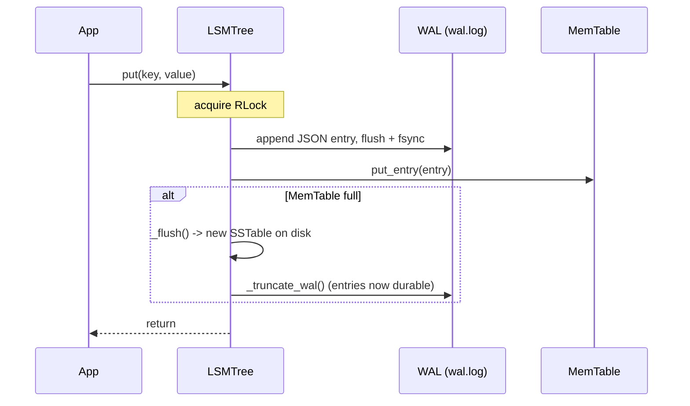

### Crash recovery

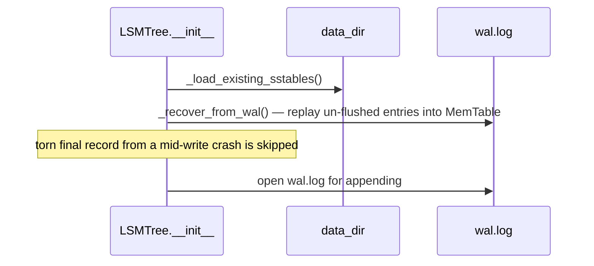

### On-disk layout

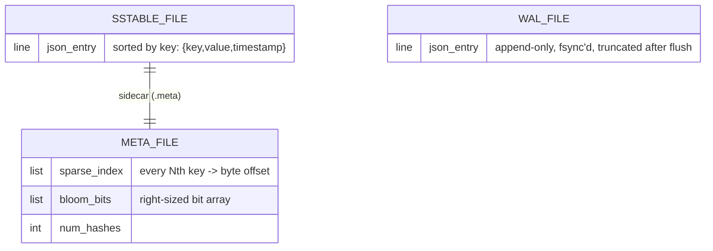

**Improvements implemented here vs. a naive LSM:**

- **WAL crash recovery** `[Implemented]` — each `put`/`delete` is appended to
  `wal.log` (flush + `fsync`) *before* touching the MemTable, and replayed on
  startup, so an un-flushed MemTable is no longer lost on crash. Verified by
  `tests/test_sstable_wal.py`.
- **Right-sized bloom filter** `[Implemented]` — `BloomFilter.optimal(n, p)`
  computes bits `m = ceil(-(n·ln p)/(ln2)^2)` and hashes `k = round((m/n)·ln2)`.
  A fixed 1024-bit filter saturated (FP → ~100%) once `n` approached ~1000; the
  sized filter holds the target false-positive rate. Verified by
  `test_optimal_keeps_false_positive_rate_low_at_scale`.
- **Thread-safety** `[Implemented]` — `put`/`delete`/`get`/`compact`/`close`
  guarded by a reentrant lock (reentrant because `put` may call `_flush`).
- **Tombstones + compaction** `[Implemented]` — deletes write a `TOMBSTONE`
  marker; `compact()` merges all SSTables keeping the latest version per key and
  dropping tombstones.
- `[Design-only]` — leveled/tiered multi-level compaction, range scans /
  iterators, block compression, and a manifest for atomic SSTable set swaps.

---

## 5. Sliding-Window Rate Limiter — `RateLimiter.py` [Implemented]

The **sliding-window counter** algorithm: it keeps only a *current* and
*previous* sub-window count (O(1) memory), and estimates the in-window rate as a
weighted blend, smoothing the burst that a fixed window allows at its boundary.

```
estimated = previous_count * (overlap fraction of previous window) + current_count
admit if estimated < capacity, else drop
```

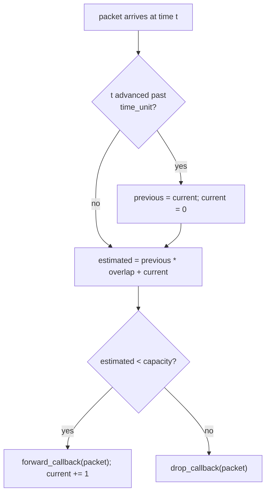

- **`SlidingWindow(capacity, time_unit, forward_callback, drop_callback)`** with
  `handle(packet)` — callbacks decouple the policy from the transport.
- **O(1)** time and space per `handle`, unlike a sliding-window *log* (one
  timestamp per request).
- **Fixes applied** `[Implemented]` — the previous version ran a packet loop at
  **import time**; it now lives under `if __name__ == "__main__"` (`_demo()`), is
  guarded by a `threading.Lock`, and has type hints and docstrings.
- `[Design-only]` — a **distributed** limiter (shared counters in Redis, per-key
  buckets, token-bucket variant) — see the `DistributedRateLimiter/` folder for
  that system-level treatment.

---

## 6. TCP Load Balancer — `LoadBalancerSocket.py` [Implemented]

A real threaded Layer-4 load balancer: it listens on a socket, and for each
accepted client connection picks a healthy `Backend` and **bidirectionally
proxies** bytes between client and backend using `select`.

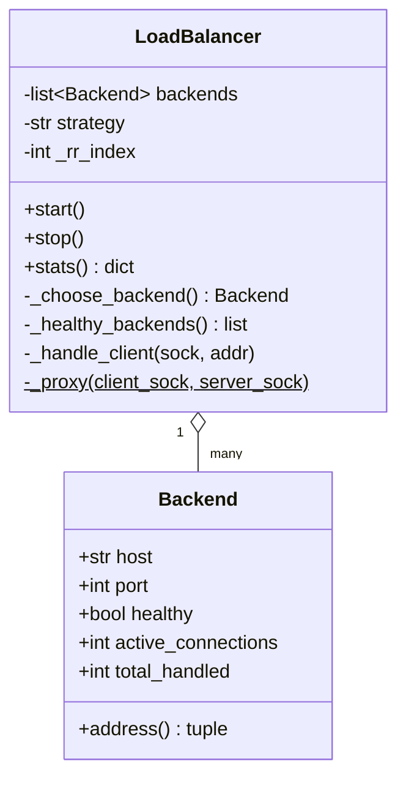

### Connection handling

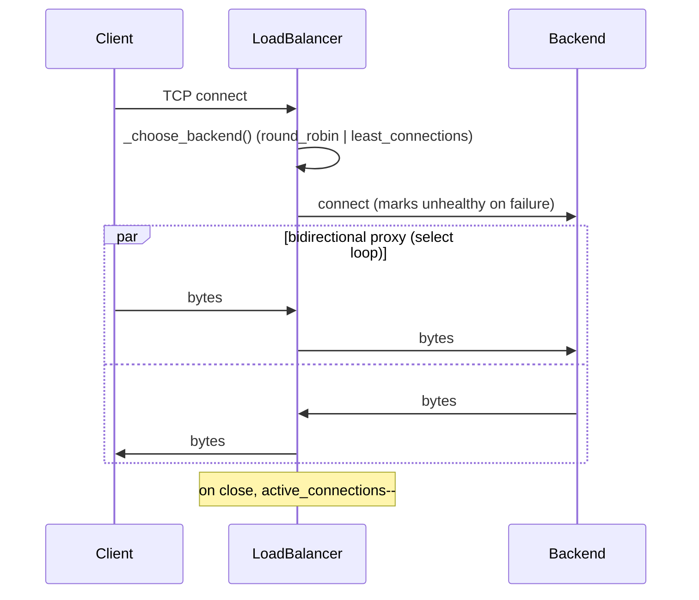

- **Strategies** `[Implemented]` — `round_robin` and `least_connections`, chosen
  from `_healthy_backends()`; per-backend health flips to unhealthy on a failed
  connect. Each client is served on its own thread.
- **Fixes applied** `[Implemented]` — replaced the original 26-line toy (single
  hardcoded backend, serial, one `recv(1024)`, no response path) with a backend
  **pool**, selection strategies, health tracking, a full bidirectional
  `select`-based proxy, and a self-contained demo using throwaway echo backends.
- `[Design-only]` — active health checks, connection draining, weighted / L7
  (HTTP-aware) routing, TLS termination, and sticky sessions.

---

## 7. Running the Simulations

All modules are stdlib-only. On Windows, set UTF-8 output first:

```powershell
$env:PYTHONIOENCODING = "utf-8"
uv run --no-project python SystemDesign\Utils\ConsistentHashing.py
uv run --no-project python SystemDesign\Utils\RendezvousHashing.py
uv run --no-project python SystemDesign\Utils\SSTable.py
uv run --no-project python SystemDesign\Utils\RateLimiter.py
uv run --no-project python SystemDesign\Utils\LoadBalancerSocket.py
```

`uv run --no-project` runs in an isolated stdlib environment (avoids the repo's
heavy optional ML dependencies).

## 8. Tests

```powershell
uv run --no-project --with pytest pytest tests/test_consistent_hashing.py `
  tests/test_rendezvous_hashing.py tests/test_sstable.py `
  tests/test_sstable_wal.py tests/test_distributed_cache.py -q
```

| Test file | Covers |
|-----------|--------|
| `test_consistent_hashing.py` | ring distribution, minimal remap, replica lookup |
| `test_rendezvous_hashing.py` | determinism, weighted distribution, add/remove minimality |
| `test_sstable.py` | put/get/delete, flush, compaction |
| `test_sstable_wal.py` | WAL crash recovery, tombstone replay, bloom right-sizing, concurrency |
| `test_distributed_cache.py` | (related) cache pub/sub + routing built on the ring |

> `RateLimiter.py` and `LoadBalancerSocket.py` are validated through their
> `__main__` demos (both exit 0); adding dedicated pytest modules for them is a
> natural next step.
