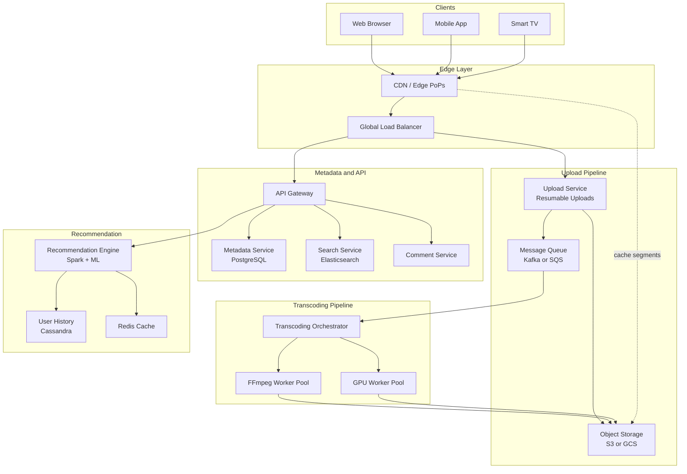
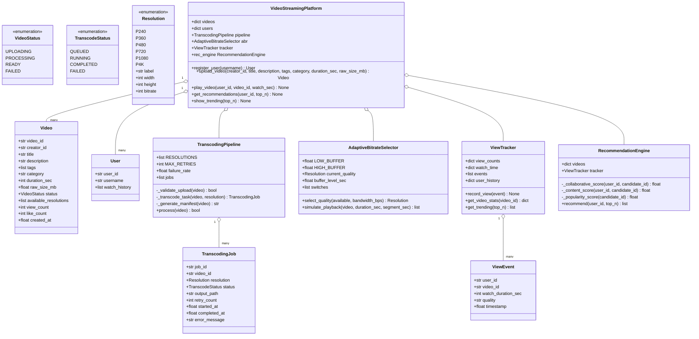
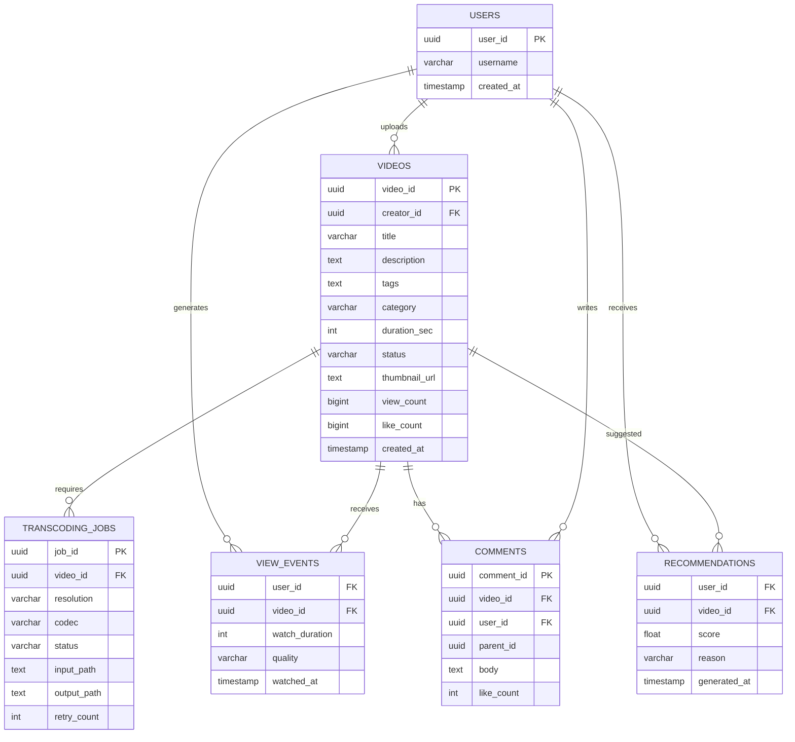
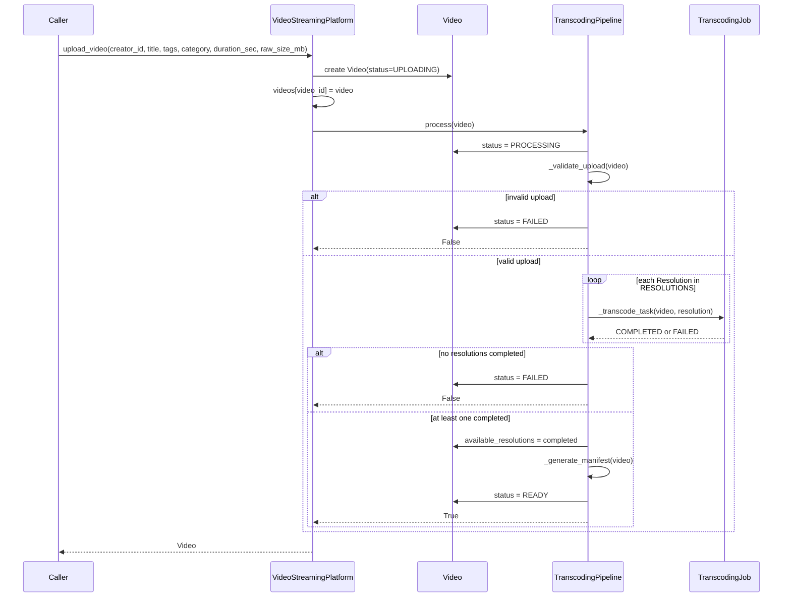
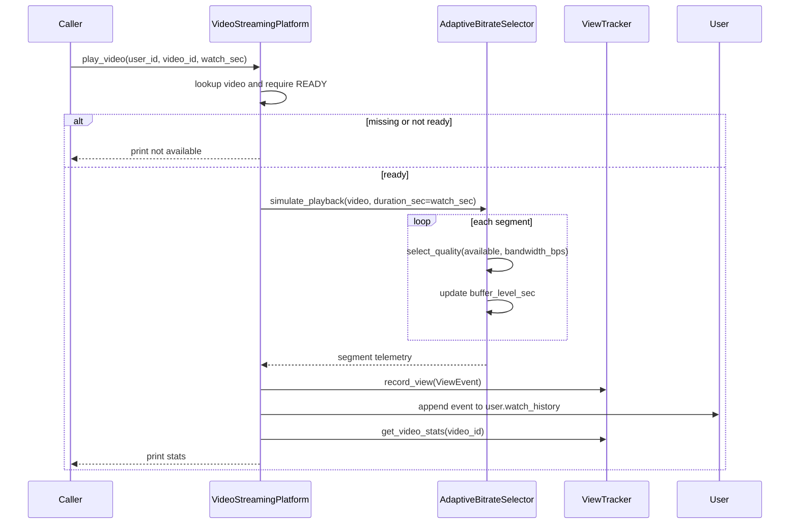
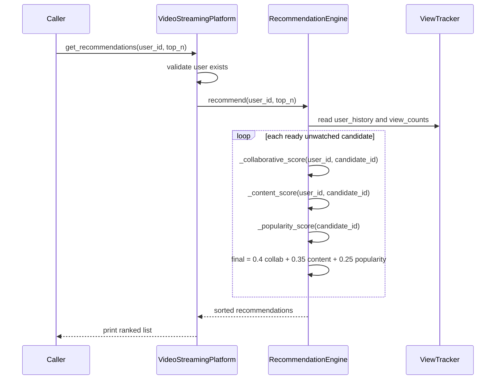

# Video Streaming Platform — Architecture

> **Scope of this document.** This is the consolidated architecture reference for
> the Video Streaming Platform. It preserves the production system design from
> [`README.md`](./README.md) and maps it to the reference implementation in
> [`video_streaming.py`](./video_streaming.py), a single-process simulation of
> upload, transcoding, adaptive playback, view tracking, trending, and
> recommendations. Sections tagged **[Design-only]** describe production
> capabilities not present in the simulation; sections tagged **[Implemented]**
> map directly to code.

---

## 1. Problem Statement

Design a large-scale video streaming platform like YouTube or Netflix that lets
users upload, transcode, store, discover, and stream video globally. The platform
must support adaptive bitrate streaming, recommendations, search, comments,
channels, view tracking, and high availability for hundreds of millions of daily
active users.

Key challenges:

- **Ingestion:** accept large multi-GB uploads reliably.
- **Transcoding:** convert raw uploads into multiple resolutions/codecs.
- **Delivery:** stream video segments with sub-200 ms start time worldwide.
- **Discovery:** power search and personalized recommendations.
- **Scale:** handle 100 M+ DAU and 1 M concurrent streams.

The simulation focuses on the core media lifecycle: create users, upload videos,
transcode each upload into resolutions, simulate adaptive playback, track view
events, compute trending videos, and generate basic recommendations.

---

## 2. Requirements

### 2.1 Functional Requirements

| # | Requirement | Details | Status |
|---|-------------|---------|--------|
| FR-1 | **Upload Video** | Users upload videos up to 10 GB via resumable upload. | ⚠️ Partially implemented (`VideoStreamingPlatform.upload_video` creates metadata and immediately processes); resumable/chunked upload is **[Design-only]** |
| FR-2 | **Transcode** | Convert each upload into 240p, 360p, 480p, 720p, 1080p, and 4K. | ✅ Implemented (`TranscodingPipeline.RESOLUTIONS`, `process`, `_transcode_task`) |
| FR-3 | **Adaptive Streaming** | Client switches quality based on bandwidth and buffer health. | ✅ Implemented (`AdaptiveBitrateSelector.select_quality`, `simulate_playback`) |
| FR-4 | **Search** | Full-text search over titles, descriptions, tags, captions. | ❌ **[Design-only]** |
| FR-5 | **Recommendations** | Personalized feed using collaborative and content-based filtering. | ✅ Basic implementation (`RecommendationEngine.recommend`) |
| FR-6 | **Comments** | Users can post, reply to, like, and report comments. | ❌ **[Design-only]** |
| FR-7 | **View Tracking** | Record views, watch time, quality, and engagement metrics. | ✅ Implemented (`ViewTracker.record_view`, `get_video_stats`, `get_trending`) |
| FR-8 | **Channels** | Creators manage channels, playlists, and subscriptions. | ❌ **[Design-only]**; code only has `User` and `creator_id` |
| FR-9 | **Notifications** | Notify subscribers when new videos are published. | ❌ **[Design-only]** |
| FR-10 | **Trending** | Show top videos by view count. | ✅ Implemented (`show_trending`, `ViewTracker.get_trending`) |

### 2.2 Non-Functional Requirements [Design-only targets]

| Category | Target |
|----------|--------|
| **Latency** | Video start time < 200 ms p99 from CDN edge |
| **Throughput** | 100 M DAU, 1 M concurrent streams |
| **Availability** | 99.9% uptime (< 8.76 h downtime/year) |
| **Durability** | 99.999999999% durability for stored video objects |
| **Global delivery** | Edge PoPs on 6 continents; < 50 ms to nearest edge |
| **Upload reliability** | Resumable uploads; no data loss on network interruption |
| **Consistency** | Eventual for views/recommendations; strong for uploads and metadata writes |

---

## 3. Capacity Estimation [Design-only]

### 3.1 Assumptions

- 100 M DAU, 10% upload content = 10 M creators.
- 500 K new videos uploaded per day.
- Average raw video size: 500 MB.
- Transcoded output: ~3× raw size for multiple resolutions and codecs.
- Average watch session: 40 minutes/day.
- Average bitrate: 5 Mbps.

### 3.2 Storage

| Item | Calculation | Daily | Yearly |
|------|-------------|-------|--------|
| Raw uploads | 500 K × 500 MB | 250 TB/day | ~91 PB/year |
| Transcoded variants | 250 TB × 3 | 750 TB/day | ~274 PB/year |
| Total new storage | Raw + transcoded | ~1 PB/day | ~365 PB/year |

### 3.3 Bandwidth and metadata

| Item | Calculation | Result |
|------|-------------|--------|
| Concurrent viewers | 1 M streams × 5 Mbps | 5 Tbps aggregate |
| Daily egress | 100 M users × 40 min × 5 Mbps / 8 | ~15 PB/day |
| Video metadata | 500 K videos/day × 5 KB | 2.5 GB/day |
| View events | 100 M users × 20 views/day | 2 B events/day |

---

## 4. High-Level Architecture [Design-only]



The production platform separates upload, transcoding, metadata, delivery, and
recommendation. The simulation collapses these layers into
`VideoStreamingPlatform` and supporting classes.

---

## 5. Reference Implementation Overview [Implemented]

`video_streaming.py` is a single-process simulation. It uses dataclasses for
domain entities, enums for status/resolution, an in-memory facade for users and
videos, a sequentially simulated transcoding DAG, a client-side ABR selector, and
in-memory view/recommendation stores.



### 5.1 Component Deep-Dive (doc → code)

| Design concept | Implemented by | Notes |
|----------------|----------------|-------|
| Video metadata service | `Video` + `VideoStreamingPlatform.videos` | In-memory metadata; production PostgreSQL is **[Design-only]**. |
| User account | `User` + `register_user` | Stores only username and watch history. |
| Upload service | `upload_video` | Creates `Video`, stores it, and immediately calls `pipeline.process`. |
| Transcoding DAG | `TranscodingPipeline.process` | Validation, per-resolution transcode tasks, manifest generation, ready state. Parallelism is simulated sequentially. |
| Transcode retry | `_transcode_task` | Retries up to `MAX_RETRIES`; random failure controlled by `failure_rate`. |
| HLS manifest | `_generate_manifest` | Emits playlist text from `video.available_resolutions`; not persisted. |
| Adaptive bitrate | `AdaptiveBitrateSelector.select_quality` | Buffer-aware and bandwidth-aware quality selection. |
| Playback simulation | `simulate_playback` + `play_video` | Generates segment rows and records a `ViewEvent`. |
| View analytics | `ViewTracker` | Tracks view counts, watch time, event list, and user history. |
| Recommendations | `RecommendationEngine` | Combines collaborative, content, and popularity scores. |
| Trending | `ViewTracker.get_trending` | Sorts videos by in-memory view count. |

---

## 6. Data Model

### 6.1 Conceptual production schema [Design-only]



### 6.2 As implemented [Implemented]

| Production entity | In-memory equivalent |
|-------------------|----------------------|
| `videos` table | `VideoStreamingPlatform.videos: dict[str, Video]` |
| `transcoding_jobs` table | `TranscodingPipeline.jobs: list[TranscodingJob]` |
| User table | `VideoStreamingPlatform.users: dict[str, User]` |
| User watch history | `ViewTracker.user_history` and `User.watch_history` |
| View events | `ViewTracker.events: list[ViewEvent]` |
| Recommendation cache | Computed on demand in `RecommendationEngine.recommend` |
| Comments/channels/subscriptions | Not implemented |

---

## 7. API Design

### 7.1 Production HTTP surface [Design-only]

| Method & Path | Purpose | Success |
|---------------|---------|---------|
| `POST /api/v1/videos/upload/init` | Create metadata and return upload URL | `201 Created` |
| `PUT /api/v1/videos/upload/{upload_id}/chunk` | Upload chunk with `Content-Range` | `200 OK` |
| `POST /api/v1/videos/upload/{upload_id}/complete` | Finalize upload and enqueue transcode | `202 Accepted` |
| `GET /api/v1/videos/{video_id}/manifest.m3u8` | Fetch HLS master playlist | `200 OK` |
| `GET /api/v1/videos/{video_id}/segments/{quality}/{segment_number}.ts` | Fetch segment from CDN | `200 OK` |
| `GET /api/v1/search?q=&page=&limit=` | Search videos | `200 OK` |
| `GET /api/v1/recommendations?user_id=&limit=` | Personalized recommendations | `200 OK` |
| `POST /api/v1/videos/{video_id}/comments` | Create comment | `201 Created` |
| `GET /api/v1/videos/{video_id}/comments?sort=&page=` | List comments | `200 OK` |
| `POST /api/v1/videos/{video_id}/view` | Record view/watch time | `202 Accepted` |

### 7.2 In-process API [Implemented]

| Method | Signature | Raises / behavior |
|--------|-----------|-------------------|
| `register_user` | `(username: str) -> User` | Generates 8-char UUID prefix |
| `upload_video` | `(creator_id, title, description="", tags=None, category="", duration_sec=300, raw_size_mb=500.0) -> Video` | Does not validate creator existence; failed transcode marks video failed |
| `TranscodingPipeline.process` | `(video: Video) -> bool` | Returns `False` if validation or all transcodes fail |
| `AdaptiveBitrateSelector.select_quality` | `(available: list[Resolution], bandwidth_bps: int) -> Resolution` | Raises `ValueError` if no resolutions available |
| `play_video` | `(user_id: str, video_id: str, watch_sec: int = 30) -> None` | Prints and returns if video missing/not ready |
| `ViewTracker.record_view` | `(event: ViewEvent) -> None` | Appends event and updates counters |
| `get_recommendations` | `(user_id: str, top_n: int = 5) -> None` | Prints and returns for unknown user |
| `show_trending` | `(top_n: int = 5) -> None` | Prints top videos |

---

## 8. Key Workflows [Implemented]

### 8.1 Upload and transcode



### 8.2 Playback and view tracking



### 8.3 Recommendation generation



---

## 9. Detailed Component Design

### 9.1 Transcoding pipeline [Implemented]

`TranscodingPipeline.process()` models a DAG:

```text
Validate raw upload
    -> Transcode 240p, 360p, 480p, 720p, 1080p, 4K
    -> Generate HLS manifest
    -> Mark video READY
```

Each `_transcode_task()` can fail randomly before the last retry attempt. Output
paths look like `s3://video-bucket/{video_id}/{resolution}/segments/`, but no
real object storage is used.

### 9.2 Adaptive bitrate streaming [Implemented]

`AdaptiveBitrateSelector` uses two signals:

- **Bandwidth:** choose the highest available resolution whose bitrate fits.
- **Buffer:** if buffer is below `LOW_BUFFER`, choose lowest quality; if above
  `HIGH_BUFFER`, step up if bandwidth allows.

The README's HLS master playlist is represented by `_generate_manifest()`:

```text
#EXTM3U
#EXT-X-STREAM-INF:BANDWIDTH=400000,RESOLUTION=426x240
240p/playlist.m3u8
...
```

### 9.3 View tracking [Implemented]

`ViewTracker` stores:

- `view_counts: dict[str, int]`
- `watch_time: dict[str, int]`
- `events: list[ViewEvent]`
- `user_history: dict[str, list[ViewEvent]]`

This models the high-write user-history store from the README, but without
durable Cassandra partitions or event streaming.

### 9.4 Recommendations [Implemented]

`RecommendationEngine.recommend()` skips videos the user has already watched and
scores each ready candidate:

```text
final_score = 0.4 * collaborative + 0.35 * content + 0.25 * popularity
```

- Collaborative score counts similar users who watched the candidate.
- Content score compares tags and category.
- Popularity score normalizes by max view count.

The production system's Spark candidate generation, neural ranker, diversity
reranking, online learning, and A/B testing remain **[Design-only]**.

### 9.5 CDN caching and object storage [Design-only]

Production uses a three-tier cache:

| Tier | Location | TTL | Content |
|------|----------|-----|---------|
| L1 Edge | CDN PoP | 24 h | Popular segments, thumbnails |
| L2 Regional | Origin shield | 72 h | Region-popular videos |
| L3 Origin | Object storage | Permanent | Source of truth |

Cache key:

```text
/{video_id}/{quality}/{segment_number}.ts
```

Trending/new videos pre-warm first segments at edges; deletion purges CDN
entries; retranscoding versions segment paths.

---

## 10. Architectural Patterns [Design-only]

- **Pipeline / DAG:** upload validation, parallel resolution transcodes, manifest
  generation, publish.
- **CDN cache-aside:** edge fetches from origin on miss and serves from cache on
  hit.
- **Event-driven processing:** upload completion emits transcode jobs; view
  events feed analytics and recommendations.
- **CQRS:** write path for uploads/comments/likes; read path via caches,
  Elasticsearch, and recommendation cache.
- **Eventual consistency:** views, recommendations, and search indexing can lag
  primary metadata.
- **Collaborative filtering:** users with overlapping watch history influence
  candidate generation.

---

## 11. Technology Choices & Trade-offs [Design-only]

| Component | Technology | Rationale |
|-----------|------------|-----------|
| Object Storage | S3 / GCS | 11 nines durability, lifecycle policies, multipart upload |
| CDN | CloudFront / Akamai | Global PoPs, adaptive bitrate support, origin shield |
| Transcoding | FFmpeg on ECS/Kubernetes | Industry standard, codec support, GPU acceleration |
| GPU Encoding | NVIDIA NVENC | Hardware-accelerated H.265/AV1 |
| Metadata DB | PostgreSQL / Aurora | ACID metadata writes and read replicas |
| User History | Cassandra | High write throughput and time-series access |
| Cache | Redis Cluster | Sub-ms recommendation/feed cache and TTL |
| Message Queue | Kafka | Durable high-throughput event streaming |
| Search | Elasticsearch | Full-text search, fuzzy matching, autocomplete |
| Recommendations | Spark + MLlib | Distributed ALS and feature engineering |
| API Gateway | Kong / AWS API Gateway | Auth, rate limiting, routing |
| Orchestration | Kubernetes | Worker autoscaling and rolling deployments |
| Monitoring | Prometheus + Grafana | Metrics and dashboards |
| Logging | ELK Stack | Centralized logs |
| CI/CD | GitHub Actions | Automated testing/deployment |

---

## 12. Scaling, Reliability & Security [Design-only]

- **Horizontal scaling:** stateless upload/API services; transcoding workers
  auto-scale on queue depth; read replicas for metadata.
- **Partitioning:** object storage by `video_id` prefix, Cassandra by `user_id`,
  Kafka by `video_id` for ordered per-video processing.
- **CDN scaling:** top 1% of videos cached globally; long-tail content served via
  origin shields.
- **Rate limiting:** upload 10 videos/hour/user, API 1000 requests/minute/user,
  comments 30/minute/user.
- **Fault tolerance:** resumable multipart uploads, transcode retries, DLQ,
  multi-AZ databases, object-store cross-region replication.
- **Circuit breakers:** recommendations fall back to trending; search falls back
  to categories; transcoding prioritizes creator tiers under backlog.
- **DR:** RPO 0 for video data, <1 minute for metadata; RTO <5 minutes.
- **Security:** OAuth 2.0/JWT, presigned uploads, malware scanning, ML content
  moderation, DRM, watermarks, TLS 1.3, AES-256 at rest, WAF, GDPR/CCPA
  deletion.
- **Observability:** video start p99, rebuffering ratio, CDN hit ratio, upload
  success, transcode queue depth, API p99, recommendation CTR, business metrics.

---

## 13. Running the Simulation [Implemented]

```powershell
uv run --no-project python SystemDesign\VideoStreaming\video_streaming.py
```

The demo registers users, uploads six videos, simulates transcoding, plays ready
videos with ABR, records views, prints trending videos, generates
recommendations, and shows platform summary statistics.

### Suggested tests

- `TranscodingPipeline.process()` marks zero-byte videos as `FAILED`.
- Successful processing populates `available_resolutions` and creates jobs.
- `AdaptiveBitrateSelector.select_quality()` raises on empty resolutions.
- Low buffer selects the lowest available quality.
- `ViewTracker.record_view()` updates view count, watch time, and user history.
- `RecommendationEngine.recommend()` excludes already-watched videos.
- `upload_video()` handles failed transcodes without removing metadata.

---

## 14. Future Improvements

- Add real resumable upload sessions and chunk accounting.
- Persist generated manifests and segment metadata.
- Separate ABR selector per playback session instead of sharing one selector on
  the platform facade.
- Validate creator IDs before upload.
- Add comments, playlists/channels, subscriptions, notifications, and search.
- Add per-video likes and engagement events beyond view tracking.
- Replace random transcode failures with injectable deterministic failure modes
  for tests.
- Abstract storage and event publishing behind interfaces for real backends.
