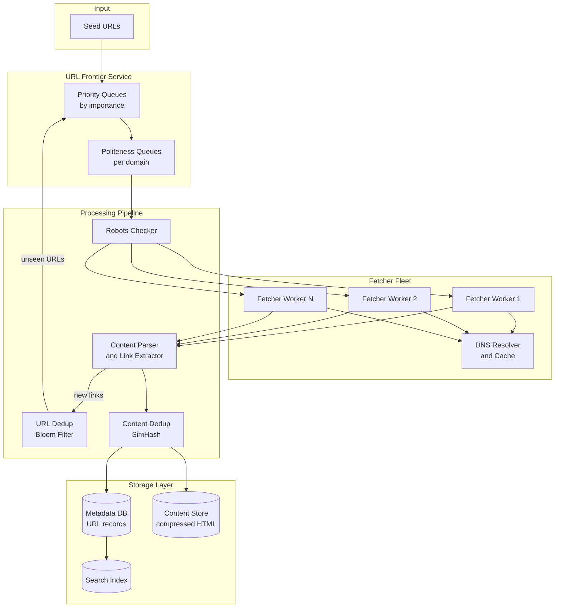
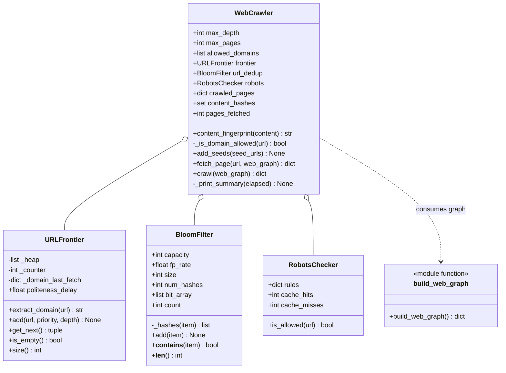
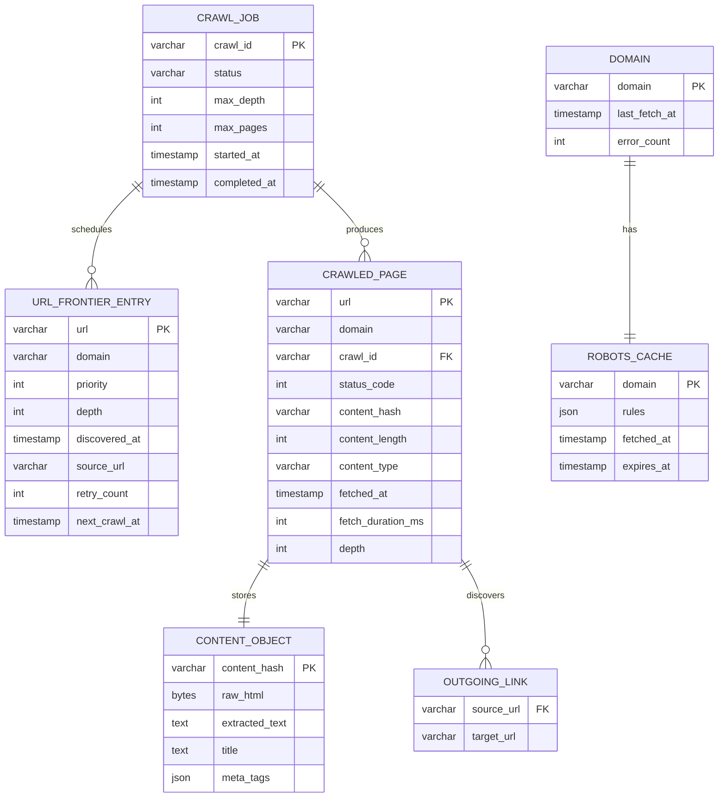
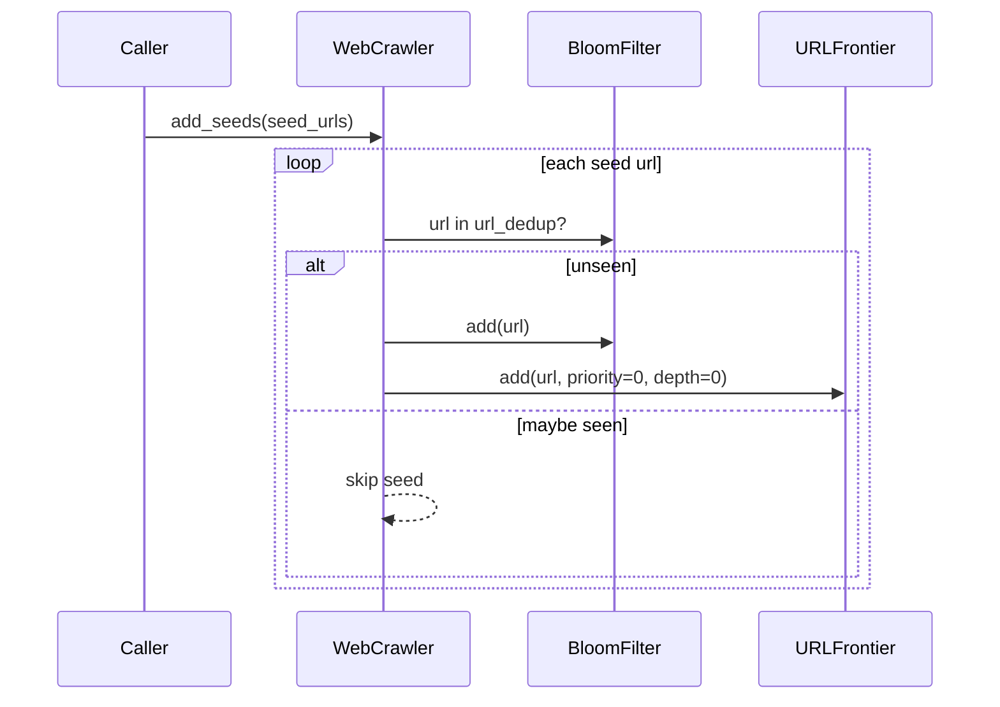
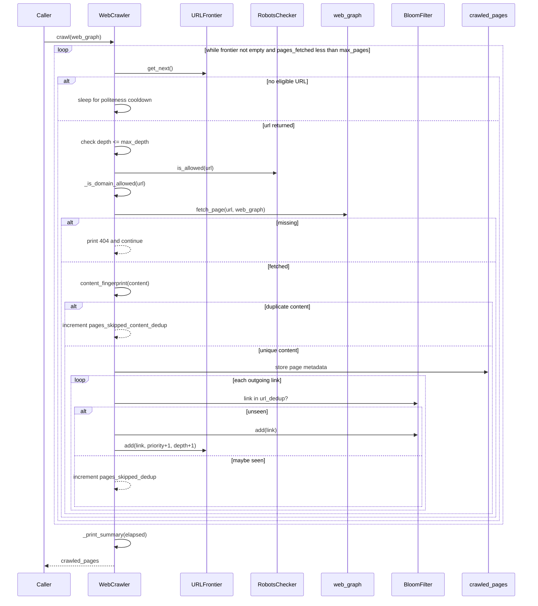
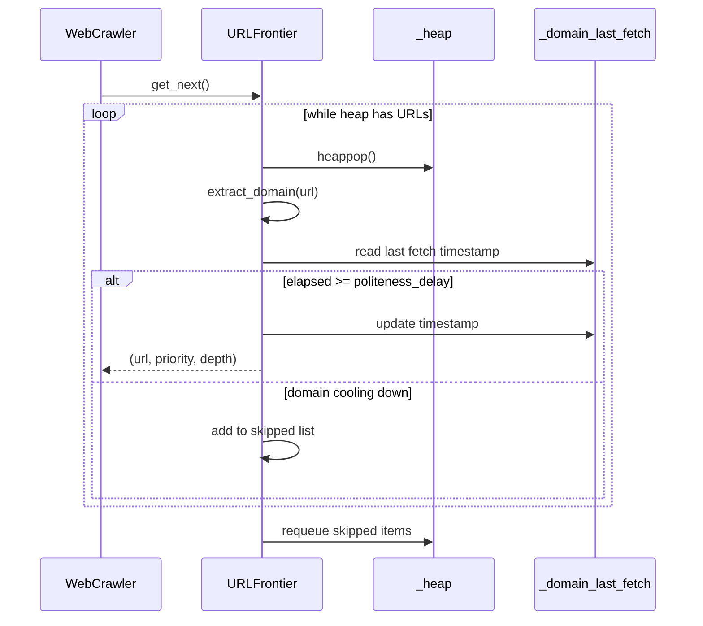

# Web Crawler — Architecture

> **Scope of this document.** This is the consolidated architecture reference for
> the Web Crawler. It preserves the production design from
> [`README.md`](./README.md) and maps it to the reference implementation in
> [`web_crawler.py`](./web_crawler.py), a single-process simulation over an
> in-memory web graph. Sections tagged **[Design-only]** describe production
> capabilities not present in the simulation; sections tagged **[Implemented]**
> map directly to code.

---

## 1. Problem Statement

Design a large-scale web crawler that systematically browses the internet,
discovers new pages via hyperlinks, downloads their content, and stores it for
indexing by a search engine. The crawler must handle billions of pages, respect
website policies, avoid duplicate work, and stay fresh by re-crawling pages
periodically.

Key challenges:

- The web is enormous: ~1 billion new/updated pages per month.
- Many pages are duplicates or near-duplicates.
- Websites have varying tolerance for crawler traffic.
- The link graph is cyclic and can trap naive crawlers.
- Content changes at different rates, requiring intelligent recrawl scheduling.

The simulation implements the core crawl loop with a priority frontier,
per-domain politeness delay, Bloom-filter URL deduplication, simulated robots.txt
rules, content fingerprint deduplication, domain restrictions, and BFS depth
limits.

---

## 2. Requirements

### 2.1 Functional Requirements

| # | Requirement | Details | Status |
|---|-------------|---------|--------|
| FR-1 | **Seed URLs** | Accept a set of seed URLs to begin crawling. | ✅ Implemented (`WebCrawler.add_seeds`) |
| FR-2 | **Extract hyperlinks** | Extract links from downloaded pages and add them to the frontier. | ✅ Implemented in `crawl()` using simulated `page["links"]` |
| FR-3 | **Download and store content** | Download HTML, metadata, headers. | ⚠️ Simulated (`fetch_page`, `crawled_pages`); real HTTP/headers are **[Design-only]** |
| FR-4 | **Respect robots.txt** | Enforce robots rules per domain. | ✅ Simulated (`RobotsChecker.is_allowed`); fetching/parsing real robots.txt is **[Design-only]** |
| FR-5 | **Configurable crawl depth** | Stop beyond max hops from seed. | ✅ Implemented (`max_depth`, `pages_skipped_depth`) |
| FR-6 | **Domain scope restriction** | Restrict crawl to allowed domains. | ✅ Exact-domain list implemented (`allowed_domains`, `_is_domain_allowed`); wildcard support is **[Design-only]** |
| FR-7 | **Normalize URLs** | Avoid duplicate URL forms. | ❌ **[Design-only]**; code does only simple domain extraction |
| FR-8 | **Status API** | Monitor crawl progress. | ❌ **[Design-only]**; console summary only (`_print_summary`) |
| FR-9 | **Pause / resume** | Pause and resume crawl jobs. | ❌ **[Design-only]** |
| FR-10 | **Re-crawl freshness** | Re-crawl pages based on policy. | ❌ **[Design-only]** |
| FR-11 | **URL deduplication** | Avoid adding already-seen URLs. | ✅ Implemented (`BloomFilter`, `url_dedup`) |
| FR-12 | **Content deduplication** | Avoid storing duplicate page content. | ✅ Implemented via exact SHA-256 prefix (`content_fingerprint`, `content_hashes`); SimHash near-duplicate detection is **[Design-only]** |

### 2.2 Non-Functional Requirements [Design-only targets]

| Category | Requirement |
|----------|-------------|
| **Politeness** | Rate-limit per domain, default 1 req/sec; honor `Crawl-delay` |
| **Scalability** | 1 B pages/month, ~385 pages/sec sustained, horizontally scalable fetchers |
| **Freshness** | Popular changing pages within 24 h; long-tail within 30 days |
| **Deduplication** | URL Bloom filter plus content SimHash |
| **Fault tolerance** | Worker crashes do not lose frontier state; at-least-once crawl |
| **Extensibility** | Pluggable parsers and storage backends |
| **Observability** | Metrics for pages/sec, errors, queue depth, domain distribution |

---

## 3. Capacity Estimation [Design-only]

### 3.1 Throughput

| Metric | Value |
|--------|-------|
| Target pages/month | 1,000,000,000 |
| Pages/day | ~33,300,000 |
| Pages/second | ~385 |
| Average page size | 100 KB HTML + headers |
| Bandwidth | 385 × 100 KB = 38.5 MB/s = 308 Mbps |

### 3.2 Storage per month

| Component | Calculation | Size |
|-----------|-------------|------|
| Raw HTML | 1 B × 100 KB | 100 TB |
| Compressed HTML | 100 TB × 0.3 gzip ratio | 30 TB |
| Metadata | 1 B × 2 KB | 2 TB |
| URL frontier | 10 B URLs × 100 B | 1 TB |
| Bloom filter | 10 B URLs, 1% false positive | ~1.2 GB |

### 3.3 Infrastructure

| Resource | Estimate |
|----------|----------|
| Fetcher workers | ~50 machines, each ~8 pages/sec with politeness |
| DNS cache | ~500 MB for 10 M domain entries |
| Content store | Distributed object store, 30 TB/month compressed |
| Metadata DB | Sharded key-value store, 2 TB/month |

---

## 4. High-Level Architecture [Design-only]



The crawler follows a producer-consumer loop: seeds and link extraction produce
URLs, the frontier schedules them, fetcher workers consume them, and parsed links
feed back into the frontier.

---

## 5. Reference Implementation Overview [Implemented]

`web_crawler.py` replaces the internet with `build_web_graph()`, a dict of URLs
to content and outgoing links. `WebCrawler.crawl()` pulls URLs from
`URLFrontier`, applies robots/domain/depth checks, simulates fetching, stores
metadata in memory, and enqueues newly discovered links.



### 5.1 Component Deep-Dive (doc → code)

| Design concept | Implemented by | Notes |
|----------------|----------------|-------|
| URL-level dedup | `BloomFilter` | Uses MD5 + SHA1 double hashing over a Python list of booleans. |
| Frontier priority | `URLFrontier._heap` | Heap item `(priority, depth, counter, url)`; lower priority number wins. |
| BFS depth | `URLFrontier.add(..., depth)` and `crawl()` | Child links are enqueued with `depth + 1`. |
| Politeness | `URLFrontier._domain_last_fetch` and `politeness_delay` | Requeues URLs if domain fetched too recently. |
| Domain extraction | `URLFrontier.extract_domain` | Simple string replacement; not a full URL parser. |
| Simulated web | `build_web_graph()` | Static in-memory pages and links across `site-a`, `site-b`, and `site-c`. |
| Robots enforcement | `RobotsChecker.rules`, `is_allowed` | Hard-coded disallow prefixes; cache counters are present but unused. |
| Domain scope | `WebCrawler.allowed_domains`, `_is_domain_allowed` | Exact-domain allow list only. |
| Page fetch | `fetch_page` | Looks up `web_graph[url]`, sleeps 10 ms, returns content/links/status. |
| Content dedup | `content_fingerprint`, `content_hashes` | Exact SHA-256 prefix, not SimHash near-duplicate detection. |
| Storage | `crawled_pages` | dict keyed by URL, storing content, fingerprint, depth, priority, timestamp, outgoing link count. |
| Metrics | counters + `_print_summary` | Console-only summary. |

---

## 6. Data Model

### 6.1 Conceptual production schema [Design-only]



### 6.2 As implemented [Implemented]

| Production entity | In-memory equivalent |
|-------------------|----------------------|
| `URLFrontierEntry` | Heap tuple `(priority, depth, counter, url)` in `URLFrontier._heap` |
| Domain politeness metadata | `URLFrontier._domain_last_fetch: dict[str, float]` |
| `CrawledPage` | `WebCrawler.crawled_pages[url]` dict |
| `ContentObject` | `content` and `fingerprint` inside `crawled_pages`; `content_hashes` set |
| `RobotsCache` | `RobotsChecker.rules` hard-coded dict |
| Crawl job status | Counters on `WebCrawler`; no persisted job entity |
| URL seen set | `BloomFilter.bit_array` |

---

## 7. API Design

### 7.1 Production HTTP surface [Design-only]

| Method & Path | Purpose | Success |
|---------------|---------|---------|
| `POST /api/v1/crawls` | Create crawl job with seeds and config | `201 Created` |
| `GET /api/v1/crawls/{crawl_id}` | Read status, pages crawled, frontier depth, errors, pages/sec | `200 OK` |
| `POST /api/v1/crawls/{crawl_id}/pause` | Pause crawl | `202 Accepted` |
| `POST /api/v1/crawls/{crawl_id}/resume` | Resume crawl | `202 Accepted` |
| `DELETE /api/v1/crawls/{crawl_id}` | Stop/delete crawl | `204 No Content` |
| `GET /api/v1/crawls/{crawl_id}/pages?domain=&limit=` | List crawled pages | `200 OK` |
| `GET /api/v1/crawls/{crawl_id}/errors?limit=` | List crawl errors | `200 OK` |
| `GET /api/v1/robots?domain=example.com` | Inspect robots cache | `200 OK` |

### 7.2 In-process API [Implemented]

| Method | Signature | Raises / behavior |
|--------|-----------|-------------------|
| `BloomFilter.add` | `(item: str) -> None` | Sets all hash positions and increments count |
| `BloomFilter.__contains__` | `(item: str) -> bool` | Probabilistic membership |
| `URLFrontier.add` | `(url: str, priority: int = 5, depth: int = 0) -> None` | Pushes heap item |
| `URLFrontier.get_next` | `() -> Optional[tuple[str, int, int]]` | Returns `None` if empty or all domains cooling down |
| `RobotsChecker.is_allowed` | `(url: str) -> bool` | Prefix match against hard-coded disallow rules |
| `WebCrawler.add_seeds` | `(seed_urls: list[str]) -> None` | Adds unseen seeds at depth 0 |
| `WebCrawler.fetch_page` | `(url: str, web_graph: dict[str, dict]) -> Optional[dict]` | Returns `None` for missing URL |
| `WebCrawler.crawl` | `(web_graph: dict[str, dict]) -> dict[str, dict]` | Prints progress and returns `crawled_pages` |

---

## 8. Key Workflows [Implemented]

### 8.1 Seed injection



### 8.2 Crawl loop over simulated web graph



### 8.3 Frontier politeness



---

## 9. Detailed Component Design

### 9.1 Bloom filter [Implemented]

`BloomFilter` computes optimal bit-array size and hash count from capacity and
false-positive rate:

```text
m = -n * ln(p) / (ln 2)^2
k = (m / n) * ln 2
```

The implementation uses double hashing:

- `h1 = md5(item)`
- `h2 = sha1(item)`
- position `i = (h1 + i * h2) % size`

It guarantees no false negatives for inserted URLs, while false positives may
skip some unseen URLs. Production partitions the Bloom filter across frontier
nodes.

### 9.2 URL frontier and BFS [Implemented]

`URLFrontier` stores heap tuples ordered by `priority`, then `depth`, then an
incrementing counter. `WebCrawler.crawl()` enqueues links with `depth + 1` and
`priority + 1`, capped at priority 9, which approximates BFS from high-quality
seeds.

### 9.3 Politeness [Implemented]

`get_next()` checks `time.time() - _domain_last_fetch[domain]`. If the elapsed
time is below `politeness_delay`, the URL is temporarily skipped and requeued.
This prevents rapid repeated requests to the same domain in the simulation.

Production extends this with per-domain back queues, robots `Crawl-delay`, and
consistent hashing so one worker owns a domain.

### 9.4 Robots.txt handling [Implemented / Design-only]

`RobotsChecker` is implemented as hard-coded disallow prefixes:

- `site-a.com`: `/private/`, `/admin/`
- `site-b.com`: `/internal/`
- `site-c.com`: none

Real robots fetching, TTL cache expiry, `Allow`, user-agent matching, and
`Crawl-delay` parsing are **[Design-only]**.

### 9.5 Content fingerprinting [Implemented / Design-only]

The simulation stores `sha256(content)[:16]` in `content_hashes`. This detects
exact duplicate content only. The README's SimHash near-duplicate detection with
Hamming-distance threshold is **[Design-only]**.

---

## 10. Architectural Patterns [Design-only]

- **Producer-consumer:** link extractor and seed injector produce URLs; fetchers
  consume them; crawled pages produce more URLs.
- **Bloom filter deduplication:** memory-efficient seen-URL tracking for billions
  of URLs.
- **BFS traversal:** prioritizes broad coverage near trusted seeds and avoids
  deep traps.
- **Per-domain token bucket:** politeness delay acts like a per-domain rate
  limiter.
- **Content-addressed storage:** content hash as key makes duplicate storage
  idempotent.
- **Circuit breaker:** domains with repeated failures move to penalty queues.

---

## 11. Technology Choices & Trade-offs [Design-only]

| Component | Choice | Rationale |
|-----------|--------|-----------|
| URL Frontier | Kafka + Redis sorted sets | Kafka durability, Redis priority and politeness timestamps |
| Bloom Filter | Partitioned Bloom filter | ~1.2 GB for 10 B URLs at 1% false positive rate |
| Content Store | S3 / MinIO | Cost-effective blob storage with content-addressed keys |
| Metadata DB | Cassandra | Write-heavy workload and flexible wide-column schema |
| DNS Cache | Local LRU + shared Redis | DNS resolution is slow; caching cuts latency |
| Content Parser | lxml / BeautifulSoup | Fast HTML parsing and extensible content handlers |
| Orchestration | Kubernetes | Auto-scale workers on frontier depth |
| Monitoring | Prometheus + Grafana | Standard metrics and alerting |
| Priority Queue | Min-heap | O(log n) insert and extract-min |
| Hashing | MurmurHash3 | Fast, well-distributed hashing for Bloom/ring |

---

## 12. Scaling, Reliability & Security [Design-only]

- **Horizontal scaling:** add fetcher workers; partition frontier by domain hash;
  object storage scales independently.
- **Bottlenecks:** mitigate single-frontier limits via partitioning, DNS latency
  via caching, bandwidth via multi-region workers, Bloom-filter size via
  partitioning, and robots fetches via TTL cache.
- **Scaling milestones:** 100 pages/sec on one machine; 1 K pages/sec with
  Redis frontier; 10 K pages/sec with Kafka and distributed Bloom filters; 100 K
  pages/sec with multi-datacenter partitioning.
- **Fault tolerance:** in-flight URLs timeout and re-enqueue, Kafka preserves
  frontier durability, Redis replicas protect queues, and content-addressed
  writes are idempotent.
- **Consistency:** at-least-once crawling and idempotent storage; checkpointed
  frontier state supports restart.
- **Crawl safety:** respect robots.txt, identify user-agent, limit redirects,
  cap content size, avoid executing JavaScript.
- **Crawler traps:** strip session parameters, cap depth, cap pages per domain,
  and detect excessive URL generation per domain.
- **Privacy:** honor `noindex`, `nofollow`, and `Cache-Control: no-store`;
  configure retention and deletion.
- **Monitoring:** pages/sec, frontier depth, error rate, fetch p99, DNS hit
  ratio, Bloom filter saturation, duplicate rate, and robots cache misses.

---

## 13. Running the Simulation [Implemented]

```powershell
uv run --no-project python SystemDesign\WebCrawler\web_crawler.py
```

The demo runs a Bloom filter example, a priority/politeness frontier example,
and three crawls over the in-memory graph: unrestricted, domain-restricted, and
shallow multi-seed.

### Suggested tests

- Bloom filter returns true for inserted URLs.
- `URLFrontier.get_next()` respects priority when domains are eligible.
- `URLFrontier.get_next()` returns `None` when all domains are cooling down.
- `WebCrawler.add_seeds()` deduplicates repeated seeds.
- `crawl()` does not exceed `max_depth`.
- `allowed_domains` prevents out-of-domain storage.
- `RobotsChecker.is_allowed()` blocks disallowed path prefixes.
- Content duplicates increment `pages_skipped_content_dedup`.

---

## 14. Future Improvements

- Use `urllib.parse` for robust URL normalization and canonicalization.
- Add wildcard domain matching for scopes such as `*.example.com`.
- Replace hard-coded robots rules with a real robots.txt parser and TTL cache.
- Add real HTTP fetching with redirect, timeout, status, header, and content-type
  handling.
- Implement SimHash for near-duplicate detection.
- Persist frontier state and crawled-page metadata.
- Add pause/resume/status APIs and recrawl scheduling.
- Make domain ownership explicit for multi-worker simulations.
